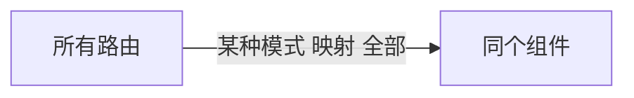

---

title: Vue学习
categories:
  - Vue
tags:
  - Vue
  - 前端
abbrlink: 1167

---

# vue2.0

>  [一套完美集成 Vite 2.x + Vue 3.x + TypeScript + Vue Router + Vuex + Axios + ESLint 等健壮的前端快速开发模板](https://github.com/XPoet/vite-vue3-starter)

## 架构搭建

> TypeScript + Vite + Vue3 + Vue Router + Vuex + Element Plus + Axios + Stylus/Sass/Less 的前端项目开发环境

### 安装vite

```bash
npm init @vitejs/app
vite-start
```

```
vue3-vite
├─ .gitignore
├─ .vscode
│  └─ extensions.json
├─ index.html
├─ package-lock.json
├─ package.json
├─ public
│  └─ favicon.ico
├─ README.md
├─ src
│  ├─ App.vue
│  ├─ assets
│  │  └─ logo.png
│  ├─ common
│  ├─ components
│  │  └─ HelloWorld.vue
│  ├─ env.d.ts
│  ├─ main.ts
│  ├─ router // router
│  ├─ store  // vuex
│  ├─ style  //  
│  ├─ utils
│  └─ views  
├─ tests
├─ tsconfig.json
└─ vite.config.ts
```

vite配置文件：vite-config.js

> [配置 Vite | Vite 官方中文文档](https://cn.vitejs.dev/config/)

```js
import { defineConfig } from 'vite'
import vue from '@vitejs/plugin-vue'
import path from 'path'
// path模块找不到，安装@types/node -> npm i @types/node -D
// https://vitejs.dev/config/
export default defineConfig({
  plugins: [vue()],
  resolve: {
    alias: {
      '@': path.resolve(__dirname, 'src')
    }
  },
  base: './',
  server: {
    port: 4000,
    open: true,
    cors: true
  }
})
```

### 安装router

```tsx
npm install vue-router@4
// 配置文件  router/index.ts
import { createRouter,createWebHistory,RouteRecordRaw } from 'vue-router'
import Home from '@/src/views/home.vue'
import Vuex from '@/src/views/vuex.vue'
const routes: Array<RouteRecordRaw>=[
    {
        path:'/',
        name:'home',
        components:Home
    },{
        path:'vuex',
        name:'vuex',
        components:Vuex
    },
    {
        path:'/axios',
        name:'axios',
        component:()=>import('@/views/axios')
    }
]
const router = createRouter({
    history:createWebHistory(),
    routes
})
export default router;
// 挂载到 main.ts
import router from './router/index'
const app = createApp(App)
app.use(router).mount("#app")
```

### 安装vuex

```tsx
npm install vuex@next
// 配置store store/index.ts
import { InjectionKey } from 'vue'
import { createStore, Store, useStore as baseUseStore } from 'vuex'
import RootStateTypes, { AllStateTypes } from './types'

import numFactoryModule from './modules/NumFactory'

export const store = createStore<RootStateTypes>({
  state: {
    text: 'This is Vuex Root.state.text'
  },
  getters: {},
  mutations: {},
  actions: {},
  modules: {
    numFactoryModule
  }
})

export const key: InjectionKey<Store<RootStateTypes>> = Symbol('vue-store')

export function useStore<T = AllStateTypes>() {
  return baseUseStore<T>(key)
}
// 挂载到 main.ts
import { key, store } from './store/index'
app.use(router).use(store,key).mount('#app')
```

### 安装vueUI

```js
npm install element-plus
npm install unplugin-vue-components // 按需加载
// 配置vite.config.js
import Components from 'unplugin-vue-components/vite'
import { ElementPlusResolver } from 'unplugin-vue-components/resolvers'

export default {
  plugins: [
    // ...
    Components({
      resolvers: [ElementPlusResolver()],
    }),
  ],
}
// 添加style-import.ts 
// utils/style-import.ts
import { App } from 'vue'
import { ElIcon, ElLoading, ElCard, ElButton } from 'element-plus'

/**
 * 按需导入 Element Plus 组件
 * Vite 插件 https://github.com/element-plus/vite-plugin-element-plus
 * @param app {App}
 */
export default function styleImport(app: App) {
  ;[ElButton, ElCard, ElLoading, ElIcon].forEach((v) => {
    app.use(v)
  })
  return app
}
// 挂载到main.js
import { createApp } from 'vue'
import App from './App.vue'
import router from './router/index'
import { key, store } from './store/index'
import styleImport from './utils/style-import'
const app= createApp(App);
styleImport(app).use(router).use(store,key).mount('#app')
```

### 安装axios

```tsx
npm i axios
// utils/axios.ts 
import Axios from 'axios'
import { ElMessage } from 'element-plus'

const baseURL = 'https://api.github.com'

const axios = Axios.create({
  baseURL,
  timeout: 20000 // 请求超时 20s
})

// 前置拦截器（发起请求之前的拦截）
axios.interceptors.request.use(
  (response) => {
    /**
     * 根据你的项目实际情况来对 config 做处理
     * 这里对 config 不做任何处理，直接返回
     */
    return response
  },
  (error) => {
    return Promise.reject(error)
  }
)

// 后置拦截器（获取到响应时的拦截）
axios.interceptors.response.use(
  (response) => {
    /**
     * 根据你的项目实际情况来对 response 和 error 做处理
     * 这里对 response 和 error 不做任何处理，直接返回
     */
    return response
  },
  (error) => {
    if (error.response && error.response.data) {
      const code = error.response.status
      const msg = error.response.data.message
      ElMessage.error(`Code: ${code}, Message: ${msg}`)
      console.error(`[Axios Error]`, error.response)
    } else {
      ElMessage.error(`${error}`)
    }
    return Promise.reject(error)
  }
)

export default axios
```

### 安装css编译器

```
npm i stylus -D 
# or 
npm i sass -D 
npm i less -D
```

## 代码规范

Prettier配置


EditorConfig配置


ESLint配置


## 提交规范

Github工作流规范

- 分支规范
- 回滚操作规范
- 提交规范
- 团队协作规范

commit message 格式规范

- commit message 由Header、Body、Footer组成

```
<Header>   type(必需) scope(可选) subject(必需)
<Body>
<Footer>
```

type   说明commit的提交类型

值	描述
feat	新增一个功能
fix	修复一个 Bug
docs	文档变更
style	代码格式（不影响功能，例如空格、分号等格式修正）
refactor	代码重构
perf	改善性能
test	测试
build	变更项目构建或外部依赖（例如 scopes: webpack、gulp、npm 等）
ci	更改持续集成软件的配置文件和 package 中的 scripts 命令，例如 scopes: Travis, Circle 等
chore	变更构建流程或辅助工具
revert	代码回退

scope 

- 指定本次 commit 影响的范围。scope 依据项目而定，例如在业务项目中可以依据菜单或者功能模块划分，如果是组件库开发，则可以依据组件划分。

用动词开头，第一人称现在时表述，例如：change 代替 changed 或 changes
第一个字母小写
结尾不加句号（.）

subject 本次 commit 的简洁描述，长度约定在 50 个字符以内，通常遵循以下几个规范

用动词开头，第一人称现在时表述，例如：change 代替 changed 或 changes
第一个字母小写
结尾不加句号（.）

```
test(launguage-service): Add test to expose bug caused by source file
feat(dev-infra):create ReleaseNotes class fir generating release not
```

Body
body 是对本次 commit 的详细描述，可以分成多行。（body 可省略）

跟 subject 类似，用动词开头，body 应该说明修改的原因和更改前后的行为对比。

Footer
如果本次提交的代码是突破性的变更或关闭缺陷，则 Footer 必需，否则可以省略。

突破性的变更

当前代码与上一个版本有突破性改变，则 Footer 以 BREAKING CHANGE 开头，后面是对变动的描述、以及变动的理由。

关闭缺陷

如果当前提交是针对特定的 issue，那么可以在 Footer 部分填写需要关闭的单个 issue 或一系列 issues。

feat

feat(browser): onUrlChange event (popstate/hashchange/polling)

Added new event to browser:

- forward popstate event if available
- forward hashchange event if popstate not available
- do polling when neither popstate nor hashchange available

Breaks $browser.onHashChange, which was removed (use onUrlChange instead)

fix

fix(compile): couple of unit tests for IE9

Older IEs serialize html uppercased, but IE9 does not...
Would be better to expect case insensitive, unfortunately jasmine does
not allow to user regexps for throw expectations.

Closes #392
Breaks foo.bar api, foo.baz should be used instead

style

style(location): add couple of missing semi colons

chore

chore(release): v3.4.2


集成commitizen实现规范 

```
npm install commitizen -D
```

```
npx commitizen init cz-conventional-changelog --save-dev --save-exact


"config": {
  "commitizen": {
    "path": "./node_modules/cz-conventional-changelog"
  }
}
```


使用Commitizen

```
以前我们提交代码都是 git commit -m "xxx"，现在改为 git cz，然后按照终端操作提示，逐步填入信息，就能自动生成规范的 commit message。
```

cz-customizable 初始化项目

```
npx commitizen init cz-customizable --save-dev --save-exact --force

"devDependencies": {
  ...
  "cz-customizable": "^6.3.0",
  ...
},

"config": {
  "commitizen": {
    "path": "./node_modules/cz-customizable"
  }
}
```

创建 .cz-config.js 文件

```
module.exports = {
  // type 类型（定义之后，可通过上下键选择）
  types: [
    { value: 'feat', name: 'feat:     新增功能' },
    { value: 'fix', name: 'fix:      修复 bug' },
    { value: 'docs', name: 'docs:     文档变更' },
    { value: 'style', name: 'style:    代码格式（不影响功能，例如空格、分号等格式修正）' },
    { value: 'refactor', name: 'refactor: 代码重构（不包括 bug 修复、功能新增）' },
    { value: 'perf', name: 'perf:     性能优化' },
    { value: 'test', name: 'test:     添加、修改测试用例' },
    { value: 'build', name: 'build:    构建流程、外部依赖变更（如升级 npm 包、修改 webpack 配置等）' },
    { value: 'ci', name: 'ci:       修改 CI 配置、脚本' },
    { value: 'chore', name: 'chore:    对构建过程或辅助工具和库的更改（不影响源文件、测试用例）' },
    { value: 'revert', name: 'revert:   回滚 commit' }
  ],

  // scope 类型（定义之后，可通过上下键选择）
  scopes: [
    ['components', '组件相关'],
    ['hooks', 'hook 相关'],
    ['utils', 'utils 相关'],
    ['element-ui', '对 element-ui 的调整'],
    ['styles', '样式相关'],
    ['deps', '项目依赖'],
    ['auth', '对 auth 修改'],
    ['other', '其他修改'],
    // 如果选择 custom，后面会让你再输入一个自定义的 scope。也可以不设置此项，把后面的 allowCustomScopes 设置为 true
    ['custom', '以上都不是？我要自定义']
  ].map(([value, description]) => {
    return {
      value,
      name: `${value.padEnd(30)} (${description})`
    }
  }),

  // 是否允许自定义填写 scope，在 scope 选择的时候，会有 empty 和 custom 可以选择。
  // allowCustomScopes: true,

  // allowTicketNumber: false,
  // isTicketNumberRequired: false,
  // ticketNumberPrefix: 'TICKET-',
  // ticketNumberRegExp: '\\d{1,5}',


  // 针对每一个 type 去定义对应的 scopes，例如 fix
  /*
  scopeOverrides: {
    fix: [
      { name: 'merge' },
      { name: 'style' },
      { name: 'e2eTest' },
      { name: 'unitTest' }
    ]
  },
  */

  // 交互提示信息
  messages: {
    type: '确保本次提交遵循 Angular 规范！\n选择你要提交的类型：',
    scope: '\n选择一个 scope（可选）：',
    // 选择 scope: custom 时会出下面的提示
    customScope: '请输入自定义的 scope：',
    subject: '填写简短精炼的变更描述：\n',
    body:
      '填写更加详细的变更描述（可选）。使用 "|" 换行：\n',
    breaking: '列举非兼容性重大的变更（可选）：\n',
    footer: '列举出所有变更的 ISSUES CLOSED（可选）。 例如: #31, #34：\n',
    confirmCommit: '确认提交？'
  },

  // 设置只有 type 选择了 feat 或 fix，才询问 breaking message
  allowBreakingChanges: ['feat', 'fix'],

  // 跳过要询问的步骤
  // skipQuestions: ['body', 'footer'],

  // subject 限制长度
  subjectLimit: 100
  breaklineChar: '|', // 支持 body 和 footer
  // footerPrefix : 'ISSUES CLOSED:'
  // askForBreakingChangeFirst : true,
}
```


集成 commitlint 验证提交规范

- 制定了规范，但在多人协作的项目中 ，提交代码这个环节，我们也增加一个限制：只让符合 Angular 规范的 commit message 通过

- 安装 commit  安装 @commitlint/config-conventional 和 @commitlint/cli

```
npm i @commitlint/config-conventional @commitlint/cli -D
```

配置 commitlint

```
// commitlint.config.js
module.exports = { extends: ['@commitlint/config-conventional'] }
```

使用 husky 的 commit-msg hook 触发验证提交信息的命令
我们使用 husky 命令在 .husky 目录下创建 commit-msg 文件，并在此执行 commit message 的验证命令。

```
.husky/
_ /
/.gitgnore
commit-msg
pre-
npx husky add .husky/commit-msg "npx --no-install commitlint --edit $1"
```


## 单元测试

jest测试方法

安装核心依赖

- vue-test-utils
- jest 
- vue-jest 
- ts-jest 

```
npm i @vue/test-utils@next jest vue-jest@next ts-jest -D
```

创建jest配置文件

```
jest.config.js
module.exports = {
  moduleFileExtensions: ['vue', 'js', 'ts'],
  preset: 'ts-jest',
  testEnvironment: 'jsdom',
  transform: {
    '^.+\\.vue$': 'vue-jest', // vue 文件用 vue-jest 转换
    '^.+\\.ts$': 'ts-jest' // ts 文件用 ts-jest 转换
  },
  // 匹配 __tests__ 目录下的 .js/.ts 文件 或其他目录下的 xx.test.js/ts xx.spec.js/ts
  testRegex: '(/__tests__/.*|(\\.|/)(test|spec))\\.(ts)$'
}
```

创建单元测试文件

在上面的 jest.config.js 文件中，我们配置只匹配 __tests__ 目录下的任意 .ts 文件或其他目录下的 xx.test.ts/xx.spec.ts 文件进行单元测试。

```
├── src/
└── tests/                           // 单元测试目录
    ├── Test.spec.ts                 // Test 组件测试
```

- Test.vue

```js
<template>
  <div class="test-container page-container">
    <div class="page-title">Unit Test Page</div>
    <p>count is: {{ count }}</p>
    <button @click="increment">increment</button>
  </div>
</template>

<script lang="ts">
  import { defineComponent, ref } from 'vue'

  export default defineComponent({
    name: 'Vuex',
    setup() {
      const count = ref<number>(0)
      const increment = () => {
        count.value += 1
      }
      return { count, increment }
    }
  })
</script>
```

- Test.spec.ts

```js
import { mount } from '@vue/test-utils'
import Test from '../src/views/Test.vue'  // 测试文件

test('Test.vue', async () => {
  const wrapper = mount(Test)
  expect(wrapper.html()).toContain('Unit Test Page')
  expect(wrapper.html()).toContain('count is: 0')
  await wrapper.find('button').trigger('click')
  expect(wrapper.html()).toContain('count is: 1')
})
```

集成@types/jest

如上图，我们使用 VSCode / WebStrom / IDEA 等编辑器时，在单元测试文件中，IDE 会提示某些方法不存在（如 test、describe、it、expect等），安装 @types/jest 即可解决。

```bash
npm i @types/jest -D
```

TypeScript 的编译器也会提示 jest 的方法和类型找不到，我们还需把 @types/jest 添加根目录下的 ts.config.json（TypeScript 配置文件）中

```
{
  "compilerOptions": {
    ...
    "types": ["vite/client", "jest"]
  },
}
```

添加eslint-plugin-jest

项目中集成了 ESLint，如上图很明显是没通过 ESLint 规则检验。因此，我们还需要在 ESLint 中增加 eslint-plugin-jest 插件来解除对 jest 的校验。

```bash
npm i eslint-plugin-jest -D
```

```
 .eslintrc.js
 module.exports = {
  ...
  extends: [
    ...
    'plugin:jest/recommended'
  ],
  ...
}
```

执行单元测试

```
在根目录下 package.json 文件的 scripts 中，添加一条单元测试命令： "test": "jest"

"script":{
	"test":"jest"
}
npm run test

```

当单元测试没有全部通过时，我们需要根据报错信息去优化对应组件的代码，进一步提高项目健壮性。但是写单元测试是件比较痛苦的事，我个人觉得也没必要全部组件都写单元测试，根据项目实际情况有针对性去写就行了。

单元测试约束

使用 husky 在 Git 的 pre-commit 和 commit-msg 阶段分别约束代码风格规范和提交信息规范。这一步，我们在 pre-push 阶段进行单元测试，只有单元测试全部通过才让代码 push 到远端仓库，否则终止 push。

使用 husky 命令在 .husky 目录下自动创建 pre-push hook 文件，并在此执行单元测试命令 npm run test。

```bash
npx husky add .husky/pre-push "npm run test $1"
```


## 自动化部署

CI （Continous Integration）持续集成

CI工具有：Github Actions 、GitLab CI 、Travis CI、Circle CI

Github Action 

Github 的持续集成服务，持续集成由很多操作组成，抓取代码测试、登录远程服务器、发布到第三方服务

使用自动部署，我们只需专注于项目开发阶段，任何重复且枯燥的行为都交由程序去完成，懒才是程序员第一生产力。

分支管理

- master 项目源代码
- gh-pages 分支存储打包后的静态文件

密钥管理

- 创建Github Token 
  - 创建一个有 repo 和 workflow 权限的 GitHub Token
- 当前仓库添加secret 
  - 仓库 -> settings -> Secrets -> New repository secret

Actions配置文件

- `.github`

```bash
.github/
	workflows
		deploy.yml
```

```bash
name: deploy

on:
  push:
    branches: [master] # master 分支有 push 时触发

jobs:
  deploy:
    runs-on: ubuntu-latest
    steps:
      - uses: actions/checkout@v2

      - name: Setup Node.js v14.x
        uses: actions/setup-node@v1
        with:
          node-version: '14.x'

      - name: Install
        run: npm install # 安装依赖

      - name: Build
        run: npm run build # 打包

      - name: Deploy
        uses: peaceiris/actions-gh-pages@v3 # 使用部署到 GitHub pages 的 action
        with:
          publish_dir: ./dist # 部署打包后的 dist 目录
          github_token: ${{ secrets.VUE3_DEPLOY }} # secret 名
          user_name: ${{ secrets.MY_USER_NAME }}
          user_email: ${{ secrets.MY_USER_EMAIL }}
          commit_message: Update Vite2.x + Vue3.x + TypeScript Starter # 部署时的 git 提交信息，自由填写
```

Github的gh-pages分支

> [如何用Github的gh-pages分支展示自己的项目 - 云+社区 - 腾讯云](https://cloud.tencent.com/developer/article/1391619)
>
> [一文教你使用GitHub Pages部署静态网页 - 知乎](https://zhuanlan.zhihu.com/p/69592043)

- 把[MuYunyun.github.io](https://www.cnblogs.com/MuYunyun.github.io) 绑定了 http://muyunyun.cn 域名，所以你实际上会访问到的是[muyunyun.cn](http://muyunyun.cn/)。

```
git subtree push --prefix=dist origin gh-pages
// 把指定的dist文件提交到gh-pages分支上
```


```
text git:(master) git symbolic-ref HEAD refs/heads/gh-pages
git add -A
git commit -m "..."
git push origin gh-pages
```


## 插件

### vscode-vue

Syntax Highlight for Vue.js

#### Code Snippets

| trigger      | snippet           |
| :----------- | :---------------- |
| `vud-cdn`    | `tag to cdnjs`    |
| `add`        | `vm.$add`         |
| `delete`     | `vm.$delete`      |
| `eval`       | `vm.$eval`        |
| `set`        | `vm.$set`         |
| `get`        | `vm.$get`         |
| `ipo`        | `vm.$interpolate` |
| `log`        | `vm.$log`         |
| `wat`        | `vm.$watch`       |
| `vue`        | `new Vue`         |
| `vue-config` | `Vue.config`      |
| `vue-dir`    | `Vue.directive`   |
| `vue-extend` | `Vue.extend`      |
| `vue-filter` | `Vue.filter`      |
| `v`          | `an empty object` |

### [Vetur](https://vuejs.github.io/vetur/)

1、vue文件没有css提示

```json
setting.json
"emmet.syntaxProfiles": {
  "vue-html": "html",
  "vue": "html"
},
 
"vetur.validation.template": false,
```

2、问题Vue文件出现  vscode红色波浪线问题 （严格模式下的格式警告），搜索Eslint 插件 取消 Eslint:Enable 的勾选，或者添加以下一行

```json
 "eslint.enable": false
```

## 重点

指令

过滤器

动画

生命周期

过滤器

计算属性和方法

组件 

## 基础

### 概念

#### 软件架构

发展过程 ： MVC ==> MVP ==> MVVM

MVC 

- Model (模型) Controller(控制器) View (视图)
-  Model ==>  View ==> Controller ==> Model 
-  Model ==>  View ==> Controller(User操作C层) ==> Model 

MVP 

- Model(数据) <=> Controller/Presenter(负责逻辑处理) <==> View(显示) 

MVVM

- 将Presenter改成ViewModel 
- Model(数据) <=>  ViewModel  <==>(DataBinding)  View(显示)
- DataBinding 数据绑定 view的变化会自动更新到ViewModel，ViewModel的变化也会自动同步到View上显示

MVVM 

```html
// MVVM中的View
<div id="app">
    <h1>Yout input is{{ message }}</h1>
    <input type="text" v-model="message">
</div>
<script>
    // MVVM VM调度者
  	// 新建一个对象，传输一个对象
    var vm = new Vue({
        el: '#app',
        data: { // 这里的data 就是MVVM中的，专门用来保存 每个页面的数据的
            message: ''
        }
    })
</script>
```

Node（后端）中的 M(数据库里面的数据)VC 与 前端中的 M(页面中的数据)VVM 之间的区别

- `MVC 是后端的分层开发概念`； Modle 数据保存 View Controller 业务逻辑
- `MVVM 是前端视图层的概念`，主要关注于 视图层分离，也就是说：MVVM 把前端的视图层，分为了 三部分 Model, View , VM ViewModel
- 为什么有了 MVC 还要有 MVVM

Vue.js 基本代码 和 MVVM 之间的对应关系


#### Vue.js 是什么

- Vue 被定义成一个用来开发 Web 界面的前端库，是一个非常轻量级的工具。
- Vue.js 本身具有`响应式编程和组件化`的特点
- Vue.js 是目前最火的一个前端框架，React 是最流行的一个前端框架（React 除了开发网站，还可以开发手机 App， Vue 语法也是可以用于进行手机 App 开发的，需要借助于 Weex）
- Vue.js 是前端的**主流框架之一**，和 Angular.js、React.js 一起，并成为前端三大主流框架！
- Vue.js 是一套构建用户界面的框架，`Vue 的核心库只关注视图层`，它不仅易于上手，还便于与第三方库或既有项目整合。（Vue 有配套的第三方类库，可以整合起来做大型项目的开发）
- 前端的主要工作？主要负责 MVC 中的 V 这一层；主要工作就是和界面打交道，来制作前端页面效果；

* `一套用于构建用户界面的JavaScript渐进式框架` 什么是渐进式（由浅入深）简单到复杂

* Vue.js 被设计为可以`自底向上逐层应用`
* Vue 本身具有组件化和响应式编程（就是保持状态和视图一致、数据绑定）的特点

#### Vue 的优点

- 体积小，压缩后 33K

- 更高的运行效率 （高效） 20kb min+ gzip 运行大小 超快虚拟 DOM

  > 基于虚拟 DOM,一种可以预先通过 JavaScript 进行各种计算，把最终的 DOM 操作计算出来并优化的技术，由于这个 DOM 操作属于预处理操作，并没有真实的操作，所以叫做虚拟 DOM

- 双向数据绑定 保持状态与视图一致

- 生态丰富，学习成本低 大量的 UI 框架、常用组件

#### 为什么要学习流行框架

- 企业为了提高开发效率：在企业中，时间就是效率，效率就是金钱；

* 企业中，使用框架，能够提高开发的效率；

- 提高开发效率的发展历程：原生 JS -> Jquery 之类的类库 -> 前端模板引擎 -> Angular.js / Vue.js（``能够帮助我们减少不必要的 DOM 操作；提高渲染效率；双向数据绑定的概念【通过框架提供的指令，我们前端程序员只需要关心数据的业务逻辑，不再关心 DOM 是如何渲染的了】``）
- 在 Vue 中，一个核心的概念，就是让用户不再操作 DOM 元素，解放了用户的双手，让程序员可以更多的时间去关注业务逻辑；

#### 框架和库的区别

+ 框架：``是一套完整的解决方案``；对项目的侵入性较大，项目如果需要更换框架，则需要重新架构整个项目。
	+ 如node 中的 express；

+ `库（插件）：提供某一个小功能`，对项目的侵入性较小，如果某个库无法完成某些需求，可以很容易切换到其它库实现需求。 
- 从 Jquery 切换到 Zepto 
  - 从 EJS 切换到 art-template

### 安装

---

> 安装成功 页面控制台出现 vue 警告
>
> You are running Vue in development mode.
> Make sure to turn on production mode when deploying for production.
> See more tips at https://vuejs.org/guide/deployment.html

#### 1. CDN

```js
<!-- 开发环境版本，包含了有帮助的命令行警告 -->
<script src="https://cdn.jsdelivr.net/npm/vue/dist/vue.js"></script>
<!-- 生产环境版本，优化了尺寸和速度 -->
<script src="https://cdn.jsdelivr.net/npm/vue"></script>
```

#### 2.官方 vue-cli 脚手架工具

```bash
命令行工具(CLI) 脚手架工具（安装vue-cli） 先安装node.js 使用npm命令 npm-v
查看npm版本 node-v 查看node版本 path 配置环境变量 
全局安装vue-cli 
npm install -g @vue/cli
# OR
yarn global add @vue/cli
本地安装vue-cli 
npm install @vue/cli
查看 vue-cli 的版本 
vue -V
创建项目
vue create my-project
cd my-project
npm install
npm run dev
注意：Vue.js 不支持 IE8 及其以下 IE 版本。
```

#### 3.webpack 安装vue-cli 脚手架工具

```bash
webpack安装vue 
全局安装 vue-cli
cnpm install -g @vue/cli
查看 vue-cli 的版本 
vue -V
@vue/cli 4.4.6
创建一个基于webpack 模板的新项目
vue init webpack my-project 
默认回车
安装依赖包 
cd my-project 
npm install
启动vue-cli
npm run dev 
```

安装报错

>  vue init webpack vue-webpack
>
>   Command vue init requires a global addon to be installed.
>   Please run yarn global add @vue/cli-init and try again.
>
>  @vue cli全局已安装@vue/cli-init后 仍提示无法初始化
>
> 解决方法
>
> 方法一
>
> yarn global add @vue/cli-init
>
> 方法二
>
> npm安装2.0兼容的cli-init
> npm install -g @vue/cli-init
>
> @vue/cli 与 cli-init 不兼容

#### `4.nrm`的安装使用

作用：提供了一些最常用的 NPM 包镜像地址，能够让我们快速的切换安装包时候的服务器地址；
什么是镜像：原来包刚一开始是只存在于国外的 NPM 服务器，但是由于网络原因，经常访问不到，这时候，我们可以在国内，创建一个和官网完全一样的 NPM 服务器，只不过，数据都是从人家那里拿过来的，除此之外，使用方式完全一样；

1. 运行`npm i nrm -g`全局安装`nrm`包；
2. 使用`nrm ls`查看当前所有可用的镜像源地址以及当前所使用的镜像源地址；
3. 使用`nrm use npm`或`nrm use taobao`切换不同的镜像源地址；

> node.js 常用的命令：node、npm、yarn、cnpm、nrm、nvm

### 目录分析

### @vue/cli安装目录分析

> node_modules 
>
> public   发布源代码
>
> src 开发目录
>
> -- assets
>
> -- components  组件
>
> -- App.vue  vue入口文件
>
> -- main.js	js入口文件
>
> package.json 项目配置文件。
>
> babel.config.js  babel配置文件。

### webpack安装@vue/cli目录分析

| 目录/文件    | 说明                                                         |
| :----------- | :----------------------------------------------------------- |
| build        | 项目构建(webpack)相关代码                                    |
| node_modules | npm 加载的项目依赖模块                                       |
| config       | 配置目录，包括端口号等。我们初学可以使用默认的。             |
| src          | 这里是我们要开发的目录，基本上要做的事情都在这个目录里。里面包含了几个目录及文件：assets: 放置一些图片，如logo等。components: 目录里面放了一个组件文件，可以不用。App.vue: 项目入口文件，我们也可以直接将组件写这里，而不使用 components 目录。main.js: 项目的核心文件。 |
| static       | 静态资源目录，如图片、字体等。                               |
| test         | 初始测试目录，可删除                                         |
| .xxxx文件    | 这些是一些配置文件，包括语法配置，git配置等。                |
| index.html   | 首页入口文件，你可以添加一些 meta 信息或统计代码啥的。       |
| package.json | 项目配置文件。                                               |
| README.md    | 项目的说明文档，markdown 格式                                |

基础特性

### 实例及选项

---

#### 模板渲染/模板

```html
<div id="app">
  <h1>Yout input is{{ message }}</h1>
</div>
<script>
  var vm = new Vue({
    el: "#app",
    data: {
      message: "Hello world"
    },
  });
</script>
```

重点

```html
vm.message == data.message
vm.message = 100
data.message = 200
vm.$data === data
vm.$el === el

<div id="app">
  <h1>Yout input is{{ message }}</h1>
</div>
<script>
  var data = {message: "Hello world"}
  var vm = new Vue({
    el: "#app",
    data: data
  });
</script>
```


#### 绑定用户数据/数据

```html
//Vue写法
<div id="app">
    <h1>Yout input is{{ message }}</h1>
    <input type="text" v-model="message">
</div>
<script>
    var vm = new Vue({
        el: '#app',
        data: {
            message: ''
        }
    })
</script>
//js写法
<h1>Your input is <span id="append"><span></h1>
<input type="text">
<script>
    var inp = document.getElementsByTagName('input')[0];
    inp.oninput = function(){
        var appends = document.querySelector('#append');
        var val = inp.value;
        appends.innerHTML = val;
    }
    //改变时
    var inp = document.getElementsByTagName('input')[0];
    inp.onchange = function(){
        var appends = document.querySelector('#append');
        var val = inp.value;
        appends.innerHTML = val;
    }
</script>
```

#### 事件绑定/方法

```html
<button v-on:click="event.alert">按钮</button>
<script>
  new Vue({
    el: "#app",
    data: {
      a: 1,
    },
    methods: {
      alert: function () {
        console.log(this.a);
      },
    },
  });
</script>
```

#### 组件化，自定义 HTML 标签

```html
<div id="app">
  <message content="Hello World!!!"></message>
  <message content="Hello Name!!!"></message>
</div>
<script>
  var Message = Vue.extend({
    props: ["content"],
    template: "<h1>{{ content }}</h1>",
  });
  Vue.component("message", Message);
  var vm = new Vue({
    el: "#app",
  });
</script>

<div id="commponts-demo">
  <button-counter></button-counter>
  <button-counter></button-counter>
  <button-counter></button-counter>
</div>
<script>
  Vue.component("button-counter", {
    data: function () {
      return {
        count: 0,
      };
    },
    template:
      '<button v-on:click="count++">You clicked me {{ count }} times.</button>',
  });
  new Vue({
    el: "#commponts-demo",
  });
</script>
```

#### 插值

```html
<div id="app">
  <!-- 文本插值 -->
  <h1>{{ name }}</h1>
  <h1 v-once>{{ name }}</h1>
  <!-- 文本插值不可改变 -->

  <!-- HTML插值 -->
  <p v-bind:id="id">id="id"HTML属性</p>
  <p v-bind:id="'id-'+id">id="'id-'+id"HTML属性</p>
  <p :id="id">id="id"HTML属性</p>
  <p :id="'id-'+id">id="'id-'+id"HTML属性</p>
  <!-- 绑定表达式 -->
  <p>{{ index+100 }}</p>
  <p>{{ index+id }}</p>
  <p>{{ inde=200?'true':'false' }}</p>
</div>
<script>
  var vm = new Vue({
    el: "#app",
    data: {
      id: 1,
      index: 10,
      name: "heweiliang",
      avater: "http://www.baidu.com",
      count: [1, 2, 3, 4, 5],
      names: ["value1", "value2", "value3"],
      items: [
        { name: "value1.0", version: "1.0" },
        { name: "value2.0", version: "2.0" },
      ],
    },
  });
</script>
```

#### 方法

```html
<div id="app">
  <h1>
    {{a}} --- {{b}}
  </h1>
</div>
<script>
  var data = { a: 1, b: 100 };
  var vm = new Vue({
    el: "#app",
    data: data,
    methods:{ //这个methods属性中定义了当前vue实例所有可用的方法
        show:function(){
            alert('Hello')
        }
    } 
  });
  console.log(vm.a == data.a);
  // vm.$data.a = 'nihao';
  vm.b = "123456";
  data.b = "abcdf";
  vm.$watch("a", function (newVal, oldVal) {
    console.log(newVal + "---" + oldVal);
  });
  vm.a = "123456456";
</script>
```

#### 生命周期

什么是生命周期：从 Vue 实例创建、运行、到销毁期间，总是伴随着各种各样的事件，这些事件，统称为生命周期！

[生命周期钩子](https://cn.vuejs.org/v2/api/#选项-生命周期钩子)：就是生命周期事件的别名而已；

生命周期钩子 = 生命周期函数 = 生命周期事件


主要的生命周期函数分类： `创建 =>运行==>销毁 `

- ==创建期间的生命周期函数==：

  - beforeCreate：实例刚在内存中被创建出来，此时，还没有初始化好 data 和 methods 属性（调用报错 ）`组件刚刚被创建`
  - created：实例已经在内存中创建 OK，此时 data 和 methods 已经创建 OK，此时还没有开始 编译模板
  - beforeMount：此时已经完成了模板的编译，但是还没有` `挂载到页面·中 `挂载之前`
  - mounted：此时，已经将编译好的模板，挂载到了页面指定的容器中显示 `挂载之后`

- ==运行期间的生命周期函数==：

* beforeUpdate：状态更新之前   执行此函数， 此时 data 中的状态值是最新的，但是界面上显示的 数据还是旧的，因为此时还没有开始重新渲染 DOM 节点
* updated：实例更新完毕之后调用此函数，此时 data 中的状态值 和 界面上显示的数据，都已经完成了更新，界面已经被重新渲染好了！

- ==销毁期间的生命周期函数==：

* beforeDestroy：实例销毁之前调用。在这一步，实例仍然完全可用。`组件销毁前调用`
* destroyed：Vue 实例销毁后调用。调用后，Vue 实例指示的所有东西都会解绑定，所有的事件监听器会被移除，所有的子实例也会被销毁。`组件销毁后调用`

create(创建) –>beforecompiled(编译前) -> compiled(编译) -> ready(准备) -> beforeDestory(销毁前) -> destory(销毁)

beforeCreate->created -> beforeMount -> mounted -> beforeUpdate -> updated

```html
<script>
  var vm = new Vue({
    el: "#app",
    init: function () {
      console.log("init");
    },
    created: function () {
      console.log("created");
    },
    beforeCompile: function () {
      console.log("beforeCreate");
    },
    compiled: function () {
      console.log("compiled");
    },
    attached: function () {
      console.log("attached");
    },
    beforeDestroy: function () {
      console.log("beforeDestory");
    },
    destroyed: function () {
      console.log("destoryed");
    },
    ready: function () {
      console.log("ready");
      this.$destroy();
    },
  });
  setTimeout(function () {
    vm.msg = "Hello nihao";
  }, 3000);
</script>
```

### 数据绑定

---

#### 数据绑定语法


#### 插值表达式


#### 计算属性和侦听器

 计算属性
​ 基础例子
​ 计算属性缓存 vs 方法
​ 计算属性 vs 侦听属性
​ 计算属性的 setter
​ 侦听器

#### 条件渲染

#####  v-if

 在 <template> 元素上使用 v-if 条件渲染分组

#####  v-else

#####  v-else-if

 用 key 管理可复用的元素

#####  v-show

 v-if vs v-show

v-if 的特点：每次都会重新删除或创建元素

v-show的特点 每次不会重新进行DOM的删除和创建操作，只是切换了元素的display : 

none 样式

```html
<input type="button" value="点击切换" @click="flag=!flag">
<input type="button" value="点击切换" @click="toggle">
<p v-if="flag">I used to find notes left in the collection basket, beautiful notes about my homilies</p>
<p v-show="flag">I used to find notes left in the collection basket, beautiful notes about my homilies</p>
<script>
    var vm = new Vue({
        el: '#app',
        data: {
            flag: true
        },
        methods: {
            toggle() {
                this.flag = !this.flag
            }
        }
    });
</script>
```

 v-if 与 v-for 一起使用

##### `v-if`和`v-show`

> 一般来说，v-if 有更高的切换消耗而
>
>  v-show 有更高的初始渲染消耗。因此，
>
> 如果需要频繁切换 v-show 较好，如果在运行时条件不大可能改变 v-if 较好。
>
> 如果元素可能永远也不会被显示出来被用户看到，则推荐使用 v-if

#### 列表

in  后面我们放过普通数组 对象数组 对象 数字

##### `v-for`和`key`属性

1. 迭代数组

```html
<ul>
  <li v-for="(item, i) in list">{{item}}+{{i}}</li>
    // i 是index 索引值
</ul>
```

2. 迭代对象中的属性

```html
<!-- 循环遍历对象身上的属性 -->
data:{
	useInfo:{
		id:1830315,
		name:'hwl',
		gender:'男'
	}
}
//val key index
<div v-for="(val, key, i) in userInfo">
	{{val}} --- {{key}} --- {{i}}
</div>

<div v-for="(val, key, i) in userInfo">
	{{val}} --- {{key}} --- {{i}}
</div>
```

3. 迭代数

```html
<p v-for="i in 10">这是第 {{i}} 个P标签</p>
```

4. 迭代对象数组

```html
data:{
	list:[
		{id:1,name:'zs1'},
		{id:2,name:'zs2'},
		{id:3,name:'zs3'},
		{id:4,name:'zs4'},
	]
}
<ul>
  <li v-for="(item, i) in list">索引：{{i}} --- 姓名：{{item.name}} --- 年龄：{{item.id}}</li>
    // i 是index 索引值
</ul>
```

> 2.2.0+ 的版本里，**当在组件中使用** v-for 时，key 现在是必须的。
>
> 在组件中，使用的时候

```html
<p v-for="item in list" :key="item.id"></p>
// key 绑定键
v-for 循环的时候 key 属性只能使用 number 获取string
key在使用的时候，必须使用 v-bind 属性绑定的形式，指定key的值
```


当 Vue.js 用 v-for 正在更新已渲染过的元素列表时，它默认用 “**就地复用**” 策略。如果数据项的顺序被改变，Vue 将**不是移动 DOM 元素来匹配数据项的顺序**， 而是**简单复用此处每个元素**，并且确保它在特定索引下显示已被渲染过的每个元素。

为了给 Vue 一个提示，**以便它能跟踪每个节点的身份，从而重用和重新排序现有元素**，你需要为每项提供一个唯一 key 属性。

用 v-for 把一个数组对应为一组元素
 在 v-for 里使用对象
 维护状态
 数组更新检测
 变异方法
 替换数组
 注意事项
 对象变更检测注意事项
 显示过滤/排序后的结果
 在 v-for 里使用值范围
 在`` <template> `上使用 v-for
 v-for 与 v-if 一同使用
 在组件上使用 v-for

#### 表单控件

#### Class 与 Style 绑定

##### 使用 class 样式

1. 数组  `[' ',' ']`

```html
<h1 :class="['red', 'thin']">这是一个邪恶的H1</h1>
```

2. 数组中使用三元表达式 `['red', 'thin', isactive?'active':'']`

```html
<h1 :class="['red', 'thin', isactive?'active':'']">这是一个邪恶的H1</h1>
data:{
	isactive: false;
}
```

3. 数组中嵌套对象

```html
<h1 :class="['red', 'thin', {'active': isactive}]">这是一个邪恶的H1</h1>
data:{
	isactive: false;
}
```

4. 直接使用对象

```html
在为class使用v-bind绑定对象的时候，对象的属性是类名，由于对象的属性可带引号，也可不带引号。
<h1 :class="{red:true, italic:true, active:true, thin:true}">这是一个邪恶的H1</h1>
```

##### 使用内联样式

1. 直接在元素上通过 `:style` 的形式，书写样式对象

    属性里面有 `-`需要单引号 包括

```html
<h1 :style="{color: 'red', 'font-size': '40px'}">这是一个善良的H1</h1>
```

2. 将样式对象，定义到 `data` 中，并直接引用到 `:style` 中

- 在 data 上定义样式：

```
data: {
        h1StyleObj: { color: 'red', 'font-size': '40px', 'font-weight': '200' }
}
```

- 在元素中，通过属性绑定的形式，将样式对象应用到元素中：

```
<h1 :style="h1StyleObj">这是一个善良的H1</h1>
```

3. 在 `:style` 中通过数组，引用多个 `data` 上的样式对象

- 在 data 上定义样式：

```
data: {
        h1StyleObj: { color: 'red', 'font-size': '40px', 'font-weight': '200' },
        h1StyleObj2: { fontStyle: 'italic' }
}
```

- 在元素中，通过属性绑定的形式，将样式对象应用到元素中：

```
<h1 :style="[h1StyleObj, h1StyleObj2]">这是一个善良的H1</h1>
```

绑定 HTML Class
​ 对象语法
​ 数组语法
​ 用在组件上
绑定内联样式
​ 对象语法
​ 数组语法
​ 自动添加前缀
​ 多重值

### 模板渲染

---

### 事件绑定与监听

---

## 指令  

1. v-if（v-else）  控制元素的显隐、运行条件不大时、更高的切换消耗、操作DOM(true/false)的增删来显隐
2. v-show  控制元素的显隐、更高的初始渲染消耗 频繁切换、切换Css的display的属性(style="display:none")来显隐
3. v-model  表单绑定
4. v-for  元素循环
5. v-text  插入文本  
	1. v-text  
	2. `{{}}`
6. v-html  插入HTML
7. v-bind 属性绑定
8. v-on 事件绑定
9. v-ref   父组件注册子组件索引方便访问
	- `v-ref:some-ref`
	- `this.$refs.some-ref`
10. v-el  (废弃)
	- `v-el:some-el`
	- `this.$els.some-el`
11. v-pre 跳过编译
12. v-cloak 解决双大括号闪烁

### 内置指令 13个

#### v-if和 v-show

v-if  

- 惰性的、初始渲染时条件为假，则什么都不用做，为真开始局部编译（编译会被缓存起来）
- 真实的条件渲染
- 通过操作DOM(true/false)的增删来显隐、
- 更高的切换消耗(元素的创建与销毁)
- 运行条件不大时
- v-else-if
- v-else

v-show

- 元素始终被编译并保留，只是简单地基于CSS切换
- 通过切换Css的display的属性(style="display:none")来显隐、
- 更高的初始渲染消耗(display属性控制元素的显示与消失)
- 不支持template语法
- 频繁切换

共同点 

- 切换元素的显示和隐藏

v-else

- 必须跟着v-if或v-show

#### `v-text`和`v-html`

- v-text

默认 v-text 是没有闪烁问题，v-text会覆盖元素中原本的内容，

但是 插值表达式 只会替换自已的这个占位符，不会把整个元素的内容清空 

```
<h1 v-cloak>Yout input is======== {{ message }} ------------</h1>
<p v-text="msg">======================</p>
<div v-html="msg2"> </div>
```

- v-html 
	- 不建议在网站上直接动态渲染任意HTML片段，很容易导致XSS攻击

#### v-for

- v-for 指令基于源数据重复渲染元素
- v-key 键值

```html
<ul v-for="(index,item) in items">
    <li>{{ item.msg }}</li>
</ul>

<p v-for="n in 10">{{n}}</p>

data:{
	items:[
		{ msg:"KING" },
		{ msg:"QUEE" },
		{ msg:"PCIN" }
	]
}
```

| 方法            | 作用 |
| --------------- | ---- |
| push()          |      |
| pop()           |      |
| shift/unshift() |      |
| splice()        |      |
| sort()          |      |
| reverse()       |      |

#### v-once


#### v-cloak

Vue 之 - `基本的代码结构`和`插值表达式`、

使用 v-cloak能够解决 插值表达式闪烁的问题（网速慢，页面会出现插入表达式{{ }} 的问题;

保持在元素上直到关联实例结束编译

隐藏未编译的Mustache标签

```html
<style>
	[v-cloak]{
		display:none;
	}
</style>
<div id="app">
  <h1 v-cloak>Yout input is{{ message }}</h1>
</div>
<script>
  var vm = new Vue({
    el: "#app",
    data: {
      message: "Hello world",
    },
  });
</script>
```

#### `v-bind`

1. 直接使用指令`v-bind`
2. 使用简化指令`:`
3. 在绑定的时候，拼接绑定内容：`:title="btnTitle + ', 这是追加的内容'"`
4. 是vue中，提供的用于绑定属性的指令
5. 可以写合法的JS表达式
6. 响应更新HTML特性、将一个或多个attribute，或者一个组件props动态绑定到表达式。
7. 绑定class或style时，支持其他类型的值，如数组或对象

| 修饰符   | 作用                       |      |
| -------- | -------------------------- | ---- |
| `.sync`  | 双向绑定，只能用于prop绑定 |      |
| `.once`  | 单次绑定，只能踊跃prop绑定 |      |
| `.camel` | 将绑定                     |      |

绑定prop

prop 的作用

| 修饰符   | 作用                                 |
| -------- | ------------------------------------ |
| `.sync`  | 双向绑定                             |
| `.once`  | 单次绑定                             |
| `.camel` | 将绑定的特性名字转换回驼峰命名<br /> |

```html
<my-component :prop="something"></my-component>
<my-component :prop.sync="something"></my-component>
<my-component :prop.once="something"></my-component>
```

#### `v-on`

`的缩写`和`事件修饰符`

##### v-on的缩写 : @

事件修饰符：

- .stop 阻止冒泡 事件 默认从里到外 阻止外层事件 
- .prevent 阻止默认事件 a链接的跳转行为 
- .capture 添加事件侦听器时使用事件捕获模式 从外到里触发事件
- .self 只当事件在该元素本身（比如不是子元素）触发时触发回调z阻止了当前元素的冒泡事件

- .once 事件只触发一次

```
<input type="button" value="按钮" @click.事件修饰符="btnHandler">
```

.self只会阻止自已身上冒泡行为的触发，并不会真正阻止 冒泡的行为

| 修饰符                  | 作用                                   |
| ----------------------- | -------------------------------------- |
| `.stop`                 | 停止冒泡                               |
| `.prevent`              | 阻止默认行为                           |
| `.capture`              | 添加事件侦听器时使用capture模式        |
| `.self`                 | 从侦听器绑定的元素本身触发时才触发回调 |
| `.{keyCode | keyAlias}` | 按键上触发回调（键别名、键代码）       |

`v-on 跑马灯效果`

```vue
<div id="app">
    <p>{{info}}</p>
    <input type="button" value="开启" @click="go">
    <input type="button" value="停止" v-on:click="stop">
</div>
<script>
var vm = new Vue({
    el: '#app', 
    data: {
        info: '猥琐发育，别浪~！', 
        intervalId:null
    }, methods: {
        go() { // 如果当前有定时器在运行，则直接return if
            if(this.intervalId != null) { return; } // 开始定时器 this.intervalId =
            setInterval(() => {
                  this.info = this.info.substring(1) + this.info.substring(0, 1);
            }, 500);
        }, 
        stop() { 
            clearInterval(this.intervalId); 
        	this.intervalId = null;
        }
    }
});
</script>
// 注意 在 vue实例中，如果想要获取data上的数据，或者 想要调用methods中的方法，必须通过this.数据属性名 或 this.方法名 来访问，这里的this，就表示 我们 new 出来的·VM实例对象
VM实例，会监听自已身上data中所有数据的改变，只要数据一发生改变，就会自动把最新的数据，从data上同步到页面中去;[只需要关心数据，不需要考虑如何重新渲染DOM页面]
```

#### `v-model`

和`双向数据绑定`

表单

- text
- radio 
- checkbox
- select option

v-bind 只能实现数据的单向绑定 ，从M到V 无法实现数据的双向绑定

使用  v-model 指令，可以实现 表单元素 和Model 中数据的双向数据绑定

v-model 只能运用在表单元素中

在vue中 ，使用事件绑定机制，为元素指定处理函数的时候，如果加了小括号，就可以给函数传参了

v-model

表单中的绑定 

- id 和 for

| 修饰符   | 作用                                                     |
| -------- | -------------------------------------------------------- |
| number   | 用户输入自动转换为Number类型                             |
| lazy     | 添加一个lazy特性，从而将数据改到change事件中发生         |
| debounce | 设置一个最小的延时，每次敲击之后延时同步输入框的值域数据 |

```html
<input v-model="msg" number lazy debounce="5000">
```

```html


// 计算器
<div id="app">
    <input type="text" v-model="n1">
    <select v-model="opt">
        <option value="+">+</option>
        <option value="-">-</option>
        <option value="*">*</option>
        <option value="/">/</option>
    </select>
    <input type="text" v-model="n2">
    <input type="button" value="=" @click="getResult">
    <input type="text" v-model="result">
</div>
<script>
    var vm = new Vue({
        el: '#app',
        data: {
            n1: 0,
            n2: 0,
            result: 0,
            opt: '0'
        },
        methods: {
            getResult() {	
                switch (this.opt) {
                    case '+':
                        this.result = parseInt(this.n1) + parseInt(this.n2);
                        break;
                    case '-':
                        this.result = parseInt(this.n1) - parseInt(this.n2);
                        break;
                    case '*':
                        this.result = parseInt(this.n1) * parseInt(this.n2);
                        break;
                    case '/':
                        this.result = parseInt(this.n1) / parseInt(this.n2);
                        break;
                }
                   // var codestr = 'parseInt(this.n1)' + this.opt+'parseInt(this.n2)'
                   //this.result = eval(codestr)
            }
        }
    });
</script>
```

#### v-ref

关于组件之间的关系

- 父子组件
- 同级组件（子子组件）

在父组件上注册一个子组件的索引，便于直接访问。不需要表达式，必须提供参数id。可以通过父组件的`$refs`对象访问子组件。

设置索引元素 `v-ref:some-ref`

访问索引元素`this.$refs.SomeRef`

通过v-ref获取到整个组件（component）的对象。

```

```

#### v-el（废弃）

为DOM元素注册一个索引，

通过v-el我们可以获取到DOM对象。

设置索引元素：v-el:some-el设置this.``$els.someEl`

访问索引元素：方便通过所属实例的`$els`访问这个元素。

- 通过 `this.$els`获取相应的DOM元素

```html
<span v-el:msg>hello</span>  // 设置索引元素
<span v-el:otherMsg>world</span>

this.$els.msg.textcontent  // "hello"
this.$els.otherMsg.textcontent // "world"
```

#### v-pre

编译时跳过当前元素和它的子元素。可以用来显示原始Mustache标签。跳过大量没有指令的节点会加快编译

### [自定义指令](https://cn.vuejs.org/v2/guide/custom-directive.html)

自定义指令  `di rec tive`

- 全局自定义指令 `Vue.directive('',{})`
- 局部自定义指令`directives:{ }`

```js
Vue.directive('Vuedemo', {
    bind(el, binding, vnode) {},
    inserted(el, binding, vnode) {},
    update(el, binding, vnode, oldVnode) {},
    componentUpdated(el, binding, vnode) {},
    unbind(el, binding, vnode) {},
});
```

#### 自定义全局指令

```js
// 自定义指令的使用方式
<input type="text" v-model="searchName" v-focus v-color="'red'" v-font-weight="900">

// 自定义全局指令 v-focus，为绑定的元素自动获取焦点：
Vue.directive('focus', {
    inserted: function (el) { // inserted 表示被绑定元素插入父节点时调用
        el.focus();
    }
});
```

#### 自定义局部指令

```js
// 自定义局部指令 v-color 和 v-font-weight，为绑定的元素设置指定的字体颜色 和 字体粗细：
directives: {
    color: { // 为元素设置指定的字体颜色
        bind(el, binding) {
            el.style.color = binding.value;
        }
    },
       'font-weight': function (el, binding2) { // 自定义指令的简写形式，等同于定义了 bind 和 update 两个钩子函数
        	el.style.fontWeight = binding2.value;
        }
}
```

基础

钩子函数


指令实例属性


对象字面量


字面修饰符


元素指令


高级选项

##  过渡

### 过滤器

概念：Vue.js 允许你自定义过滤器，**可被用作一些常见的文本格式化**。过滤器可以用在两个地方：**mustache 插值和 v-bind 表达式**。过滤器应该被添加在 JavaScript 表达式的尾部，由“管道”符指示；

### 私有过滤器

1. HTML 元素：

```
<td>{{item.ctime | dataFormat('yyyy-mm-dd')}}</td>

```

2. 私有 `filters` 定义方式：

```
filters: { // 私有局部过滤器，只能在 当前 VM 对象所控制的 View 区域进行使用

    dataFormat(input, pattern = "") { // 在参数列表中 通过 pattern="" 来指定形参默认值，防止报错

      var dt = new Date(input);

      // 获取年月日

      var y = dt.getFullYear();

      var m = (dt.getMonth() + 1).toString().padStart(2, '0');

      var d = dt.getDate().toString().padStart(2, '0');


      // 如果 传递进来的字符串类型，转为小写之后，等于 yyyy-mm-dd，那么就返回 年-月-日

      // 否则，就返回  年-月-日 时：分：秒

      if (pattern.toLowerCase() === 'yyyy-mm-dd') {

        return `${y}-${m}-${d}`;

      } else {

        // 获取时分秒

        var hh = dt.getHours().toString().padStart(2, '0');

        var mm = dt.getMinutes().toString().padStart(2, '0');

        var ss = dt.getSeconds().toString().padStart(2, '0');


        return `${y}-${m}-${d} ${hh}:${mm}:${ss}`;

      }

    }

  }

```

> 使用 ES6 中的字符串新方法 String.prototype.padStart(maxLength, fillString='') 或 String.prototype.padEnd(maxLength, fillString='')来填充字符串；

### 全局过滤器

```
// 定义一个全局过滤器

Vue.filter('dataFormat', function (input, pattern = '') {

  var dt = new Date(input);

  // 获取年月日

  var y = dt.getFullYear();

  var m = (dt.getMonth() + 1).toString().padStart(2, '0');

  var d = dt.getDate().toString().padStart(2, '0');


  // 如果 传递进来的字符串类型，转为小写之后，等于 yyyy-mm-dd，那么就返回 年-月-日

  // 否则，就返回  年-月-日 时：分：秒

  if (pattern.toLowerCase() === 'yyyy-mm-dd') {

    return `${y}-${m}-${d}`;

  } else {

    // 获取时分秒

    var hh = dt.getHours().toString().padStart(2, '0');

    var mm = dt.getMinutes().toString().padStart(2, '0');

    var ss = dt.getSeconds().toString().padStart(2, '0');


    return `${y}-${m}-${d} ${hh}:${mm}:${ss}`;

  }

});

```

> 注意：当有局部和全局两个名称相同的过滤器时候，会以就近原则进行调用，即：局部过滤器优先于全局过滤器被调用！

## [动画](https://cn.vuejs.org/v2/guide/transitions.html)

动画能够提高用户的体验，帮助用户更好的理解页面中的功能；

### 使用过渡类名实现动画

`.v-enter-active 和 .v-leave-active设置动画过渡的时间`

`.v-enter 和 .v-leave-active 设置动画进入和离开`

```html
<style>
/* 定义进入和离开时候的过渡状态 */
.v-enter-active,
.v-leave-active {
    transition: all 0.2s ease;
    position: absolute;
}

/* 定义进入过渡的开始状态 和 离开过渡的结束状态 */
.v-enter,
.v-leave-to {
    opacity: 0;
    transform: translateX(100px);
}
</style>

<div id="app">
    <input type="button" value="动起来" @click="myAnimate">
    <!-- 使用 transition 将需要过渡的元素包裹起来 -->
    <transition>
      <div v-show="isshow">动画哦</div>
    </transition>
</div>

<script>
// 创建 Vue 实例，得到 ViewModel
var vm = new Vue({
  el: '#app',
  data: {
    isshow: false
  },
  methods: {
    myAnimate() {
      this.isshow = !this.isshow;
    }
  }
});
</script>
```

### 自定义v-前缀

通过可以给`transtion标签添加name属性设置自定义v-前缀`

```html
<style>
/* 定义进入和离开时候的过渡状态 */
.fade-enter-active,
.fade-leave-active {
    transition: all 0.2s ease;
    position: absolute;
}

/* 定义进入过渡的开始状态 和 离开过渡的结束状态 */
.fade-enter,
.fade-leave-to {
    opacity: 0;
    transform: translateX(100px);
}
</style>

<div id="app">
    <input type="button" value="动起来" @click="myAnimate">
    <!-- 使用 transition 将需要过渡的元素包裹起来 -->
    <transition name="fade">
      <div v-show="isshow">动画哦</div>
    </transition>
</div>

<script>
// 创建 Vue 实例，得到 ViewModel
var vm = new Vue({
  el: '#app',
  data: {
    isshow: false
  },
  methods: {
    myAnimate() {
      this.isshow = !this.isshow;
    }
  }
});
</script>
```

### 钩子函数实现小球半场动画

```html
<style>
    .ball{
        width:20px;
        height:20px;
        border-radius:50%;
        background-color:red;
    }
</style>
<div id="app">
    <input type="button" value="按钮" @click="flag=!flag">
    <transition 
       @before-enter="beforeEnter" 
       @enter="enter"
       @after-enter="afterEnter"
               >
		<div class="ball" v-show="flag"></div>
     </transition>
</div>	

<script>
    var vm = new Vue({
        el: '#app',
        data: {
            flag: true
        },
        methods: {
            
    // 动画钩子函数的第一个参数el,表示 要执行动画的那个DOM元素，是个原生的JS DOM对象 是通过 document.getElementById('')方式获取到的原生的JS DOM对象       
         	beforeEnter(el){// 动画入场之前，此时动画尚未开始，可以在beforeEnter中，设置元素开始动画之前的起始样式
                el.style.transform="translate(0,0)";
            };
            enter(el,done){
 // 表示动画 开始之后的样式，这里，可以设置小球完成之后的，结束状态       	  		el.offsetWidth没有实际的作用，可以认为强制动画刷新el.offsetTop/Left/Right
        	    el.offsetWidth
        		el.style.transform="translate(150px,450px)"
       	        el.style.transition="all 1s ease"
        		//这里的done ,起始就是 afterEnter这个函数，也就是 done 是 afterEnter函数的引用
        		done()
    		},
            afterEnter(el){
                this.flag = !this.flag      
            }        
        }
    });
</script>
```

> 自定义指令 
>
> Vue.directive(‘focus’,function(el){
>
> })
>
> el是原生的DOM元素

### 小球动画每次重新开始的位置

```html

```


### 使用transition-group元素实例

```html
<style>
        * {
            margin: 0;
            padding: 0;
            list-style-type: none;
            text-decoration: none;
        }

        li {
            border: 1px solid black;
            padding: 10px;
        }
        
        li:hover{
            background-color: pink;
            transition: all 1s ease;
        }

        .v-enter,
        .v-leave-to {
            transform: translateY(150px);
            opacity: 0;
        }

        .v-enter-active,
        .v-leave-active {
            transition: all 1s ease;
        }
    </style>
    <div id="app">
        <label for="">
            id:
            <input type="text" name="" id="" v-model="id">
        </label>
        <label for="">
            name:
            <input type="text" name="" id="" v-model="name">
        </label>
        <input type="button" value="提交" @click="add">
        <ul>
          //在实现列表过渡的时候，如果需要过渡的元素，是通过 v-for 循环 渲染出来的，不能使用transition 包裹 ，需要使用transitionGroup
            //如果要为v-for 循环创建的元素设置动画，必须为每一个元素设置 key 属性
            <transition-group>
                <li v-for="item in list" :key="item.id">
                    id：{{item.id}} name:{{item.name}}
                </li>
            </transition-group>   
        </ul>
    </div>

    <script>
        var vm = new Vue({
            el: '#app',
            data: {
                list: [
                    { id: '1', name: 'hwl' },
                    { id: '2', name: 'hwq' },
                    { id: '3', name: 'hz' },
                    { id: '4', name: 'ljf' }
                ]
            },
            methods: {
                add() {
                    this.list.push({ id: this.id, name: this.name })
                    this.name = this.id = ''
                }
            }
        });
    </script>
```


### 实现transition-group元素实例

```html

```


### 实现列表删除和删除实例

```html
<style>
        * {
            margin: 0;
            padding: 0;
            list-style-type: none;
            text-decoration: none;
        }

        li {
            width: 100%;
            border: 1px solid black;
            padding: 10px;
        }
        
        li:hover{
            background-color: pink;
            transition: all 1s ease;
        }

        .v-enter,
        .v-leave-to {
            transform: translateY(150px);
            opacity: 0;
        }

        .v-enter-active,
        .v-leave-active {
            transition: all 1s ease;
        }
		// v-move和 .v-leaver-active配合使用，能够实现列表后续的元素，渐渐地飘上来的效果
        .v-move{
            transition: all 1s ease;
        }
        .v-leave-active {
            position: absolute;
        }
    </style>
    <div id="app">
        <label for="">
            id:
            <input type="text" name="" id="" v-model="id">
        </label>
        <label for="">
            name:
            <input type="text" name="" id="" v-model="name">
        </label>
        <input type="button" value="提交" @click="add">
        <ul>
            <transition-group>
                <li v-for="(item,index) in list" :key="item.id" @click="del(index)">
                    id：{{item.id}} name:{{item.name}}
                </li>
            </transition-group>   
        </ul>
    </div>

    <script>
        var vm = new Vue({
            el: '#app',
            data: {
                list: [
                    { id: '1', name: 'hwl' },
                    { id: '2', name: 'hwq' },
                    { id: '3', name: 'hz' },
                    { id: '4', name: 'ljf' }
                ]
            },
            methods: {
                add() {
                    this.list.push({ id: this.id, name: this.name })
                    this.name = this.id = ''
                },
                del(index){
                    this.list.splice(index,1)
                }
            }
        });
    </script>
```


### trasition-group 中appear

```html
// 给trasition-group 添加appear属性，实现页面展示出来时候，入场时候的效果  
同岗位transition-group元素，设置tag属性，指定transition-group渲染为指定的元素，如果不指定tag属性，默认，渲染为span 标签
//<ul>
<transition-group appear tag="ul">
                <li v-for="(item,index) in list" :key="item.id" @click="del(index)">
                    id：{{item.id}} name:{{item.name}}
                </li>
            </transition-group>  
//</ul>
```


### [使用第三方 CSS 动画库](https://cn.vuejs.org/v2/guide/transitions.html#自定义过渡类名)

1. 导入动画类库：

```html
<link rel="stylesheet" type="text/css" href="./lib/animate.css">
```

2. 定义 transition 及属性：

```html
<transition
	enter-active-class="fadeInRight"
    leave-active-class="fadeOutRight"
    :duration="{ enter: 500, leave: 800 }">
  	<div class="animated" v-show="isshow">动画哦</div>
</transition>
```

### 使用动画钩子函数

1. 定义 transition 组件以及三个钩子函数：

```html
<div id="app">
    <input type="button" value="切换动画" @click="isshow = !isshow">
    <transition
    @before-enter="beforeEnter"
    @enter="enter"
    @after-enter="afterEnter">
      <div v-if="isshow" class="show">OK</div>
    </transition>
  </div>
```

2. 定义三个 methods 钩子方法：

```html
methods: {
        beforeEnter(el) { // 动画进入之前的回调
          el.style.transform = 'translateX(500px)';
        },
        enter(el, done) { // 动画进入完成时候的回调
          el.offsetWidth;
          el.style.transform = 'translateX(0px)';
          done();
        },
        afterEnter(el) { // 动画进入完成之后的回调
          this.isshow = !this.isshow;
        }
}
```

3. 定义动画过渡时长和样式：

```
.show{
      transition: all 0.4s ease;
}
```

### [v-for 的列表过渡](https://cn.vuejs.org/v2/guide/transitions.html#列表的进入和离开过渡)

1. 定义过渡样式：

```
<style>
    .list-enter,
    .list-leave-to {
      opacity: 0;
      transform: translateY(10px);
    }

    .list-enter-active,
    .list-leave-active {
      transition: all 0.3s ease;
    }
</style>
```

2. 定义 DOM 结构，其中，需要使用 transition-group 组件把 v-for 循环的列表包裹起来：

```
  <div id="app">
    <input type="text" v-model="txt" @keyup.enter="add">

    <transition-group tag="ul" name="list">
      <li v-for="(item, i) in list" :key="i">{{item}}</li>
    </transition-group>
  </div>
```

3. 定义 VM 中的结构：

```
    // 创建 Vue 实例，得到 ViewModel
    var vm = new Vue({
      el: '#app',
      data: {
        txt: '',
        list: [1, 2, 3, 4]
      },
      methods: {
        add() {
          this.list.push(this.txt);
          this.txt = '';
        }
      }
    });
```

### 列表的排序过渡

`<transition-group>` 组件还有一个特殊之处。不仅可以进入和离开动画，**还可以改变定位**。要使用这个新功能只需了解新增的 `v-move` 特性，**它会在元素的改变定位的过程中应用**。

- `v-move` 和 `v-leave-active` 结合使用，能够让列表的过渡更加平缓柔和：

```
.v-move{
  transition: all 0.8s ease;
}
.v-leave-active{
  position: absolute;
}
```

## 表单


## 事件


## 计算


## 方法


## 组件

### 组件的定义&&组件化和模块化的区别

什么是组件： 组件的出现，就是为了拆分 Vue 实例的代码量的，能够让我们以不同的组件，来划分不同的功能模块，将来我们需要什么样的功能，就可以去调用对应的组件即可；
组件化和模块化的不同：

- 模块化： 是从代码逻辑的角度进行划分的；方便代码分层开发，保证每个功能模块的职能单一；
- 组件化： 是从 UI 界面的角度进行划分的；前端的组件化，方便 UI 组件的重用；

###  组件的复用

####  概念

 组件是可复用的 Vue 实例对象
​ 每用一次组件，就会有一个它的新实例被创建。

```html
data// 必须是一个函数
data: function () {
    return {
     count: 0
    }
}
```

 一个组件的 data 选项必须是一个函数，因此每个实例可以维护一份被返回对象的独立的拷贝
​ 组件的组织
​ 概念
​ 一个应用会以一棵嵌套的组件树的形式来组织
​ 为了能在模板中使用，这些组件必须先注册以便 Vue 能够识别。这里有两种组件的注册类型：全局注册和局部注册。

```html
Vue.component('my-component-name', {
// ... options ...
})
```

### 全局组件定义的三种方式

1. 使用 Vue.extend 配合 Vue.component 方法：

```html
<login></login>
<lo-gin></lo-gin>
<script>
var logins = Vue.extend({
      template: '<h1>登录</h1>'
});
Vue.component('login', logins);
Vue.component('loGin', logins);
// 如果使用Vue.component 定义全局组件的时候，组件名称使用了驼峰命名,则在引用组件的时候，需要吧 大写的驼峰改为小写的字母，同时，两个单词之前，使用 - 链接;
</script>
```

2. 直接使用 Vue.component 方法：

```html
<script>
//Vue.component 第一个参数：组件的名称，将来在引入之间的时候，就是一个标签形式来引入它的
第二个参数：Vue.extend创建的组件，其中template 就是组件将来要展示的HTML内容
Vue.component('register', Vue.extend({
      template: '<h1>注册</h1>'
 }));
// 注意：不论是那种方式创建出来的组件，组件的template属性指向的模板内容，必须有且只能有唯一的一个根元素
Vue.component('register', {
	template: '<div><h1>注册</h1><span>spna</span></div>'
 });
</script>
```

3. 将模板字符串，定义到 script 标签中：

```html
// JS中
<script id="tmpl" type="x-template">
    <div><a href="#">登录</a> | <a href="#">注册</a></div>
</script>

<script>
    Vue.component('account', {
        template: '#tpl'
    });
</script>
```

4. 将模板字符串，定义到HTML中：

```html
<div id="app">
    <account></account>
</div>
// HTML中
<template id="tpl">
	<div>
        <h1>这是通过template元素,在定义</h1>
    	<h4>这是一个或</h4>
    </div>
</template>

<script>
    Vue.component('account', {
        template: '#tpl'
    });
</script>
```

> 注意： 组件中的 DOM 结构，有且只能有唯一的根元素（Root Element）来进行包裹！

### 使用components定义私有组

```html
<div id="app">
    <login></login> //不能再这里使用
</div>

<div id="app2">
    <login></login> // components 定义了私有组 
</div>

<template id="tpl2">
	<div>
        <h1>
            this is a h1
        </h1>
         <h1>
            this is a h1
        </h1>
    </div>
</template>

<script>
    var vm2 = new Vue({
    el: '#app2',
    data:{},
    methods:{},
    filters:{},
    directives:{},
    components:{
        login:{
            template:'#tpl2'
        }
    },
    beforeCreate(){},
    created(){},
    beforeMount(){},
    mounted(){},
    beforenUpdate(){},
    updated(){},
    beforeDestory(){},
    destoryed(){}
    })
</script>
```

### 组件计时器

```html
  <div id="commponts-demo">
        <button-counter></button-counter>
        <button-counter></button-counter>
        <button-counter></button-counter>
    </div>
    <div id="calc-demo">
        <btn></btn>
        <btn></btn>
        <btn></btn>
    </div>
    <template id="tpl">
        <div>
            <button @click="add">You clicked me {{ count2 }} times.</button>
            <h3>{{count2}}</h3>
        </div>
    </template>
    <script>
        Vue.component("button-counter", {
            data: function () {
                return {
                    count: 0,
                };
            },
            template: '<button v-on:click="count++">You clicked me {{ count }} times.</button>',
        });
        Vue.component("btn", {
            template: '#tpl',
            data: function () {
                return {
                    count2: 0
                };
            },
            methods: {
                add() {
                    this.count2++
                }
            }
        })
        new Vue({
            el: "#commponts-demo",
        });
        new Vue({
            el: "#calc-demo",
        });
    </script>
```

### 组件中展示数据和响应事件

1. 在组件中，`data`需要被定义为一个方法，例如：

```html
//1.组件可以有自已的data数据
2.组件的data 和实例的data 有点不一样，实例中的data可以为一个对象，但是组件中的data必须是一个方法
3.组件中的data除了必须为一个方法之外，这个方法的内部，还必须返回一个对象才行;
4.组件中的data数据，使用方式，和实例中的data 使用方式完全一样

<script>
Vue.component('mycom',{
    template: '<h1>这是一个data</h1>',
    data:function(){
        return{
            msg: 'this a msg'
        }
    }
})    
    
Vue.component('account', {
      template: '#tmpl',
      data() {
        return {
          msg: '大家好！'
        }
      },
      methods:{
        login(){
          alert('点击了登录按钮');
        }
      }
});
</script>
```

2. 在子组件中，如果将模板字符串，定义到了 script 标签中，那么，要访问子组件身上的`data`属性中的值，需要使用`this`来访问；

### 【重点】为什么组件中的 data 属性必须定义为一个方法并返回一个对象

1. 通过计数器案例演示

```html
<div id="app">
    <btn></btn>
    <btn></btn>
    <btn></btn>
</div>
<template id="tpl">
    <div>
        <button @click="counter">点击{{count}}次数</button>
        <h2>{{count}}</h2>
    </div>
</template>
<script>
    Vue.component('btn', {
        template: '#tpl',
        data: function () {
            return { count: 0 }
        },
        methods: {
            counter() {
                this.count++;
            }
        }
    })

    var vm = new Vue({
        el: '#app',
        data: {

        },
        methods: {

        }
    });
</script>
```

### 使用`components`属性定义局部子组件

1. 组件实例定义方式：

```
<script>
    // 创建 Vue 实例，得到 ViewModel
    var vm = new Vue({
      el: '#app',
      data: {},
      methods: {},
      components: { // 定义子组件
        account: { // account 组件
          template: '<div><h1>这是Account组件{{name}}</h1><login></login></div>', // 在这里使用定义的子组件
          components: { // 定义子组件的子组件
            login: { // login 组件
              template: "<h3>这是登录组件</h3>"
            }
          }
        }
      }
    });
  </script>
```

2. 引用组件：

```
<div id="app">
    <account></account>
</div>
```

### 使用`flag`标识符结合`v-if`和`v-else`切换组件

1. 页面结构：

```
<div id="app">
    <input type="button" value="toggle" @click="flag=!flag">
    <my-com1 v-if="flag"></my-com1>
    <my-com2 v-else="flag"></my-com2>
  </div>
```

2. Vue 实例定义：

```
<script>
    Vue.component('myCom1', {
      template: '<h3>奔波霸</h3>'
    })

    Vue.component('myCom2', {
      template: '<h3>霸波奔</h3>'
    })

    // 创建 Vue 实例，得到 ViewModel
    var vm = new Vue({
      el: '#app',
      data: {
        flag: true
      },
      methods: {}
    });
  </script>
  
   <div id="app">
        <a href="" @click.prevent="flag=true">登陆</a>
        <a href="" @click.prevent="flag=false">注册</a>
        <login v-if="flag"></login>
        <reg v-else="flag"></reg>
    </div>

    <script>
        Vue.component('login', {
            template: '<h1>登陆页面</h1>'
        })
        Vue.component('reg', {
            template: '<h1>注册页面</h1>'
        })
        var vm = new Vue({
            el: '#app',
            data: {
                flag:true
            },
            methods: {

            }
        });
    </script>
```

### 使用`:is`属性来切换不同的子组件,并添加切换动画

支持多个切换

1. 组件实例定义方式：

```
  // 登录组件
    const login = Vue.extend({
      template: `<div>
        <h3>登录组件</h3>
      </div>`
    });
    Vue.component('login', login);

    // 注册组件
    const register = Vue.extend({
      template: `<div>
        <h3>注册组件</h3>
      </div>`
    });
    Vue.component('register', register);

    // 创建 Vue 实例，得到 ViewModel
    var vm = new Vue({
      el: '#app',
      data: { comName: 'login' },
      methods: {}
    });
```

2. 使用`component`标签，来引用组件，并通过`:is`属性来指定要加载的组件：

```html
<div id="app">
    <a href="#" @click.prevent="comName='login'">登录</a>
    <a href="#" @click.prevent="comName='register'">注册</a>
    <hr>
    // 通过mode 属性，设置组件切换时候的模式
    <transition mode="out-in">
    // component是一个占位符，：is属性，可以用来指定要展示的组件的名称
      <component :is="comName"></component>
    </transition>
  </div>
```

3. 添加切换样式：

```css
<style>
.v-enter,
.v-leave-to {
    opacity: 0;
    transform: translateX(30px);
}

.v-enter-active,
.v-leave-active {
    position: absolute;
    transition: all 0.3s ease;
}
  
h3{
    margin: 0;
}
</style>
```

component 

```
var login = {
 	template:'<h1>hello</h1>'
}

var vm = new Vue({
	el:'#app',
	data:{},
	methods:{},
	components:{
		login// login:'login'
		// mylogin:'login '
	}
})
```


### 父组件向子组件传值

子组件中，默认无法访问到父组件中的data上的数据和methods 中的方法

1. 组件实例定义方式，注意：一定要使用`props`属性来定义父组件传递过来的数据

```
<script>
    // 创建 Vue 实例，得到 ViewModel
    var vm = new Vue({
      el: '#app',
      data: {
        msg: '这是父组件中的消息'
      },
      components: {
        son: {
       	 // 子组件中的data数据，并不是通过父组件传递过来的，而是子组件自身私有的，比如：子组件通过AJax请求回来的数据，都可以放在data身上 data上的数据可读可写的
         data(){
       	  	return {
       	  	
       	  	}
       	  }
          template: '<h1>这是子组件 --- {{finfo}}</h1>',
        // props 中的数据都是只读的，无法重新赋值 
        props: ['finfo']，
        directives:{},
        filters:{},
        components:{},
      
        } 
      }
    });
  </script>
```

2. 使用`v-bind`或简化指令，将数据传递到子组件中：

```
<div id="app">
    <son :finfo="msg"></son>
  </div>
```

### 子组件向父组件传值

1. 原理：父组件将方法的引用，传递到子组件内部，子组件在内部调用父组件传递过来的方法，同时把要发送给父组件的数据，在调用方法的时候当作参数传递进去；
2. 父组件将方法的引用传递给子组件，其中，`getMsg`是父组件中`methods`中定义的方法名称，`func`是子组件调用传递过来方法时候的方法名称

```
<son @func="getMsg"></son>
```

3. 子组件内部通过`this.$emit('方法名', 要传递的数据)`方式，来调用父组件中的方法，同时把数据传递给父组件使用

```
<div id="app">
    <!-- 引用父组件 -->
    <son @func="getMsg"></son>

    <!-- 组件模板定义 -->
    <script type="x-template" id="son">
      <div>
        <input type="button" value="向父组件传值" @click="sendMsg" />
      </div>
    </script>
  </div>

  <script>
    // 子组件的定义方式
    Vue.component('son', {
      template: '#son', // 组件模板Id
      methods: {
        sendMsg() { // 按钮的点击事件
          this.$emit('func', 'OK'); // 调用父组件传递过来的方法，同时把数据传递出去
        }
      }
    });

    // 创建 Vue 实例，得到 ViewModel
    var vm = new Vue({
      el: '#app',
      data: {},
      methods: {
        getMsg(val){ // 子组件中，通过 this.$emit() 实际调用的方法，在此进行定义
          alert(val);
        }
      }
    });
  </script>
```

### 评论列表案例

目标：主要练习父子组件之间传值

### 使用 `this.$refs` 来获取元素和组件

```
  <div id="app">
    <div>
      <input type="button" value="获取元素内容" @click="getElement" />
      <!-- 使用 ref 获取元素 -->
      <h1 ref="myh1">这是一个大大的H1</h1>

      <hr>
      <!-- 使用 ref 获取子组件 -->
      <my-com ref="mycom"></my-com>
    </div>
  </div>

  <script>
    Vue.component('my-com', {
      template: '<h5>这是一个子组件</h5>',
      data() {
        return {
          name: '子组件'
        }
      }
    });

    // 创建 Vue 实例，得到 ViewModel
    var vm = new Vue({
      el: '#app',
      data: {},
      methods: {
        getElement() {
          // 通过 this.$refs 来获取元素
          console.log(this.$refs.myh1.innerText);
          // 通过 this.$refs 来获取组件
          console.log(this.$refs.mycom.name);
        }
      }
    });
  </script>
```


## Virtual DOM


## API


# vue3.0

>[让你30分钟快速掌握vue 3](https://juejin.cn/post/6887359442354962445)

新增

- setup()
- ref()
- reactive()
- isRef()
- toRefs()
- computed()
- watch()
- LifeCycle Hooks (新的生命周期)
- Template refs
- globalProperties
- Suspense


# vue-cli

## 安装

单文件组件

- 传统方式  `html文件`

- 单文件组件 `vue文件 ` vue-loader 解析vue文件

传统方式

```html
// hello.html 
<div id="app">
	<h1>{{ message }}</h1>
</div>

<script>
    // 组件 全局组件
    Vue.component('Hello',{
        template: '<h1>this is a h1</h1>'
    })
    
    var vm = new Vue({
        el:'#app',
        data:{
            message: hello world
        }
    })
</script>
```

> 这种方式在很多中小规模的项目中运作的很好，在这些项目里 JavaScript 只被用来加强特定的视图。但当在更复杂的项目中，或者你的前端完全由 JavaScript 驱动的时候，下面这些缺点将变得非常明显：
>
> - **全局定义 (Global definitions)** 强制要求每个 component 中的命名不得重复
> - **字符串模板 (String templates)** 缺乏语法高亮，在 HTML 有多行的时候，需要用到丑陋的 `\`
> - **不支持 CSS (No CSS support)** 意味着当 HTML 和 JavaScript 组件化时，CSS 明显被遗漏
> - **没有构建步骤 (No build step)** 限制只能使用 HTML 和 ES5 JavaScript，而不能使用预处理器，如 Pug (formerly Jade) 和 Babel

单文件组件就是一个vue文件代表一个组件，解决了传统方式的问题

> 文件扩展名为 `.vue` 的 **single-file components (单文件组件)** 为以上所有问题提供了解决方法，并且还可以使用 webpack 或 Browserify 等构建工具。

优点

- [完整语法高亮](https://github.com/vuejs/awesome-vue#source-code-editing)
- [CommonJS 模块](https://webpack.js.org/concepts/modules/#what-is-a-webpack-module)
- [组件作用域的 CSS](https://vue-loader.vuejs.org/zh-cn/features/scoped-css.html)

安装 vue-cli脚手架工具

```bash
npm install -g @vue/cli // 安装到全局下
npm install -s @vue/cli // 安装到本地项目下
```

安装webpack

```bash
npm install -g webpack
```

问题：vue-cli已经安装的版本过低 vue ui 没有效果

```bash
卸载旧版本
npm uninstall vue-cli -g 
yarn global remove vue-cli
```

报错

```bash
npm ERR! code EEXIST
npm ERR! path D:\SoftWare\NodeJs\nodejs\node_modules\@vue\cli\bin\vue.js
npm ERR! dest D:\SoftWare\NodeJs\nodejs\vue
npm ERR! EEXIST: file already exists, cmd shim 'D:\SoftWare\NodeJs\nodejs\node_modules\@vue\cli\bin\vue.js' -> 'D:\SoftWare\NodeJs\nodejs\vue'
npm ERR! File exists: D:\SoftWare\NodeJs\nodejs\vue
npm ERR! Remove the existing file and try again, or run npm
npm ERR! with --force to overwrite files recklessly.

npm ERR! A complete log of this run can be found in:
npm ERR!     C:\Users\Administrator\AppData\Roaming\npm-cache\_logs\2020-06-27T14_27_02_784Z-debug.log

=====
nodeJS 安装 要有两部分 命令行工具 和 安装目录
问题原因 nodeJS 目录中已经安装了vue的相关命令行工具，但是node_modules模块中没有@vue
解决方法：删除vue的命令行工具，然后重装 `npm install -g @vue/cli`
```

vue 图形化管理界面 创建新项目 `Create ` 

```bash
vue ui
```

vue命令行创建 vue-cli

```bash
vue官方 命令行创建工具
vue create myproject 
webpack 创建项目
vue init webpack myproject
```

目录介绍

```bash
node_modules
public 打包，部署到生产环境中的目录 
src  开发目录环境
-- components 组件目录
---- HelloWorld.vue 单文件组件
---- test.vue 单文件组件
-- App.vue 入口文件（组件的引入）
```

运行

```bash
npm run serve //命令是 npm run serve 不是 npm run server
```

```bash
npm ERR! missing script: server
npm ERR! 
npm ERR! Did you mean this?
npm ERR!     serve

npm ERR! A complete log of this run can be found in:
npm ERR!     C:\Users\Administrator\AppData\Roaming\npm-cache\_logs\2020-06-27T15_27_04_483Z-debug.log
====
命令是 npm run serve 不是 npm run server
```

## 使用

新建 test.vue 文件

```vue
<template>
// 模板区域 视图区域	
	<h2 class="red">Hello {{ msg }}</h2>
</template>

<script>
// 脚本区域
//方法一
export default{
    name: 'World',
    props:{  // props 参数 和 data 参数
        msg:{
            type: String,  // 数据类型 String 是大写的
            default: "test msg"	 //默认
        }
    },
    methods:{
        
    },
    data:{
       return{
        	msg:'test msg'
    	} 
    },
}   

// 方法二
module.exports = {
    data:function(){
        return{
            greeting: 'Hello'
        }
    }
}
</script>

<style scoped>
	// 样式区域 scoped
    .red{color:red}
</style>
```

> 两种传递参数的方法：data 传递参数 和 props 传递参数

```
props:{
	msg:{
		type:string,
		default:"test msg"
	}
}

data:{
	return{
		msg: 'test msg'
	}
}
```

App.vue 入口文件引入 

三步 使用组件 + 导入 组件 + 组件注册

```bash
<template>
<div id="app">
	<hello></hello> // 3.使用组件
</div>
</template>

// 导入组件
<script>
	import hello from './componets/HelloWorld.vue'  // 1.导入组件
	export default {
      name: 'App',
      components: {
        HelloWorld,
        test // 2.组件注册
 	 }
}
</script>
```

第三种：不使用单文件组件，你仍然可以把 JavaScript、CSS 分离成独立的文件然后做到热重载和预编译。

```bash
<!-- my-component.vue -->
<template>
  <div>This will be pre-compiled</div>
</template>
<script src="./my-component.js"></script>
<style src="./my-component.css"></style>

```

webpack 部署vue时遇到的问题 

```
You may use special comments to disable some warnings.
Use // eslint-disable-next-line to ignore the next line.
Use /* eslint-disable */ to ignore all warnings in a file.
```

Vue对语法的限制严格，所以第一次编译运行项目时一直失败

**解决办法：**

在build/webpack.base.conf.js文件中，注释或者删除掉：module->rules中有关eslint的规则

eslint是一个语法检查工具，但是限制很严格，在我的vue文件里面很多空格都会导致红线警告(可以屏蔽)，虽然可以屏蔽，但是在编译的时候老是会跳出来一堆警告出来，所以能完全关闭语法的限制是最好的了。

```
module: {
  rules: [
    //...(config.dev.useEslint ? [createLintingRule()] : []), // 注释或者删除
    {
      test: /\.vue$/,
      loader: 'vue-loader',
      options: vueLoaderConfig
    },
    ...
    }
  ]
}   
```

## 开发

html和静态资源


css


webpack


模式和环境变量


## 配置


## 部署


# vuex

## vuex基础

> [vuex源码太枯燥 ? 撸一个 !](https://juejin.cn/post/6844904014912421896)
>
> [用150行代码实现Vuex 80%的功能](https://juejin.cn/post/6844903775665127437)
>
> [Vuex源码阅读分析](https://juejin.cn/post/6844903590503383048)
>
> [vue-router+axios+vuex大杂烩](https://juejin.cn/post/6844903850579607565#heading-9)
>
> [一文弄懂vuex的使用方式](https://juejin.cn/post/6844903949586153480)
>
> [2020前端技术面试必备Vue：(四)Vuex状态管理](https://juejin.cn/post/6844904110215397390)
>
> [2020前端技术面试必备Vue：(四)Vuex状态管理](https://juejin.cn/post/6844904110215397390)
>
> [【前端笔记】Vuex 是什么，为什么需要](https://juejin.cn/post/6844903763249987591)
>
> [学习 vuex 源码整体架构，打造属于自己的状态管理库](https://juejin.cn/post/6844904001192853511)
>
> [2年vue项目实战经验汇总](https://juejin.cn/post/6844904056893243400)
>
> [Vue从甜小白到皮大佬系列(八) Vuex](https://juejin.cn/post/6844903936583794702)
>
> [Vuex使用(实战记录)](https://juejin.cn/post/6844903854484488206)
>
> [[译] 一张图弄明白 Vuex 里该存放什么样的数据](https://juejin.cn/post/6844903840114966536)
>
> [Vuex基础知识梳理](https://juejin.cn/post/6870146101853290503)
>
> [大白话讲解 Vuex 该怎么样使用](https://juejin.cn/post/6844903897895534606)
>
> [vuex工作原理详解 - 简书](https://www.jianshu.com/p/d95a7b8afa06)
>
> [Vuex核心知识点总结【下篇】](https://juejin.cn/post/6860463546384416782)
>
> [谈谈我怎么使用的 vuex](https://juejin.cn/post/6934569178519207949)
>
> [Vuex 源码解析](https://juejin.cn/post/6844903507057704974)
>
> [手把手教你使用Vuex，猴子都能看懂的教程](https://juejin.cn/post/6928468842377117709)
>
> [[译]为什么 VueX 是前端与 API 之间的完美接口](https://juejin.cn/post/6844903616235438093)
>
> [Vuex 的应用场景](https://juejin.cn/post/6844903540469530632)
>
> [Vuex如何实现数据共享](https://juejin.cn/post/6844904023712071693)
>
> [Vue秩序白银 —构建自己的Vuex](https://juejin.cn/post/6844903801443500046)
>
> [vuex原理解析：手写一个vuex](https://juejin.cn/post/6844904143216181256)
>
> [Vuex 原理](https://juejin.cn/post/6844904082826592269)
>
> [理解 vuex 实现原理](https://juejin.cn/post/6844903949938475022)
>
> [玩烂 Vuex](https://juejin.cn/post/6844903624137523213)
>
> [Vuex持久化插件-解决刷新数据消失的问题](https://juejin.cn/post/6844903650427404302)
>
> [挑战全网最幽默的Vuex系列教程：第一讲 Vuex到底是什么鬼](https://juejin.cn/post/6844904129794424839)
>
> [vue的状态管理模式—vuex](https://juejin.cn/post/6844903695767830542)
>
> [vuex其实超简单,喝完这3步,还有3步](https://juejin.cn/post/6844903608207540237)
>
> [vuex其实超简单,只需3步](https://juejin.cn/post/6844903607620337678)
>
> [手摸手教你在vue-cli里面使用vuex，以及vuex简介](https://juejin.cn/post/6844903520743718925)
>
> [vuex 基本入门和使用（三）-关于 mutation](https://juejin.cn/post/6844903551781568526)
>
> [基于Vuex实现小米商城购物车](https://juejin.cn/post/6844904085494185991)
>
> [手摸手教你在vue-cli里面使用vuex，以及vuex简介](https://juejin.cn/post/6844903520743718925)
>
> [震惊！喝个茶的时间就学会了vuex](https://juejin.cn/post/6844903558496665607#heading-8)
>
> [Vuex 通俗版教程](https://juejin.cn/post/6844903496362229767)

Vuex.Store 构造器选项

- state
- mutations
- actions
- getters

Vuex.Store实例方法

- commit 
- dispath 

Vuex有几种属性，它们存在的意义分别是什么

- 5种
- state：State属性是Vuex的单一状态树
- getter：Getter类似于Vue的 computed 对象。是根据业务逻辑来处理State，使得生成业务所需的属性。
- mutation：Mutation是唯一用来更改Vuex中状态的方法。
- action：Action是用来解决异步操作而产生的，它提交的是Mutation
- module:Module是将Vuex模块化的对象，目的是更好的维护。

module加namespace有什么作用

- vuex中的namespace类似于vue脚手架封装的scoped，目的是私有化属性。

什么类型的数据应该放到vuex里面，什么类型的不放？

- 多个组件共享的状态适合放到vuex里去。

从store里拿数据和getters拿数据有什么区别？ getters存在的意义是什么？

- 单从计算数据来看没什么区别，但是getters 可以在多组件之间复用。

vuex中使用异步操作的流程

- 在组件内使用dispatch触发Action方法。Action调用Mutation方法。Mutation再改变state状态。

不使用Vuex会带来什么问题

- Vuex存在的目的是共享状态。如果不使用Vuex，那么该集中管理的状态就会变成分布管理，会导致可维护性下降。

Vuex 的应用场景有什么？

大型应用中，用于全局共享的data,例如全局消息提醒、控件权限控制等等。
vuex可配合sessionStorage做用户基本信息的持久化存储。
多级组件的数据需要共享或多个页面之间的数据存在因果关系时，可以使用vuex。

vuex更多地是用于解决跨组件通信以及作为数据管理中心集中存储和管理数据状态的。简单点说就是多个组件需要共用一个状态，说明多个视图依赖于同一状态，像这种复杂的数据传递问题，就可以使用vuex来解决。

什么时候适合使用 Vuex，什么时候不适合使用 Vuex？

应用场景

场景 ==》 解决方法

购物城功能
登录状态

- 组件会被销毁（解决的问题：关闭后可以保留，在重新打开后，内容依然存在） 

	> 假如有这样一个组件，他是弹窗，有一些复选框和输入框，用户会选择和填写信息；
	> 然后这个弹窗会被关闭和打开，由于业务需要，这个弹窗输入的内容，希望关闭后可以保留，在重新打开后，内容依然存在。

	- 将值存在父组件中 ，子组件读取父组件的
	- sessionStorage、cookies之类的里面，在 created 时从中读取，destroyed的时候写入其中
	- global-event-bus`?`
	- 存在 Vuex  
		- 通过 $store.state 来调用，通过 commit() 来修改值
		- created 的时候，读取存在 state 里面的值，在 destroyed 的时候，写回 state
		- 优点是解耦，不跟其他组件打交道。

- 组件基于数据而创建

- 多对多事件——多处触发，影响多处

需要 数据 和 组件 分离，分别处理，那么使用 Vuex 是非常合适的。相反，如果不需要分离处理，那么不使用 Vuex 也没关系。

比如某个数据只跟某组件打交道，是强耦合的。那么这个数据就应该存放在该组件的 data 属性中。

解决的问题

- 组件间通信的问题
- 共享可复用组件状态

vuex的整体流程是：

在组件内部，通过dispatch来分发action。
再通过action来调用mutation
进而触发mutation内部的commit来修改state
最后state改变，导致页面重新render。

Vuex 是什么 ?

 Vuex 是一个专为Vue.js 应用程序开发的``状态管理模式``。它采用``集中式存储管理应用的所有组件的状态``，并以相应的规则保证状态以一种可预测的方式发生变化。（对数据data统一管理）

Vuex是用来管控状态的，将所有组件的状态进行集中管理。我们可以把vuex理解为一个仓库，仓库中的货物就是各个对象，其中state是存放数据的地方，这里的数据都是响应式的。也就是说Vuex种的状态存储都是响应式的，当状态发生改变时，相应的组件引用该状态的值也会及时更新。

Vuex有什么作用?

Vuex的优点和缺点？

优点

多层嵌套的组件、兄弟组件间的状态会更好管理维护
缓存一些当前要使用请求远程或本地的数据集（刷新后会自己销毁）
有了第二条，就可以减少向服务器的请求，节省资源。如果你的用户足够多，那么每多出一个请求，对公司来说，都是一大笔钱
对开发者来说，如果你的项目足够复杂，团队的规模也不仅是一个人，数据集中处理更利于程序的稳定和维护


```bash
main.js
store.js
```

```bash
npm install --save vuex
```

```js
// main.js
import store from '@/store/store.js'

new Vue({
	el:'#app',
	store,
	template:'<App></App>',
	components:{ App }
})
```

| 属性      | 作用                                      |
| --------- | ----------------------------------------- |
| store     | 容器                                      |
| state     | 数据初始值 (data) 唯一的数据源 单一状态树 |
| getters   | 计算属性（computed）                      |
| mutations | 同步方法                                  |
| actions   | 异步方法                                  |

vuex有一种机制，把store注入到根组件内部，这样就可以在每一个组件内使用这个store(通过this.$store的方式调用)

action 类似于 mutation

不同在于：Action 提交的是 Mutaion，而不是直接变更状态，mutation 是改变 store中状态的执行者，Action可以包含任意异步操作，而 mutation 只能是同步操作

state：用于数据的存储，是store中的唯一数据源
getters：如vue中的计算属性一样，基于state数据的二次包装，常用于数据的筛选和多个数据的相关性计算
mutation：类似函数，改变state数据的唯一途径，且不能用于处理异步事件
action：类似于mutation，用于提交mutation来改变状态，而不直接变更状态，可以包含任意异步操作
modules：类似于命名空间，用于项目中将各个模块的状态分开定义和操作，便于维护

```js
// store/store.js
import Vue from 'vue'
import Vuex from 'vuex'

Vue.use(Vuex)

export default new Vuex.store({
    state:{    // 数据 data
        // 写入数据 data
    },
    getters:{	// computed  
        // 类似computed 方法
    },
    mutations:{ // 同步操作    store.commit('changeTestMsg', '父组件修改自己后的文本')
        // 类似methods 写方法对数据做出更改(同步操作)
    },
    actions:{ 	// 异步操作
        // 类似methods 写方法对数据做出更改(异步操作)
    }
})
```

注意点

- state
	- state.值名
- getter
	- 获取state中的值
		- state.值名
	- 计算具体某个值
		- 值(state){  } 
	- this.getter
- mutaions 和 actions 层 负责将getter 的 计算属性 变更到 state 上
	- 方法名(state,值){}
	- `state.goods.totalPrice = this.getters.totalPrice`
	- `this.commit(‘result’,’msg’)`
	- state == 》 mutations 、actions  ==》  getter

```js
// state.js 存储初始数据
state:{ // state.goods.totalPrice
	totalNum: 0,
    // 数组
	goodsData:[
		{
			id: '001',
            title: 'apple',
            price: 10.00,
            image:'',
            num: 1000
		}
	]
}
// getters.js
getters:{ // 计算属性 this.getters.totalPrice
    // 计算具体state中的值
    // getters 使用 state 中的值 
    // state.值名  值(state){}
    totalNum(state){ // totalNum: 0
        return state.totalNum + 1000
    }
    price(state){
        return state.price > 0 ? '正常':'不正常' 
    }
}

//   就是说通过控制方法，控制计算属性的变化
// mutations.js 同步方法
// 组件中调用 vuex的方法 result('1800') 
mutations:{
    // 方法名(state,自定义参数) 
    // 第一个参数为默认参数 state 后面的参数为页面操作传过来的参数
    result(state,msg){
        // console.log(msg)
        // 重点 
        state.goods.totalPrice = this.getters.totalPrice;
        state.goods.totalNum = this.getters.totalNum;
    },
    reduceGoods(state,index){
        state.goods.goodsData[index].num-=1;
        let msg = '我执行了一次'
        this.commit('reselt',msg); // 复合 调用前面的函数 相当于 result(state,msg){}
        // 重新渲染 方法    1、this.commit('reselt',msg)
        // 2、 commit('result',{ state:state })
        // 3、 commit('result',{ type:'result',state:state })
    }    
}

// action.js 异步方法

```

使用

直接使用

```vue
{{ goods.goodsData }}


computed:{
	goods(){
		// this.$store
 		return this.$store.state.goods;
// this.$store.state访问这些状态，一般把它的值注入到computed中
	}
}
```

辅助函数使用

- 对于在一个组件中使用多个state的情况，Vue提供了一个辅助函数MapState，用于将多个state注入到computed里，让我们少些点代码。

```js
{{ goods.goodsData }}
goodsReduce(index)

import { mapState,mapGetters,mapMutations } from 'vuex'

computed:{
	...mapState(['goods'])
	...mapGetters(['totalPrice','totalNum'])
	
	// ...mapState({ goodsData:state =>state.goods  }) 改名
}
methods:{
 	...mapMutations(['reduceGoods','addGoods'])
         /**
                    这里你可以直接理解为如下形式,相当于直接调用了store.js中的方法
                    reduceGoods(index){
                        // 这样是不是觉得很熟悉了？
                    },
                    addGoods(index){

                    }
                    好，还是不熟悉，我们换下面这种写法

                    onReduce(index){ 
                        //我们在methods中定义了onReduce方法，相应的Dom中的click事件名要改成onReduce
                        this.reduceGoods(index)
                        //这相当于调用了store.js的方法，这样是不是觉得满意了
                    }

                **/
}

```

```

```

Module

```
const moduleA = {
  state: { /*data**/ },
  mutations: { /**方法**/ },
  actions: { /**方法**/ },
  getters: { /**方法**/ }
}

const moduleB = {
  state: { /*data**/ },
  mutations: { /**方法**/ },
  actions: { /**方法**/ }
  getters: { /**方法**/ }
}

export default new Vuex.Store({
  modules: {
    a: moduleA,
    b: moduleB
  }
})

//在模块内部使用
state.goods //这种使用方式和单个使用方式样，直接使用就行

//在组件中使用
store.state.a.goods //先找到模块的名字，再去调用属性
store.state.b.goods //先找到模块的名字，再去调用属性
```

State (单一状态树,数据共享数据存储)

Getter (Vuex 的计算属性,从 state 派生状态)

Mutation (更改 Vuex state 的唯一方法,同步操作)

Action (异步操作处理方法,提交 mutation 来更改 state,而不是直接变更)

```
import Child from './Child.vue'
computed:{
        msg(){
            return this.$store.state.testMsg
        }
    },
    methods:{
        clickHandler(){
          this.$store.commit('changeTestMsg', '父组件修改自己后的文本')
        },
        clickHandler2(){
            this.$store.commit('changeChildText', '父组件修改子组件后的我文本')
        } 
    }
    
    
  testMsg: '原始文本',
    childText: '子组件原始文本'
    
    
  mutations: {
    updataName(state) {
        state.name = 'newName'
    },
    changeTestMsg(state, str) {
        state.testMsg = str;
    },
    changeChildText(state, str) {
        state.childText = str;
    }
  },    
```

### 概述

### 简单实例

### 严格模式

### 中间件

### 表单处理

### 目录结构

## 组件通信

> https://juejin.im/post/6844903941864423431

## keep-aliver

> [keep-alive + vuex 让缓存的页面灵活起来](https://juejin.cn/post/6844903825371824142)

# vue-router

> - [ ] [vue-router 官网](https://router.vuejs.org/)
> - [ ] [vue-router文档](https://www.cntofu.com/book/132/installation.md)

> - 路由
> 	- 动态路由匹配
> 	- 嵌套路由

## 组件树vs路由树

路由思考

- a链接 跳转 
- 路由
	-  就是把组件绑定对应的路由
	- 把所有的路由抽离出来方便管理（集中管理）
	- 实现a链接的跳转功能
	- 可以通过路由传递参数
	- 实现路由动态传递参数
- 嵌套路由和嵌套组件匹配
- 动态路由
- 编程式vs声明式
- 路由传参
- 路由守卫

## 版本

- v3.x
- v4.x

## 概念

- 后端路由：对于普通的网站，所有的超链接都是 URL 地址，所有的 URL 地址都对应服务器上对应的资源；
- 前端路由：对于单页面应用程序来说，主要通过 URL 中的 hash(#号)来实现不同页面之间的切换，同时，hash 有一个特点：HTTP 请求中不会包含 hash 相关的内容；所以，单页面程序中的页面跳转主要用 hash 实现。（前端当前页面的跳转）
- 在单页面应用程序中，这种通过 hash 改变来切换页面的方式，称作前端路由（区别于后端路由）；
- 使用vue-router开发，整个应用已经别拆分成独立的组件，把路由映射到各个组件，会把各个组件渲染到正确的地方
- 单页应用和多页应用的区别

## 安装

CDN

```html
<script src="https://cdn.bootcdn.net/ajax/libs/vue/2.6.11/vue.common.dev.js"></script>
<script src="https://cdn.bootcdn.net/ajax/libs/vue-router/3.1.3/vue-router.common.js"></script>
// vue-router 依赖于vue
```

NPM webpack构建vue项目

```js
npm install vue-router

import Vue from 'vue'
import VueRouter from 'vue-router'

Vue.use(VueRouter)

vue add router
```

## 使用

### CDN

1. 导入 vue-router 组件类库：

```html
<!-- 1. 导入 vue-router 组件类库 -->
<script src="./lib/vue-router-2.7.0.js"></script>
```

2. 使用 router-link 组件来导航

```html
<a href="#/login">登陆</a>
<a href="#/register">注册</a>
// 替换上面的写法
<!-- 2. 使用 router-link 组件来导航 -->  
// 默认渲染一个a标签 ，自定义标签 使用tag 属性
<router-link to="/login" tag="span">登录</router-link>
<router-link to="/login">登录</router-link>
<router-link to="/register">注册</router-link>
```

3. 使用 router-view 组件来显示匹配到的组件

```html
<!-- 3. 使用 router-view 组件来显示匹配到的组件 -->
// html中要放容器
// 这是vue-router提供的元素，专门用来当作占位符的，将来，路由规则，配到的组件，就会展示到这个router-view 中去
// 所以：我们可以把router-view 认为是一个占位符
<router-view></router-view>
```

4. 创建使用`Vue.extend`创建组件

```js
// 4.1 使用 Vue.extend 来创建登录组件
// 组件的模板对象
var login = Vue.extend({
	template: '<h1>登录组件</h1>'
});
// 4.2 使用 Vue.extend 来创建注册组件
var register = Vue.extend({
	template: '<h1>注册组件</h1>'
});
```

5. 创建一个路由 router 实例，通过 routers 属性来定义路由匹配规则

```js
route.js    
//创建一个路由对象，当导入vue-router 包之后，在 window全局对象中，就有了一个路由的构造函数，VueRouter
var router = new VueRouter({
    // route 这个配置对象 中的route 表示路由匹配规则 的意思
    //每个路由规则,都是一个对象,这个规则对象,身上,有两个必须的属性:
    //属性1是path,表示监听哪个路由链接地址;
    //属性2是component, 表示,如果路由是前面匹配到的path ,则展示component属性对应的那个组件   
    // 注意：component 属性值，必须是一个 组件的模板对象，不能是 组件的引用名称   
    routes: [
        { path: '/', redirect:'/login' },
        // 默认根路径 的访问组件
        // 这里的redirect 和 Node 中的redirect 不一样
        { path: '/login', component: login },
        { path: '/register', component: register }
    ]
    //  component 不要忘记
});
```

6. 使用 router 属性来使用路由规则

```js
// 6. 创建 Vue 实例，得到 ViewModelvar 
vm = new Vue({    
    el: '#app',    
    router：router // 使用 router 属性来使用路由规则 
});
```

路由重定向的使用

```js
路由器重定向的使用{ path: '/', redirect:'/login' }, routes: [        { path: '/', redirect:'/login' },        // 默认根路径 的访问组件        // 这里的redirect 和 Node 中的redirect 不一样        { path: '/login', component: login },        { path: '/register', component: register }]
```

设置路由高亮的两种方法

```css
// Vue默认的类名.router-link-active{	color:red;    // 设置路由选中时的样式状态}var router = new VueRouter({    routes: [        { path: '/', redirect:'/login' },        { path: '/login', component: login },        { path: '/register', component: register }    ]，    linkActiveClass  :'myactive'    //  component 不要忘记});.myactive{	color:red;    // 设置路由选中时的样式状态}
```

为路由切换启动动画

```css
动画两组类// mode 过渡的模式<transition mode="out-in">	<router-view></router-view></transition>.v-enter,.v-leave-to{	opacity:0;    transform:translateX(140px);}.v-enter-active,.v-leave-active{	transtion:all 0.5 ease;}
```

使用jQuery方式传递参数 $route.query  ? query

```js
如果在路由中，使用查询字符串，给路由传递参数，则不需要修改<router-link to="/logi？id=10">登录</router-link><router-link to="/register？id=10&name=zs">注册</router-link>var login = {	template :'<h1>login -- {{ this.$route.query.id }}  --- {{ $route.query.name }}</h1>'	// 测试	created(){		console.log(this.$route.query)	}}query: {id: "1830315", name: "hwl"}
```

使用params 方式传递路径  参数 

```js
<router-link to="/login/12/hwl">登录</router-link><router-link to="/register/id10/namezs">注册</router-link>var login = {	template :'<h1>login -- {{ this.$route.params.id }}  --- {{ $route.params.name }}</h1>'	// 测试	created(){		console.log(this.$route.params)	}}var router = new VueRouter({    routes: [        { path: '/', redirect:'/login' },        { path: '/login/:id/:name', component: login },        { path: '/register', component: register }    ]，    linkActiveClass:'myactive'    //  component 不要忘记});
```

1. 在规则中定义参数：

```js
{ path: '/register/:id', component: register }
```

2. 通过 `this.$route.params`来获取路由中的参数：

```js
var register = Vue.extend({	template: '<h1>注册组件 --- {{this.$route.params.id}}</h1>'});
```

params 方式传递路径 jQuery方式传递参数

```
<router-link to="login?id=1830315&name=hwl">login</router-link>  { path: '/login', component: login },  template: '<h1>login---{{ $route.query.name }} --- {{ $route.query.id }}</h1>', <router-link to="/login/12/i233d">login</router-link>   { path: '/login/:id/:name', component: login } template: '<h1>login--- {{$route.params.name}} --- {{$route.params.id}} </h1>'
```

使用 `children` 属性实现路由嵌套

```html
<div id="app">    <router-link to="/account">Account</router-link>    <router-view></router-view></div><script>    // 父路由中的组件    const account = Vue.extend({      template: `<div>        这是account组件        <router-link to="/account/login">login</router-link> |        <router-link to="/account/register">register</router-link>        <router-view></router-view>      </div>`    });    // 子路由中的 login 组件    const login = Vue.extend({      template: '<div>登录组件</div>'    });    // 子路由中的 register 组件    const register = Vue.extend({      template: '<div>注册组件</div>'    });    // 路由实例    var router = new VueRouter({      routes: [        { path: '/', redirect: '/account/login' }, // 使用 redirect 实现路由重定向        {          path: '/account',          component: account,            // 使用children 属性 实现子路由的path前面，不要带 / 否则 永远以根路径开始请求，这样不方便用户去理解URL地址          children: [ // 通过 children 数组属性，来实现路由的嵌套            { path: 'login', component: login }, // 注意，子路由的开头位置，不要加 / 路径符            { path: 'register', component: register }          ]        }      ]    });    // 创建 Vue 实例，得到 ViewModel    var vm = new Vue({      el: '#app',      data: {},      methods: {},      components: {        account      },      router: router    }); </script>  <div id="app">        <router-link to="/account">Account</router-link>        <router-view></router-view>    </div>    <template id="tmpl">        <div>            <h1>这是Account组件</h1>            <router-link to="/account/login">login</router-link>            <router-link to="/account/register">register</router-link>            <router-view></router-view>        </div>    </template>    <script>        var account = {            template: '#tmpl'        }        var login = {            template: '<h3>login</h3>'        }        var register = {            template: '<h3>register</h3>'        }        var router = new VueRouter({            routes: [                {                    path: '/account', component: account,                    children: [                        //使用children属性，实现子路由，同时，子路由的path前面，不要带/，否则永远以根路径开始请求，这样不方便我们用户去理解URL地址                        { path: 'login', component: login },                        { path: 'register', component: register }                    ]                }            ]        })        var vm = new Vue({            el: '#app',            data: {            },            methods: {            },            router        });    </script>
```

命名视图实现经典布局 同一路由 多个组件

```js
<style>    .header {        border: 1px solid red;    }    .content{        display: flex;    }    .sidebar {        flex: 2;        border: 1px solid green;        height: 500px;    }    .mainbox{        flex: 8;        border: 1px solid blue;        height: 500px;    }</style><div id="app">    <router-view></router-view>    <div class="content">      <router-view name="a"></router-view>      <router-view name="b"></router-view>    </div>  </div><script>    var header = Vue.component('header', {      template: '<div class="header">header</div>'    });    var sidebar = Vue.component('sidebar', {      template: '<div class="sidebar">sidebar</div>'    });    var mainbox = Vue.component('mainbox', {      template: '<div class="mainbox">mainbox</div>'    });    // 创建路由对象    var router = new VueRouter({      routes: [        {            //{ path: 'login', component: login }            // componet -> components:{ 'default: 'header,} router-view 添加 name 属性值           path: '/', components: {            default: header,            a: sidebar,            b: mainbox          }        }      ]    });    // 创建 Vue 实例，得到 ViewModel    var vm = new Vue({      el: '#app',      data: {},      methods: {},      router    }); </script>
```

父子组件传值

```
  <div id="app">        <son v-bind:parmsg="msg" @func="getMessage"></son>    </div>    <template id="tpl">        <div>            <h1>this is a {{parmsg}}</h1>            <input type="button" value="向父组件传递参数" @click="sendMessage">        </div>    </template>    <script>        var son = {            template: '#tpl',            data() {                return {                    sonmsg: '我是子组件的消息'                }            },            methods: {                sendMessage() {                    this.$emit('func',this.sonmsg);                }            },            props: ['parmsg']        }        var vm = new Vue({            el: '#app',            data: {                msg: 'message',                newmeg: ''            },            methods: {                getMessage(data) {                    this.newmeg = data                    console.log(this.newmeg)                }            },            components: {                son            }        });    </script>
```

keyup

```html
<input type="text" name="" id="" v-model="firstname" @keyup="getFullName">+        <input type="text" name="" id="" v-model="lastname" @keyup="getFullName">=        <input type="text" name="" id="" v-model="fullname" @keyup="getFullName">
```

### NPM

在 vue 组件页面中，集成 vue-router 路由模块

```js
// main.js
import Vue from 'vue'
import VueRouter from 'vue-router'

// Vue.use(PluginContructor)  vue用此方法来注册插件
Vue.use(VueRouter) // 注册到Vue对象上
```

```js
// main.js
import login from './components/account/login.vue'  // 导入组件
import register from './components/account/register.vue'  

var router = new VueRouter({  
    routes: [    
        { path: '/', redirect: '/login' },    
        { path: '/login', component: login },    
        { path: '/register', component: register }  
    ]
});
```

将路由对象，挂载到 Vue 实例上:

```js
var vm = new Vue({
  el: '#app',
  // render: c => { return c(App) }
  render(c) {
    return c(App);
  },
  router // 将路由对象，挂载到 Vue 实例上
});
```

改造 App.vue 组件，在 template 中，添加`router-link`和`router-view`：

```js
<router-link to="/login">登录</router-link>
<router-link to="/register">注册</router-link>
<router-view></router-view>
```

```js
var rt = new router({//以一个对象的形式传入参数
   routes:[//数组形式，
       {
           path:'/',//指定要跳转的路径
           compoent:HelloWorld//指定要展示的组件
        //以下部分可以跳过   
           name:'helloworld'//指定该路径名称，:to="{name:“helloworld”}"//必须唯一
           children:[//嵌套路由的子路由
            {
                path:"child",// 这里不要在前面加/，
                component:() => import('./views/child.vue')//懒加载的方式
            }
           ],
           redirect:'/',//重定向
           alias:"/home";//别名，即访问“/”和“/home”跳转到同一个页面
           mode:'history';//默认为hash模式，在url上会加个#，比较难看，一般采用‘history’
       } 
   ]
})
//在vue中注入实例
new Vue({
el:"#app",
   router:rt,
   components:{App},
   template:'<App/>'
})
```

```html
<router-view></router-view> // 视图加载
```

## 动态路由


## 命名路由和视图

| 标签            | 作用                                 |
| --------------- | ------------------------------------ |
| `v-link`        | vue2.0 后被 router-link 替代         |
| `<router-link>` | 链接 相当于a链接 to 属性 相当于 href |
| `<router-view>` | 视图 占位符                          |

### v-link

```html
<a v-link="{path:'/foo'}">Go to foo</a>
```

### router-link

```html
<router-link to="/foo"></router-link>
```

### router-view


### 命名路由


### 命名视图


## 重定向和别名

### 重定向 redirect


### 别名 alias


## 路由实例

### 路由选项

|      |      |      |
| ---- | ---- | ---- |
|      |      |      |
|      |      |      |
|      |      |      |

### 路由器实例属性


### 路由器实例方法


## 路由匹配

### 动态片段


### 全匹配片段


### 具名路由


### 路由对象


## 路由传参

布尔模式


对象模式


函数模式


## 嵌套路由


## 编程式和导航式


## 组件路由配置


## HTML5 History 模式 和 hash 模式


## 导航守卫

全局前置守卫


全局解析守卫


全局后置钩子


路由独享的守卫


组件内的守卫


## 路由元信息 meta

定义

- 

使用

```js
const router = new VueRouter({
	routes:[
        {  // routes配置的每一个路由对象为路由记录
         	path: '/foo',
            component: Foo,
            children：[
            	path: 'bar',
            	component: Bar,
                // a meta field
                meta: { requiresAuth: true }
            ]
        }
    ]
})
```

访问

- 一个路由匹配到的所有路由记录会暴露为 `$route` 对象 (还有在导航守卫中的路由对象) 的 `$route.matched` 数组。因此，我们需要遍历`$route.matched` 来检查路由记录中的 `meta` 字段。

```js
$route.matched
```


## 过渡动效


## 数据获取


## 滚动行为


## 路由懒加载


## 导航故障


## 总结


## API文档

> - [ ] [API 参考 | Vue Router](https://router.vuejs.org/zh/api/#router-link)

- router-link to replace append tag active-class 链接标签
- router-view name   占位符

- router 
	- 构建选项  
	- 实例属性  
	- 实例方法  
- route
	- 路由对象 `this.$route`
- 组件注入
	- this.$router  router 实例 (全局)
	- this.$route 当前激活的路由信息对象 (局部)

|                |                                                              |
| -------------- | ------------------------------------------------------------ |
| router-link    | 是一个a链接  `to`(router.push() 目标路由的链接 )、`replace`、`append`、`tag`、`active-class`、 |
| router-view    | `name`  设置了名称，则会渲染对应的路由配置中                 |
| v-slot         | 作用域插槽暴露第底层的定制能力，主要面向库作者、但也可以为开发者提供便利 |
| Router构建选项 | routes、mode、base、linkActiveClass 、linkExactActiveClass 、scrollBehavior 、parseQuery 、stringifyQuery、fallback |
| Router实例属性 | app、mode、currentRoute、START_LOCATION                      |
| Router实例方法 | berforeEach、beforeResolve、afterEach、push、replace、go、back、forward、getMatchedComponent、resolve、addRoutes、addRoute、addRoutes、onReady、onError |
| 路由对象       | `$route.path` 、``$route.params`、`$route.query `、`$route.hash`、`$route.fullPath`、**$route.matched**、**$route.name**、**$route.redirectedFrom** |
| 组件注入       | 注入的属性 `this.$router` router 实例<br />、`this.$route` 当前激活的路由信息对象、属性只读、属性不可变、可以watch它<br />增加的组件配置选项 |

```html
// <router-link> 
    <router-link to="home">Home</router-link>
    // <a href="home">Home</a>
    <router-link :to="home">Home</router-link>
    <router-link :to="{ path:'home' }">Home</router-link>
    // 命名的路由 
    <router-link :to="{ name:'user',params:{ userId:123 } }"></router-link>
    <!-- 带查询参数，下面的结果为 /register?plan=private -->
    <router-link :to="{ path: 'register', query: { plan: 'private' }}"
                 ></router-link
        >
```


```
// route.js

// main.js
```


# vite

web开发构建工具


# vue-resource

Vue 2.0 后 作者停止更新，作者建议使用Axios替换 vue-resource

实现 get, post, jsonp 请求

The HTTP client for Vue.js

 https://github.com/pagekit/vue-resource

```html
yarn add vue-resource
npm install vue-resource
<script src="https://cdn.jsdelivr.net/npm/vue/dist/vue.js"></script>
< script src="https://cdn.bootcdn.net/ajax/libs/vue-resource/1.5.1/vue-resource.js"></script>
```

除了 vue-resource 之外，还可以使用 `axios` 的``第三方包``实现实现数据的请求

1. 之前的学习中，如何发起数据请求？
2. 常见的数据请求类型？ get post jsonp
3. 测试的 URL 请求资源地址：

- get 请求地址： http://vue.studyit.io/api/getlunbo
- post 请求地址：http://vue.studyit.io/api/post
- jsonp 请求地址：http://vue.studyit.io/api/jsonp

```html
<div id="app">
    <input type="button" value="get请求" @click="getInfo">
    <input type="button" value="post请求" @click="postInfo">
    <input type="button" value="jsonp请求" @click="jsonpInfo">
</div>

<script>
    var vm = new Vue({
        el: '#app',
        data: {

        },
        methods: {
            getInfo() { // 发起get请求
                this.$http.get('http://vue.studyit.io/api/getlunbo').then(function (result) {
                    console.log(result)
                })
            },
            postInfo() { // 发起post请求 表单 application/x-www-form-urlencoded 手动发起的post请求，默认没有表单格式，所以，有的服务器处理不了
                // 通过post方法的第三个参数，{ emulateJSON: true } 设置提交的内容类型为普通表单数据格式
                this.$http.post('http://vue.studyit.io/api/post', {}, { emulateJSON: true }).then(result => {
                    console.log(result)
                })
            },
            jsonpInfo() { //发起jsonp请求
                this.$http.jsonp('http://vue.studyit.io/api/jsonp').then(result => {
                    console.log(result.body)
                })
            }
        }
    });
</script>
```


4. JSONP 的实现原理

- 由于浏览器的安全性限制，不允许 AJAX 访问 协议不同、域名不同、端口号不同的 数据接口，浏览器认为这种访问不安全；
- 可以通过动态创建 script 标签的形式，把 script 标签的 src 属性，指向数据接口的地址，因为 script 标签不存在跨域限制，这种数据获取方式，称作 JSONP（注意：根据 JSONP 的实现原理，知晓，JSONP 只支持 Get 请求）；
- 具体实现过程：

* 先在客户端定义一个回调方法，预定义对数据的操作；
* 再把这个回调方法的名称，通过 URL 传参的形式，提交到服务器的数据接口；
* 服务器数据接口组织好要发送给客户端的数据，再拿着客户端传递过来的回调方法名称，拼接出一个调用这个方法的字符串，发送给客户端去解析执行；
* 客户端拿到服务器返回的字符串之后，当作 Script 脚本去解析执行，这样就能够拿到 JSONP 的数据了；

- 带大家通过 Node.js ，来手动实现一个 JSONP 的请求例子；

```js
   const http = require('http');
   // 导入解析 URL 地址的核心模块
   const urlModule = require('url');

   const server = http.createServer();
   // 监听 服务器的 request 请求事件，处理每个请求
   server.on('request', (req, res) => {
     const url = req.url;

     // 解析客户端请求的URL地址
     var info = urlModule.parse(url, true);

     // 如果请求的 URL 地址是 /getjsonp ，则表示要获取JSONP类型的数据
     if (info.pathname === '/getjsonp') {
       // 获取客户端指定的回调函数的名称
       var cbName = info.query.callback;
       // 手动拼接要返回给客户端的数据对象
       var data = {
         name: 'zs',
         age: 22,
         gender: '男',
         hobby: ['吃饭', '睡觉', '运动']
       }
       // 拼接出一个方法的调用，在调用这个方法的时候，把要发送给客户端的数据，序列化为字符串，作为参数传递给这个调用的方法：
       var result = `${cbName}(${JSON.stringify(data)})`;
       // 将拼接好的方法的调用，返回给客户端去解析执行
       res.end(result);
     } else {
       res.end('404');
     }
   });

   server.listen(3000, () => {
     console.log('server running at http://127.0.0.1:3000');
   });
```

5. vue-resource 的配置步骤：

- 直接在页面中，通过`script`标签，引入 `vue-resource` 的脚本文件；
- 注意：引用的先后顺序是：先引用 `Vue` 的脚本文件，再引用 `vue-resource` 的脚本文件；

6. 发送 get 请求：

```js
getInfo() { // get 方式获取数据
  this.$http.get('http://127.0.0.1:8899/api/getlunbo').then(res => {
    console.log(res.body);
  })
}
```

7. 发送 post 请求：

```js
postInfo() {
  var url = 'http://127.0.0.1:8899/api/post';
  // post 方法接收三个参数：
  // 参数1： 要请求的URL地址
  // 参数2： 要发送的数据对象
  // 参数3： 指定post提交的编码类型为 application/x-www-form-urlencoded
  this.$http.post(url, { name: 'zs' }, { emulateJSON: true }).then(res => {
    console.log(res.body);
  });
}
```

8. 发送 JSONP 请求获取数据：

```js
jsonpInfo() { // JSONP形式从服务器获取数据
  var url = 'http://127.0.0.1:8899/api/jsonp';
  this.$http.jsonp(url).then(res => {
    console.log(res.body);
  });
}
```

配置本地数据库和数据接口 API

1. 先解压安装 `PHPStudy`;
2. 解压安装 `Navicat` 这个数据库可视化工具，并激活；
3. 打开 `Navicat` 工具，新建空白数据库，名为 `dtcmsdb4`;
4. 双击新建的数据库，连接上这个空白数据库，在新建的数据库上`右键` -> `运行SQL文件`，选择并执行 `dtcmsdb4.sql` 这个数据库脚本文件；如果执行不报错，则数据库导入完成；
5. 进入文件夹 `vuecms3_nodejsapi` 内部，执行 `npm i` 安装所有的依赖项；
6. 先确保本机安装了 `nodemon`, 没有安装，则运行 `npm i nodemon -g` 进行全局安装，安装完毕后，进入到 `vuecms3_nodejsapi`目录 -> `src`目录 -> 双击运行 `start.bat`
7. 如果 API 启动失败，请检查 PHPStudy 是否正常开启，同时，检查 `app.js` 中第 `14行` 中数据库连接配置字符串是否正确；PHPStudy 中默认的 用户名是 root，默认的密码也是 root

# axios 

（ Vue .js AJAX）

注意使用场景

axios 依赖原生的 ES6 Promise 实现

Vue.js 2.0 版本推荐使用 axios 来完成 ajax 请求

Axios 是一个基于 Promise 的易用、简洁且高效的HTTP 库，可以用在浏览器和 Node.js。

[介绍 — Vue.js](https://cn.vuejs.org/v2/cookbook/index.html)

[Vue.js Ajax(axios) | 菜鸟教程](https://www.runoob.com/vue2/vuejs-ajax-axios.html)

[axios中文文档|axios中文网 | axios](http://www.axios-js.com/zh-cn/docs/index.html)

[axios/axios: Promise based HTTP client for the browser and node.js](https://github.com/axios/axios)

特点

- 从浏览器中创建XMLHttpRequests
- 从node.js 创建 http 请求
- 支持Promise API

> promise  依赖原生的 ES6 Promise 实现

安装

cdn

> axios 依赖于vue

```js
 <script src="https://cdn.jsdelivr.net/npm/vue/dist/vue.js"></script>
<script src="https://unpkg.com/axios/dist/axios.min.js"></script>
或
 <script src="https://cdn.jsdelivr.net/npm/vue/dist/vue.js"></script>
<script src="https://cdn.staticfile.org/axios/0.18.0/axios.min.js"></script>
```

npm 

```
npm install axios
```

yarn

```
yarn add axios
```

bower

```
bower install axios
```

HTTP 请求 GET 请求 和 POST 请求 实际上就是发送一个请求（数据）

是什么？ HTTP协议中的两种发送请求（request）的方法。request(请求) 和 response(响应)

> HTTP（超文本传输协议）是基于TCP/IP的关于数据如何在万维网通信的协议
>
> HTTPS (超文本加密传输协议) 
>
> TCP / UDP

| HTTP 请求 | 相同点  | 不同点 |
| --------- | ------- | ------ |
| POST请求  | TCP连接 |        |
| GET请求   | TCP连接 |        |

JSON 数据的格式(对象)

创建一个JSON 数据格式的文件

JavaScript Object Nation

```
https://heweiliang88.github.io/data.json
```

JSON 文件的构成

- 键值对
- 数组 （数组元素）可以是任何的数据类型
- 对象（键值对） 字符串类型要用双引号 
- 数组对象 // 对象数组
- 大括号


```
axios 组成部分
// 方法部分(请求方法的别名)
get()
post()
create()
...
.then()	 // 数据处理部分
.catch() // 错误处理部分
```


## Get 方法

Get 方法解析JSON 文件

```html
<div id="app">
	{{msg}}
</app>

<div id="app">
	<h1 v-for="msgs in msg">
    	{{msgs}}
    </h1> 
</app>

var vm = new Vue({
	el:'#app',
	data():{
		msg:null
	}
	mounted():{
		axios
			.get('https://heweiliang88.github.io/data.json')
			.then(response => (this.msg = response.data)) // response 读取 json 文件 response.data 读取json数据
			.catch(
				function(error){
					console.log(error);
				}
			)
	}
})
```

GET方法传递参数 URL （/user?ID=12345） 和  params :{ } 传递参数 (传递参数的两种方式)

```
// 直接在 URL 上添加参数 ID=12345
axios.get('/user?ID=12345')
  .then(function (response) {
    console.log(response);
  })
  .catch(function (error) {
    console.log(error);
  });
 
// 也可以通过 params 设置参数：
axios.get('/user', {
    params: {
      ID: 12345
    }
  })
  .then(function (response) {
    console.log(response);
  })
  .catch(function (error) {
    console.log(error);
  });
```


## POST方法

```
new Vue({
	el:'#app',
	data(){
		return{
			info:null
		}
	},
	mounted(){
		axios
			.post('https://heweiliang88.github.io/data.json')
			.then(response => (this.info = response))
			.catch(
				function(error){
					console.log(error);
				}
			)
	}
})
```

```
axios.post('/user', {
    firstName: 'Fred',        // 参数 firstName
    lastName: 'Flintstone'    // 参数 lastName
  })
  .then(function (response) {
    console.log(response);
  })
  .catch(function (error) {
    console.log(error);
  });
```


> GET  和 POST 的传递参数的方法
>
> GET  url 传递参数 和 params 传递参数
>
> POST 

```
axios.get('/user?firstname=he&&lastname=weiliang')

axios.get('/user',{
	params:{
        firstname:'he',
        lastname:'weiliang'
	}
})
axios.post('/user',{
	firstname:'he',
	lastname:'weiliang'
})
```


## axios API


| 方法                | 作用                  |
| ------------------- | --------------------- |
| axios(config)       | 发送POST请求          |
| axios(url[,config]) | 发送GET请求默认的方法 |

可以通过向 axios 传递 相关配置创建请求

```js
axios(config)
// 发送POST请求 axios({json}) 和上面的axios.get() / axios.post() 方法相同
axios({
	methods:'post',
	url:'/user/12345',
	data:{
		firstName:'HE'
        lastName:'WeiLiang'
	}
})
//  GET 请求远程图片
axios({
  method:'get',
  url:'http://bit.ly/2mTM3nY',
  responseType:'stream'
})
.then(function(response) {
  response.data.pipe(fs.createWriteStream('ada_lovelace.jpg'))
});
axios(url[, config])
// 发送 GET 请求（默认的方法）
axios('/user/12345');
```

>axios({methods、url、data})


## 请求方法的别名

> 请求方法提供了别名、可以直接使用别名来发起请求

```js
axios.request(config)
axios.get(url[, config])
axios.delete(url[, config])
axios.head(url[, config])
axios.post(url[, data[, config]])
axios.put(url[, data[, config]])
axios.patch(url[, data[, config]])

request、get、post、put、head、patch、delete
```


## 并发

同步和异步

处理并发请求的助手函数`all() 和 spread()`

```
axios.all(iterable); iterable 中的是一个数组
axios.spread(callback);
```

执行多个并发请求(就是同时执行多个请求) axios.all() 方法 

axios.all([函数1，函数2，函数3])

```
function getUseAccount(){
	return axios.get('/user/12345');
}
function getUserPrermissions(){
	return axios.get('/user/12345/permission');
}
axios.all() // 方法 
axios.all([getUseAccount(),getUserPermissions()])
	.then(axios.spread(function(acct.perms){
		// 两个请求现在都在执行完成
}));
```

## 创建实例

使用方法 axios.create([config])

```
axios.create([config])
const instance = axios.create({
	baseURL = '',
	timeout:1000,  // 超时时间
	headers: {'X-Custom-Header': 'foobar'} //头信息
}
```

## 实例方法

指定的配置将与实例的配置合并

```
axios#request(config)
axios#get(url[, config])
axios#delete(url[, config])
axios#head(url[, config])
axios#post(url[, data[, config]])
axios#put(url[, data[, config]])
axios#patch(url[, data[, config]])
```


## 请求配置

```js

```


## 响应结构(响应数据)

axios请求的响应包含以下信息（就是请求后返回的信息）

```json
{
	// data 由服务器提供的响应 数据
    data:{},
    
    // status HTTP 状态码
    status:200,
    
    //  statusTest 来自服务器响应的HTTP状态信息
    statusText:"OK",
    
    // headers 服务器响应的头信息
    headers:{}
    
    // config 是为请求提供的配置信息
    config:{}
    
}
```

```json
{ 
// data 由服务器提供的响应数据
"data": { "roles": { "name": "名字", "num": "数量", "companies": "公司种类" }, "name": "公司表", "num": 5, "companies": [ "腾讯", "Google", "github", "阿里巴巴", "百度" ], "effect": { "social": [ "腾讯", "Google", "github" ], "shopping": [ "阿里巴巴" ], "search": [ "Google", "百度" ] }, "sites": [ { "name": "Google", "info": [ "Android", "Google 搜索", "Google 翻译" ] }, { "name": "阿里巴巴", "info": [ "淘宝", "支付宝", "滴滴打车" ] }, { "name": "腾讯", "info": [ "王者荣耀", "微信", "QQ" ] }, { "name": "github", "info": [ "git" ] }, { "name": "百度", "info": [ "百度云", "百度搜索", "百度打车" ] } ] }, 
// 状态码
"status": 200,
//  statusTest 来自服务器响应的HTTP状态信息
"statusText": "", 
// headers 服务器响应的头信息
"headers": { "cache-control": "max-age=600", "content-length": "397", "content-type": "application/json; charset=utf-8", "expires": "Tue, 07 Jul 2020 01:38:21 GMT", "last-modified": "Mon, 06 Jul 2020 10:55:58 GMT" },
// config 是为请求提供的配置信息
"config": { "transformRequest": {}, "transformResponse": {}, "timeout": 0, "xsrfCookieName": "XSRF-TOKEN", "xsrfHeaderName": "X-XSRF-TOKEN", "maxContentLength": -1, "headers": { "Accept": "application/json, text/plain, */*" }, "method": "get", "url": "https://heweiliang88.github.io/data.json" }, "request": {} 

}
```

使用then 

```js
axios.get("/user/12345")
.then(function(response){
	console.log(response.data);
	console.log(response.status);
    console.log(response.statusText);
    console.log(response.headers);
    console.log(response.config);
});

then(response => (this.info = response))
```

使用catch

```
.catch(function(error){
	console.log(error);
})
```


## 配置默认值(default)

全局的 axios 默认值：

> 全局的axios(作用域作用在全局) 配置默认值，防止多次重复操作，减少代码的重复 URL headers.common/post

```js
axios.defaults.baseURL = 'https://api.example.com';  //默认URL
axios.defaults.headers.common['Authorization'] = AUTH_TOKEN;  // headers
axios.defaults.headers.post['Content-Type'] = 'application/x-www-form-urlencoded'; //post
```

自定义实例默认值

```js
// 创建实例设置默认配置的默认值
var instance = axios.create({
	baseURL:'https://api.example.com'
})

// 在实例已创建后修改默认值
instance.defaults.headers.common['Authorization'] = AUTH_TOKEN;
```


## 配置的优先级

> 配置会以一个优先顺序进行合并。这个顺序是：在 lib/defaults.js 找到的库的默认值，然后是实例的 defaults 属性，最后是请求的 config 参数。后者将优先于前者。
>
> lib/defaults.js库   => 实例的defaults  => config 参数  后者将优先于前者。
>
> 自定义创建实例默认值 > 实例的defaults > lib/defaults.js 库

```js
// 使用由库提供的配置的默认值来创建实例
// 此时超时配置的默认值是 `0`
var instance = axios.create();

// 覆写库的超时默认值
// 现在，在超时前，所有请求都会等待 2.5 秒
instance.defaults.timeout = 2500;

// 为已知需要花费很长时间的请求覆写超时设置 get 请求
instance.get('/longRequest', {
  timeout: 5000
});
```


## 拦截器

在请求或响应被then或catch 处理前拦截它们

> interceptors 拦截器  请求拦截器 和 响应拦截器
>
> interceptors.request.use()

```js
// 添加请求拦截器
axios.interceptors.request.use(
	function (config){
		return config;
	},function(error){
		return Promise.reject(error);
	}
});
// 添加响应拦截器
axios.interceptors.response.use(
	function (config){
		return config;
	},function(error){
		return Promise.reject(error);
	}
})
```

移除拦截器 `axios.interceptors.requeset.eject`

```js
var myInterceptor = axios.interceptors.request.use(function(){});
axios.interceptors.requeset.eject(myInterceptor);
// interceptors.use/eject 
```

可以为``自定义axios 实例``添加拦截器

```
var instance = axios.create();
instance.interceptors.request.use(function(){

})
```

> 自定义 axios 实例
>
> 创建axios 添加 拦截器
>
> 请求拦截器
>
> 直接使用拦截器

## 取消

使用 cancel token 取消请求

Axios 的 cancel token 


可以使用CancelToken.source 工厂方法创建 cancel token 

```js
var CancelToken = axios.CancelToken;
var source = CancelToken.source();
axios.get('/user.12345',{
	cacelToken:source.token
}).catch(function(thrown){
	if(axios.isCancel(thrown)){
		console.log('Requst canceled',thrown.message)
	}else{
	
	}
}})

source.cancel
```


## 错误处理

```js
axios.get('/user/123445')
.catch(function(error){
	if(error.response){
		console.log(error.response.data);
		console.log(error.response.status);
		console.log(error.response.headers);
	}else{
		console.log(’Error‘,error.message);
	}
	console.log(error.config);
});
```

`可以使用 validate Status 配置选项定义一个自定义 HTTP 状态码的错误范围。`

> validateStatus

```js
axios.get('/user/12345',funciton(){
	validateStatus:funciton(status){
		return status < 500  // 状态码在大于或等于500时才会 reject
	}
})
```


## querystring 模块（qs库）[Querry String]

node内置模块，该模块包含用以 URL 解析的实用函数。（对URL 处理的相关模块）

```
const querystring = require('querystring');
axios.post('http://heweiliang.com/',querrystring.stringify({foo:'bar'}));
```


# vue-ui

> 网络通信 （axios (实现ajax)）
>
> 页面跳转 （router）
>
> 状态管理 （vuex）
>
> UI 库 （Element-UI）
>
> iView

## ELement

[Element - 网站快速成型工具](https://element.eleme.cn/#/zh-CN)

Element，一套为开发者、设计师和产品经理准备的基于 `Vue 2.0 的桌面端组件库`

vue@cli3 以上版本  Element plugin for `@vue/cli` 3.0.

```
vue create my-app
cd my-app
// 安装
vue add element 
```

安装 

```bash
npm i element-ui -Snpm i element-ui -S
```

CDN

```js
<!-- 引入样式 -->
<link rel="stylesheet" href="https://unpkg.com/element-ui/lib/theme-chalk/index.css">
<!-- 引入组件库 -->
<!-- import Vue before Element -->
<script src="https://unpkg.com/vue/dist/vue.js"></script>
<!-- import JavaScript -->
<script src="https://unpkg.com/element-ui/lib/index.js"></script>
```

快速入门[使用方法]

安装[CDN,NPM] => 引入Element [完整引入，按需引入]  => 全局配置 => 开始使用

引入ELement  [导入（element-ui 和 css 文件） => Vue.use 使用]

修改 `main.js文件`完整引入

```vue
import Vue from 'vue';
// 导入
import ElementUI from 'element-ui';
// css
import 'element-ui/lib/theme-chalk/index.css';
import App from './App.vue';
// 使用 vue.use()
vue.use(ElementUI);

new Vue({
	el:'#app'
}}
```

按需引入[使用的是安装 babel-plugin-component 插件]

> babel Babel 是一个 JavaScript 编译器。可以将高等级的JavaScript 语法装换成转换为向后兼容的 JavaScript 语法，以便能够运行在当前和旧版本的浏览器或其他环境中。

```vue
import Vue from 'vue';
import {
  Pagination,
  Dialog,
  Autocomplete,
  Dropdown,
  DropdownMenu,
  DropdownItem,
  Menu,
  Submenu,
  MenuItem,
  MenuItemGroup,
  Input,
  InputNumber,
  Radio,
  RadioGroup,
  RadioButton,
  Checkbox,
  CheckboxButton,
  CheckboxGroup,
  Switch,
  Select,
  Option,
  OptionGroup,
  Button,
  ButtonGroup,
  Table,
  TableColumn,
  DatePicker,
  TimeSelect,
  TimePicker,
  Popover,
  Tooltip,
  Breadcrumb,
  BreadcrumbItem,
  Form,
  FormItem,
  Tabs,
  TabPane,
  Tag,
  Tree,
  Alert,
  Slider,
  Icon,
  Row,
  Col,
  Upload,
  Progress,
  Spinner,
  Badge,
  Card,
  Rate,
  Steps,
  Step,
  Carousel,
  CarouselItem,
  Collapse,
  CollapseItem,
  Cascader,
  ColorPicker,
  Transfer,
  Container,
  Header,
  Aside,
  Main,
  Footer,
  Timeline,
  TimelineItem,
  Link,
  Divider,
  Image,
  Calendar,
  Backtop,
  PageHeader,
  CascaderPanel,
  Loading,
  MessageBox,
  Message,
  Notification
} from 'element-ui';

Vue.use(Pagination);
Vue.use(Dialog);
Vue.use(Autocomplete);
Vue.use(Dropdown);
Vue.use(DropdownMenu);
Vue.use(DropdownItem);
Vue.use(Menu);
Vue.use(Submenu);
Vue.use(MenuItem);
Vue.use(MenuItemGroup);
Vue.use(Input);
Vue.use(InputNumber);
Vue.use(Radio);
Vue.use(RadioGroup);
Vue.use(RadioButton);
Vue.use(Checkbox);
Vue.use(CheckboxButton);
Vue.use(CheckboxGroup);
Vue.use(Switch);
Vue.use(Select);
Vue.use(Option);
Vue.use(OptionGroup);
Vue.use(Button);
Vue.use(ButtonGroup);
Vue.use(Table);
Vue.use(TableColumn);
Vue.use(DatePicker);
Vue.use(TimeSelect);
Vue.use(TimePicker);
Vue.use(Popover);
Vue.use(Tooltip);
Vue.use(Breadcrumb);
Vue.use(BreadcrumbItem);
Vue.use(Form);
Vue.use(FormItem);
Vue.use(Tabs);
Vue.use(TabPane);
Vue.use(Tag);
Vue.use(Tree);
Vue.use(Alert);
Vue.use(Slider);
Vue.use(Icon);
Vue.use(Row);
Vue.use(Col);
Vue.use(Upload);
Vue.use(Progress);
Vue.use(Spinner);
Vue.use(Badge);
Vue.use(Card);
Vue.use(Rate);
Vue.use(Steps);
Vue.use(Step);
Vue.use(Carousel);
Vue.use(CarouselItem);
Vue.use(Collapse);
Vue.use(CollapseItem);
Vue.use(Cascader);
Vue.use(ColorPicker);
Vue.use(Transfer);
Vue.use(Container);
Vue.use(Header);
Vue.use(Aside);
Vue.use(Main);
Vue.use(Footer);
Vue.use(Timeline);
Vue.use(TimelineItem);
Vue.use(Link);
Vue.use(Divider);
Vue.use(Image);
Vue.use(Calendar);
Vue.use(Backtop);
Vue.use(PageHeader);
Vue.use(CascaderPanel);

Vue.use(Loading.directive);

Vue.prototype.$loading = Loading.service;
Vue.prototype.$msgbox = MessageBox;
Vue.prototype.$alert = MessageBox.alert;
Vue.prototype.$confirm = MessageBox.confirm;
Vue.prototype.$prompt = MessageBox.prompt;
Vue.prototype.$notify = Notification;
Vue.prototype.$message = Message;
```

借助 [babel-plugin-component](https://github.com/QingWei-Li/babel-plugin-component)，我们可以只引入需要的组件，以达到减小项目体积的目的。

1. 安装

```bash
npm install babel-plugin-component -D// 开发目录
```

2.  修改`.babeirc || vue-cli 中的babel.config.js`

```
{
  "presets": [["es2015", { "modules": false }]],
  "plugins": [
    [
      "component",
      {
        "libraryName": "element-ui",
        "styleLibraryName": "theme-chalk"
      }
    ]
  ]
}

vue-cli
module.exports = {
	presets:[
		'@vue/cli-plugin-babel/preset',
		["es2015", { "modules": false }]
	],
	 "plugins": [
    [
      "component",
      {
        "libraryName": "element-ui",
        "styleLibraryName": "theme-chalk"
      }
    ]
  ]
}
```

2. 修改`main.js`文件–

```
import Vue from 'vue';
import { Button,Select } from 'element-ui';
import App from './App.vue';

Vue.componet(Button.name,Button);
Vue.componet(Select.name,Select);
/*
Vue.use(Button)
Vue.use(Select)
*/

new Vue({
	el:"#app",
	render: h -> h(App)
});
```

```
Module build failed: Error: Couldn't find preset "es2015" relative to directory 报错

npm install babel-preset-es2015
```

全局配置

在引入 Element 时，可以传入一个全局配置对象。该对象目前支持 `size` 与 `zIndex` 字段。`size` 用于改变组件的默认尺寸，`zIndex` 设置弹框的初始 z-index（默认值：2000）。按照引入 Element 的方式，具体操作如下：

完整引入 Element：

```vue
import Vue from 'vue';
import { Button } from 'element-ui';
Vue.use(Element,{ size:'small',zIndex:3000 });
```

按需引入 Element：

```vue
import Vue from 'vue';
import { Button } from 'element-ui';

Vue.prototype.$ELEMENT = { size: 'small', zIndex: 3000 };
Vue.use(Button);
```

组件分类

> Basic
>
> Form 表单
>
> Data
>
> Notice
>
> Navigation 导航
>
> Others


组件快速使用


修改 三个文件

> 一、components 组件
>
> mylink.vue  子组件
>
> 新建组件 复制代码到组件中
>
> 
>
> 二、App.vue 入口组件 父组件 
>
> 三步
>
> 1. 导入新建的组件文件的位置
> 2. 创建组件components :{ } 全局组件
> 3. 使用标签（就是导入组件名）
>
> 注意： 导入的文件名
>
> ```
> import link from './components/link.vue';
> link导入的名字要和文件名相同
> ```
>
> 三、main.js  
>
> 导入 element-ui UI 库
>
> ```
> import ElementUI from 'element-ui'
> import 'element-ui/lib/theme-chalk/index.css'
> Vue,use(ElementUI)
> ```
>
> 分析：
>
> 
>
> mylink.vue 就是新建的一个子组件
>
> App.vue 是一个父组件
>
> main.js  是一个入口文件 负责导入所有的vue 文件


## iview

# vue-ssr

> - [ ] [Vue.js 服务器端渲染指南 | Vue SSR 指南](https://ssr.vuejs.org/zh/#%E4%BB%80%E4%B9%88%E6%98%AF%E6%9C%8D%E5%8A%A1%E5%99%A8%E7%AB%AF%E6%B8%B2%E6%9F%93-ssr-%EF%BC%9F)

vue.js 服务器端渲染指南


## 普通服务端渲染


## 流式服务端渲染


# vue-loader

> - [ ] [介绍 | Vue Loader](https://vue-loader.vuejs.org/zh/)

## 理解

vue-loader 和 vue-cli 的区别

- vue-loader 是一个webpack的loader加载器，学习的是如果在webpack配置vue- loader解析vue文件
- vue-cli是一个脚手架工具 ，提供的是像webpack一样的项目构建工具

vue-loader 解析 

- template  ==> html 
- script ==> js
- style  ==> css

## 概念

- vue-loader 是一个基于webpack 的loader，在vue组件化中起着决定性的作用
- vue-loader 是解析vue文件的加载器，运行`.vue`文件
- 它允许你以一种名为单文件组件（SFCs）的格式撰写 Vue 组件

## 安装

vue-cli

```bash
vui ui
```

webpack

```bash
npm install -D vue-loader vue-template-compiler
```

```js
// webpack.config.js 
// 对vue文件进行处理
const { VueLoaderPlugin } = require('vue-loader')

module.exports = {
    module:{
      	rules:[
           {
                test: /\.vue$/,
            	loader: 'vue-loader'
           }
        ]  
    },
    plugins:[
        new VueLoaderPlugin()
    ]
}

module.export = {
    mode:'development',
    module:{
        rules:{
            {
                test: /\.vue$/,
                loader: 'vue-loader'
      		},
            {
                test: /\.js$/,
                loader: 'babel-loader'
            },
        	{
                test: /\.css$/,
                use: [
                    'vue-style-loader',
                    'css-loader'
                ]
    		}
        }       
    },
    plugins:[
        new VueLoaderPlugin()
    ] 
}
```

## 使用

- template HTML模板文件
	- vue-html-loader
	- 只支持单个template
- script  配置vue和载入其他组件或者依赖库 \JS逻辑代码
	- babel-loader 编译ES6语法糖
	- 支持import导入vue 文件
	- 支持单个script标签
- style  CSS样式
	- vue-style-loader 和 css-loader
	- 可以包含多种预编译语法

```vue
//.vue 文件
<template> // 只支持单个template 可以使用pug 
	<div id="app">
    </div>
</template>
<script> // 默认支持 babel 
	export default{
        
    }
</script>
// npm install sass-loader node-sass 安装最新版本不兼容的问题
<style lang="scss" scope> 
    // 可以包含多种预编译语法
    // lang 配置多种编译语法 scope 应用到当前组件
</style>
```

## 加载

### 处理资源路径

处理`template`块

#### vue-loader 

处理template块中的 html

- vue-loader编译单文件组件中的`<template>`块时，它也会将所有遇到的资源 URL 转换为 **webpack 模块请求**。

```js


createElement('img', {
  attrs: {
    src: require('../image.png') // 现在这是一个模块的请求了
  }
})
```

#### css-loader

解决静态资源文件

#### file-loader 

- 可以指定要复制和放置资源文件的位置，以及如何使用版本哈希命名以获得更好的缓存。此外，这意味着 **你可以就近管理图片文件，可以使用相对路径而不用担心部署时 URL 的问题**。使用正确的配置，webpack 将会在打包输出中自动重写文件路径为正确的 URL。

#### url-loader

- 允许你有条件地将文件转换为内联的 base-64 URL (当文件小于给定的阈值)，这会减少小文件的 HTTP 请求数。如果文件大于该阈值，会自动的交给 `file-loader` 处理

#### 资源URL转换规则

- 如果路径是绝对路径 (例如 `/images/foo.png`)，会原样保留
- 如果路径以 `.` 开头，将会被看作相对的模块依赖，并按照你的本地文件系统上的目录结构进行解析
- 如果路径以 `~` 开头，其后的部分将会被看作模块依赖。这意味着你可以用该特性来引用一个 Node 依赖中的资源
- 如果路径以 `@` 开头，也会被看作模块依赖。如果你的 webpack 配置中给 `@` 配置了 alias，这就很有用了。所有 `vue-cli` 创建的项目都默认配置了将 `@` 指向 `/src`。

### 预处理器

在 webpack 中，所有的预处理器需要匹配对应的 loader。

#### Sass

```bash
npm install -D sass-loader node-sass
```

```js
module.exports = {
  module: {
    rules: [
      // ... 忽略其它规则

      // 普通的 `.scss` 文件和 `*.vue` 文件中的
      // `<style lang="scss">` 块都应用它
      {
        test: /\.scss$/,
        use: [
          'vue-style-loader',
          'css-loader',
          'sass-loader'
        ]
      }
    ]
  },
  // 插件忽略
}
```

```vue
<style lang="scss">
/* 在这里撰写 SCSS */
</style>
```

#### Less

```bash
npm install -D less less-loader
```

```js
// webpack.config.js -> module.rules
{
  test: /\.less$/,
  use: [
    'vue-style-loader',
    'css-loader',
    'less-loader'
  ]
}
```

#### Stylus

```
npm install -D stylus stylus-loader
```


#### PostCSS


#### Babel


#### TypeScript


#### Pug


### Scoped CSS


### CSS Modules


### CSS提取

```
npm install -D
```


## 自定义块

- 允许在一个 `.vue` 文件中使用自定义块，并对其运用自定义的 loader 链；


## 代码校验

ESLint 校验vue和技术

- 支持在 Vue 单文件组件的模板和脚本部分的代码校验。

```bash
npm install -D eslint eslint-loader // 安装eslint
eslint --ext js,vue MyComponent.vue  // 允许eslint
```

```js
//.eslintrc.js
module.exports = {
    extends:[
        "plugin:vue/essential"
    ]
} 

// webpack.config.js
module.exports = {
  // ... 其它选项
  module: {
    rules: [
      {
        enforce: 'pre',
        test: /\.(js|vue)$/,
        loader: 'eslint-loader',
        exclude: /node_modules/
      }
    ]
  } 
}
```

styleLint 校验样式

- 支持在 Vue 单文件组件的样式部分的代码校验。

```bash
npm install -D stylelint-webpack-plugin
stylelint MyComponent.vue
```

```js
// webpack.config.js
const StyleLintPlugin = require('stylelint-webpack-plugin');
module.exports = {
  // ... 其它选项
  plugins: [
    new StyleLintPlugin({
      files: ['**/*.{vue,htm,html,css,sss,less,scss,sass}'],
    })
  ]
}
```

## 函数式组件


## 热重载

热重载：不只是当你修改文件的时候简单重新加载页面。修改 `.vue` 文件时，该组件的所有实例将在**不刷新页面**的情况下被替换。它甚至保持了应用程序和被替换组件的当前状态！当你调整模版或者修改样式时，这极大地提高了开发体验。

关闭热重载

热重载默认是开启

```js
module: {
  rules: [
    {
      test: /\.vue$/,
      loader: 'vue-loader',
      options: {
        hotReload: false // 关闭热重载
      }
    }
  ]
}
```

## 测试

单元测试


e2e测试

## 依赖


## 源码

目录结构

```bash
vue-loader
-- loader.js // 主入口文件
-- parser.js // 内容解析文件
-- selector.js 
-- style-rewriter.js //接受模板style的内容
-- template-loader.js  //接受模板template的内容
-- template-rewrite.js
```


# vuepress

> [快速上手 | VuePress 中文文档 | VuePress 中文网](https://www.vuepress.cn/guide/getting-started.html)

创建并进入一个新目录

```bash
mkdir vuepress-starter && cd vuepress-starter
```

使用你喜欢的包管理器进行初始化

```bash
yarn init # npm init
```

将 VuePress 安装为本地依赖
我们已经不再推荐全局安装 VuePress

```bash
yarn add -D vuepress 
# npm install -D vuepress
```

报错：` An unexpected error occurred: "https://registry.npmjs.org/vuepress: getaddrinfo ENOTFOUND registry.npmjs.org"`

- 检查网络情况

注意
如果你的现有项目依赖了 webpack 3.x，我们推荐使用 [Yarn](https://classic.yarnpkg.com/zh-Hans/) 而不是 npm 来安装 VuePress。因为在这种情形下，npm 会生成错误的依赖树。
创建你的第一篇文档

```bash
mkdir docs && echo '# Hello VuePress' > docs/README.md
```

在 `package.json` 中添加一些 [scripts](https://classic.yarnpkg.com/zh-Hans/docs/package-json#toc-scripts)
这一步骤是可选的，但我们推荐你完成它。在下文中，我们会默认这些 scripts 已经被添加。

```json
{
  "scripts": {
    "docs:dev": "vuepress dev docs",
    "docs:build": "vuepress build docs"
  }
}
```

在本地启动服务器

```bash
yarn docs:dev # npm run docs:dev
```

首页内容

```
---
home: true
heroImage: /logo.jpg
actionText: 快速上手 →
actionLink: /zh/guide/
features:
- title: 简洁至上
  details: 以 Markdown 为中心的项目结构，以最少的配置帮助你专注于写作。
- title: Vue驱动
  details: 享受 Vue + webpack 的开发体验，在 Markdown 中使用 Vue 组件，同时可以使用 Vue 来开发自定义主题。
- title: 高性能
  details: VuePress 为每个页面预渲染生成静态的 HTML，同时在页面被加载的时候，将作为 SPA 运行。
footer: MIT Licensed | Copyright © 2018-present Evan You
---
```

## 配置文件

```
/docs/.vuepress
mkdir .vuepress

```

## 导航栏

- 注意点： 

- `nav`由text、link、items组成
	- text：栏目名（项名）
	- link：链接，可以指向本地目录和http地址
	- items：可以包含多个text和link，可以继续反复套用组成复杂的菜单

```js
{
    text: '面试宝典', link: '/baodian/',
        items: [
            {text: '初级开发篇', link: '/baodian/zero/'},
            // 是text 不是title 必须有link的值
            {text: '中高进阶篇', link: '/baodian/high/'},
        ]
},
```

```js
// nav.js
module.exports = [
    {
        text: '懵逼指南', link: '/guide/'
    },
    {
        text: '面试宝典', link: '/baodian/',
		items: [
            {text: '初级开发篇', link: '/baodian/zero/'},
            {text: '中高进阶篇', link: '/baodian/high/'},
        ]
    },
    {
        text: '工具箱',
        items: [
			{
                text: '在线编辑',
				items: [
					{text: '图片压缩', link: 'https://tinypng.com/'}
				]
            },
			{
                text: '在线服务',
				items: [
					{text: '阿里云', link: 'https://www.aliyun.com/'},
					{text: '腾讯云', link: 'https://cloud.tencent.com/'}
				]
            },
			{
                text: '博客指南',
				items: [
					{text: '掘金', link: 'https://juejin.im/'},
					{text: 'CSDN', link: 'https://blog.csdn.net/'}
				]
            }
        ]
    }
]
```

## 侧边栏

- 自动配置
- 手动配置

```
sidebar:'auto'
```

```
sidebar.js
module.exports = {
	'/guide/': require('../guide/sidebar'),

	'/baodian/zero': require('../baodian/zero/sidebar'),
	'/baodian/high': require('../baodian/high/sidebar'),
}	

```

## 自动生成侧边栏和导航栏

```
npm install -D boboidream/vuepress-bar
```

```
// 配置中添加插件
// .vuepress/config.js
// or
// .vuepress/theme/index.js

module.exports = {
  plugins: ['autobar']
}
```

vuepress主题

vuepress demo 基本目录结构

> - vuepress-theme-antdocs/  
> - vuepress-theme-reco/  
> - vuepress-theme-vdoing/
> - vuepress-theme-hope/    
> - vuepress-theme-seeker/ 
> - vuepress-theme-zjblog/


vuepress插件


## 全文搜索

 vuepress-plugin-fulltext-search 
 vuepress-plugin-flexsearch

```bash
yarn add -D vuepress-plugin-fulltext-search
```

```
// .vuepress/config.js
 module.exports = {
  // ...
  plugins: ['fulltext-search'],
  }
```

## vuepress + githubAction + githubPage


## vuepress sidebar 


```
 head: [
    ["link", { rel: "icon", href: "/img/logo.png" }], // logo
    ["link", { rel: "stylesheet", href: "/css/style.css" }],
    ["meta", { name: 'author', content: 'Coder' }],
    ["meta", { name: 'keywords', content: 'HTML CSS JS ES6 TypeScript 前端 大前端 前后端分离 快速学习 一本全方位的前端的学习指南' }],
  ],

```

## 更新时间

yarn add moment

```
const moment = require('moment');

[
      '@vuepress/last-updated',
      {
        transformer: (timestamp, lang) => {
          // 不要忘了安装 moment
          const moment = require('moment')
          moment.locale(lang)
          return moment(timestamp).format("LLLL")
        }
      }
    ]
```

# vue–validator


# vue-devtools

Vue 调试工具

# [vue-preview](https://github.com/LS1231/vue-preview)

一个 Vue 集成 PhotoSwipe 图片预览插件


概念：
vuex 是 Vue 配套的 公共数据管理工具，它可以把一些共享的数据，保存到 vuex 中，方便 整个程序中的任何组件直接获取或修改我们的公共数据；

组件中的 css 作用域问题

抽离路由为单独的模块


# vue源码

## util 

env


dom


lang


components


options


debug


## 深入响应式原理


## 父子类合并策略


## 缓存


## 属性props


## events


# Rollup 


# Browserify 


# PostCSS

> - [ ] [PostCSS - 是一个用 JavaScript 工具和插件来转换 CSS 代码的工具 | PostCSS 中文网](https://www.postcss.com.cn/)

一个用 JavaScript 工具和插件转换 CSS 代码的工具

安装

```bash
npm install -g postcss-loader
npm install autoprefixer
```

配置

```js
// webpack.config.js
module.export = {
    vue:{
        postcss:[require('postcss-cssnext')()],
        autoprefixer:false
    }
}

postcss:function(){
    return [press,autoprefixer]
}

postcss:{
    plugins:[...],
    options:[
    	perser:sugarss         
    ]
}
```

命令

```bash
npm install postcss-cli
postcss [option] [-o output-file | -d output-directory | -r] [input-file]
```

插件

- autoprefixer, PostCss 作用是为CSS中的属性添加浏览器的特定的前缀
- …

`watch`属性的使用

考虑一个问题：想要实现 `名` 和 `姓` 两个文本框的内容改变，则全名的文本框中的值也跟着改变；（用以前的知识如何实现？？？）

1. 监听`data`中属性的改变：

```
<div id="app">    <input type="text" v-model="firstName"> +    <input type="text" v-model="lastName"> =    <span>{{fullName}}</span>  </div>  <script>    // 创建 Vue 实例，得到 ViewModel    var vm = new Vue({      el: '#app',      data: {        firstName: 'jack',        lastName: 'chen',        fullName: 'jack - chen'      },      methods: {},//使用这个属性，可以监视data 中指定数据的变化，然后触发这个watch 中对应的function处理函数      watch: {        'firstName': function (newVal, oldVal) { // 第一个参数是新数据，第二个参数是旧数据          this.fullName = newVal + ' - ' + this.lastName;        },        'lastName': function (newVal, oldVal) {          this.fullName = this.firstName + ' - ' + newVal;        }      }    });  </script>    v-model=""  watch:{  	'':function(newVal,oldVal){  	  	}  }  
```

2. 监听路由对象的改变：

```html
<div id="app">    <router-link to="/login">登录</router-link>    <router-link to="/register">注册</router-link>    <router-view></router-view>  </div>  <script>    var login = Vue.extend({      template: '<h1>登录组件</h1>'    });    var register = Vue.extend({      template: '<h1>注册组件</h1>'    });    var router = new VueRouter({      routes: [        { path: "/login", component: login },        { path: "/register", component: register }      ]    });    // 创建 Vue 实例，得到 ViewModel    var vm = new Vue({      el: '#app',      data: {},      methods: {},      router: router,      watch: {        '$route': function (newVal, oldVal) {          if (newVal.path === '/login') {            console.log('这是登录组件');          } else if (newVal.path === '/register') {                        console.log('这是注册组件');                    }        }                         }    });  </script>'$route.path': function (newVal, oldVal) {          if (newVal === '/login') {            console.log('这是登录组件');          } else if (newVal === '/register') {                        console.log('这是注册组件');                    }         }
```

`computed`计算属性的使用

1. 默认只有`getter`的计算属性：

```html
<div id="app">    <input type="text" v-model="firstName"> +    <input type="text" v-model="lastName"> =    <span>{{fullName}}</span>  </div>  <script>    // 创建 Vue 实例，得到 ViewModel    var vm = new Vue({      el: '#app',      data: {        firstName: 'jack',        lastName: 'chen'      },      methods: {},//在computed 中，可以定义-些属性这些属性，叫做[计算属性]，计算属性的，本质，就是一个方法，只不过，我们在使用这些计算属性的时候，是把它们的名称，直接当作属性来使用的；并不会把计算属性，当作方法去调用；             computed: { // 计算属性； 特点：当计算属性中所以来的任何一个 data 属性改变之后，都会重新触发 本计算属性 的重新计算，从而更新 fullName 的值 //注意：计算属性，在引用的时候，一定不要加（）去调用，直接把它当作普通属性去使用就好了；//注意：只要计算属性，这个function 内部，所用到的任何data 中的数据发送了变化，就会立即重新计算这个计算属性的值   //注意3：计算属性的求值结果4会被缓存起来，方便下次直接使用：如果计算属性方法中，所以来的任何数据，都没有发生过变化，则，不会重新对计算属性求值；                            fullName() {//'fullName':function()          return this.firstName + ' - ' + this.lastName;        }      }    });  </script>
```

2. 定义有`getter`和`setter`的计算属性：

```html
<div id="app">    <input type="text" v-model="firstName">    <input type="text" v-model="lastName">    <!-- 点击按钮重新为 计算属性 fullName 赋值 -->    <input type="button" value="修改fullName" @click="changeName">    <span>{{fullName}}</span>  </div>  <script>    // 创建 Vue 实例，得到 ViewModel    var vm = new Vue({      el: '#app',      data: {        firstName: 'jack',        lastName: 'chen'      },      methods: {        changeName() {          this.fullName = 'TOM - chen2';        }      },      computed: {        fullName: {          get: function () {            return this.firstName + ' - ' + this.lastName;          },          set: function (newVal) {            var parts = newVal.split(' - ');            this.firstName = parts[0];            this.lastName = parts[1];          }        }      }    });  </script>
```

`watch`、`computed`和`methods`之间的对比

1. `computed`属性的结果会被缓存，除非依赖的响应式属性变化才会重新计算。主要当作属性来使用；
2. `methods`方法表示一个具体的操作，主要书写业务逻辑；
3. `watch`一个对象，键是需要观察的表达式，值是对应回调函数。主要用来监听某些特定数据的变化，从而进行某些具体的业务逻辑操作；可以看作是`computed`和`methods`的结合体；

# Vue

相关文章

- [vue.js 1.x 文档](https://v1-cn.vuejs.org/)
- [vue.js 2.x 文档](https://cn.vuejs.org/)
- [String.prototype.padStart(maxLength, fillString)](http://www.css88.com/archives/7715)
- [js 里面的键盘事件对应的键码](http://www.cnblogs.com/wuhua1/p/6686237.html)
- [Vue.js 双向绑定的实现原理](http://www.cnblogs.com/kidney/p/6052935.html)
- [URL 中的 hash（井号）](http://www.cnblogs.com/joyho/articles/4430148.html)
- [pagekit/vue-resource](https://github.com/pagekit/vue-resource)
- [navicat 如何导入 sql 文件和导出 sql 文件](https://jingyan.baidu.com/article/a65957f4976aad24e67f9b9b.html)
- [贝塞尔在线生成器](http://cubic-bezier.com/#.4,-0.3,1,.33)

## VS 插件

### vscode-vue

Syntax Highlight for Vue.js

#### Code Snippets

| trigger      | snippet           |
| :----------- | :---------------- |
| `vud-cdn`    | `tag to cdnjs`    |
| `add`        | `vm.$add`         |
| `delete`     | `vm.$delete`      |
| `eval`       | `vm.$eval`        |
| `set`        | `vm.$set`         |
| `get`        | `vm.$get`         |
| `ipo`        | `vm.$interpolate` |
| `log`        | `vm.$log`         |
| `wat`        | `vm.$watch`       |
| `vue`        | `new Vue`         |
| `vue-config` | `Vue.config`      |
| `vue-dir`    | `Vue.directive`   |
| `vue-extend` | `Vue.extend`      |
| `vue-filter` | `Vue.filter`      |
| `v`          | `an empty object` |

### [Vetur](https://vuejs.github.io/vetur/)

1、vue文件没有css提示

```json
setting.json
"emmet.syntaxProfiles": {
  "vue-html": "html",
  "vue": "html"
},
 
"vetur.validation.template": false,
```

2、问题Vue文件出现  vscode红色波浪线问题 （严格模式下的格式警告），搜索Eslint 插件 取消 Eslint:Enable 的勾选，或者添加以下一行

```json
 "eslint.enable": false
```

[VSCode .vue 文件 html css 无智能提示 - 简书](https://www.jianshu.com/p/ad8e2698b221)

[vscode下的vue文件格式化 - 掘金](https://juejin.im/post/5bfcdee25188251d9e0c40f2)

## 基础

### 概念

#### 软件架构

MVVM 

```html
// MVVM中的View
<div id="app">
    <h1>Yout input is{{ message }}</h1>
    <input type="text" v-model="message">
</div>
<script>
    // MVVM VM调度者
    var vm = new Vue({
        el: '#app',
        data: { // 这里的data 就是MVVM中的，专门用来保存 每个页面的数据的
            message: ''
        }
    })
</script>
```

#### Node（后端）中的 M(数据库里面的数据)VC 与 前端中的 M(页面中的数据)VVM 之间的区别

- `MVC 是后端的分层开发概念`； Modle 数据保存 View Controller 业务逻辑
- `MVVM 是前端视图层的概念`，主要关注于 视图层分离，也就是说：MVVM 把前端的视图层，分为了 三部分 Model, View , VM ViewModel
- 为什么有了 MVC 还要有 MVVM

#### Vue.js 基本代码 和 MVVM 之间的对应关系


#### Vue.js 是什么

- Vue 被定义成一个用来开发 Web 界面的前端库，是一个非常轻量级的工具。
- Vue.js 本身具有`响应式编程和组件化`的特点
- Vue.js 是目前最火的一个前端框架，React 是最流行的一个前端框架（React 除了开发网站，还可以开发手机 App， Vue 语法也是可以用于进行手机 App 开发的，需要借助于 Weex）
- Vue.js 是前端的**主流框架之一**，和 Angular.js、React.js 一起，并成为前端三大主流框架！
- Vue.js 是一套构建用户界面的框架，`Vue 的核心库只关注视图层`，它不仅易于上手，还便于与第三方库或既有项目整合。（Vue 有配套的第三方类库，可以整合起来做大型项目的开发）
- 前端的主要工作？主要负责 MVC 中的 V 这一层；主要工作就是和界面打交道，来制作前端页面效果；

* `一套用于构建用户界面的JavaScript渐进式框架` 什么是渐进式（由浅入深）简单到复杂

* Vue.js 被设计为可以`自底向上逐层应用`
* Vue 本身具有组件化和响应式编程（就是保持状态和视图一致、数据绑定）的特点

#### Vue 的优点

- 体积小，压缩后 33K

- 更高的运行效率 （高效） 20kb min+ gzip 运行大小 超快虚拟 DOM

  > 基于虚拟 DOM,一种可以预先通过 JavaScript 进行各种计算，把最终的 DOM 操作计算出来并优化的技术，由于这个 DOM 操作属于预处理操作，并没有真实的操作，所以叫做虚拟 DOM

- 双向数据绑定 保持状态与视图一致

- 生态丰富，学习成本低 大量的 UI 框架、常用组件

#### 为什么要学习流行框架

- 企业为了提高开发效率：在企业中，时间就是效率，效率就是金钱；

* 企业中，使用框架，能够提高开发的效率；

- 提高开发效率的发展历程：原生 JS -> Jquery 之类的类库 -> 前端模板引擎 -> Angular.js / Vue.js（``能够帮助我们减少不必要的 DOM 操作；提高渲染效率；双向数据绑定的概念【通过框架提供的指令，我们前端程序员只需要关心数据的业务逻辑，不再关心 DOM 是如何渲染的了】``）
- 在 Vue 中，一个核心的概念，就是让用户不再操作 DOM 元素，解放了用户的双手，让程序员可以更多的时间去关注业务逻辑；

#### 框架和库的区别

+ 框架：``是一套完整的解决方案``；对项目的侵入性较大，项目如果需要更换框架，则需要重新架构整个项目。
  + 如node 中的 express；

+ `库（插件）：提供某一个小功能`，对项目的侵入性较小，如果某个库无法完成某些需求，可以很容易切换到其它库实现需求。 

- 从 Jquery 切换到 Zepto 
  - 从 EJS 切换到 art-template

### 安装

---

> 安装成功 页面控制台出现 vue 警告
>
> You are running Vue in development mode.
> Make sure to turn on production mode when deploying for production.
> See more tips at https://vuejs.org/guide/deployment.html

#### 1. CDN

```js
<!-- 开发环境版本，包含了有帮助的命令行警告 -->
<script src="https://cdn.jsdelivr.net/npm/vue/dist/vue.js"></script>
<!-- 生产环境版本，优化了尺寸和速度 -->
<script src="https://cdn.jsdelivr.net/npm/vue"></script>
```

#### 2.官方 vue-cli 脚手架工具

```bash
命令行工具(CLI) 脚手架工具（安装vue-cli） 先安装node.js 使用npm命令 npm-v
查看npm版本 node-v 查看node版本 path 配置环境变量 
全局安装vue-cli 
npm install -g @vue/cli
# OR
yarn global add @vue/cli
本地安装vue-cli 
npm install @vue/cli
查看 vue-cli 的版本 
vue -V
创建项目
vue create my-project
cd my-project
npm install
npm run dev
注意：Vue.js 不支持 IE8 及其以下 IE 版本。
```

#### 3.webpack 安装vue-cli 脚手架工具

```bash
webpack安装vue 
全局安装 vue-cli
cnpm install -g @vue/cli
查看 vue-cli 的版本 
vue -V
@vue/cli 4.4.6
创建一个基于webpack 模板的新项目
vue init webpack my-project 
默认回车
安装依赖包 
cd my-project 
npm install
启动vue-cli
npm run dev 
```

安装报错

>  vue init webpack vue-webpack
>
>  Command vue init requires a global addon to be installed.
>  Please run yarn global add @vue/cli-init and try again.
>
>  @vue cli全局已安装@vue/cli-init后 仍提示无法初始化
>
>  解决方法
>
>  方法一
>
>  yarn global add @vue/cli-init
>
>  方法二
>
>  npm安装2.0兼容的cli-init
>  npm install -g @vue/cli-init
>
>  @vue/cli 与 cli-init 不兼容

#### `4.nrm`的安装使用

作用：提供了一些最常用的 NPM 包镜像地址，能够让我们快速的切换安装包时候的服务器地址；
什么是镜像：原来包刚一开始是只存在于国外的 NPM 服务器，但是由于网络原因，经常访问不到，这时候，我们可以在国内，创建一个和官网完全一样的 NPM 服务器，只不过，数据都是从人家那里拿过来的，除此之外，使用方式完全一样；

1. 运行`npm i nrm -g`全局安装`nrm`包；
2. 使用`nrm ls`查看当前所有可用的镜像源地址以及当前所使用的镜像源地址；
3. 使用`nrm use npm`或`nrm use taobao`切换不同的镜像源地址；

> node.js 常用的命令：node、npm、yarn、cnpm、nrm、nvm

### 目录分析

### @vue/cli安装目录分析

> node_modules 
>
> public   发布源代码
>
> src 开发目录
>
> -- assets
>
> -- components  组件
>
> -- App.vue  vue入口文件
>
> -- main.js	js入口文件
>
> package.json 项目配置文件。
>
> babel.config.js  babel配置文件。

### webpack安装@vue/cli目录分析

| 目录/文件    | 说明                                                         |
| :----------- | :----------------------------------------------------------- |
| build        | 项目构建(webpack)相关代码                                    |
| node_modules | npm 加载的项目依赖模块                                       |
| config       | 配置目录，包括端口号等。我们初学可以使用默认的。             |
| src          | 这里是我们要开发的目录，基本上要做的事情都在这个目录里。里面包含了几个目录及文件：assets: 放置一些图片，如logo等。components: 目录里面放了一个组件文件，可以不用。App.vue: 项目入口文件，我们也可以直接将组件写这里，而不使用 components 目录。main.js: 项目的核心文件。 |
| static       | 静态资源目录，如图片、字体等。                               |
| test         | 初始测试目录，可删除                                         |
| .xxxx文件    | 这些是一些配置文件，包括语法配置，git配置等。                |
| index.html   | 首页入口文件，你可以添加一些 meta 信息或统计代码啥的。       |
| package.json | 项目配置文件。                                               |
| README.md    | 项目的说明文档，markdown 格式                                |


## 基础特性

### 实例及选项

---

#### 模板渲染/模板

```html
<div id="app">
  <h1>Yout input is{{ message }}</h1>
</div>
<script>
  var vm = new Vue({
    el: "#app",
    data: {
      message: "Hello world"
    },
  });
</script>
```

重点

```html
vm.message == data.message
vm.message = 100
data.message = 200
vm.$data === data
vm.$el === el

<div id="app">
  <h1>Yout input is{{ message }}</h1>
</div>
<script>
  var data = {message: "Hello world"}
  var vm = new Vue({
    el: "#app",
    data: data
  });
</script>
```


#### 绑定用户数据/数据

```html
//Vue写法
<div id="app">
    <h1>Yout input is{{ message }}</h1>
    <input type="text" v-model="message">
</div>
<script>
    var vm = new Vue({
        el: '#app',
        data: {
            message: ''
        }
    })
</script>
//js写法
<h1>Your input is <span id="append"><span></h1>
<input type="text">
<script>
    var inp = document.getElementsByTagName('input')[0];
    inp.oninput = function(){
        var appends = document.querySelector('#append');
        var val = inp.value;
        appends.innerHTML = val;
    }
    //改变时
    var inp = document.getElementsByTagName('input')[0];
    inp.onchange = function(){
        var appends = document.querySelector('#append');
        var val = inp.value;
        appends.innerHTML = val;
    }
</script>
```

#### 事件绑定/方法

```html
<button v-on:click="event.alert">按钮</button>
<script>
  new Vue({
    el: "#app",
    data: {
      a: 1,
    },
    methods: {
      alert: function () {
        console.log(this.a);
      },
    },
  });
</script>
```

#### 组件化，自定义 HTML 标签

```html
<div id="app">
  <message content="Hello World!!!"></message>
  <message content="Hello Name!!!"></message>
</div>
<script>
  var Message = Vue.extend({
    props: ["content"],
    template: "<h1>{{ content }}</h1>",
  });
  Vue.component("message", Message);
  var vm = new Vue({
    el: "#app",
  });
</script>

<div id="commponts-demo">
  <button-counter></button-counter>
  <button-counter></button-counter>
  <button-counter></button-counter>
</div>
<script>
  Vue.component("button-counter", {
    data: function () {
      return {
        count: 0,
      };
    },
    template:
      '<button v-on:click="count++">You clicked me {{ count }} times.</button>',
  });
  new Vue({
    el: "#commponts-demo",
  });
</script>
```

#### 插值

```html
<div id="app">
  <!-- 文本插值 -->
  <h1>{{ name }}</h1>
  <h1 v-once>{{ name }}</h1>
  <!-- 文本插值不可改变 -->

  <!-- HTML插值 -->
  <p v-bind:id="id">id="id"HTML属性</p>
  <p v-bind:id="'id-'+id">id="'id-'+id"HTML属性</p>
  <p :id="id">id="id"HTML属性</p>
  <p :id="'id-'+id">id="'id-'+id"HTML属性</p>
  <!-- 绑定表达式 -->
  <p>{{ index+100 }}</p>
  <p>{{ index+id }}</p>
  <p>{{ inde=200?'true':'false' }}</p>
</div>
<script>
  var vm = new Vue({
    el: "#app",
    data: {
      id: 1,
      index: 10,
      name: "heweiliang",
      avater: "http://www.baidu.com",
      count: [1, 2, 3, 4, 5],
      names: ["value1", "value2", "value3"],
      items: [
        { name: "value1.0", version: "1.0" },
        { name: "value2.0", version: "2.0" },
      ],
    },
  });
</script>
```

#### 方法

```html
<div id="app">
  <h1>
    {{a}} --- {{b}}
  </h1>
</div>
<script>
  var data = { a: 1, b: 100 };
  var vm = new Vue({
    el: "#app",
    data: data,
    methods:{ //这个methods属性中定义了当前vue实例所有可用的方法
        show:function(){
            alert('Hello')
        }
    } 
  });
  console.log(vm.a == data.a);
  // vm.$data.a = 'nihao';
  vm.b = "123456";
  data.b = "abcdf";
  vm.$watch("a", function (newVal, oldVal) {
    console.log(newVal + "---" + oldVal);
  });
  vm.a = "123456456";
</script>
```

#### 生命周期

什么是生命周期：从 Vue 实例创建、运行、到销毁期间，总是伴随着各种各样的事件，这些事件，统称为生命周期！

[生命周期钩子](https://cn.vuejs.org/v2/api/#选项-生命周期钩子)：就是生命周期事件的别名而已；

生命周期钩子 = 生命周期函数 = 生命周期事件


主要的生命周期函数分类： `创建 =>运行==>销毁 `

- ==创建期间的生命周期函数==：

  - beforeCreate：实例刚在内存中被创建出来，此时，还没有初始化好 data 和 methods 属性（调用报错 ）`组件刚刚被创建`
  - created：实例已经在内存中创建 OK，此时 data 和 methods 已经创建 OK，此时还没有开始 编译模板
  - beforeMount：此时已经完成了模板的编译，但是还没有` `挂载到页面·中 `挂载之前`
  - mounted：此时，已经将编译好的模板，挂载到了页面指定的容器中显示 `挂载之后`

- ==运行期间的生命周期函数==：

* beforeUpdate：状态更新之前   执行此函数， 此时 data 中的状态值是最新的，但是界面上显示的 数据还是旧的，因为此时还没有开始重新渲染 DOM 节点
* updated：实例更新完毕之后调用此函数，此时 data 中的状态值 和 界面上显示的数据，都已经完成了更新，界面已经被重新渲染好了！

- ==销毁期间的生命周期函数==：

* beforeDestroy：实例销毁之前调用。在这一步，实例仍然完全可用。`组件销毁前调用`
* destroyed：Vue 实例销毁后调用。调用后，Vue 实例指示的所有东西都会解绑定，所有的事件监听器会被移除，所有的子实例也会被销毁。`组件销毁后调用`

create(创建) –>beforecompiled(编译前) -> compiled(编译) -> ready(准备) -> beforeDestory(销毁前) -> destory(销毁)

beforeCreate->created -> beforeMount -> mounted -> beforeUpdate -> updated

```html
<script>
  var vm = new Vue({
    el: "#app",
    init: function () {
      console.log("init");
    },
    created: function () {
      console.log("created");
    },
    beforeCompile: function () {
      console.log("beforeCreate");
    },
    compiled: function () {
      console.log("compiled");
    },
    attached: function () {
      console.log("attached");
    },
    beforeDestroy: function () {
      console.log("beforeDestory");
    },
    destroyed: function () {
      console.log("destoryed");
    },
    ready: function () {
      console.log("ready");
      this.$destroy();
    },
  });
  setTimeout(function () {
    vm.msg = "Hello nihao";
  }, 3000);
</script>
```

### 数据绑定

---

#### 数据绑定语法


#### 插值表达式


#### 计算属性和侦听器

 计算属性
​ 基础例子
​ 计算属性缓存 vs 方法
​ 计算属性 vs 侦听属性
​ 计算属性的 setter
​ 侦听器

#### 条件渲染

#####  v-if

 在 <template> 元素上使用 v-if 条件渲染分组

#####  v-else

#####  v-else-if

 用 key 管理可复用的元素

#####  v-show

 v-if vs v-show

v-if 的特点：每次都会重新删除或创建元素

v-show的特点 每次不会重新进行DOM的删除和创建操作，只是切换了元素的display : 

none 样式

```html
<input type="button" value="点击切换" @click="flag=!flag">
<input type="button" value="点击切换" @click="toggle">
<p v-if="flag">I used to find notes left in the collection basket, beautiful notes about my homilies</p>
<p v-show="flag">I used to find notes left in the collection basket, beautiful notes about my homilies</p>
<script>
    var vm = new Vue({
        el: '#app',
        data: {
            flag: true
        },
        methods: {
            toggle() {
                this.flag = !this.flag
            }
        }
    });
</script>
```

 v-if 与 v-for 一起使用

##### `v-if`和`v-show`

> 一般来说，v-if 有更高的切换消耗而
>
> v-show 有更高的初始渲染消耗。因此，
>
> 如果需要频繁切换 v-show 较好，如果在运行时条件不大可能改变 v-if 较好。
>
> 如果元素可能永远也不会被显示出来被用户看到，则推荐使用 v-if

#### 列表

in  后面我们放过普通数组 对象数组 对象 数字

##### `v-for`和`key`属性

1. 迭代数组

```html
<ul>
  <li v-for="(item, i) in list">{{item}}+{{i}}</li>
    // i 是index 索引值
</ul>
```

2. 迭代对象中的属性

```html
<!-- 循环遍历对象身上的属性 -->
data:{
	useInfo:{
		id:1830315,
		name:'hwl',
		gender:'男'
	}
}
//val key index
<div v-for="(val, key, i) in userInfo">
	{{val}} --- {{key}} --- {{i}}
</div>

<div v-for="(val, key, i) in userInfo">
	{{val}} --- {{key}} --- {{i}}
</div>
```

3. 迭代数

```html
<p v-for="i in 10">这是第 {{i}} 个P标签</p>
```

4. 迭代对象数组

```html
data:{
	list:[
		{id:1,name:'zs1'},
		{id:2,name:'zs2'},
		{id:3,name:'zs3'},
		{id:4,name:'zs4'},
	]
}
<ul>
  <li v-for="(item, i) in list">索引：{{i}} --- 姓名：{{item.name}} --- 年龄：{{item.id}}</li>
    // i 是index 索引值
</ul>
```

> 2.2.0+ 的版本里，**当在组件中使用** v-for 时，key 现在是必须的。
>
> 在组件中，使用的时候

```html
<p v-for="item in list" :key="item.id"></p>
// key 绑定键
v-for 循环的时候 key 属性只能使用 number 获取string
key在使用的时候，必须使用 v-bind 属性绑定的形式，指定key的值
```


当 Vue.js 用 v-for 正在更新已渲染过的元素列表时，它默认用 “**就地复用**” 策略。如果数据项的顺序被改变，Vue 将**不是移动 DOM 元素来匹配数据项的顺序**， 而是**简单复用此处每个元素**，并且确保它在特定索引下显示已被渲染过的每个元素。

为了给 Vue 一个提示，**以便它能跟踪每个节点的身份，从而重用和重新排序现有元素**，你需要为每项提供一个唯一 key 属性。

用 v-for 把一个数组对应为一组元素
 在 v-for 里使用对象
 维护状态
 数组更新检测
 变异方法
 替换数组
 注意事项
 对象变更检测注意事项
 显示过滤/排序后的结果
 在 v-for 里使用值范围
 在`` <template> `上使用 v-for
 v-for 与 v-if 一同使用
 在组件上使用 v-for

#### 表单控件

#### Class 与 Style 绑定

##### 使用 class 样式

1. 数组  `[' ',' ']`

```html
<h1 :class="['red', 'thin']">这是一个邪恶的H1</h1>
```

2. 数组中使用三元表达式 `['red', 'thin', isactive?'active':'']`

```html
<h1 :class="['red', 'thin', isactive?'active':'']">这是一个邪恶的H1</h1>
data:{
	isactive: false;
}
```

3. 数组中嵌套对象

```html
<h1 :class="['red', 'thin', {'active': isactive}]">这是一个邪恶的H1</h1>
data:{
	isactive: false;
}
```

4. 直接使用对象

```html
在为class使用v-bind绑定对象的时候，对象的属性是类名，由于对象的属性可带引号，也可不带引号。
<h1 :class="{red:true, italic:true, active:true, thin:true}">这是一个邪恶的H1</h1>
```

##### 使用内联样式

1. 直接在元素上通过 `:style` 的形式，书写样式对象

   属性里面有 `-`需要单引号 包括

```html
<h1 :style="{color: 'red', 'font-size': '40px'}">这是一个善良的H1</h1>
```

2. 将样式对象，定义到 `data` 中，并直接引用到 `:style` 中

- 在 data 上定义样式：

```
data: {
        h1StyleObj: { color: 'red', 'font-size': '40px', 'font-weight': '200' }
}
```

- 在元素中，通过属性绑定的形式，将样式对象应用到元素中：

```
<h1 :style="h1StyleObj">这是一个善良的H1</h1>
```

3. 在 `:style` 中通过数组，引用多个 `data` 上的样式对象

- 在 data 上定义样式：

```
data: {
        h1StyleObj: { color: 'red', 'font-size': '40px', 'font-weight': '200' },
        h1StyleObj2: { fontStyle: 'italic' }
}
```

- 在元素中，通过属性绑定的形式，将样式对象应用到元素中：

```
<h1 :style="[h1StyleObj, h1StyleObj2]">这是一个善良的H1</h1>
```

绑定 HTML Class
​ 对象语法
​ 数组语法
​ 用在组件上
绑定内联样式
​ 对象语法
​ 数组语法
​ 自动添加前缀
​ 多重值

### 模板渲染

---

### 事件绑定与监听

---

## 指令

### 内置指令

#### v-cloak

Vue 之 - `基本的代码结构`和`插值表达式`、

使用 v-cloak能够解决 插值表达式闪烁的问题（网速慢，页面会出现插入表达式{{ }} 的问题;

```html
<style>
	[v-cloak]{
		display:none;
	}
</style>
<div id="app">
  <h1 v-cloak>Yout input is{{ message }}</h1>
</div>
<script>
  var vm = new Vue({
    el: "#app",
    data: {
      message: "Hello world",
    },
  });
</script>
```

#### `v-text`和`v-html`

默认 v-text 是没有闪烁问题，v-text会覆盖元素中原本的内容，但是 插值表达式 只会替换自已的这个占位符，不会把整个元素的内容清空 

```
<h1 v-cloak>Yout input is======== {{ message }} ------------</h1>
<p v-text="msg">======================</p>
<div v-html="msg2"> </div>
```

#### `v-bind`

1. 直接使用指令`v-bind`
2. 使用简化指令`:`
3. 在绑定的时候，拼接绑定内容：`:title="btnTitle + ', 这是追加的内容'"`
4. 是vue中，提供的用于绑定属性的指令
5. 可以写合法的JS表达式

#### `v-on的缩写`和`事件修饰符`

##### v-on的缩写 : @

事件修饰符：

- .stop 阻止冒泡 事件 默认从里到外 阻止外层事件 
- .prevent 阻止默认事件 a链接的跳转行为 
- .capture 添加事件侦听器时使用事件捕获模式 从外到里触发事件
- .self 只当事件在该元素本身（比如不是子元素）触发时触发回调z阻止了当前元素的冒泡事件

- .once 事件只触发一次

```
<input type="button" value="按钮" @click.事件修饰符="btnHandler">
```

.self只会阻止自已身上冒泡行为的触发，并不会真正阻止 冒泡的行为

##### `v-on 跑马灯效果`

```vue
<div id="app">
    <p>{{info}}</p>
    <input type="button" value="开启" @click="go">
    <input type="button" value="停止" v-on:click="stop">
</div>
<script>
var vm = new Vue({
    el: '#app', 
    data: {
        info: '猥琐发育，别浪~！', 
        intervalId:null
    }, methods: {
        go() { // 如果当前有定时器在运行，则直接return if
            if(this.intervalId != null) { return; } // 开始定时器 this.intervalId =
            setInterval(() => {
                  this.info = this.info.substring(1) + this.info.substring(0, 1);
            }, 500);
        }, 
        stop() { 
            clearInterval(this.intervalId); 
        	this.intervalId = null;
        }
    }
});
</script>
// 注意 在 vue实例中，如果想要获取data上的数据，或者 想要调用methods中的方法，必须通过this.数据属性名 或 this.方法名 来访问，这里的this，就表示 我们 new 出来的·VM实例对象
VM实例，会监听自已身上data中所有数据的改变，只要数据一发生改变，就会自动把最新的数据，从data上同步到页面中去;[只需要关心数据，不需要考虑如何重新渲染DOM页面]
```

#### `v-model`和`双向数据绑定`

v-bind 只能实现数据的单向绑定 ，从M到V 无法实现数据的双向绑定

使用  v-model 指令，可以实现 表单元素 和Model 中数据的双向数据绑定

v-model 只能运用在表单元素中

在vue中 ，使用事件绑定机制，为元素指定处理函数的时候，如果加了小括号，就可以给函数传参了

##### 简易计算器案例

```html
<div id="app">
    <input type="text" v-model="n1">
    <select v-model="opt">
        <option value="+">+</option>
        <option value="-">-</option>
        <option value="*">*</option>
        <option value="/">/</option>
    </select>
    <input type="text" v-model="n2">
    <input type="button" value="=" @click="getResult">
    <input type="text" v-model="result">
</div>
<script>
    var vm = new Vue({
        el: '#app',
        data: {
            n1: 0,
            n2: 0,
            result: 0,
            opt: '0'
        },
        methods: {
            getResult() {	
                switch (this.opt) {
                    case '+':
                        this.result = parseInt(this.n1) + parseInt(this.n2);
                        break;
                    case '-':
                        this.result = parseInt(this.n1) - parseInt(this.n2);
                        break;
                    case '*':
                        this.result = parseInt(this.n1) * parseInt(this.n2);
                        break;
                    case '/':
                        this.result = parseInt(this.n1) / parseInt(this.n2);
                        break;
                }
                   // var codestr = 'parseInt(this.n1)' + this.opt+'parseInt(this.n2)'
                   //this.result = eval(codestr)
            }
        }
    });
</script>
```

### [自定义指令](https://cn.vuejs.org/v2/guide/custom-directive.html)

1. 自定义全局和局部的 自定义指令：

```
    // 自定义全局指令 v-focus，为绑定的元素自动获取焦点：

    Vue.directive('focus', {

      inserted: function (el) { // inserted 表示被绑定元素插入父节点时调用

        el.focus();

      }

    });


    // 自定义局部指令 v-color 和 v-font-weight，为绑定的元素设置指定的字体颜色 和 字体粗细：

      directives: {

        color: { // 为元素设置指定的字体颜色

          bind(el, binding) {

            el.style.color = binding.value;

          }

        },

        'font-weight': function (el, binding2) { // 自定义指令的简写形式，等同于定义了 bind 和 update 两个钩子函数

          el.style.fontWeight = binding2.value;

        }

      }

```

2. 自定义指令的使用方式：

```
<input type="text" v-model="searchName" v-focus v-color="'red'" v-font-weight="900">

```

## 过滤器 && 过渡

### 过滤器

概念：Vue.js 允许你自定义过滤器，**可被用作一些常见的文本格式化**。过滤器可以用在两个地方：**mustache 插值和 v-bind 表达式**。过滤器应该被添加在 JavaScript 表达式的尾部，由“管道”符指示；

### 私有过滤器

1. HTML 元素：

```
<td>{{item.ctime | dataFormat('yyyy-mm-dd')}}</td>

```

2. 私有 `filters` 定义方式：

```
filters: { // 私有局部过滤器，只能在 当前 VM 对象所控制的 View 区域进行使用

    dataFormat(input, pattern = "") { // 在参数列表中 通过 pattern="" 来指定形参默认值，防止报错

      var dt = new Date(input);

      // 获取年月日

      var y = dt.getFullYear();

      var m = (dt.getMonth() + 1).toString().padStart(2, '0');

      var d = dt.getDate().toString().padStart(2, '0');


      // 如果 传递进来的字符串类型，转为小写之后，等于 yyyy-mm-dd，那么就返回 年-月-日

      // 否则，就返回  年-月-日 时：分：秒

      if (pattern.toLowerCase() === 'yyyy-mm-dd') {

        return `${y}-${m}-${d}`;

      } else {

        // 获取时分秒

        var hh = dt.getHours().toString().padStart(2, '0');

        var mm = dt.getMinutes().toString().padStart(2, '0');

        var ss = dt.getSeconds().toString().padStart(2, '0');


        return `${y}-${m}-${d} ${hh}:${mm}:${ss}`;

      }

    }

  }

```

> 使用 ES6 中的字符串新方法 String.prototype.padStart(maxLength, fillString='') 或 String.prototype.padEnd(maxLength, fillString='')来填充字符串；

### 全局过滤器

```
// 定义一个全局过滤器

Vue.filter('dataFormat', function (input, pattern = '') {

  var dt = new Date(input);

  // 获取年月日

  var y = dt.getFullYear();

  var m = (dt.getMonth() + 1).toString().padStart(2, '0');

  var d = dt.getDate().toString().padStart(2, '0');


  // 如果 传递进来的字符串类型，转为小写之后，等于 yyyy-mm-dd，那么就返回 年-月-日

  // 否则，就返回  年-月-日 时：分：秒

  if (pattern.toLowerCase() === 'yyyy-mm-dd') {

    return `${y}-${m}-${d}`;

  } else {

    // 获取时分秒

    var hh = dt.getHours().toString().padStart(2, '0');

    var mm = dt.getMinutes().toString().padStart(2, '0');

    var ss = dt.getSeconds().toString().padStart(2, '0');


    return `${y}-${m}-${d} ${hh}:${mm}:${ss}`;

  }

});

```

> 注意：当有局部和全局两个名称相同的过滤器时候，会以就近原则进行调用，即：局部过滤器优先于全局过滤器被调用！

## [动画](https://cn.vuejs.org/v2/guide/transitions.html)

动画能够提高用户的体验，帮助用户更好的理解页面中的功能；

### 使用过渡类名实现动画

`.v-enter-active 和 .v-leave-active设置动画过渡的时间`

`.v-enter 和 .v-leave-active 设置动画进入和离开`

```html
<style>
/* 定义进入和离开时候的过渡状态 */
.v-enter-active,
.v-leave-active {
    transition: all 0.2s ease;
    position: absolute;
}

/* 定义进入过渡的开始状态 和 离开过渡的结束状态 */
.v-enter,
.v-leave-to {
    opacity: 0;
    transform: translateX(100px);
}
</style>

<div id="app">
    <input type="button" value="动起来" @click="myAnimate">
    <!-- 使用 transition 将需要过渡的元素包裹起来 -->
    <transition>
      <div v-show="isshow">动画哦</div>
    </transition>
</div>

<script>
// 创建 Vue 实例，得到 ViewModel
var vm = new Vue({
  el: '#app',
  data: {
    isshow: false
  },
  methods: {
    myAnimate() {
      this.isshow = !this.isshow;
    }
  }
});
</script>
```

### 自定义v-前缀

通过可以给`transtion标签添加name属性设置自定义v-前缀`

```html
<style>
/* 定义进入和离开时候的过渡状态 */
.fade-enter-active,
.fade-leave-active {
    transition: all 0.2s ease;
    position: absolute;
}

/* 定义进入过渡的开始状态 和 离开过渡的结束状态 */
.fade-enter,
.fade-leave-to {
    opacity: 0;
    transform: translateX(100px);
}
</style>

<div id="app">
    <input type="button" value="动起来" @click="myAnimate">
    <!-- 使用 transition 将需要过渡的元素包裹起来 -->
    <transition name="fade">
      <div v-show="isshow">动画哦</div>
    </transition>
</div>

<script>
// 创建 Vue 实例，得到 ViewModel
var vm = new Vue({
  el: '#app',
  data: {
    isshow: false
  },
  methods: {
    myAnimate() {
      this.isshow = !this.isshow;
    }
  }
});
</script>
```

### 钩子函数实现小球半场动画

```html
<style>
    .ball{
        width:20px;
        height:20px;
        border-radius:50%;
        background-color:red;
    }
</style>
<div id="app">
    <input type="button" value="按钮" @click="flag=!flag">
    <transition 
       @before-enter="beforeEnter" 
       @enter="enter"
       @after-enter="afterEnter"
               >
		<div class="ball" v-show="flag"></div>
     </transition>
</div>	

<script>
    var vm = new Vue({
        el: '#app',
        data: {
            flag: true
        },
        methods: {
            
    // 动画钩子函数的第一个参数el,表示 要执行动画的那个DOM元素，是个原生的JS DOM对象 是通过 document.getElementById('')方式获取到的原生的JS DOM对象       
         	beforeEnter(el){// 动画入场之前，此时动画尚未开始，可以在beforeEnter中，设置元素开始动画之前的起始样式
                el.style.transform="translate(0,0)";
            };
            enter(el,done){
 // 表示动画 开始之后的样式，这里，可以设置小球完成之后的，结束状态       	  		el.offsetWidth没有实际的作用，可以认为强制动画刷新el.offsetTop/Left/Right
        	    el.offsetWidth
        		el.style.transform="translate(150px,450px)"
       	        el.style.transition="all 1s ease"
        		//这里的done ,起始就是 afterEnter这个函数，也就是 done 是 afterEnter函数的引用
        		done()
    		},
            afterEnter(el){
                this.flag = !this.flag      
            }        
        }
    });
</script>
```

> 自定义指令 
>
> Vue.directive(‘focus’,function(el){
>
> })
>
> el是原生的DOM元素

### 小球动画每次重新开始的位置

```html

```


### 使用transition-group元素实例

```html
<style>
        * {
            margin: 0;
            padding: 0;
            list-style-type: none;
            text-decoration: none;
        }

        li {
            border: 1px solid black;
            padding: 10px;
        }
        
        li:hover{
            background-color: pink;
            transition: all 1s ease;
        }

        .v-enter,
        .v-leave-to {
            transform: translateY(150px);
            opacity: 0;
        }

        .v-enter-active,
        .v-leave-active {
            transition: all 1s ease;
        }
    </style>
    <div id="app">
        <label for="">
            id:
            <input type="text" name="" id="" v-model="id">
        </label>
        <label for="">
            name:
            <input type="text" name="" id="" v-model="name">
        </label>
        <input type="button" value="提交" @click="add">
        <ul>
          //在实现列表过渡的时候，如果需要过渡的元素，是通过 v-for 循环 渲染出来的，不能使用transition 包裹 ，需要使用transitionGroup
            //如果要为v-for 循环创建的元素设置动画，必须为每一个元素设置 key 属性
            <transition-group>
                <li v-for="item in list" :key="item.id">
                    id：{{item.id}} name:{{item.name}}
                </li>
            </transition-group>   
        </ul>
    </div>

    <script>
        var vm = new Vue({
            el: '#app',
            data: {
                list: [
                    { id: '1', name: 'hwl' },
                    { id: '2', name: 'hwq' },
                    { id: '3', name: 'hz' },
                    { id: '4', name: 'ljf' }
                ]
            },
            methods: {
                add() {
                    this.list.push({ id: this.id, name: this.name })
                    this.name = this.id = ''
                }
            }
        });
    </script>
```


### 实现transition-group元素实例

```html

```


### 实现列表删除和删除实例

```html
<style>
        * {
            margin: 0;
            padding: 0;
            list-style-type: none;
            text-decoration: none;
        }

        li {
            width: 100%;
            border: 1px solid black;
            padding: 10px;
        }
        
        li:hover{
            background-color: pink;
            transition: all 1s ease;
        }

        .v-enter,
        .v-leave-to {
            transform: translateY(150px);
            opacity: 0;
        }

        .v-enter-active,
        .v-leave-active {
            transition: all 1s ease;
        }
		// v-move和 .v-leaver-active配合使用，能够实现列表后续的元素，渐渐地飘上来的效果
        .v-move{
            transition: all 1s ease;
        }
        .v-leave-active {
            position: absolute;
        }
    </style>
    <div id="app">
        <label for="">
            id:
            <input type="text" name="" id="" v-model="id">
        </label>
        <label for="">
            name:
            <input type="text" name="" id="" v-model="name">
        </label>
        <input type="button" value="提交" @click="add">
        <ul>
            <transition-group>
                <li v-for="(item,index) in list" :key="item.id" @click="del(index)">
                    id：{{item.id}} name:{{item.name}}
                </li>
            </transition-group>   
        </ul>
    </div>

    <script>
        var vm = new Vue({
            el: '#app',
            data: {
                list: [
                    { id: '1', name: 'hwl' },
                    { id: '2', name: 'hwq' },
                    { id: '3', name: 'hz' },
                    { id: '4', name: 'ljf' }
                ]
            },
            methods: {
                add() {
                    this.list.push({ id: this.id, name: this.name })
                    this.name = this.id = ''
                },
                del(index){
                    this.list.splice(index,1)
                }
            }
        });
    </script>
```


### trasition-group 中appear

```html
// 给trasition-group 添加appear属性，实现页面展示出来时候，入场时候的效果  
同岗位transition-group元素，设置tag属性，指定transition-group渲染为指定的元素，如果不指定tag属性，默认，渲染为span 标签
//<ul>
<transition-group appear tag="ul">
                <li v-for="(item,index) in list" :key="item.id" @click="del(index)">
                    id：{{item.id}} name:{{item.name}}
                </li>
            </transition-group>  
//</ul>
```


### [使用第三方 CSS 动画库](https://cn.vuejs.org/v2/guide/transitions.html#自定义过渡类名)

1. 导入动画类库：

```html
<link rel="stylesheet" type="text/css" href="./lib/animate.css">
```

2. 定义 transition 及属性：

```html
<transition
	enter-active-class="fadeInRight"
    leave-active-class="fadeOutRight"
    :duration="{ enter: 500, leave: 800 }">
  	<div class="animated" v-show="isshow">动画哦</div>
</transition>
```

### 使用动画钩子函数

1. 定义 transition 组件以及三个钩子函数：

```html
<div id="app">
    <input type="button" value="切换动画" @click="isshow = !isshow">
    <transition
    @before-enter="beforeEnter"
    @enter="enter"
    @after-enter="afterEnter">
      <div v-if="isshow" class="show">OK</div>
    </transition>
  </div>
```

2. 定义三个 methods 钩子方法：

```html
methods: {
        beforeEnter(el) { // 动画进入之前的回调
          el.style.transform = 'translateX(500px)';
        },
        enter(el, done) { // 动画进入完成时候的回调
          el.offsetWidth;
          el.style.transform = 'translateX(0px)';
          done();
        },
        afterEnter(el) { // 动画进入完成之后的回调
          this.isshow = !this.isshow;
        }
}
```

3. 定义动画过渡时长和样式：

```
.show{
      transition: all 0.4s ease;
}
```

### [v-for 的列表过渡](https://cn.vuejs.org/v2/guide/transitions.html#列表的进入和离开过渡)

1. 定义过渡样式：

```
<style>
    .list-enter,
    .list-leave-to {
      opacity: 0;
      transform: translateY(10px);
    }

    .list-enter-active,
    .list-leave-active {
      transition: all 0.3s ease;
    }
</style>
```

2. 定义 DOM 结构，其中，需要使用 transition-group 组件把 v-for 循环的列表包裹起来：

```
  <div id="app">
    <input type="text" v-model="txt" @keyup.enter="add">

    <transition-group tag="ul" name="list">
      <li v-for="(item, i) in list" :key="i">{{item}}</li>
    </transition-group>
  </div>
```

3. 定义 VM 中的结构：

```
    // 创建 Vue 实例，得到 ViewModel
    var vm = new Vue({
      el: '#app',
      data: {
        txt: '',
        list: [1, 2, 3, 4]
      },
      methods: {
        add() {
          this.list.push(this.txt);
          this.txt = '';
        }
      }
    });
```

### 列表的排序过渡

`<transition-group>` 组件还有一个特殊之处。不仅可以进入和离开动画，**还可以改变定位**。要使用这个新功能只需了解新增的 `v-move` 特性，**它会在元素的改变定位的过程中应用**。

- `v-move` 和 `v-leave-active` 结合使用，能够让列表的过渡更加平缓柔和：

```
.v-move{
  transition: all 0.8s ease;
}
.v-leave-active{
  position: absolute;
}
```


## 组件

### 组件的定义&&组件化和模块化的区别

什么是组件： 组件的出现，就是为了拆分 Vue 实例的代码量的，能够让我们以不同的组件，来划分不同的功能模块，将来我们需要什么样的功能，就可以去调用对应的组件即可；
组件化和模块化的不同：

- 模块化： 是从代码逻辑的角度进行划分的；方便代码分层开发，保证每个功能模块的职能单一；
- 组件化： 是从 UI 界面的角度进行划分的；前端的组件化，方便 UI 组件的重用；

###  组件的复用

####  概念

 组件是可复用的 Vue 实例对象
​ 每用一次组件，就会有一个它的新实例被创建。

```html
data// 必须是一个函数
data: function () {
    return {
     count: 0
    }
}
```

 一个组件的 data 选项必须是一个函数，因此每个实例可以维护一份被返回对象的独立的拷贝
​ 组件的组织
​ 概念
​ 一个应用会以一棵嵌套的组件树的形式来组织
​ 为了能在模板中使用，这些组件必须先注册以便 Vue 能够识别。这里有两种组件的注册类型：全局注册和局部注册。

```html
Vue.component('my-component-name', {
// ... options ...
})
```

### 全局组件定义的三种方式

1. 使用 Vue.extend 配合 Vue.component 方法：

```html
<login></login>
<lo-gin></lo-gin>
<script>
var logins = Vue.extend({
      template: '<h1>登录</h1>'
});
Vue.component('login', logins);
Vue.component('loGin', logins);
// 如果使用Vue.component 定义全局组件的时候，组件名称使用了驼峰命名,则在引用组件的时候，需要吧 大写的驼峰改为小写的字母，同时，两个单词之前，使用 - 链接;
</script>
```

2. 直接使用 Vue.component 方法：

```html
<script>
//Vue.component 第一个参数：组件的名称，将来在引入之间的时候，就是一个标签形式来引入它的
第二个参数：Vue.extend创建的组件，其中template 就是组件将来要展示的HTML内容
Vue.component('register', Vue.extend({
      template: '<h1>注册</h1>'
 }));
// 注意：不论是那种方式创建出来的组件，组件的template属性指向的模板内容，必须有且只能有唯一的一个根元素
Vue.component('register', {
	template: '<div><h1>注册</h1><span>spna</span></div>'
 });
</script>
```

3. 将模板字符串，定义到 script 标签中：

```html
// JS中
<script id="tmpl" type="x-template">
    <div><a href="#">登录</a> | <a href="#">注册</a></div>
</script>

<script>
    Vue.component('account', {
        template: '#tpl'
    });
</script>
```

4. 将模板字符串，定义到HTML中：

```html
<div id="app">
    <account></account>
</div>
// HTML中
<template id="tpl">
	<div>
        <h1>这是通过template元素,在定义</h1>
    	<h4>这是一个或</h4>
    </div>
</template>

<script>
    Vue.component('account', {
        template: '#tpl'
    });
</script>
```

> 注意： 组件中的 DOM 结构，有且只能有唯一的根元素（Root Element）来进行包裹！

### 使用components定义私有组

```html
<div id="app">
    <login></login> //不能再这里使用
</div>

<div id="app2">
    <login></login> // components 定义了私有组 
</div>

<template id="tpl2">
	<div>
        <h1>
            this is a h1
        </h1>
         <h1>
            this is a h1
        </h1>
    </div>
</template>

<script>
    var vm2 = new Vue({
    el: '#app2',
    data:{},
    methods:{},
    filters:{},
    directives:{},
    components:{
        login:{
            template:'#tpl2'
        }
    },
    beforeCreate(){},
    created(){},
    beforeMount(){},
    mounted(){},
    beforenUpdate(){},
    updated(){},
    beforeDestory(){},
    destoryed(){}
    })
</script>
```

### 组件计时器

```html
  <div id="commponts-demo">
        <button-counter></button-counter>
        <button-counter></button-counter>
        <button-counter></button-counter>
    </div>
    <div id="calc-demo">
        <btn></btn>
        <btn></btn>
        <btn></btn>
    </div>
    <template id="tpl">
        <div>
            <button @click="add">You clicked me {{ count2 }} times.</button>
            <h3>{{count2}}</h3>
        </div>
    </template>
    <script>
        Vue.component("button-counter", {
            data: function () {
                return {
                    count: 0,
                };
            },
            template: '<button v-on:click="count++">You clicked me {{ count }} times.</button>',
        });
        Vue.component("btn", {
            template: '#tpl',
            data: function () {
                return {
                    count2: 0
                };
            },
            methods: {
                add() {
                    this.count2++
                }
            }
        })
        new Vue({
            el: "#commponts-demo",
        });
        new Vue({
            el: "#calc-demo",
        });
    </script>
```


### 组件中展示数据和响应事件

1. 在组件中，`data`需要被定义为一个方法，例如：

```html
//1.组件可以有自已的data数据
2.组件的data 和实例的data 有点不一样，实例中的data可以为一个对象，但是组件中的data必须是一个方法
3.组件中的data除了必须为一个方法之外，这个方法的内部，还必须返回一个对象才行;
4.组件中的data数据，使用方式，和实例中的data 使用方式完全一样

<script>
Vue.component('mycom',{
    template: '<h1>这是一个data</h1>',
    data:function(){
        return{
            msg: 'this a msg'
        }
    }
})    
    
Vue.component('account', {
      template: '#tmpl',
      data() {
        return {
          msg: '大家好！'
        }
      },
      methods:{
        login(){
          alert('点击了登录按钮');
        }
      }
});
</script>
```

2. 在子组件中，如果将模板字符串，定义到了 script 标签中，那么，要访问子组件身上的`data`属性中的值，需要使用`this`来访问；

### 【重点】为什么组件中的 data 属性必须定义为一个方法并返回一个对象

1. 通过计数器案例演示

```html
<div id="app">
    <btn></btn>
    <btn></btn>
    <btn></btn>
</div>
<template id="tpl">
    <div>
        <button @click="counter">点击{{count}}次数</button>
        <h2>{{count}}</h2>
    </div>
</template>
<script>
    Vue.component('btn', {
        template: '#tpl',
        data: function () {
            return { count: 0 }
        },
        methods: {
            counter() {
                this.count++;
            }
        }
    })

    var vm = new Vue({
        el: '#app',
        data: {

        },
        methods: {

        }
    });
</script>
```


### 使用`components`属性定义局部子组件

1. 组件实例定义方式：

```
<script>
    // 创建 Vue 实例，得到 ViewModel
    var vm = new Vue({
      el: '#app',
      data: {},
      methods: {},
      components: { // 定义子组件
        account: { // account 组件
          template: '<div><h1>这是Account组件{{name}}</h1><login></login></div>', // 在这里使用定义的子组件
          components: { // 定义子组件的子组件
            login: { // login 组件
              template: "<h3>这是登录组件</h3>"
            }
          }
        }
      }
    });
  </script>
```

2. 引用组件：

```
<div id="app">
    <account></account>
</div>
```

### 使用`flag`标识符结合`v-if`和`v-else`切换组件

1. 页面结构：

```
<div id="app">
    <input type="button" value="toggle" @click="flag=!flag">
    <my-com1 v-if="flag"></my-com1>
    <my-com2 v-else="flag"></my-com2>
  </div>
```

2. Vue 实例定义：

```
<script>
    Vue.component('myCom1', {
      template: '<h3>奔波霸</h3>'
    })

    Vue.component('myCom2', {
      template: '<h3>霸波奔</h3>'
    })

    // 创建 Vue 实例，得到 ViewModel
    var vm = new Vue({
      el: '#app',
      data: {
        flag: true
      },
      methods: {}
    });
  </script>
  
   <div id="app">
        <a href="" @click.prevent="flag=true">登陆</a>
        <a href="" @click.prevent="flag=false">注册</a>
        <login v-if="flag"></login>
        <reg v-else="flag"></reg>
    </div>

    <script>
        Vue.component('login', {
            template: '<h1>登陆页面</h1>'
        })
        Vue.component('reg', {
            template: '<h1>注册页面</h1>'
        })
        var vm = new Vue({
            el: '#app',
            data: {
                flag:true
            },
            methods: {

            }
        });
    </script>
```

### 使用`:is`属性来切换不同的子组件,并添加切换动画

支持多个切换

1. 组件实例定义方式：

```
  // 登录组件
    const login = Vue.extend({
      template: `<div>
        <h3>登录组件</h3>
      </div>`
    });
    Vue.component('login', login);

    // 注册组件
    const register = Vue.extend({
      template: `<div>
        <h3>注册组件</h3>
      </div>`
    });
    Vue.component('register', register);

    // 创建 Vue 实例，得到 ViewModel
    var vm = new Vue({
      el: '#app',
      data: { comName: 'login' },
      methods: {}
    });
```

2. 使用`component`标签，来引用组件，并通过`:is`属性来指定要加载的组件：

```html
<div id="app">
    <a href="#" @click.prevent="comName='login'">登录</a>
    <a href="#" @click.prevent="comName='register'">注册</a>
    <hr>
    // 通过mode 属性，设置组件切换时候的模式
    <transition mode="out-in">
    // component是一个占位符，：is属性，可以用来指定要展示的组件的名称
      <component :is="comName"></component>
    </transition>
  </div>
```

3. 添加切换样式：

```css
<style>
.v-enter,
.v-leave-to {
    opacity: 0;
    transform: translateX(30px);
}

.v-enter-active,
.v-leave-active {
    position: absolute;
    transition: all 0.3s ease;
}
  
h3{
    margin: 0;
}
</style>
```

component 

```
var login = {
 	template:'<h1>hello</h1>'
}

var vm = new Vue({
	el:'#app',
	data:{},
	methods:{},
	components:{
		login// login:'login'
		// mylogin:'login '
	}
})
```


### 父组件向子组件传值

子组件中，默认无法访问到父组件中的data上的数据和methods 中的方法

1. 组件实例定义方式，注意：一定要使用`props`属性来定义父组件传递过来的数据

```
<script>
    // 创建 Vue 实例，得到 ViewModel
    var vm = new Vue({
      el: '#app',
      data: {
        msg: '这是父组件中的消息'
      },
      components: {
        son: {
       	 // 子组件中的data数据，并不是通过父组件传递过来的，而是子组件自身私有的，比如：子组件通过AJax请求回来的数据，都可以放在data身上 data上的数据可读可写的
         data(){
       	  	return {
       	  	
       	  	}
       	  }
          template: '<h1>这是子组件 --- {{finfo}}</h1>',
        // props 中的数据都是只读的，无法重新赋值 
        props: ['finfo']，
        directives:{},
        filters:{},
        components:{},
      
        } 
      }
    });
  </script>
```

2. 使用`v-bind`或简化指令，将数据传递到子组件中：

```
<div id="app">
    <son :finfo="msg"></son>
  </div>
```

### 子组件向父组件传值

1. 原理：父组件将方法的引用，传递到子组件内部，子组件在内部调用父组件传递过来的方法，同时把要发送给父组件的数据，在调用方法的时候当作参数传递进去；
2. 父组件将方法的引用传递给子组件，其中，`getMsg`是父组件中`methods`中定义的方法名称，`func`是子组件调用传递过来方法时候的方法名称

```
<son @func="getMsg"></son>
```

3. 子组件内部通过`this.$emit('方法名', 要传递的数据)`方式，来调用父组件中的方法，同时把数据传递给父组件使用

```
<div id="app">
    <!-- 引用父组件 -->
    <son @func="getMsg"></son>

    <!-- 组件模板定义 -->
    <script type="x-template" id="son">
      <div>
        <input type="button" value="向父组件传值" @click="sendMsg" />
      </div>
    </script>
  </div>

  <script>
    // 子组件的定义方式
    Vue.component('son', {
      template: '#son', // 组件模板Id
      methods: {
        sendMsg() { // 按钮的点击事件
          this.$emit('func', 'OK'); // 调用父组件传递过来的方法，同时把数据传递出去
        }
      }
    });

    // 创建 Vue 实例，得到 ViewModel
    var vm = new Vue({
      el: '#app',
      data: {},
      methods: {
        getMsg(val){ // 子组件中，通过 this.$emit() 实际调用的方法，在此进行定义
          alert(val);
        }
      }
    });
  </script>
```

### 评论列表案例

目标：主要练习父子组件之间传值

### 使用 `this.$refs` 来获取元素和组件

```
  <div id="app">
    <div>
      <input type="button" value="获取元素内容" @click="getElement" />
      <!-- 使用 ref 获取元素 -->
      <h1 ref="myh1">这是一个大大的H1</h1>

      <hr>
      <!-- 使用 ref 获取子组件 -->
      <my-com ref="mycom"></my-com>
    </div>
  </div>

  <script>
    Vue.component('my-com', {
      template: '<h5>这是一个子组件</h5>',
      data() {
        return {
          name: '子组件'
        }
      }
    });

    // 创建 Vue 实例，得到 ViewModel
    var vm = new Vue({
      el: '#app',
      data: {},
      methods: {
        getElement() {
          // 通过 this.$refs 来获取元素
          console.log(this.$refs.myh1.innerText);
          // 通过 this.$refs 来获取组件
          console.log(this.$refs.mycom.name);
        }
      }
    });
  </script>
```

## 插件

### vue-router 

[Vue Router](https://router.vuejs.org/zh/)

#### 路由的概念

- 后端路由：对于普通的网站，所有的超链接都是 URL 地址，所有的 URL 地址都对应服务器上对应的资源；
- 前端路由：对于单页面应用程序来说，主要通过 URL 中的 hash(#号)来实现不同页面之间的切换，同时，hash 有一个特点：HTTP 请求中不会包含 hash 相关的内容；所以，单页面程序中的页面跳转主要用 hash 实现；（前端当前页面的跳转）
- 在单页面应用程序中，这种通过 hash 改变来切换页面的方式，称作前端路由（区别于后端路由）；

#### 安装

CDN

```html
<script src="https://cdn.bootcdn.net/ajax/libs/vue/2.6.11/vue.common.dev.js"></script>
<script src="https://cdn.bootcdn.net/ajax/libs/vue-router/3.1.3/vue-router.common.js"></script>
// vue-router 依赖于vue
```

NPM webpack构建vue项目

```bash
npm install vue-router

import Vue from 'vue'
import VueRouter from 'vue-router'

Vue.use(VueRouter)
```

#### 使用 vue-router

1. 导入 vue-router 组件类库：

```html
<!-- 1. 导入 vue-router 组件类库 -->
<script src="./lib/vue-router-2.7.0.js"></script>
```

2. 使用 router-link 组件来导航

```html
<a href="#/login">登陆</a>
<a href="#/register">注册</a>
替换上面的写法
<!-- 2. 使用 router-link 组件来导航 -->  
默认渲染一个a标签 ，自定义标签 使用tag 属性
<router-link to="/login" tag="span">登录</router-link>

<router-link to="/login">登录</router-link>
<router-link to="/register">注册</router-link>
```

3. 使用 router-view 组件来显示匹配到的组件

```html
<!-- 3. 使用 router-view 组件来显示匹配到的组件 -->
html中要放容器
这是vue-router提供的元素，专门用来当作占位符的，将来，路由规则，配到的组件，就会展示到这个router-view 中去
所以：我们可以把router-view 认为是一 个占位符
<router-view></router-view>
```

4. 创建使用`Vue.extend`创建组件

```js
// 4.1 使用 Vue.extend 来创建登录组件
// 组件的模板对象
var login = Vue.extend({
	template: '<h1>登录组件</h1>'
});
// 4.2 使用 Vue.extend 来创建注册组件
var register = Vue.extend({
	template: '<h1>注册组件</h1>'
});
```

5. 创建一个路由 router 实例，通过 routers 属性来定义路由匹配规则

```js
//创建一个路由对象，当导入vue-router 包之后，在 window全局对象中，就有了一个路由的构造函数，VueRouter
var router = new VueRouter({
    // route 这个配置对象 中的route 表示路由匹配规则 的意思
    //每个路由规则,都是一个对象,这个规则对象,身上,有两个必须的属性:
//属性1是path,表示监听哪个路由链接地址;
//属性2是component, 表示,如果路由是前面匹配到的path ,则展示component属性对应的那个组件   
// 注意：component 属性值，必须是一个 组件的模板对象，不能是 组件的引用名称   
    routes: [
        { path: '/', redirect:'/login' },
        // 默认根路径 的访问组件
        // 这里的redirect 和 Node 中的redirect 不一样
        { path: '/login', component: login },
        { path: '/register', component: register }
    ]
    //  component 不要忘记
});
```

6. 使用 router 属性来使用路由规则

```js
// 6. 创建 Vue 实例，得到 ViewModel
var vm = new Vue({

    el: '#app',
    router：router // 使用 router 属性来使用路由规则 

});
```

路由重定向的使用

```js
路由器重定向的使用
{ path: '/', redirect:'/login' }, 
routes: [
        { path: '/', redirect:'/login' },
        // 默认根路径 的访问组件
        // 这里的redirect 和 Node 中的redirect 不一样
        { path: '/login', component: login },
        { path: '/register', component: register }
]
```

设置路由高亮的两种方法

```css
// Vue默认的类名
.router-link-active{
	color:red;
    // 设置路由选中时的样式状态
}

var router = new VueRouter({
    routes: [
        { path: '/', redirect:'/login' },
        { path: '/login', component: login },
        { path: '/register', component: register }
    ]，
    linkActiveClass  :'myactive'
    //  component 不要忘记
});

.myactive{
	color:red;
    // 设置路由选中时的样式状态
}

```

为路由切换启动动画

```css
动画两组类
// mode 过渡的模式
<transition mode="out-in">
	<router-view></router-view>
</transition>

.v-enter,.v-leave-to{
	opacity:0;
    transform:translateX(140px);
}
.v-enter-active,.v-leave-active{
	transtion:all 0.5 ease;
}
```

使用jQuery方式传递参数 $route.query  ? query

```js
如果在路由中，使用查询字符串，给路由传递参数，则不需要修改
<router-link to="/logi？id=10">登录</router-link>
<router-link to="/register？id=10&name=zs">注册</router-link>
var login = {
	template :'<h1>login -- {{ this.$route.query.id }}  --- {{ $route.query.name }}</h1>'
	// 测试
	created(){
		console.log(this.$route.query)
	}
}

query: {id: "1830315", name: "hwl"}
```

使用params 方式传递路径  参数 

```js
<router-link to="/login/12/hwl">登录</router-link>
<router-link to="/register/id10/namezs">注册</router-link>
var login = {
	template :'<h1>login -- {{ this.$route.params.id }}  --- {{ $route.params.name }}</h1>'
	// 测试
	created(){
		console.log(this.$route.params)
	}
}

var router = new VueRouter({
    routes: [
        { path: '/', redirect:'/login' },
        { path: '/login/:id/:name', component: login },
        { path: '/register', component: register }
    ]，
    linkActiveClass:'myactive'
    //  component 不要忘记
});
```

1. 在规则中定义参数：

```js
{ path: '/register/:id', component: register }
```

2. 通过 `this.$route.params`来获取路由中的参数：

```js
var register = Vue.extend({
	template: '<h1>注册组件 --- {{this.$route.params.id}}</h1>'
});
```

params 方式传递路径 jQuery方式传递参数

```
<router-link to="login?id=1830315&name=hwl">login</router-link>
  { path: '/login', component: login },
  template: '<h1>login---{{ $route.query.name }} --- {{ $route.query.id }}</h1>',

 <router-link to="/login/12/i233d">login</router-link>
   { path: '/login/:id/:name', component: login }
 template: '<h1>login--- {{$route.params.name}} --- {{$route.params.id}} </h1>'
```

使用 `children` 属性实现路由嵌套

```html
<div id="app">
    <router-link to="/account">Account</router-link>
    <router-view></router-view>
</div>

<script>
    // 父路由中的组件
    const account = Vue.extend({
      template: `<div>
        这是account组件
        <router-link to="/account/login">login</router-link> |
        <router-link to="/account/register">register</router-link>
        <router-view></router-view>
      </div>`
    });

    // 子路由中的 login 组件
    const login = Vue.extend({
      template: '<div>登录组件</div>'
    });

    // 子路由中的 register 组件
    const register = Vue.extend({
      template: '<div>注册组件</div>'
    });

    // 路由实例
    var router = new VueRouter({
      routes: [
        { path: '/', redirect: '/account/login' }, // 使用 redirect 实现路由重定向
        {
          path: '/account',
          component: account,
            // 使用children 属性 实现子路由的path前面，不要带 / 否则 永远以根路径开始请求，这样不方便用户去理解URL地址
          children: [ // 通过 children 数组属性，来实现路由的嵌套
            { path: 'login', component: login }, // 注意，子路由的开头位置，不要加 / 路径符
            { path: 'register', component: register }
          ]
        }
      ]
    });

    // 创建 Vue 实例，得到 ViewModel
    var vm = new Vue({
      el: '#app',
      data: {},
      methods: {},
      components: {
        account
      },
      router: router
    });
 </script>


  <div id="app">
        <router-link to="/account">Account</router-link>
        <router-view></router-view>
    </div>
    <template id="tmpl">
        <div>
            <h1>这是Account组件</h1>
            <router-link to="/account/login">login</router-link>
            <router-link to="/account/register">register</router-link>
            <router-view></router-view>
        </div>
    </template>
    <script>
        var account = {
            template: '#tmpl'
        }

        var login = {
            template: '<h3>login</h3>'
        }

        var register = {
            template: '<h3>register</h3>'
        }

        var router = new VueRouter({
            routes: [
                {
                    path: '/account', component: account,
                    children: [
                        //使用children属性，实现子路由，同时，子路由的path前面，不要带/，否则永远以根路径开始请求，这样不方便我们用户去理解URL地址

                        { path: 'login', component: login },
                        { path: 'register', component: register }
                    ]
                }
            ]
        })

        var vm = new Vue({
            el: '#app',
            data: {

            },
            methods: {

            },
            router
        });
    </script>
```

命名视图实现经典布局 同一路由 多个组件

```js
<style>
    .header {
        border: 1px solid red;
    }

    .content{
        display: flex;
    }
    .sidebar {
        flex: 2;
        border: 1px solid green;
        height: 500px;
    }
    .mainbox{
        flex: 8;
        border: 1px solid blue;
        height: 500px;
    }
</style>
<div id="app">
    <router-view></router-view>
    <div class="content">
      <router-view name="a"></router-view>
      <router-view name="b"></router-view>
    </div>
  </div>
<script>
    var header = Vue.component('header', {
      template: '<div class="header">header</div>'
    });

    var sidebar = Vue.component('sidebar', {
      template: '<div class="sidebar">sidebar</div>'
    });

    var mainbox = Vue.component('mainbox', {
      template: '<div class="mainbox">mainbox</div>'
    });

    // 创建路由对象
    var router = new VueRouter({
      routes: [
        {
            //{ path: 'login', component: login }
            // componet -> components:{ 'default: 'header,} router-view 添加 name 属性值 
          path: '/', components: {
            default: header,
            a: sidebar,
            b: mainbox
          }
        }
      ]
    });

    // 创建 Vue 实例，得到 ViewModel
    var vm = new Vue({
      el: '#app',
      data: {},
      methods: {},
      router
    });
 </script>
```

父子组件传值

```
  <div id="app">
        <son v-bind:parmsg="msg" @func="getMessage"></son>
    </div>
    <template id="tpl">
        <div>
            <h1>this is a {{parmsg}}</h1>
            <input type="button" value="向父组件传递参数" @click="sendMessage">
        </div>
    </template>
    <script>
        var son = {
            template: '#tpl',
            data() {
                return {
                    sonmsg: '我是子组件的消息'
                }
            },
            methods: {
                sendMessage() {
                    this.$emit('func',this.sonmsg);
                }
            },
            props: ['parmsg']
        }
        var vm = new Vue({
            el: '#app',
            data: {
                msg: 'message',
                newmeg: ''
            },
            methods: {
                getMessage(data) {
                    this.newmeg = data
                    console.log(this.newmeg)
                }
            },
            components: {
                son
            }
        });
    </script>
```

父组件 -》子组件


父组件 《  -子组件


keyup

```html
<input type="text" name="" id="" v-model="firstname" @keyup="getFullName">+
        <input type="text" name="" id="" v-model="lastname" @keyup="getFullName">=
        <input type="text" name="" id="" v-model="fullname" @keyup="getFullName">
```


`watch`属性的使用

考虑一个问题：想要实现 `名` 和 `姓` 两个文本框的内容改变，则全名的文本框中的值也跟着改变；（用以前的知识如何实现？？？）

1. 监听`data`中属性的改变：

```
<div id="app">
    <input type="text" v-model="firstName"> +
    <input type="text" v-model="lastName"> =
    <span>{{fullName}}</span>
  </div>

  <script>
    // 创建 Vue 实例，得到 ViewModel
    var vm = new Vue({
      el: '#app',
      data: {
        firstName: 'jack',
        lastName: 'chen',
        fullName: 'jack - chen'
      },
      methods: {},
//使用这个属性，可以监视data 中指定数据的变化，然后触发这个watch 中对应的function处理函数
      watch: {
        'firstName': function (newVal, oldVal) { // 第一个参数是新数据，第二个参数是旧数据
          this.fullName = newVal + ' - ' + this.lastName;
        },
        'lastName': function (newVal, oldVal) {
          this.fullName = this.firstName + ' - ' + newVal;
        }
      }
    });
  </script>
  
  v-model=""
  watch:{
  	'':function(newVal,oldVal){
  	
  	}
  }
  
```

2. 监听路由对象的改变：

```html
<div id="app">
    <router-link to="/login">登录</router-link>
    <router-link to="/register">注册</router-link>

    <router-view></router-view>
  </div>

  <script>
    var login = Vue.extend({
      template: '<h1>登录组件</h1>'
    });

    var register = Vue.extend({
      template: '<h1>注册组件</h1>'
    });

    var router = new VueRouter({
      routes: [
        { path: "/login", component: login },
        { path: "/register", component: register }
      ]
    });

    // 创建 Vue 实例，得到 ViewModel
    var vm = new Vue({
      el: '#app',
      data: {},
      methods: {},
      router: router,
      watch: {
        '$route': function (newVal, oldVal) {
          if (newVal.path === '/login') {
            console.log('这是登录组件');
          } else if (newVal.path === '/register') {
                        console.log('这是注册组件');
                    }
        }
          
         
      }
    });
  </script>


'$route.path': function (newVal, oldVal) {
          if (newVal === '/login') {
            console.log('这是登录组件');
          }
 else if (newVal === '/register') {
                        console.log('这是注册组件');
                    } 
        }
```

`computed`计算属性的使用

1. 默认只有`getter`的计算属性：

```html
<div id="app">
    <input type="text" v-model="firstName"> +
    <input type="text" v-model="lastName"> =
    <span>{{fullName}}</span>
  </div>

  <script>
    // 创建 Vue 实例，得到 ViewModel
    var vm = new Vue({
      el: '#app',
      data: {
        firstName: 'jack',
        lastName: 'chen'
      },
      methods: {},
//在computed 中，可以定义-些属性这些属性，叫做[计算属性]，计算属性的，本质，就是一个方法，只不过，我们在使用这些计算属性的时候，是把它们的名称，直接当作属性来使用的；并不会把计算属性，当作方法去调用；       
      computed: { // 计算属性； 特点：当计算属性中所以来的任何一个 data 属性改变之后，都会重新触发 本计算属性 的重新计算，从而更新 fullName 的值

 //注意：计算属性，在引用的时候，一定不要加（）去调用，直接把它当作普通属性去使用就好了；
//注意：只要计算属性，这个function 内部，所用到的任何data 中的数据发送了变化，就会立即重新计算这个计算属性的值   
//注意3：计算属性的求值结果4会被缓存起来，方便下次直接使用：如果计算属性方法中，所以来的任何数据，都没有发生过变化，则，不会重新对计算属性求值；          
          
        fullName() {//'fullName':function()
          return this.firstName + ' - ' + this.lastName;
        }
      }
    });
  </script>
```

2. 定义有`getter`和`setter`的计算属性：

```html
<div id="app">
    <input type="text" v-model="firstName">
    <input type="text" v-model="lastName">
    <!-- 点击按钮重新为 计算属性 fullName 赋值 -->
    <input type="button" value="修改fullName" @click="changeName">

    <span>{{fullName}}</span>
  </div>

  <script>
    // 创建 Vue 实例，得到 ViewModel
    var vm = new Vue({
      el: '#app',
      data: {
        firstName: 'jack',
        lastName: 'chen'
      },
      methods: {
        changeName() {
          this.fullName = 'TOM - chen2';
        }
      },
      computed: {
        fullName: {
          get: function () {
            return this.firstName + ' - ' + this.lastName;
          },
          set: function (newVal) {
            var parts = newVal.split(' - ');
            this.firstName = parts[0];
            this.lastName = parts[1];
          }
        }
      }
    });
  </script>
```

`watch`、`computed`和`methods`之间的对比

1. `computed`属性的结果会被缓存，除非依赖的响应式属性变化才会重新计算。主要当作属性来使用；
2. `methods`方法表示一个具体的操作，主要书写业务逻辑；
3. `watch`一个对象，键是需要观察的表达式，值是对应回调函数。主要用来监听某些特定数据的变化，从而进行某些具体的业务逻辑操作；可以看作是`computed`和`methods`的结合体；

4.

1)

在 vue 组件页面中，集成 vue-router 路由模块

[vue-router 官网](https://router.vuejs.org/)

1. 导入路由模块：

```js
import VueRouter from 'vue-router'
```

2. 安装路由模块：

```js
Vue.use(VueRouter);
```

3. 导入需要展示的组件:

```js
import login from './components/account/login.vue'
import register from './components/account/register.vue'
```

4. 创建路由对象:

```js
var router = new VueRouter({
  routes: [
    { path: '/', redirect: '/login' },
    { path: '/login', component: login },
    { path: '/register', component: register }
  ]
});
```

5. 将路由对象，挂载到 Vue 实例上:

```js
var vm = new Vue({
  el: '#app',
  // render: c => { return c(App) }
  render(c) {
    return c(App);
  },
  router // 将路由对象，挂载到 Vue 实例上
});
```

6. 改造 App.vue 组件，在 template 中，添加`router-link`和`router-view`：

```js
<router-link to="/login">登录</router-link>
<router-link to="/register">注册</router-link>
<router-view></router-view>
```

### vue-resource 

实现 get, post, jsonp 请求

The HTTP client for Vue.js

 https://github.com/pagekit/vue-resource

```html
yarn add vue-resource
npm install vue-resource
<script src="https://cdn.jsdelivr.net/npm/vue/dist/vue.js"></script>
< script src="https://cdn.bootcdn.net/ajax/libs/vue-resource/1.5.1/vue-resource.js"></script>
```

除了 vue-resource 之外，还可以使用 `axios` 的``第三方包``实现实现数据的请求

1. 之前的学习中，如何发起数据请求？
2. 常见的数据请求类型？ get post jsonp
3. 测试的 URL 请求资源地址：

- get 请求地址： http://vue.studyit.io/api/getlunbo
- post 请求地址：http://vue.studyit.io/api/post
- jsonp 请求地址：http://vue.studyit.io/api/jsonp

```html
<div id="app">
    <input type="button" value="get请求" @click="getInfo">
    <input type="button" value="post请求" @click="postInfo">
    <input type="button" value="jsonp请求" @click="jsonpInfo">
</div>

<script>
    var vm = new Vue({
        el: '#app',
        data: {

        },
        methods: {
            getInfo() { // 发起get请求
                this.$http.get('http://vue.studyit.io/api/getlunbo').then(function (result) {
                    console.log(result)
                })
            },
            postInfo() { // 发起post请求 表单 application/x-www-form-urlencoded 手动发起的post请求，默认没有表单格式，所以，有的服务器处理不了
                // 通过post方法的第三个参数，{ emulateJSON: true } 设置提交的内容类型为普通表单数据格式
                this.$http.post('http://vue.studyit.io/api/post', {}, { emulateJSON: true }).then(result => {
                    console.log(result)
                })
            },
            jsonpInfo() { //发起jsonp请求
                this.$http.jsonp('http://vue.studyit.io/api/jsonp').then(result => {
                    console.log(result.body)
                })
            }
        }
    });
</script>
```


4. JSONP 的实现原理

- 由于浏览器的安全性限制，不允许 AJAX 访问 协议不同、域名不同、端口号不同的 数据接口，浏览器认为这种访问不安全；
- 可以通过动态创建 script 标签的形式，把 script 标签的 src 属性，指向数据接口的地址，因为 script 标签不存在跨域限制，这种数据获取方式，称作 JSONP（注意：根据 JSONP 的实现原理，知晓，JSONP 只支持 Get 请求）；
- 具体实现过程：

* 先在客户端定义一个回调方法，预定义对数据的操作；
* 再把这个回调方法的名称，通过 URL 传参的形式，提交到服务器的数据接口；
* 服务器数据接口组织好要发送给客户端的数据，再拿着客户端传递过来的回调方法名称，拼接出一个调用这个方法的字符串，发送给客户端去解析执行；
* 客户端拿到服务器返回的字符串之后，当作 Script 脚本去解析执行，这样就能够拿到 JSONP 的数据了；

- 带大家通过 Node.js ，来手动实现一个 JSONP 的请求例子；

```js
   const http = require('http');
   // 导入解析 URL 地址的核心模块
   const urlModule = require('url');

   const server = http.createServer();
   // 监听 服务器的 request 请求事件，处理每个请求
   server.on('request', (req, res) => {
     const url = req.url;

     // 解析客户端请求的URL地址
     var info = urlModule.parse(url, true);

     // 如果请求的 URL 地址是 /getjsonp ，则表示要获取JSONP类型的数据
     if (info.pathname === '/getjsonp') {
       // 获取客户端指定的回调函数的名称
       var cbName = info.query.callback;
       // 手动拼接要返回给客户端的数据对象
       var data = {
         name: 'zs',
         age: 22,
         gender: '男',
         hobby: ['吃饭', '睡觉', '运动']
       }
       // 拼接出一个方法的调用，在调用这个方法的时候，把要发送给客户端的数据，序列化为字符串，作为参数传递给这个调用的方法：
       var result = `${cbName}(${JSON.stringify(data)})`;
       // 将拼接好的方法的调用，返回给客户端去解析执行
       res.end(result);
     } else {
       res.end('404');
     }
   });

   server.listen(3000, () => {
     console.log('server running at http://127.0.0.1:3000');
   });
```

5. vue-resource 的配置步骤：

- 直接在页面中，通过`script`标签，引入 `vue-resource` 的脚本文件；
- 注意：引用的先后顺序是：先引用 `Vue` 的脚本文件，再引用 `vue-resource` 的脚本文件；

6. 发送 get 请求：

```js
getInfo() { // get 方式获取数据
  this.$http.get('http://127.0.0.1:8899/api/getlunbo').then(res => {
    console.log(res.body);
  })
}
```

7. 发送 post 请求：

```js
postInfo() {
  var url = 'http://127.0.0.1:8899/api/post';
  // post 方法接收三个参数：
  // 参数1： 要请求的URL地址
  // 参数2： 要发送的数据对象
  // 参数3： 指定post提交的编码类型为 application/x-www-form-urlencoded
  this.$http.post(url, { name: 'zs' }, { emulateJSON: true }).then(res => {
    console.log(res.body);
  });
}
```

8. 发送 JSONP 请求获取数据：

```js
jsonpInfo() { // JSONP形式从服务器获取数据
  var url = 'http://127.0.0.1:8899/api/jsonp';
  this.$http.jsonp(url).then(res => {
    console.log(res.body);
  });
}
```

#### 配置本地数据库和数据接口 API

1. 先解压安装 `PHPStudy`;
2. 解压安装 `Navicat` 这个数据库可视化工具，并激活；
3. 打开 `Navicat` 工具，新建空白数据库，名为 `dtcmsdb4`;
4. 双击新建的数据库，连接上这个空白数据库，在新建的数据库上`右键` -> `运行SQL文件`，选择并执行 `dtcmsdb4.sql` 这个数据库脚本文件；如果执行不报错，则数据库导入完成；
5. 进入文件夹 `vuecms3_nodejsapi` 内部，执行 `npm i` 安装所有的依赖项；
6. 先确保本机安装了 `nodemon`, 没有安装，则运行 `npm i nodemon -g` 进行全局安装，安装完毕后，进入到 `vuecms3_nodejsapi`目录 -> `src`目录 -> 双击运行 `start.bat`
7. 如果 API 启动失败，请检查 PHPStudy 是否正常开启，同时，检查 `app.js` 中第 `14行` 中数据库连接配置字符串是否正确；PHPStudy 中默认的 用户名是 root，默认的密码也是 root

### vue-devtools 

Vue 调试工具

### [vue-preview](https://github.com/LS1231/vue-preview)

一个 Vue 集成 PhotoSwipe 图片预览插件


概念：
vuex 是 Vue 配套的 公共数据管理工具，它可以把一些共享的数据，保存到 vuex 中，方便 整个程序中的任何组件直接获取或修改我们的公共数据；

组件中的 css 作用域问题

抽离路由为单独的模块

## 状态管理 Vuex

### 概述

### 简单实例

### 严格模式

### 中间件

### 表单处理

### 目录结构


# Vue-cli

### 单文件组件

传统方式  ===> 单文件组件

1. 传统方式

```html
hello.html 
<div id="app">
	<h1>{{ message }}</h1>
</div>

<script>
    // 组件 全局组件
    Vue.component('Hello',{
        template: '<h1>this is a h1</h1>'
    })
    
    var vm = new Vue({
        el:'#app',
        data:{
            message: hello world
        }
    })
</script>
```

> 这种方式在很多中小规模的项目中运作的很好，在这些项目里 JavaScript 只被用来加强特定的视图。但当在更复杂的项目中，或者你的前端完全由 JavaScript 驱动的时候，下面这些缺点将变得非常明显：
>
> - **全局定义 (Global definitions)** 强制要求每个 component 中的命名不得重复
> - **字符串模板 (String templates)** 缺乏语法高亮，在 HTML 有多行的时候，需要用到丑陋的 `\`
> - **不支持 CSS (No CSS support)** 意味着当 HTML 和 JavaScript 组件化时，CSS 明显被遗漏
> - **没有构建步骤 (No build step)** 限制只能使用 HTML 和 ES5 JavaScript，而不能使用预处理器，如 Pug (formerly Jade) 和 Babel

2. 单文件组件就是一个vue文件代表一个组件，解决了传统方式的问题

> 文件扩展名为 `.vue` 的 **single-file components (单文件组件)** 为以上所有问题提供了解决方法，并且还可以使用 webpack 或 Browserify 等构建工具。

优点

- [完整语法高亮](https://github.com/vuejs/awesome-vue#source-code-editing)
- [CommonJS 模块](https://webpack.js.org/concepts/modules/#what-is-a-webpack-module)
- [组件作用域的 CSS](https://vue-loader.vuejs.org/zh-cn/features/scoped-css.html)

安装 vue-cli脚手架工具

```bash
npm install -g @vue/cli // 安装到全局下
npm install -s @vue/cli // 安装到本地项目下
```

安装webpack

```bash
npm install -g webpack
```

问题：vue-cli已经安装的版本过低 vue ui 没有效果

```bash
卸载旧版本
npm uninstall vue-cli -g 
yarn global remove vue-cli
```

报错

```bash
npm ERR! code EEXIST
npm ERR! path D:\SoftWare\NodeJs\nodejs\node_modules\@vue\cli\bin\vue.js
npm ERR! dest D:\SoftWare\NodeJs\nodejs\vue
npm ERR! EEXIST: file already exists, cmd shim 'D:\SoftWare\NodeJs\nodejs\node_modules\@vue\cli\bin\vue.js' -> 'D:\SoftWare\NodeJs\nodejs\vue'
npm ERR! File exists: D:\SoftWare\NodeJs\nodejs\vue
npm ERR! Remove the existing file and try again, or run npm
npm ERR! with --force to overwrite files recklessly.

npm ERR! A complete log of this run can be found in:
npm ERR!     C:\Users\Administrator\AppData\Roaming\npm-cache\_logs\2020-06-27T14_27_02_784Z-debug.log

=====
nodeJS 安装 要有两部分 命令行工具 和 安装目录
问题原因 nodeJS 目录中已经安装了vue的相关命令行工具，但是node_modules模块中没有@vue
解决方法：删除vue的命令行工具，然后重装 `npm install -g @vue/cli`
```

vue 图形化管理界面 创建新项目 `Create ` 

```bash
vue ui
```

vue命令行创建 vue-cli

```bash
vue官方 命令行创建工具
vue create myproject 
webpack 创建项目
vue init webpack myproject
```

目录介绍

```bash
node_modules
public 打包，部署到生产环境中的目录 
src  开发目录环境
-- components 组件目录
---- HelloWorld.vue 单文件组件
---- test.vue 单文件组件
-- App.vue 入口文件（组件的引入）
```

运行

```bash
npm run serve //命令是 npm run serve 不是 npm run server
```

```bash
npm ERR! missing script: server
npm ERR! 
npm ERR! Did you mean this?
npm ERR!     serve

npm ERR! A complete log of this run can be found in:
npm ERR!     C:\Users\Administrator\AppData\Roaming\npm-cache\_logs\2020-06-27T15_27_04_483Z-debug.log
====
命令是 npm run serve 不是 npm run server
```

新建 test.vue 文件

```vue
<template>
// 模板区域 视图区域	
	<h2 class="red">Hello {{ msg }}</h2>
</template>

<script>
// 脚本区域
//方法一
export default{
    name: 'World',
    props:{  // props 参数 和 data 参数
        msg:{
            type: String,  // 数据类型 String 是大写的
            default: "test msg"	 //默认
        }
    },
    methods:{
        
    },
    data:{
       return{
        	msg:'test msg'
    	} 
    },
}   

// 方法二
module.exports = {
    data:function(){
        return{
            greeting: 'Hello'
        }
    }
}
</script>

<style scoped>
	// 样式区域 scoped
    .red{color:red}
</style>
```

> 两种传递参数的方法：data 传递参数 和 props 传递参数

```
props:{
	msg:{
		type:string,
		default:"test msg"
	}
}

data:{
	return{
		msg: 'test msg'
	}
}
```

App.vue 入口文件引入 

三步 使用组件 + 导入 组件 + 组件注册

```bash
<template>
<div id="app">
	<hello></hello> // 3.使用组件
</div>
</template>

// 导入组件
<script>
	import hello from './componets/HelloWorld.vue'  // 1.导入组件
	export default {
      name: 'App',
      components: {
        HelloWorld,
        test // 2.组件注册
 	 }
}
</script>
```


第三种：不使用单文件组件，你仍然可以把 JavaScript、CSS 分离成独立的文件然后做到热重载和预编译。

```bash
<!-- my-component.vue -->
<template>
  <div>This will be pre-compiled</div>
</template>
<script src="./my-component.js"></script>
<style src="./my-component.css"></style>

```

#### webpack 部署vue时遇到的问题 e

```
You may use special comments to disable some warnings.
Use // eslint-disable-next-line to ignore the next line.
Use /* eslint-disable */ to ignore all warnings in a file.
```

Vue对语法的限制严格，所以第一次编译运行项目时一直失败

**解决办法：**

在build/webpack.base.conf.js文件中，注释或者删除掉：module->rules中有关eslint的规则

eslint是一个语法检查工具，但是限制很严格，在我的vue文件里面很多空格都会导致红线警告(可以屏蔽)，虽然可以屏蔽，但是在编译的时候老是会跳出来一堆警告出来，所以能完全关闭语法的限制是最好的了。

```
module: {
  rules: [
    //...(config.dev.useEslint ? [createLintingRule()] : []), // 注释或者删除
    {
      test: /\.vue$/,
      loader: 'vue-loader',
      options: vueLoaderConfig
    },
    ...
    }
  ]
}   
```


# Vuex


# Vue-router


# Vue-resource

Vue 2.0 后 作者停止更新，作者建议使用Axios替换 vue-resource

# Axios （ Vue .js AJAX）

注意使用场景

axios 依赖原生的 ES6 Promise 实现

Vue.js 2.0 版本推荐使用 axios 来完成 ajax 请求

Axios 是一个基于 Promise 的易用、简洁且高效的HTTP 库，可以用在浏览器和 Node.js。

[介绍 — Vue.js](https://cn.vuejs.org/v2/cookbook/index.html)

[Vue.js Ajax(axios) | 菜鸟教程](https://www.runoob.com/vue2/vuejs-ajax-axios.html)

[axios中文文档|axios中文网 | axios](http://www.axios-js.com/zh-cn/docs/index.html)

[axios/axios: Promise based HTTP client for the browser and node.js](https://github.com/axios/axios)

特点

- 从浏览器中创建XMLHttpRequests
- 从node.js 创建 http 请求
- 支持Promise API

> promise  依赖原生的 ES6 Promise 实现

安装

cdn

> axios 依赖于vue

```js
 <script src="https://cdn.jsdelivr.net/npm/vue/dist/vue.js"></script>
<script src="https://unpkg.com/axios/dist/axios.min.js"></script>
或
 <script src="https://cdn.jsdelivr.net/npm/vue/dist/vue.js"></script>
<script src="https://cdn.staticfile.org/axios/0.18.0/axios.min.js"></script>
```

npm 

```
npm install axios
```

yarn

```
yarn add axios
```

bower

```
bower install axios
```

HTTP 请求 GET 请求 和 POST 请求 实际上就是发送一个请求（数据）

是什么？ HTTP协议中的两种发送请求（request）的方法。request(请求) 和 response(响应)

> HTTP（超文本传输协议）是基于TCP/IP的关于数据如何在万维网通信的协议
>
> HTTPS (超文本加密传输协议) 
>
> TCP / UDP

| HTTP 请求 | 相同点  | 不同点 |
| --------- | ------- | ------ |
| POST请求  | TCP连接 |        |
| GET请求   | TCP连接 |        |

JSON 数据的格式(对象)

创建一个JSON 数据格式的文件

JavaScript Object Nation

```
https://heweiliang88.github.io/data.json
```

JSON 文件的构成

- 键值对
- 数组 （数组元素）可以是任何的数据类型
- 对象（键值对） 字符串类型要用双引号 
- 数组对象 // 对象数组
- 大括号


```
axios 组成部分
// 方法部分(请求方法的别名)
get()
post()
create()
...
.then()	 // 数据处理部分
.catch() // 错误处理部分
```


## Get 方法

Get 方法解析JSON 文件

```html
<div id="app">
	{{msg}}
</app>

<div id="app">
	<h1 v-for="msgs in msg">
    	{{msgs}}
    </h1> 
</app>

var vm = new Vue({
	el:'#app',
	data():{
		msg:null
	}
	mounted():{
		axios
			.get('https://heweiliang88.github.io/data.json')
			.then(response => (this.msg = response.data)) // response 读取 json 文件 response.data 读取json数据
			.catch(
				function(error){
					console.log(error);
				}
			)
	}
})
```

GET方法传递参数 URL （/user?ID=12345） 和  params :{ } 传递参数 (传递参数的两种方式)

```
// 直接在 URL 上添加参数 ID=12345
axios.get('/user?ID=12345')
  .then(function (response) {
    console.log(response);
  })
  .catch(function (error) {
    console.log(error);
  });
 
// 也可以通过 params 设置参数：
axios.get('/user', {
    params: {
      ID: 12345
    }
  })
  .then(function (response) {
    console.log(response);
  })
  .catch(function (error) {
    console.log(error);
  });
```


## POST方法

```
new Vue({
	el:'#app',
	data(){
		return{
			info:null
		}
	},
	mounted(){
		axios
			.post('https://heweiliang88.github.io/data.json')
			.then(response => (this.info = response))
			.catch(
				function(error){
					console.log(error);
				}
			)
	}
})
```

```
axios.post('/user', {
    firstName: 'Fred',        // 参数 firstName
    lastName: 'Flintstone'    // 参数 lastName
  })
  .then(function (response) {
    console.log(response);
  })
  .catch(function (error) {
    console.log(error);
  });
```


> GET  和 POST 的传递参数的方法
>
> GET  url 传递参数 和 params 传递参数
>
> POST 

```
axios.get('/user?firstname=he&&lastname=weiliang')

axios.get('/user',{
	params:{
        firstname:'he',
        lastname:'weiliang'
	}
})
axios.post('/user',{
	firstname:'he',
	lastname:'weiliang'
})
```


## axios API


| 方法                | 作用                  |
| ------------------- | --------------------- |
| axios(config)       | 发送POST请求          |
| axios(url[,config]) | 发送GET请求默认的方法 |

可以通过向 axios 传递 相关配置创建请求

```js
axios(config)
// 发送POST请求 axios({json}) 和上面的axios.get() / axios.post() 方法相同
axios({
	methods:'post',
	url:'/user/12345',
	data:{
		firstName:'HE'
        lastName:'WeiLiang'
	}
})
//  GET 请求远程图片
axios({
  method:'get',
  url:'http://bit.ly/2mTM3nY',
  responseType:'stream'
})
.then(function(response) {
  response.data.pipe(fs.createWriteStream('ada_lovelace.jpg'))
});
axios(url[, config])
// 发送 GET 请求（默认的方法）
axios('/user/12345');
```

>axios({methods、url、data})


## 请求方法的别名

> 请求方法提供了别名、可以直接使用别名来发起请求

```js
axios.request(config)
axios.get(url[, config])
axios.delete(url[, config])
axios.head(url[, config])
axios.post(url[, data[, config]])
axios.put(url[, data[, config]])
axios.patch(url[, data[, config]])

request、get、post、put、head、patch、delete
```


## 并发

同步和异步

处理并发请求的助手函数`all() 和 spread()`

```
axios.all(iterable); iterable 中的是一个数组
axios.spread(callback);
```

执行多个并发请求(就是同时执行多个请求) axios.all() 方法 

axios.all([函数1，函数2，函数3])

```
function getUseAccount(){
	return axios.get('/user/12345');
}
function getUserPrermissions(){
	return axios.get('/user/12345/permission');
}
axios.all() // 方法 
axios.all([getUseAccount(),getUserPermissions()])
	.then(axios.spread(function(acct.perms){
		// 两个请求现在都在执行完成
}));
```

## 创建实例

使用方法 axios.create([config])

```
axios.create([config])
const instance = axios.create({
	baseURL = '',
	timeout:1000,  // 超时时间
	headers: {'X-Custom-Header': 'foobar'} //头信息
}
```

## 实例方法

指定的配置将与实例的配置合并

```
axios#request(config)
axios#get(url[, config])
axios#delete(url[, config])
axios#head(url[, config])
axios#post(url[, data[, config]])
axios#put(url[, data[, config]])
axios#patch(url[, data[, config]])
```


## 请求配置

```js

```


## 响应结构(响应数据)

axios请求的响应包含以下信息（就是请求后返回的信息）

```json
{
	// data 由服务器提供的响应 数据
    data:{},
    
    // status HTTP 状态码
    status:200,
    
    //  statusTest 来自服务器响应的HTTP状态信息
    statusText:"OK",
    
    // headers 服务器响应的头信息
    headers:{}
    
    // config 是为请求提供的配置信息
    config:{}
    
}
```

```json
{ 
// data 由服务器提供的响应数据
"data": { "roles": { "name": "名字", "num": "数量", "companies": "公司种类" }, "name": "公司表", "num": 5, "companies": [ "腾讯", "Google", "github", "阿里巴巴", "百度" ], "effect": { "social": [ "腾讯", "Google", "github" ], "shopping": [ "阿里巴巴" ], "search": [ "Google", "百度" ] }, "sites": [ { "name": "Google", "info": [ "Android", "Google 搜索", "Google 翻译" ] }, { "name": "阿里巴巴", "info": [ "淘宝", "支付宝", "滴滴打车" ] }, { "name": "腾讯", "info": [ "王者荣耀", "微信", "QQ" ] }, { "name": "github", "info": [ "git" ] }, { "name": "百度", "info": [ "百度云", "百度搜索", "百度打车" ] } ] }, 
// 状态码
"status": 200,
//  statusTest 来自服务器响应的HTTP状态信息
"statusText": "", 
// headers 服务器响应的头信息
"headers": { "cache-control": "max-age=600", "content-length": "397", "content-type": "application/json; charset=utf-8", "expires": "Tue, 07 Jul 2020 01:38:21 GMT", "last-modified": "Mon, 06 Jul 2020 10:55:58 GMT" },
// config 是为请求提供的配置信息
"config": { "transformRequest": {}, "transformResponse": {}, "timeout": 0, "xsrfCookieName": "XSRF-TOKEN", "xsrfHeaderName": "X-XSRF-TOKEN", "maxContentLength": -1, "headers": { "Accept": "application/json, text/plain, */*" }, "method": "get", "url": "https://heweiliang88.github.io/data.json" }, "request": {} 

}
```

使用then 

```js
axios.get("/user/12345")
.then(function(response){
	console.log(response.data);
	console.log(response.status);
    console.log(response.statusText);
    console.log(response.headers);
    console.log(response.config);
});

then(response => (this.info = response))
```

使用catch

```
.catch(function(error){
	console.log(error);
})
```


## 配置默认值(default)

全局的 axios 默认值：

> 全局的axios(作用域作用在全局) 配置默认值，防止多次重复操作，减少代码的重复 URL headers.common/post

```js
axios.defaults.baseURL = 'https://api.example.com';  //默认URL
axios.defaults.headers.common['Authorization'] = AUTH_TOKEN;  // headers
axios.defaults.headers.post['Content-Type'] = 'application/x-www-form-urlencoded'; //post
```

自定义实例默认值

```js
// 创建实例设置默认配置的默认值
var instance = axios.create({
	baseURL:'https://api.example.com'
})

// 在实例已创建后修改默认值
instance.defaults.headers.common['Authorization'] = AUTH_TOKEN;
```


## 配置的优先级

> 配置会以一个优先顺序进行合并。这个顺序是：在 lib/defaults.js 找到的库的默认值，然后是实例的 defaults 属性，最后是请求的 config 参数。后者将优先于前者。
>
> lib/defaults.js库   => 实例的defaults  => config 参数  后者将优先于前者。
>
> 自定义创建实例默认值 > 实例的defaults > lib/defaults.js 库

```js
// 使用由库提供的配置的默认值来创建实例
// 此时超时配置的默认值是 `0`
var instance = axios.create();

// 覆写库的超时默认值
// 现在，在超时前，所有请求都会等待 2.5 秒
instance.defaults.timeout = 2500;

// 为已知需要花费很长时间的请求覆写超时设置 get 请求
instance.get('/longRequest', {
  timeout: 5000
});
```


## 拦截器

在请求或响应被then或catch 处理前拦截它们

> interceptors 拦截器  请求拦截器 和 响应拦截器
>
> interceptors.request.use()

```js
// 添加请求拦截器
axios.interceptors.request.use(
	function (config){
		return config;
	},function(error){
		return Promise.reject(error);
	}
});
// 添加响应拦截器
axios.interceptors.response.use(
	function (config){
		return config;
	},function(error){
		return Promise.reject(error);
	}
})
```

移除拦截器 `axios.interceptors.requeset.eject`

```js
var myInterceptor = axios.interceptors.request.use(function(){});
axios.interceptors.requeset.eject(myInterceptor);
// interceptors.use/eject 
```

可以为``自定义axios 实例``添加拦截器

```
var instance = axios.create();
instance.interceptors.request.use(function(){

})
```

> 自定义 axios 实例
>
> 创建axios 添加 拦截器
>
> 请求拦截器
>
> 直接使用拦截器

## 取消

使用 cancel token 取消请求

Axios 的 cancel token 


可以使用CancelToken.source 工厂方法创建 cancel token 

```js
var CancelToken = axios.CancelToken;
var source = CancelToken.source();
axios.get('/user.12345',{
	cacelToken:source.token
}).catch(function(thrown){
	if(axios.isCancel(thrown)){
		console.log('Requst canceled',thrown.message)
	}else{
	
	}
}})

source.cancel
```


## 错误处理

```js
axios.get('/user/123445')
.catch(function(error){
	if(error.response){
		console.log(error.response.data);
		console.log(error.response.status);
		console.log(error.response.headers);
	}else{
		console.log(’Error‘,error.message);
	}
	console.log(error.config);
});
```

`可以使用 validate Status 配置选项定义一个自定义 HTTP 状态码的错误范围。`

> validateStatus

```js
axios.get('/user/12345',funciton(){
	validateStatus:funciton(status){
		return status < 500  // 状态码在大于或等于500时才会 reject
	}
})
```


## querystring 模块（qs库）[Querry String]

node内置模块，该模块包含用以 URL 解析的实用函数。（对URL 处理的相关模块）

```
const querystring = require('querystring');
axios.post('http://heweiliang.com/',querrystring.stringify({foo:'bar'}));
```


# Vue 组件库

> 网络通信 （axios (实现ajax)）
>
> 页面跳转 （router）
>
> 状态管理 （vuex）
>
> UI 库 （Element-UI）
>
> iView

## UI 组件库

## ELement

[Element - 网站快速成型工具](https://element.eleme.cn/#/zh-CN)

Element，一套为开发者、设计师和产品经理准备的基于 `Vue 2.0 的桌面端组件库`

vue@cli3 以上版本  Element plugin for `@vue/cli` 3.0.

```
vue create my-app
cd my-app
// 安装
vue add element 
```

安装 

```bash
npm i element-ui -Snpm i element-ui -S
```

CDN

```js
<!-- 引入样式 -->
<link rel="stylesheet" href="https://unpkg.com/element-ui/lib/theme-chalk/index.css">
<!-- 引入组件库 -->
<!-- import Vue before Element -->
<script src="https://unpkg.com/vue/dist/vue.js"></script>
<!-- import JavaScript -->
<script src="https://unpkg.com/element-ui/lib/index.js"></script>
```

快速入门[使用方法]

安装[CDN,NPM] => 引入Element [完整引入，按需引入]  => 全局配置 => 开始使用

引入ELement  [导入（element-ui 和 css 文件） => Vue.use 使用]

修改 `main.js文件`完整引入

```vue
import Vue from 'vue';
// 导入
import ElementUI from 'element-ui';
// css
import 'element-ui/lib/theme-chalk/index.css';
import App from './App.vue';
// 使用 vue.use()
vue.use(ElementUI);

new Vue({
	el:'#app'
}}
```

按需引入[使用的是安装 babel-plugin-component 插件]

> babel Babel 是一个 JavaScript 编译器。可以将高等级的JavaScript 语法装换成转换为向后兼容的 JavaScript 语法，以便能够运行在当前和旧版本的浏览器或其他环境中。

```vue
import Vue from 'vue';
import {
  Pagination,
  Dialog,
  Autocomplete,
  Dropdown,
  DropdownMenu,
  DropdownItem,
  Menu,
  Submenu,
  MenuItem,
  MenuItemGroup,
  Input,
  InputNumber,
  Radio,
  RadioGroup,
  RadioButton,
  Checkbox,
  CheckboxButton,
  CheckboxGroup,
  Switch,
  Select,
  Option,
  OptionGroup,
  Button,
  ButtonGroup,
  Table,
  TableColumn,
  DatePicker,
  TimeSelect,
  TimePicker,
  Popover,
  Tooltip,
  Breadcrumb,
  BreadcrumbItem,
  Form,
  FormItem,
  Tabs,
  TabPane,
  Tag,
  Tree,
  Alert,
  Slider,
  Icon,
  Row,
  Col,
  Upload,
  Progress,
  Spinner,
  Badge,
  Card,
  Rate,
  Steps,
  Step,
  Carousel,
  CarouselItem,
  Collapse,
  CollapseItem,
  Cascader,
  ColorPicker,
  Transfer,
  Container,
  Header,
  Aside,
  Main,
  Footer,
  Timeline,
  TimelineItem,
  Link,
  Divider,
  Image,
  Calendar,
  Backtop,
  PageHeader,
  CascaderPanel,
  Loading,
  MessageBox,
  Message,
  Notification
} from 'element-ui';

Vue.use(Pagination);
Vue.use(Dialog);
Vue.use(Autocomplete);
Vue.use(Dropdown);
Vue.use(DropdownMenu);
Vue.use(DropdownItem);
Vue.use(Menu);
Vue.use(Submenu);
Vue.use(MenuItem);
Vue.use(MenuItemGroup);
Vue.use(Input);
Vue.use(InputNumber);
Vue.use(Radio);
Vue.use(RadioGroup);
Vue.use(RadioButton);
Vue.use(Checkbox);
Vue.use(CheckboxButton);
Vue.use(CheckboxGroup);
Vue.use(Switch);
Vue.use(Select);
Vue.use(Option);
Vue.use(OptionGroup);
Vue.use(Button);
Vue.use(ButtonGroup);
Vue.use(Table);
Vue.use(TableColumn);
Vue.use(DatePicker);
Vue.use(TimeSelect);
Vue.use(TimePicker);
Vue.use(Popover);
Vue.use(Tooltip);
Vue.use(Breadcrumb);
Vue.use(BreadcrumbItem);
Vue.use(Form);
Vue.use(FormItem);
Vue.use(Tabs);
Vue.use(TabPane);
Vue.use(Tag);
Vue.use(Tree);
Vue.use(Alert);
Vue.use(Slider);
Vue.use(Icon);
Vue.use(Row);
Vue.use(Col);
Vue.use(Upload);
Vue.use(Progress);
Vue.use(Spinner);
Vue.use(Badge);
Vue.use(Card);
Vue.use(Rate);
Vue.use(Steps);
Vue.use(Step);
Vue.use(Carousel);
Vue.use(CarouselItem);
Vue.use(Collapse);
Vue.use(CollapseItem);
Vue.use(Cascader);
Vue.use(ColorPicker);
Vue.use(Transfer);
Vue.use(Container);
Vue.use(Header);
Vue.use(Aside);
Vue.use(Main);
Vue.use(Footer);
Vue.use(Timeline);
Vue.use(TimelineItem);
Vue.use(Link);
Vue.use(Divider);
Vue.use(Image);
Vue.use(Calendar);
Vue.use(Backtop);
Vue.use(PageHeader);
Vue.use(CascaderPanel);

Vue.use(Loading.directive);

Vue.prototype.$loading = Loading.service;
Vue.prototype.$msgbox = MessageBox;
Vue.prototype.$alert = MessageBox.alert;
Vue.prototype.$confirm = MessageBox.confirm;
Vue.prototype.$prompt = MessageBox.prompt;
Vue.prototype.$notify = Notification;
Vue.prototype.$message = Message;
```

借助 [babel-plugin-component](https://github.com/QingWei-Li/babel-plugin-component)，我们可以只引入需要的组件，以达到减小项目体积的目的。

1. 安装

```bash
npm install babel-plugin-component -D// 开发目录
```

2.  修改`.babeirc || vue-cli 中的babel.config.js`

```
{
  "presets": [["es2015", { "modules": false }]],
  "plugins": [
    [
      "component",
      {
        "libraryName": "element-ui",
        "styleLibraryName": "theme-chalk"
      }
    ]
  ]
}

vue-cli
module.exports = {
	presets:[
		'@vue/cli-plugin-babel/preset',
		["es2015", { "modules": false }]
	],
	 "plugins": [
    [
      "component",
      {
        "libraryName": "element-ui",
        "styleLibraryName": "theme-chalk"
      }
    ]
  ]
}
```

2. 修改`main.js`文件–

```
import Vue from 'vue';
import { Button,Select } from 'element-ui';
import App from './App.vue';

Vue.componet(Button.name,Button);
Vue.componet(Select.name,Select);
/*
Vue.use(Button)
Vue.use(Select)
*/

new Vue({
	el:"#app",
	render: h -> h(App)
});
```

```
Module build failed: Error: Couldn't find preset "es2015" relative to directory 报错

npm install babel-preset-es2015
```

全局配置

在引入 Element 时，可以传入一个全局配置对象。该对象目前支持 `size` 与 `zIndex` 字段。`size` 用于改变组件的默认尺寸，`zIndex` 设置弹框的初始 z-index（默认值：2000）。按照引入 Element 的方式，具体操作如下：

完整引入 Element：

```vue
import Vue from 'vue';
import { Button } from 'element-ui';
Vue.use(Element,{ size:'small',zIndex:3000 });
```

按需引入 Element：

```vue
import Vue from 'vue';
import { Button } from 'element-ui';

Vue.prototype.$ELEMENT = { size: 'small', zIndex: 3000 };
Vue.use(Button);
```

组件分类

> Basic
>
> Form 表单
>
> Data
>
> Notice
>
> Navigation 导航
>
> Others


组件快速使用


修改 三个文件

> 一、components 组件
>
> mylink.vue  子组件
>
> 新建组件 复制代码到组件中
>
> 
>
> 二、App.vue 入口组件 父组件 
>
> 三步
>
> 1. 导入新建的组件文件的位置
> 2. 创建组件components :{ } 全局组件
> 3. 使用标签（就是导入组件名）
>
> 注意： 导入的文件名
>
> ```
> import link from './components/link.vue';
> link导入的名字要和文件名相同
> ```
>
> 三、main.js  
>
> 导入 element-ui UI 库
>
> ```
> import ElementUI from 'element-ui'
> import 'element-ui/lib/theme-chalk/index.css'
> Vue,use(ElementUI)
> ```
>
> 分析：
>
> 
>
> mylink.vue 就是新建的一个子组件
>
> App.vue 是一个父组件
>
> main.js  是一个入口文件 负责导入所有的vue 文件


## iview

# 前言

## vue2.0 VS vue3.0

> vue 2.0 和 vue 3.0
>
> - 90% 以上代码可与vue2.0复用
> - Composition API 作为 新增API 不会影响旧的逻辑代码
> - Mixin不再推荐
>
> 新特性
>
> - v-for中 Ref 数组
> - v-if 与 v-for 的优先级
> - v-model
> - v-bind Merge Behavior
> - 组件
>   - 异步组件
> - 自定义指令
> - 全局API

> vue 不支持IE8及以下版本，  使用了 IE8 无法模拟ECMAScript 5 特性 ，Vue 支持兼容 ECMAScript 的浏览器

## Vue内容

> - 基础
> - 深入组件
>   - 组件注册
>   - prop
>   - 自定义事件
>   - 插槽
>   - 动态组件 & 异步组件
>   - 处理边界情况 
> - 过渡&动画
> - 可复用性 & 组合
> - 工具 Vuecli + 测试  + Typescript + 生产环境部署
> - 规范化 vue-router vuex vue ssr 
> - 内在

## Vue全家桶

**项目构建工具 + 路由 + 状态管理 + http请求工具**

> 项目构建工具(脚手架工具)：
>
> - vue-cli
> - vite(vue3 新功能)
>
> 状态管理：
>
> - vuex
>
> 异步请求：
>
> - axios (http请求包)
>
> 服务器渲染：
>
> - vue ssr
>
> 浏览器开发插件：
>
> - vue devtool
>
> 常用组件库
>
> - UI库：element-ui、iviwe
>
> CSS样式
>
> - sass/scss
> - less
> - postcss
>
>
> 动画库：
>
> 规范化
>
> - esLint 和 babel
> - CMD、AMD、ES6

## VS 插件

### vue

Syntax Highlight for Vue.js

#### Code Snippets

| trigger      | snippet           |
| :----------- | :---------------- |
| `vud-cdn`    | `tag to cdnjs`    |
| `add`        | `vm.$add`         |
| `delete`     | `vm.$delete`      |
| `eval`       | `vm.$eval`        |
| `set`        | `vm.$set`         |
| `get`        | `vm.$get`         |
| `ipo`        | `vm.$interpolate` |
| `log`        | `vm.$log`         |
| `wat`        | `vm.$watch`       |
| `vue`        | `new Vue`         |
| `vue-config` | `Vue.config`      |
| `vue-dir`    | `Vue.directive`   |
| `vue-extend` | `Vue.extend`      |
| `vue-filter` | `Vue.filter`      |
| `v`          | `an empty object` |

### [Vetur](https://vuejs.github.io/vetur/)

自动完成功能，诊断错误，代码导航和许多其他IDE功能，Vetur可以使Vue单个文件组件的读写变得顺畅

1、vue文件没有css提示

```json
setting.json
"emmet.syntaxProfiles": {
  "vue-html": "html",
  "vue": "html"
},
 
"vetur.validation.template": false,
```

2、问题Vue文件出现  vscode红色波浪线问题 （严格模式下的格式警告），搜索Eslint 插件 取消 Eslint:Enable 的勾选，或者添加以下一行

```json
 "eslint.enable": false
```

> [VSCode .vue 文件 html css 无智能提示 ](https://www.jianshu.com/p/ad8e2698b221)
>
> [vscode下的vue文件格式化](https://juejin.im/post/5bfcdee25188251d9e0c40f2)

# vue

> [Vue3中文文档](https://www.vue3js.cn/docs/zh/guide/introduction.html#vue-js-%E6%98%AF%E4%BB%80%E4%B9%88)

## 基础

### 概念

#### 软件架构

复杂的软件必须有清晰合理的架构，否则无法开发和维护。

> [MVC，MVP 和 MVVM 的图示](http://www.ruanyifeng.com/blog/2015/02/mvcmvp_mvvm.html)

MVVM 和 MVP 是 MVM 延伸出来的

- MVM(Model-View-Controller) 是最常见的软件架构之一、通信单向    
  -  单向圆环 
- MVVM 模式将 Presenter 改名为 ViewModel （唯一的区别是，它采用双向绑定（data-binding））
  - View  `<==>` Presenter `<==>` Model
- MVP 将 Controller 改名为 Presenter，同时改变了通信方向、通信双向。   
  - View(Prassive View 被动视图 非常薄 )  `<-->` Presenter (非常厚)`<==>` Model

#### MVVM

```html
// MVVM中的View
<div id="app">
    <h1>Yout input is{{ message }}</h1>
    <input type="text" v-model="message">
</div>
<script>
    // MVVM VM调度者
    var vm = new Vue({
        el: '#app',
        data: { // 这里的data 就是MVVM中的，专门用来保存 每个页面的数据的
            message: 'Hello Message'
        }
    })
</script>
```

#### MVC && MVVM && MVP

- Node（后端）中的 M(数据库里面的数据)VC 与 前端中的 M(页面中的数据)VVM 之间的区别


- `MVC 是后端的分层开发概念`  Model-View-Controller

  - Modle (模型)：数据保存   
  - View (视图)：用户界面  ===> 视图层
  - Controller (控制器)：业务逻辑  ===> 逻辑层

- `MVVM 是前端视图层的概念`，  Model-View-ViewModel

  主要关注于 视图层分离，也就是说：MVVM 把前端的视图层，分为了 三部分 

  - Model 
  - View  视图层
  - VM ViewModel

Vue.js 基本代码 和 MVVM 之间的对应关系


#### Vue.js 是什么

- `一套用于构建用户界面的JavaScript渐进式框架` ，什么是渐进式（由浅入深）简单到复杂
- Vue 被定义成一个用来开发 Web 界面的前端库，是一个非常轻量级的工具。
- Vue.js 本身具有`响应式编程和组件化`的特点
- Vue.js 是目前最火的一个前端框架，React 是最流行的一个前端框架（React 除了开发网站，还可以开发手机 App， Vue 语法也是可以用于进行手机 App 开发的，需要借助于 Weex）
- Vue.js 是前端的**主流框架之一**，和 Angular.js、React.js 一起，并成为前端三大主流框架！
- Vue.js 是一套构建用户界面的框架，`Vue 的核心库只关注视图层`，它不仅易于上手，还便于与第三方库或既有项目整合。（Vue 有配套的第三方类库，可以整合起来做大型项目的开发）
- 前端的主要工作？主要负责 MVC 中的 V 这一层；主要工作就是和界面打交道，来制作前端页面效果；

* Vue.js 被设计为可以`自底向上逐层应用`
* Vue 本身具有组件化和响应式编程（就是保持状态和视图一致、数据绑定）的特点

#### Vue 的优点

- 体积小，压缩后 33K

- 更高的运行效率 （高效） 20kb min+ gzip 运行大小 超快虚拟 DOM

  > 基于虚拟 DOM,一种可以预先通过 JavaScript 进行各种计算，把最终的 DOM 操作计算出来并优化的技术，由于这个 DOM 操作属于预处理操作，并没有真实的操作，所以叫做虚拟 DOM

- 双向数据绑定 保持状态与视图一致

- 生态丰富，学习成本低 大量的 UI 框架、常用组件

#### 为什么要学习流行框架

- 企业为了提高开发效率：在企业中，时间就是效率，效率就是金钱；

* 企业中，使用框架，能够提高开发的效率；

- 提高开发效率的发展历程：原生 JS -> Jquery 之类的类库 -> 前端模板引擎 -> Angular.js / Vue.js（``能够帮助我们减少不必要的 DOM 操作；提高渲染效率；双向数据绑定的概念【通过框架提供的指令，我们前端程序员只需要关心数据的业务逻辑，不再关心 DOM 是如何渲染的了】``）
- 在 Vue 中，一个核心的概念，就是让用户不再操作 DOM 元素，解放了用户的双手，让程序员可以更多的时间去关注业务逻辑；

#### 框架和库的区别

+ 框架：``是一套完整的解决方案``；对项目的侵入性较大，项目如果需要更换框架，则需要重新架构整个项目。

+ 如node 中的 express；

+ 库（插件）：``提供某一个小功能`，对项目的侵入性较小，如果某个库无法完成某些需求，可以很容易切换到其它库实现需求。 
  + 从 Jquery 切换到 Zepto 
    + [Zepto.js ](https://www.html.cn/doc/zeptojs_api/)
    + **Zepto**是一个轻量级的**针对现代高级浏览器的JavaScript库，** 它与jquery**有着类似的api**。 

  + 从 EJS 切换到 art-template
    + [EJS -- 嵌入式 JavaScript 模板引擎 | EJS 中文文档](https://ejs.bootcss.com/)
    + EJS 是一套简单的模板语言，帮你利用普通的 JavaScript 代码生成 HTML 页面。
    + art-template 是一个简约、超快的模板引擎。它采用作用域预声明的技术来优化模板渲染速度，从而获得接近 JavaScript 极限的运行性能，并且同时支持 NodeJS 和浏览器。

### 安装

- 开发版本（vue.js）：包含完整的警告和调试模式 
- 生产版本（vue.min.js）：删除了警告，33.30KB min+gzip

#### CDN

```js
<!-- 开发环境版本，包含了有帮助的命令行警告 -->
<script src="https://cdn.jsdelivr.net/npm/vue/dist/vue.js"></script>
<!-- 生产环境版本，优化了尺寸和速度 -->
<script src="https://cdn.jsdelivr.net/npm/vue"></script>
```

#### ES Modeles

```html
<sciprt type="module">
 	import Vue from 'https://cdn.jsdelivr.net/npm/vue@2.6.12/dist/vue.esm.browser.js'
</sciprt>
```

#### @vue/cli和webpack安装vue

#### npm

```cmd
# 最新稳定版
# 安装vue
npm install vue@next

# 安装vue cli
yarn global add @vue/cli@next
# OR
npm install -g @vue/cli@next
```

vite

安装

```css 
<script src="https://unpkg.com/vue@next"></script>
npm install vue@next
```

Vite

Vite 是一个Web开发构建工具，由于其原生ES模块导入方法，它允许快速提供代码

```bash
npm init vite-app <project-name>
cd <project-name>
npm install 
npm run dev

yarn create vite-app <project-name>
cd <project-name>
yarn 
yarn dev
```

Bower

```
bower install vue
```

### 基本实例

### Vue3

```html
// Vue 2
<div id="app"></div>

var vm = new Vue({
	el:'#app',
	data(){
		return:{

		}
	}
})

//Vue 3
<div id="event">
	{{ message }}
</div>

<script>
const Event = {
    data(){
        return{
            message:"Hello World!!!"
        }
    }
}

Vue.createApp(Event).mount("#event")
    
    // Vue.createApp(变量).mount(‘挂载元素’);
</script>

const app = Vue.createApp({
	data(){
		reutrn{count: msg}
	}
})
const vm = app.mount('#app')

Vue.createApp({
	data(){
		return{

		}
	}
}).mount('#app')
```


#### 声明式渲染

> 所有的Vue组件都是Vue实例，并且接受相同的选项对象，(一些根实例特有的选项除外)。

```html
<div id="app">
  <h1>Yout input is{{ message }}</h1>
</div>
<script>
  var obj = {
      b: 100
  }  
  var vm = new Vue({
// 创建一个 Vue 实例，传入一个选项对象  
// 根Vue实例对象
    el: "#app",
    data: {
      message: "Hello world",
      obj: obj  
    },
  });
</script>


// vue 3.0
<div id="counter">
  Counter:{counter}
</div>
<script>
const Counter = {
	data(){
		return {
			counter:0
		}
	},
	mounted(){
		setInterval(()=>{
			this.counter++
		},1000)
	}
}
Vue.createApp(Counter).mount('#counter')
    // 
</script>
```

```bash
vm.message == data.message
vm.message = 100
data.message = 200
vm.$data === data
vm.$el === el
```

data选项的初始值：(JavaScript数据类型)

```
data: {
  newTodoText: '',
  visitCount: 0,
  hideCompletedTodos: false,
  todos: [],
  error: null
}
```

使用 `Object.freeze()`，这会阻止修改现有的 property，也意味着响应系统无法再*追踪*变化。

```html
<div id="app">
  <p>{{ foo }}</p>
  <!-- 这里的 `foo` 不会更新！ -->
  <button v-on:click="foo = 'baz'">Change it</button>
</div>
<script>
    var obj = {
        foo:'bar'
    }
    Object.freeze(obj)
    new Vue({
        el: '#app',
        data: obj
    })
</script>
```

除了数据 property，Vue 实例还暴露了一些有用的实例 property 与方法。它们都有前缀 `$`，以便与用户定义的 property 区分开来。例如：

- 实例property与方法，带有前缀 `$`
- 用户定义的property

```js
var data = { a: 1 }
var vm = new Vue({
  el: '#example',
  data: data
})

vm.$data === data // => true
vm.$el === document.getElementById('example') // => true

// $watch 是一个实例方法
vm.$watch('a', function (newValue, oldValue) {
  // 这个回调将在 `vm.a` 改变后调用
})
```

#### 表单绑定用户数据

```html
//Vue写法
<div id="app">
    <h1>Yout input is{{ message }}</h1>
    <input type="text" v-model="message">
</div>
<script>
    var vm = new Vue({
        el: '#app',
        data: {
            message: ''
        }
    })
</script>
```

```js
//js写法
<h1>Your input is <span id="append"><span></h1>
<input type="text">
<script>
    var inp = document.getElementsByTagName('input')[0];
	// oninput  离开input时  onchange 改变时
	// input的value值
    inp.oninput = function(){
        var appends = document.querySelector('#append');
        var val = inp.value;
        appends.innerHTML = val;
    }
</script>
```

#### 事件绑定/方法

```html
<button v-on:click="event.alert">按钮</button>
<script>
  new Vue({
    el: "#app",
    data: {
      a: 1,
    },
    methods: {
      alert: function () {
       // alert(){} 
        console.log(this.a);
      },
    },
  });  
</script>
```

#### 组件化/自定义 HTML 标签

```html
<div id="app">
  <message content="Hello World!!!"></message>
  <message content="Hello Name!!!"></message>
</div>
<script>
  var Message = Vue.extend({
    props: ["content"],
    template: "<h1>{{ content }}</h1>",
  });
  Vue.component("message", Message);
  var vm = new Vue({
    el: "#app",
  });
</script>

// Vue3
<script>
const app = Vue.createApp(...);
app.component('todo-item',{
    template:`<li>This is a todo</li>`                      
})                          
 app.mount(...)                         
</script>
```

```html
<div id="commponts-demo">
  <button-counter></button-counter>
  <button-counter></button-counter>
  <button-counter></button-counter>
</div>
<script>
  Vue.component("button-counter", {
    data: function () {
      return {
        count: 0,
      };
    },
    template:
      '<button v-on:click="count++">You clicked me {{ count }} times.</button>',
      // template:'#tpl'
  });
  new Vue({
    el: "#commponts-demo",
  });
</script>
```

```html
<div id="app">
    <account></account>
</div>
// HTML中
<template id="tpl">
	<div>
        <h1>这是通过template元素,在定义</h1>
    	<h4>这是一个或</h4>
    </div>
</template>

<script>
    Vue.component('account', {
        template: '#tpl'
    });
</script>
```

### 模板语法

#### 插值

> - `{{}}` Mustache”语法 (双大括号) 的文本插值{数据绑定}
> - `v-once` 文本插值不可改变  执行一次性地插值，当数据改变时，插值处的内容不会更新
> - `v-html=""` 输出html
> - `v-bind` v-bind:id=""  v-bind:disabled="" v-bind:href=""  v-bind:src=" " 绑定属性值
> - 使用JavaScript 表达式
> - `v-if`

```html
<div id="app">
  <!-- 文本插值 -->
  <h1>{{ name }}</h1>
  <!-- 文本插值不可改变  执行一次性地插值，当数据改变时，插值处的内容不会更新。-->
  <h1 v-once>{{ name }}</h1>
  <!-- HTML插值 -->
  <p v-bind:id="id">id="id"HTML属性</p>
  <p v-bind:id="'id-'+id">id="'id-'+id"HTML属性</p>
  <p :id="id">id="id"HTML属性</p>
  <p :id="'id-'+id">id="'id-'+id"HTML属性</p>
  <!-- 绑定表达式 -->
  <p>{{ index+100 }}</p>
  <p>{{ index+id }}</p>
  <p>{{ inde=200?'true':'false' }}</p>
</div>
<script>
  var vm = new Vue({
    el: "#app",
    data: {
      id: 1,
      index: 10,
      name: "heweiliang",
      avater: "http://www.baidu.com",
      count: [1, 2, 3, 4, 5],
      names: ["value1", "value2", "value3"],
      items: [
        { name: "value1.0", version: "1.0" },
        { name: "value2.0", version: "2.0" },
      ],
    },
  });
</script>
```

```html
<div id="app">
  <h1>
    {{a}} --- {{b}}
  </h1>
</div>
<script>
  var data = { a: 1, b: 100 };
  var vm = new Vue({
    el: "#app",
    data: data,
    methods:{ //这个methods属性中定义了当前vue实例所有可用的方法
        show:function(){
            alert('Hello')
        }
    } 
  });
  console.log(vm.a == data.a);
  // vm.$data.a = 'nihao';
  vm.b = "123456";
  data.b = "abcdf";
  // watch的使用 vue 
  //$vm.watch("值",{function(newVal,oldVal){ }})
  vm.$watch("a", function (newVal, oldVal) {
    console.log(newVal + "---" + oldVal);
  });
  vm.a = "123456456";
</script>
```


#### 防抖和节流

Vue 没有内置支持防抖和节流，但可以使用 [Lodash](https://lodash.com/) 等库来实现。

```html
<script src="https://unpkg.com/lodash@4.17.20/lodash.min.js"></script>
<script>
Vue.createAPP({
    methods:{
        // 用 Lodash 的防抖函数
        click:_.debounce(function(){
            // ... 响应点击
        },500)
    }
}).mount('#app')
</script>

app.component('save-button', {
  created() {
    // 用 Lodash 的防抖函数
    this.debouncedClick = _.debounce(this.click, 500)
  },
  unmounted() {
    // 移除组件时，取消定时器
    this.debouncedClick.cancel()
  },
  methods: {
    click() {
      // ... 响应点击 ...
    }
  },
  template: `
    <button @click="debouncedClick">
      Save
    </button>
  `
})
```


#### 指令

##### 内置指令

- `{{}}` 、v-text、v-html
- v-el 、v-ref  `vue1.0中的v-el和v-ref在2.0中被废弃了。`
  - v-once 标明元素或组件只能i渲染一次
  - v-bind  动态绑定DOM元素属性 `:`
  - v-on 事件绑定 `@`
  - v-for 列表循环
  - v-if / v-else /v-else-if 
  - v-show
  - v-html 插入HTML  需要绑定在某个元素上且能避免编译前闪现问题
  - v-text 避免未编译前的闪现问题 解决`{{ text }} 中闪现的问题`
  - v-el 为DOM元素注册了一个索引，可以直接访问DOM元素（通过`v-el`我们可以获取到`DOM`对象）
    - 可以通过实例的`$els`属性调用
  - v-ref 通过`v-ref`获取到整个组件（`component`）的对象
    - 可以通过实例的`$refs`属性调用
  - v-cloak 在元素上添加了一个`[v-cloak]的属性，直到关联的实例结束编译`
    - css规则
  - v-pre 跳过编译这个元素和子元素，作用显示出`{{双大括号}}`

```html
// v-el 、v-ref  `vue1.0中的属性 v-el和v-ref在2.0中被废弃了。`
<div v-el:demo>这是一段话</div>  
vm.$els.demo.innerText
// 这是一段话
<template id="demo">
    <h2>组件对象</h2>
</template>
<demo v-ref:mycom></demo>
<button @click="getCom">获取组件对象</button>
vm.$refs.mycom
<h1 v-text="HH"></h1>
```

##### 自定义指令

#### 缩写

##### v-bind

```html
<a v-bind:href="url"> </a>
<a :href="url">...</a>
<!-- 动态参数的缩写 (2.6.0+) -->
<a :[key]="url"> ... </a>
```

##### v-on

```html
<a v-on:click="doSomething">...</a>
<!-- 缩写 -->
<a @click="doSomething">...</a>
<!-- 动态参数的缩写 (2.6.0+) -->
<a @[event]="doSomething"> ... </a>
```

### 生命周期

> 创建（create）  ==> 挂载（mounted） ==> 更新（updated） ==> 销毁（destroy）
>
> - beforeCreate created
> - beforeMount mounted
> - beforeUpdate updated
> - beforeDestory destroyed
>
> 生命周期钩子的 `this` 上下文指向调用它的 Vue 实例。vm.foo

什么是生命周期：从 Vue 实例创建、运行、到销毁期间，总是伴随着各种各样的事件，这些事件，统称为生命周期！

[生命周期钩子](https://cn.vuejs.org/v2/api/#选项-生命周期钩子)：就是生命周期事件的别名而已；

生命周期钩子 = 生命周期函数 = 生命周期事件


主要的生命周期函数分类： `创建 =>运行==>销毁 `

- ==创建期间的生命周期函数==：

  - beforeCreate：实例刚在内存中被创建出来，此时，还没有初始化好 data 和 methods 属性（调用报错 ）`组件刚刚被创建`
  - created：实例已经在内存中创建 OK，此时 data 和 methods 已经创建 OK，此时还没有开始 编译模板
  - beforeMount：此时已经完成了模板的编译，但是还没有` `挂载到页面·中 `挂载之前`
  - mounted：此时，已经将编译好的模板，挂载到了页面指定的容器中显示 `挂载之后`

- ==运行期间的生命周期函数==：

* beforeUpdate：状态更新之前   执行此函数， 此时 data 中的状态值是最新的，但是界面上显示的 数据还是旧的，因为此时还没有开始重新渲染 DOM 节点
* updated：实例更新完毕之后调用此函数，此时 data 中的状态值 和 界面上显示的数据，都已经完成了更新，界面已经被重新渲染好了！

- ==销毁期间的生命周期函数==：

* beforeDestroy：实例销毁之前调用。在这一步，实例仍然完全可用。`组件销毁前调用`
* destroyed：Vue 实例销毁后调用。调用后，Vue 实例指示的所有东西都会解绑定，所有的事件监听器会被移除，所有的子实例也会被销毁。`组件销毁后调用`

create(创建) –>beforecompiled(编译前) -> compiled(编译) -> ready(准备) -> beforeDestory(销毁前) -> destory(销毁)

beforeCreate->created -> beforeMount -> mounted -> beforeUpdate -> updated

```html
<script>
  var vm = new Vue({
    el: "#app",
    init: function () {
      console.log("init");
    },
    created: function () {
      console.log("created");
    },
    beforeCompile: function () {
      console.log("beforeCreate");
    },
    compiled: function () {
      console.log("compiled");
    },
    attached: function () {
      console.log("attached");
    },
    beforeDestroy: function () {
      console.log("beforeDestory");
    },
    destroyed: function () {
      console.log("destoryed");
    },
    ready: function () {
      console.log("ready");
      this.$destroy();
    },
  });
  setTimeout(function () {
    vm.msg = "Hello nihao";
  }, 3000);
</script>
```

### 计算属性`computed`和侦听器`watch`

####  计算属性 `computed`

##### 基本概念

> 任何复杂逻辑，你都应该使用计算属性
>
> - computed  
> - data
> - method   
> - watch

- getter
- setter

计算属性解决的是什么问题

- 模板内的表达式非常便利，但是设计它们的初衷是用于简单运算的。在模板中放入太多的逻辑会让模板过重且难以维护。
- 模版中放入太多声明式的逻辑会让模板本身过重，尤其当在页面中使用大量复杂的逻辑表达式处理数据时，会对页面的可维护性造成很大的影响，而 computed 的设计初衷也正是用于解决此类问题。

什么是计算属性

计算的属性、（计算代表逻辑），就是把模板中的复杂逻辑进行抽取出来，让模板不要过重

```js
<div id="example">
  <p>{{message.split('').reverse().join('') }}</p>
<p>{{message}}</p>
<p>{{reversedMessage}}</p>
<p>{{hello}}</p>
 </div>
var vm = new Vue({
    el:"#example",
    data:{
        message:'Hello'
    },
    computed:{
      reversedMessage:function(){
      // 缩写形式 reversedMessage(){
          return this.message.split('').reserve().join('')
      },
      hello(){
          return 'hello world'
      },
      Num()  
    },
    methods:{
        alertWindows(){
           	console.log('Hello World') 
        }
    }
})
```

>computed 与 data的区别：
>
>computed 是计算属性，数据的逻辑运算
>
>data 是数据
>
>计算属性可以理解为经过计算的data，的属性
>
>不要触发机制
>
>methods 是事件，与computed的区别在于 computed 是可以直接返回一个
>
>methods  需要触发机制 **计算属性是基于它们的响应式依赖进行缓存的**
>
>```js
>computed: {
>// 可以直接使用{{comNum}}
>comNum() {// 这个不是一个函数
>	 return this.num 
>	 // 插值表达式直接渲染为 {{值}}
>}
>},
>methods: {
>// {{say}} function () { [native code]}
>say() {
>return 'hello say'
>// 插值表达式 返回的是一个function
>}
>},
>```
>
>

##### 计算属性缓存vs方法

计算属性与方法的区别：``计算属性是基于它们的响应式依赖进行缓存``

可以通过在表达式中调用方法来达到同样的效果

```html
<p>{{reversedMessage}}</p>
methods:{
	reversssedMessage:function(){
		return this.message.split('').reverse().join('') 
	}
}
```

> 我们可以将同一函数定义为一个方法而不是一个计算属性，两个方式的最终结果确是是完全相同的
>
> 不同的是`计算属性是基于它们的响应式依赖进行缓存的`。只在相关响应式依赖发生改变时它们才会重新求值。这就意味着只要 `message` 还没有发生改变，多次访问 `reversedMessage` 计算属性会立即返回之前的计算结果，而不必再次执行函数。

我们为什么需要缓存？

设我们有一个性能开销比较大的计算属性 **A**，它需要遍历一个巨大的数组并做大量的计算。然后我们可能有其他的计算属性依赖于 **A**。如果没有缓存，我们将不可避免的多次执行 **A** 的 getter！如果你不希望有缓存，请用方法来替代。

##### 计算属性 `computed `vs 侦听属性 `watch`

- computed 计算属性  
- watch 侦听属性 ：Vue 提供了一种更通用的方法来``观察和响应Vue实例上的数据变动``：侦听属性，通常更好的做法是使用计算属性而不是命令式的 `watch` 回调。

计算属性的名字不能与 data中的名字一致

侦听属性有什么作用：

观察和响应Vue实例的数据变动

watch

```js
<div id="demo">{{ fullName }}</div>
var vm = new Vue({
  el: '#demo',
  data: {
     // 观察和响应Vue实例上的数据变动 firstName 和 lastName
    firstName: 'Foo',
    lastName: 'Bar',
    fullName: 'Foo Bar'
  },
  watch: {
    firstName: function (val) {
      this.fullName = val + ' ' + this.lastName
    },
    lastName: function (val) {
      this.fullName = this.firstName + ' ' + val
    }
  }
})
```

```
vm.fullName
vm.firstName
vm.lastName
```

代码是命令式且重复的。将它与计算属性的版本进行比较：

computed

```js
var vm = new Vue({
	el:"demo",
	data:{
        // 存储数据
        // computed的函数名不能与data中的数据名字一致
		firstName:'Foo',
		lastName:'Bar'
	},
	computed:{
        // 函数名返回的值 {{fullName}} 
        fullName: function () {
          return this.firstName + ' ' + this.lastName
        }
        // fullName(){}
        // fullName:{ set(){},get(){} }
	}
})
```

```
// 修改data中的值
vm.lastName
vm.firstName
// 修改的是computed的setter属性，默认没有setter,要设置
vm.fullName

//设置setter ，才能修改computed的值
fullName:{ // 对象方法
	get(){
		return
	},
	set(val){
	
	}
}

```


##### 计算属性的setter

计算属性默认只有getter，不过在需要时你也可以提供一个setter

```js
<h1>{{firstNan}}</h1>
data:(){
    firstName:'ni',
    lastName:'demingzi'    
}
computed:{
    // 写法一 ：默认使用get
    // 没有getter
    num(){
        return 1000
    }
    // vm.num = 1000 ==> set
    num:{
        get(){
            return 100
        }
        set(newVale){
            
        }
    }
    // 新写法 get 和 set
    // vm.fullName = 'John Doe'
	fullName:{
		// getter 返回值
		get:function(){
		//get(){}
			return this.firstName + ' ' + this.lastName
		}
		// setter 设置值
		set:function(newValue){
			var names = new Value.split('')
			this.firstName = names[0]
			this.lastName = names[names.length - 1]
		}
	}
}
```

 `vm.fullName = 'John Doe'` 时，setter 会被调用，`vm.firstName` 和 `vm.lastName` 也会相应地被更新。

####  侦听器 `watch`

> [vue系列---理解Vue中的computed,watch,methods的区别及源码实现(六) - 龙恩0707 - 开发者的网上家园](https://www.cnblogs.com/tugenhua0707/p/11760466.html#_labe2)
>
> [面试题： Vue中的 computed 和 watch的区别](https://juejin.im/post/6844903807592169486)
>
> watch 是每时每刻监听数据或者动作的变化

如果一个数据依赖于其他数据，那么把这个数据设计为computed的  

如果你需要在某个数据变化时做一些事情，使用watch来观察这个数据变化

什么是侦听器

- ``观察和响应Vue实例上的数据变动``
- 计算属性在大多数情况下更合适，但有时也需要一个自定义的侦听器。

侦听器解决的问题

Vue 通过 `watch` 选项提供了一个更通用的方法，来响应数据的变化。当需要在数据变化时执行异步或开销较大的操作时，这个方式是最有用的。

```html
  <div id="app">
        <h1>{{ firstName }}</h1>
        <button @click="changeClick()">按钮</button>
        <button @click="counterClick()">{{bigNum}}数字</button>
    </div>
    <script>
        var vm = new Vue({
            el: "#app",
            data() {
                return {
                    firstName: 'He',
                    secondName: 'WeiLiang',
                    bigNum:199
                }
            },
            computed: {

            },
            watch: {
                // 监听数据的变化
                firstName: function (newval, oldval) {
                    console.log("oldval   " + oldval);
                    console.log("newval   " + newval);
                    // oldval   He
					// newval   WeiLiang
                },
                bigNum() {
                    if (this.bigNum > 200) {
                        console.log('BigNum 大于 200');
                    }
                }
            },
            methods: {
                changeClick() {
                    this.firstName = this.secondName
                }
            }
        })
    </script>
```

#### 方法 `methods`

```js
methods: {
    alertWindows() {
        alert('alert Hello!!!')
    }
},
```

### 条件渲染

####  v-if

```html
<h1 v-if="hidden"></h1>
data:{
	hidden:true
}
```

####  v-else

```html
<h1 v-if="hidden">Vue is awesome!</h1>
<h1 v-else>这是第二段文字</h1>
    
<h1 v-if="hidden">Vue is awesome!</h1>
<button @click="changebutton()">按钮</button>

<h1 v-if="flag">Vue is awesome!</h1>
<button @click="flag=!flag">按钮</button>

data:{
	hidden:true,
	flag:true
}
methods:{
	 changebutton() {
          this.hidden =!this.hidden
     }
}
```

 在`` <template> `元素上使用 `v-if `条件渲染分组

```html
<template v-if="hidden">
    <p>这是一段文字</p>
    <p>这是第二段文字</p>
</template>
```

通过随机数确定显示

```html
<div v-if=“Math.random() > 0.5”>	
    这是第一段文字的随机数
</div>
<div v-else>
    这是第二段文字的随机数
</div>
```

####  v-else-if

```html
<div v-if="type === 'A'">
A
</div>
<div v-else-if="type === 'B'">
B
</div>
<div v-else-if="type === 'C'">
C
</div>
<div v-else>
NOT A/B/C
</div>
```

 用 key 管理可复用的元素

Vue 会尽可能高效地渲染元素，通常会复用已有元素而不是从头开始渲染。这么做除了使 Vue 变得非常快之外，还有其它一些好处。例如，如果你允许用户在不同的登录方式之间切换：

```html
<template v-if="loginType === 'username'">
  <label>Username</label>
  <input placeholder="Enter your username"></template>
<template v-else>
  <label>Email</label>
  <input placeholder="Enter your email address">
</template>
```

Vue 为你提供了一种方式来表达“这两个元素是完全独立的，不要复用它们”。只需添加一个具有唯一值的 `key` attribute 即可：

```html
<template v-if="loginType === 'username'">
  <label>Username</label>
    // key 设置唯一值key
  <input placeholder="Enter your username" key="username-input">
</template>
<template v-else>
  <label>Email</label>
  <input placeholder="Enter your email address" key="email-input">
</template>
```

####  v-show

> `v-show` 的元素始终会被渲染并保留在 DOM 中。`v-show` 只是简单地切换元素的 CSS property `display`。
>
> `v-show` 不支持 `<template>` 元素，也不支持 `v-else`。

```html
<h1 v-show="true">显示</h1>
```

####  v-if vs v-show

> 一般来说，
>
> - v-if 有更高的切换消耗
> - v-show 有更高的初始渲染消耗。
>
> 因此，如果需要频繁切换 v-show 较好，如果在运行时条件不大可能改变 v-if 较好。
>
> 如果元素可能永远也不会被显示出来被用户看到，则推荐使用 v-if
>
> - v-if 的特点：每次都会重新删除或创建元素，是“真正”的条件渲染，因为它会确保在切换过程中条件块内的事件监听器和子组件适当地被销毁和重建。
>
>   也是**惰性的**：如果在初始渲染时条件为假，则什么也不做——直到条件第一次变为真时，才会开始渲染条件块。
>
> - v-show的特点 ：每次不会重新进行DOM的删除和创建操作，只是切换了元素的display ,不管初始条件是什么，元素总是会被渲染，并且只是简单地基于 CSS 进行切换。

```html
<input type="button" value="点击切换" @click="flag=!flag">
<input type="button" value="点击切换" @click="toggle">
<p v-if="flag">I </p>
<p v-show="flag">You</p>
<script>
    var vm = new Vue({
        el: '#app',
        data: {
            flag: true
        },
        methods: {
            toggle() {
                this.flag = !this.flag
            }
        }
    });
</script>
```

#### `v-if` 与` v-for` 一起使用

> **不推荐**同时使用 `v-if` 和 `v-for`。当 `v-if` 与 `v-for` 一起使用时，`v-for` 具有比 `v-if` 更高的优先级。

### 列表渲染

- in  后面我们放过普通数组 对象数组 对象 数字
- of 替代 in 作为分隔符，接近JavaScript 迭代器的语法 

```html
<div v-for="item in items"></div>
<div v-for="item of items"></div>
```

#### `v-for`和`key`属性

1. 迭代数组

```html
<ul>
  <li v-for="(item, i) in list">{{item}}+{{i}}</li>
    // i 是index 索引值
</ul>
```

2. 迭代对象中的属性

```html
<!-- 循环遍历对象身上的属性 -->
data:{
	useInfo:{
		id:1830315,
		name:'hwl',
		gender:'男'
	}
}
//val key index
<div v-for="(val, key, i) in userInfo">
	{{val}} --- {{key}} --- {{i}}
</div>

<div v-for="(val, key, i) in userInfo">
	{{val}} --- {{key}} --- {{i}}
</div>
```

3. 迭代数

```html
<p v-for="i in 10">这是第 {{i}} 个P标签</p>
```

4. 迭代对象数组

```html
data:{
	list:[
		{id:1,name:'zs1'},
		{id:2,name:'zs2'},
		{id:3,name:'zs3'},
		{id:4,name:'zs4'},
	]
}
<ul>
  <li v-for="(item, i) in list" :key="item.id">索引：{{i}} --- 姓名：{{item.name}} --- 年龄：{{item.id}}</li>
    // i 是index 索引值
</ul>
```

> 2.2.0+ 的版本里，**当在组件中使用** v-for 时，key 现在是必须的。在组件中，使用的时候

```html
<p v-for="item in list" :key="item.id"></p>
// key 绑定键
v-for 循环的时候 key 属性只能使用 number 获取string
key在使用的时候，必须使用 v-bind 属性绑定的形式，指定key的值
```

#### data数组渲染到HTML

- `v-for` 和 `:key`

```html
<ul id="example-1">
  <li v-for="item in items" :key="item.message">
 // items 源数据数组 item 数组元素的别名
 // v-bind:key == :key   
    {{ item.message }}
  </li>
</ul>

var example1 = new Vue({
  el: '#example-1',
  data: {
    items: [
      { message: 'Foo' },
      { message: 'Bar' }
    ]
  }
})
```

- 第二个参数`index`
- 在 `v-for` 块中，我们可以访问所有父作用域的 property。`v-for` 还支持一个可选的第二个参数，即当前项的索引。

```html
<ul id="example-2">
  <li v-for="(item, index) in items">
    {{ parentMessage }} - {{ index }} - {{ item.message }}
  </li>
</ul>
var example2 = new Vue({
  el: '#example-2',
  data: {
    parentMessage: 'Parent',
    items: [
      { message: 'Foo' },
      { message: 'Bar' }
    ]
  }
})
```

#### 维护状态 key 的值的使用

当 Vue.js 用 v-for 正在更新已渲染过的元素列表时，它默认用 “**就地复用**” 策略。如果数据项的顺序被改变，Vue 将**不是移动 DOM 元素来匹配数据项的顺序**， 而是**简单复用此处每个元素**，并且确保它在特定索引下显示已被渲染过的每个元素。（DOM改变顺序，不是修改DOM,而是重新渲染每一个元素）

这个默认的模式是高效的，但是**只适用于不依赖子组件状态或临时 DOM 状态 (例如：表单输入值) 的列表渲染输出**。

为了给 Vue 一个提示，**以便它能跟踪每个节点的身份，从而重用和重新排序现有元素**，你需要为每项提供一个唯一 key 属性。

```html
<div v-for=“item in items” v-bind:key="item.id">
    // 绑定key的值
</div>    
```

建议尽可能在使用 `v-for` 时提供 `key` attribute，除非遍历输出的 DOM 内容非常简单，或者是刻意依赖默认行为以获取性能上的提升。

因为它(key)是 Vue 识别节点的一个通用机制，`key` 并不仅与 `v-for` 特别关联。后面我们将在指南中看到，它还具有其它用途。

> 不要使用对象或数组之类的非基本类型值作为 `v-for` 的 `key`。请用字符串或数值类型的值。

#### v-for 遍历对象

```html
<ul id="v-for-object" class="demo">
    <li v-for="value in object">
    	{{value}}
    </li>
</ul>

new Vue({
	el:'#v-for-object',
	data: {
        object: {
          title: 'How to do lists in Vue',
          author: 'Jane Doe',
          publishedAt: '2016-04-10'
        }
  }
})
```

第二个的参数：为 property 名称 (也就是键名)：

```html
<div v-for="(value,name) in object">
{{ name }} : {{ value }}
</div>
```

第三个参数：作为索引

```html
<div v-for="(value,name,index) in object">
	{{index}} {{name}} {{value}}
</div>
```

#### 数组更新检测

变更方法

Vue将被侦听的数组的变更方法进行包裹，所以他们也将会触发视图更新，这些包裹过的方法包括：

- `push()`
- `pop()`
- `shift()`
- `unshift()`
- `splice()`
- `sort()`
- `reverse()`

```html
你可以打开控制台，然后对前面例子的 items 数组尝试调用变更方法。比如 example1.items.push({ message: 'Baz' })。
```

替换数组

变更方法，顾名思义，会变更调用了这些方法的原始数组。相比之下，也有非变更方法，例如 `filter()`、`concat()` 和 `slice()`。它们不会变更原始数组，而**总是返回一个新数组**。当使用非变更方法时，可以用新数组替换旧数组：

```js
example1.items = example1.item.filter(function(item){
	return item.message.match(/Foo/)	
})
```

你可能认为这将导致 Vue 丢弃现有 DOM 并重新渲染整个列表。幸运的是，事实并非如此。Vue 为了使得 DOM 元素得到最大范围的重用而实现了一些智能的启发式方法，所以``用一个含有相同元素的数组去替换原来的数组``是非常高效的操作。

由于JavaScript 的限制，Vue不能检测数组和对象的变化

显示过滤/排序后的结果

有时，我们想要显示一个数组经过过滤或排序后的版本，而不实际变更或重置原始数据。在这种情况下，可以创建一个计算属性，来返回过滤或排序后的数组。

```html
<li v-for="n in evenNumvers">{{n}}</li>
data:{
	numbers:[1,2,3,4,5]
},
computed:{
	evenNumbers:funciton(){
		return this.number.filter(function(number){
	return number % 2 === 0
})
	}
}
```

#### 在`v-for` 里使用值范围

`v-for`也可以接受整数，在这种情况下，它会把模板重复对应次数

```html
<div>
    <span v-for="n in 10">{{ n }}</span>
</div>
```

#### 在`template` 上使用`v-for`

```html
<ul>
  <template v-for="item in items">
    <li>{{ item.msg }}</li>
    <li class="divider" role="presentation"></li>
  </template>
</ul>
```

#### `v-for` 与 `v-if` 一同使用

当它们处于同一节点，`v-for` 的优先级比 `v-if` 更高，这意味着 `v-if` 将分别重复运行于每个 `v-for` 循环中。当你只想为*部分*项渲染节点时，这种优先级的机制会十分有用，如下：

```html
<li v-for="todo in todos" v-if="!todo.isComplete">
  {{ todo }}
</li>
```

而如果你的目的是有条件地跳过循环的执行，那么可以将 `v-if` 置于外层元素 (或 [`) 上。如：

```html
<ul v-if="todos.length">
  <li v-for="todo in todos">
    {{ todo }}
  </li>
</ul>
<p v-else>No todos left!</p>
```

#### 在组件上使用 `v-for`

在自定义组件上，你可以像在任何普通元素上一样使用 `v-for`。

```html
<my-component v-for="item in items" :key="item.id"></my-component>
```

2.2.0+ 的版本里，当在组件上使用 `v-for` 时，`key` 现在是必须的。

然而，任何数据都不会被自动传递到组件里，因为组件有自己独立的作用域。为了把迭代数据传递到组件里，我们要使用 prop：

```html
<my-component
  v-for="(item, index) in items"
  v-bind:item="item"
  v-bind:index="index"
  v-bind:key="item.id"
></my-component>
```

不自动将 `item` 注入到组件里的原因是，这会使得组件与 `v-for` 的运作紧密耦合。明确组件数据的来源能够使组件在其他场合重复使用。

下面是一个简单的 todo 列表的完整例子：

```html
<div id="todo-list-example">
  <form v-on:submit.prevent="addNewTodo">
    <label for="new-todo">Add a todo</label>
    <input
      v-model="newTodoText"
      id="new-todo"
      placeholder="E.g. Feed the cat"
    >
    <button>Add</button>
  </form>
  <ul>
    <li
      is="todo-item"
      v-for="(todo, index) in todos"
      v-bind:key="todo.id"
      v-bind:title="todo.title"
      v-on:remove="todos.splice(index, 1)"
    ></li>
  </ul>
</div>
```

注意这里的 `is="todo-item"` attribute。这种做法在使用 DOM 模板时是十分必要的，因为在 `<ul>` 元素内只有 `<li>` 元素会被看作有效内容。这样做实现的效果与 `<todo-item>` 相同，但是可以避开一些潜在的浏览器解析错误。查看 [DOM 模板解析说明](https://cn.vuejs.org/v2/guide/components.html#解析-DOM-模板时的注意事项) 来了解更多信息。

```html
Vue.component('todo-item', {
  template: '\
    <li>\
      {{ title }}\
      <button v-on:click="$emit(\'remove\')">Remove</button>\
    </li>\
  ',
  props: ['title']
})

new Vue({
  el: '#todo-list-example',
  data: {
    newTodoText: '',
    todos: [
      {
        id: 1,
        title: 'Do the dishes',
      },
      {
        id: 2,
        title: 'Take out the trash',
      },
      {
        id: 3,
        title: 'Mow the lawn'
      }
    ],
    nextTodoId: 4
  },
  methods: {
    addNewTodo: function () {
      this.todos.push({
        id: this.nextTodoId++,
        title: this.newTodoText
      })
      this.newTodoText = ''
    }
  }
})
```

### Class 与 Style 绑定

v-bind 的使用 v-bind 绑定的是属性

> Class 和 Style 表达式的结果类型除了字符串之外，还可以是对象或数组
>
> - Class 类
> - Style 样式

#### 使用 class 样式（绑定HTML Class）

> 数组 直接使用 `['','']` 重点单引号
>
> 数组嵌套对象
>
> 直接对象

1. 数组  `[' ',' ']`  重点： 数组没有办法通过通过data 绑定 只能使用 字符串的形式直接绑定 class样式

```html
<h1 :class="['red', 'thin']">这是一个邪恶的H1</h1>
```

2. 数组中使用三元表达式 `['red', 'thin', isactive?'active':'']`

```html
<h1 :class="['red', 'thin', isactive?'active':'']">这是一个邪恶的H1</h1>
data:{
	isactive: false;
}
```

3. 数组中嵌套对象

```html
<h1 :class="['red', 'thin', {'active': isactive}]">这是一个邪恶的H1</h1>
data:{
	isactive: false;
}
```

4. 直接使用对象

```html
在为class使用v-bind绑定对象的时候，对象的属性是类名，由于对象的属性可带引号，也可不带引号。
<h1 :class="{red:true, italic:false, active:true, thin:true}">这是一个邪恶的H1</h1>

<h1 class="static" :class="{active:isActive,Error:hasError}"></h1>

data:{
	isActive:true
	hasError:false
}

把绑定的数据对象从内联定义的模板
<div v-bind:class="classObject"></div>
data:{
	classObject:{
		active:true,
		'text-danger':false
	}
}
<style>
    .active{
     	color:red;
        font-size:20px;
    }
</style>
```

5. 组件上使用

```html
Vue.component('my-component',{
	template:'<p class="foo bar"></p>'
})
<my-component class="bar boo" :class="{ active:isActive }"></my-component>

data{
	isActive:true
}

<p class="foo bar boo active"></p>
```

#### 使用内联样式（绑定内联样式）

> - 直接使用对象`重点键值都要 单引号 ‘’`
> - 在data中使用对象，一个对象
> - data中的多个对象，通过数组绑定样式

内联样式的对象都要`""`

1. 直接在元素上通过 `:style` 的形式，书写样式对象

   属性里面有 `-`需要单引号 包括

```html
<h1 :style="{color: 'red', 'font-size': '40px'}">这是一个善良的H1</h1>
// 直接绑定内联样式，相当于
<h1 style="color:red;font-size:12px"></h1>
<div v-bind:style="{ color: activeColor, fontSize: fontSize + 'px' }"></div>
data: {
  activeColor: 'red',
  fontSize: 30
}
```

2. 将样式对象，定义到 `data` 中，并直接引用到 `:style` 中

- 在 data 上定义样式：

```html
<h1 :style="h1StyleObj"></h1>
data: {
    h1StyleObj: { color: 'red', 'font-size': '40px', 'font-weight': '200' }
}
```

- 在元素中，通过属性绑定的形式，将样式对象应用到元素中：

```
<h1 :style="h1StyleObj">这是一个善良的H1</h1>
```

3. 在 `:style` 中通过数组，引用多个 `data` 上的样式对象

- 在 data 上定义样式：

```
data: {
        h1StyleObj: { color: 'red', 'font-size': '40px', 'font-weight': '200' },
        h1StyleObj2: { fontStyle: 'italic' }
}
```

- 在元素中，通过属性绑定的形式，将样式对象应用到元素中：

```
<h1 :style="[h1StyleObj, h1StyleObj2]">这是一个善良的H1</h1>
```

多重值

`style` 绑定中的 property 提供一个包含多个值的数组，常用于提供多个带前缀的值，例如：

```
<div :style="{ display: ['-webkit-box', '-ms-flexbox', 'flex'] }"></div>
```

### 事件处理

> - click 
> - move
> - keyup

#### `v-on`指令监听事件

```html
<div id="app">
    <button v-on:click="counter += 1">{{ counter }}</button>
</div>
<script>
    new Vue({
        el:"#app",
        data:{
           	counter:0
        }
    })
</script>
```

#### 事件处理方法

```html
<div id="app">
  	<button v-on:click="greet">{{ counter }}</button>  
    // greet 事件名，不用（）
</div>

methods:{
	greet:function(event){
		alert('hello Message')	
		console.log(event.target.tagName)
	}
}
```

#### 方法 传递参数

传递一个参数

```html
<div id="app">
    <button type="button" class="btn btn-primary" @click="greet('Hi')">Hi</button>
    <button type="button" class="btn btn-info" @click="greet('Message')">Message</button>
</div>

methods: {
    greet(message) {
        console.log(message);
    }
}
```

参数两个参数

```html
<button v-on:click="warn('Message',$event)">按钮</button>

methods:{
	warn:function(message,event){
		if(event){
			event.preventDefault()
		}
		alert(message)
	}
}
```

#### 事件修饰符

在事件处理程序中调用 `event.preventDefault()` 或 `event.stopPropagation()` 是非常常见的需求。尽管我们可以在方法中轻松实现这点，但更好的方式是：方法只有纯粹的数据逻辑，而不是去处理 DOM 事件细节。

- 修饰符是由点开头的指令后缀来表示的

- 修饰符可以串联

| 事件修饰符 | 作用                                                         |
| ---------- | ------------------------------------------------------------ |
| `.stop`    | 阻止单击事件继续传播                                         |
| `.prevent` | 提交事件不再重载页面                                         |
| `.capture` | 添加事件监听器时使用事件捕获模式、即内部元素触发的事件先在此处理，然后才交由内部元素进行处理 |
| `.self`    | 只当在 event.target 是当前元素自身时触发处理函数 即事件不是从内部元素触发的 |
| `.once`    | 2.1.4 新增、点击事件将只会触发一次                           |
| `.passive` | 2.3.0 新增、Vue 还对应 [`addEventListener` 中的 `passive` 选项](https://developer.mozilla.org/en-US/docs/Web/API/EventTarget/addEventListener#Parameters)提供了 `.passive` 修饰符。 |

```html
<!-- 阻止单击事件继续传播 -->
<a v-on:click.stop="doThis"></a>

<!-- 提交事件不再重载页面 -->
<form v-on:submit.prevent="onSubmit"></form>

<!-- 修饰符可以串联 -->
<a v-on:click.stop.prevent="doThat"></a>

<!-- 只有修饰符 -->
<form v-on:submit.prevent></form>

<!-- 添加事件监听器时使用事件捕获模式 -->
<!-- 即内部元素触发的事件先在此处理，然后才交由内部元素进行处理 -->
<div v-on:click.capture="doThis">...</div>

<!-- 只当在 event.target 是当前元素自身时触发处理函数 -->
<!-- 即事件不是从内部元素触发的 -->
<div v-on:click.self="doThat">...</div>

<!-- 点击事件将只会触发一次 -->
<a v-on:click.once="doThis"></a>
// 不像其它只能对原生的 DOM 事件起作用的修饰符，.once 修饰符还能被用到自定义的组件事件上。

<!-- 滚动事件的默认行为 (即滚动行为) 将会立即触发 -->
<!-- 而不会等待 `onScroll` 完成  -->
<!-- 这其中包含 `event.preventDefault()` 的情况 -->
<div v-on:scroll.passive="onScroll">...</div>
// 这个 .passive 修饰符尤其能够提升移动端的性能。
// 不要把 .passive 和 .prevent 一起使用，因为 .prevent 将会被忽略，同时浏览器可能会向你展示一个警告。请记住，.passive 会告诉浏览器你不想阻止事件的默认行为。
```

#### 按钮修饰符

> 修饰键与常规按键不同，在和 `keyup` 事件一起用时，事件触发时修饰键必须处于按下状态。换句话说，只有在按住 `ctrl` 的情况下释放其它按键，才能触发 `keyup.ctrl`。而单单释放 `ctrl` 也不会触发事件。如果你想要这样的行为，请为 `ctrl` 换用 `keyCode`：`keyup.17`。

常规按键

按键码 `@keyup.`

- `.enter` 回车键
- `.tab`制表键 
- `.delete` (捕获“删除”和“退格”键)
- `.esc`  逃逸键
- `.space`  空格键

- 方向键
  - `.up` 上
  - `.down`下
  - `.left` 左
  - `.right` 右

```html
 <input type="text" v-on:keyup.enter="greet" @keyup.up="up">
 greet(){
 	console.log('msg');
 }
up(){
	console.log('upup')
}
```

自定义按键修饰符别名:全局 `config.keyCodes` 对象[自](https://cn.vuejs.org/v2/api/#keyCodes)

```
// 可以使用 `v-on:keyup.f1`
Vue.config.keyCodes.f1 = 112
```

#### 系统修饰键

- `.ctrl`
- `.alt`
- `.shift`
- `.meta`

```
<!-- Alt + C -->
<input v-on:keyup.alt.67="clear">

<!-- Ctrl + Click -->
<div v-on:click.ctrl="doSomething">Do something</div>
```

鼠标按键修饰符

- `.left`
- `.right`
- `.mideele`


### 表单输入绑定

v-modul 指令在表单 `input textarea select` 元素上创建双向数据绑定

它会根据控件类型自动选取正确的方法来更新元素。尽管有些神奇，但 `v-model` 本质上不过是``语法糖``。它负责监听用户的输入事件以更新数据，并对一些极端场景进行一些特殊处理。

`v-model` 在内部为不同的输入元素使用不同的 property 并抛出不同的事件：

- text 和 textarea 元素使用 `value` property 和 `input` 事件；
- checkbox 和 radio 使用 `checked` property 和 `change` 事件；
- select 字段将 `value` 作为 prop 并将 `change` 作为事件。

#### 基本用法

> - 文本
> - 多行文本
> - 复选框
> - 单个按钮
> - 选择框

文本`input`

```html
<input v-model="message" placeholder="输入内容">
<p>{{ message }}</p>
```

多行文本 `textarea`

```html
<p style="white-space:pre-line;">{{ message }}</p>
<textarea v-model="message" placeholder="输入内容"></textarea>
```

复选框`input:checkbox`

单个复选框，绑定到布尔值

```html
<input type="checkbox" id="checkbox" v-model="checked">
<label for="checkbox">{{checked}}</label>
```

多个复选框，绑定到同一个数组

```html
<input type="checkbox" id="jack" value="Jack" v-model="checkedNames">
<label for="jack">Jack</label>
<input type="checkbox" id="john" value="John" v-model="checkedNames">
<label for="john">John</label>
<input type="checkbox" id="mike" value="Mike" v-model="checkedNames">
<label for="mike">Mike</label>
<br>
<span>Checked names: {{ checkedNames }}</span>
new Vue({
	el:'...',
	data:{
		checkedName:[]
	}
})
```

单选按钮 `input radio`

```html
<div id="example-4">
    // 绑定同一个
  <input type="radio" id="one" value="One" v-model="picked">
  <label for="one">One</label>
  <br>
  <input type="radio" id="two" value="Two" v-model="picked">
  <label for="two">Two</label>
  <br>
  <span>Picked: {{ picked }}</span>
</div>
new Vue({
	el:'#exampe-4',
	data:{
		picked:''
	}
})
```

选择框 `select option `

单选

```html
<div id="example-5">
  <select v-model="selected">
    <option disabled value="">请选择</option>
    <option>A</option>
    <option>B</option>
    <option>C</option>
  </select>
  <span>Selected: {{ selected }}</span>
</div>
new Vue({
  el: '...',
  data: {
    selected: ''
  }
})
```

多选时（绑定一个数组）

```html
<div id="example-6">
  <select v-model="selected" multiple style="width: 50px;">
    <option>A</option>
    <option>B</option>
    <option>C</option>
  </select>
  <br>
  <span>Selected: {{ selected }}</span>
</div>
new Vue({
  el: '#example-6',
  data: {
    selected: []
  }
})
```

v-for 渲染 option

```html
<select v-model="selected">
  <option v-for="option in options" v-bind:value="option.value">
    {{ option.text }}
  </option>
</select>
<span>Selected: {{ selected }}</span>
new Vue({
  el: '...',
  data: {
    selected: 'A',
    options: [
      { text: 'One', value: 'A' },
      { text: 'Two', value: 'B' },
      { text: 'Three', value: 'C' }
    ]
  }
})
```

#### 值绑定

##### 复选框

```html
<input type="checkbox" v-model="toggle" true-value=“yes” false-value="no">
// 当选中时
vm.toggle === 'yes'
// 当没有选中时
vm.toggle === 'no'
```

##### 单选按钮

```html
<input type="radio" v-model="pick" v-bind:value="a">
vm.pick === vm.a
```

##### 选项框的选项

```html
<select v-model="selected">
    <!-- 内联对象字面量 -->
  <option v-bind:value="{ number: 123 }">123</option>
</select>
// 当选中时
typeof vm.selected // => 'object'
vm.selected.number // => 123
```

#### 修饰符

##### .lazy

`v-model` 在每次`input` 事件触发后将输入框的值与数据进行同步

在鼠标离开输入框时进行同步

```html
<input v-model.lazy="msg">
```

##### .number

自动将用户的输入值转为数值类型

没有办法输入字符，只能输入数字

```html
<input v-modle.number="age" type="number">
```

##### .trim

自动过滤用户输入的首尾空白字符

自动在鼠标离开input框时

```html
<input v-modle.trim="msg">
```

## 指令 directive

### 内置指令

#### v-cloak

Vue 之 - `基本的代码结构`和`插值表达式`、

使用 v-cloak能够解决 插值表达式闪烁的问题（网速慢，页面会出现插入表达式{{ }} 的问题;

```html
<style>
	[v-cloak]{
		display:none;
	}0
</style>
<div id="app">
  <h1 v-cloak>Yout input is{{ message }}</h1>
</div>
<script>
  var vm = new Vue({
    el: "#app",
    data: {
      message: "Hello world",
    },
  });
</script>
```

#### `v-text`和`v-html`

默认 v-text 是没有闪烁问题，v-text会覆盖元素中原本的内容，但是 插值表达式 只会替换自已的这个占位符，不会把整个元素的内容清空 

```
<h1 v-cloak>Yout input is======== {{ message }} ------------</h1>
<p v-text="msg">======================</p>
<div v-html="msg2"> </div>
```

#### `v-bind`

1. 直接使用指令`v-bind`
2. 使用简化指令`:`
3. 在绑定的时候，拼接绑定内容：`:title="btnTitle + ', 这是追加的内容'"`
4. 是vue中，提供的用于绑定属性的指令
5. 可以写合法的JS表达式

#### `v-on的缩写`和`事件修饰符`

##### v-on的缩写 : @

事件修饰符：

- .stop 阻止冒泡 事件 默认从里到外 阻止外层事件 
- .prevent 阻止默认事件 a链接的跳转行为 
- .capture 添加事件侦听器时使用事件捕获模式 从外到里触发事件
- .self 只当事件在该元素本身（比如不是子元素）触发时触发回调z阻止了当前元素的冒泡事件

- .once 事件只触发一次

```
<input type="button" value="按钮" @click.事件修饰符="btnHandler">
```

.self只会阻止自已身上冒泡行为的触发，并不会真正阻止 冒泡的行为

##### `v-on 跑马灯效果`

```vue
<div id="app">
    <p>{{info}}</p>
    <input type="button" value="开启" @click="go">
    <input type="button" value="停止" v-on:click="stop">
</div>
<script>
var vm = new Vue({
    el: '#app', 
    data: {
        info: '猥琐发育，别浪~！', 
        intervalId:null
    }, methods: {
        go() { // 如果当前有定时器在运行，则直接return if
            if(this.intervalId != null) { return; } // 开始定时器 this.intervalId =
            setInterval(() => {
                  this.info = this.info.substring(1) + this.info.substring(0, 1);
            }, 500);
        }, 
        stop() { 
            clearInterval(this.intervalId); 
        	this.intervalId = null;
        }
    }
});
</script>
// 注意 在 vue实例中，如果想要获取data上的数据，或者 想要调用methods中的方法，必须通过this.数据属性名 或 this.方法名 来访问，这里的this，就表示 我们 new 出来的·VM实例对象
VM实例，会监听自已身上data中所有数据的改变，只要数据一发生改变，就会自动把最新的数据，从data上同步到页面中去;[只需要关心数据，不需要考虑如何重新渲染DOM页面]
```

#### `v-model`和`双向数据绑定`

v-bind 只能实现数据的单向绑定 ，从M到V 无法实现数据的双向绑定

使用  v-model 指令，可以实现 表单元素 和Model 中数据的双向数据绑定

v-model 只能运用在表单元素中

在vue中 ，使用事件绑定机制，为元素指定处理函数的时候，如果加了小括号，就可以给函数传参了

##### 简易计算器案例

```html
<div id="app">
    <input type="text" v-model="n1">
    <select v-model="opt">
        <option value="+">+</option>
        <option value="-">-</option>
        <option value="*">*</option>
        <option value="/">/</option>
    </select>
    <input type="text" v-model="n2">
    <input type="button" value="=" @click="getResult">
    <input type="text" v-model="result">
</div>
<script>
    var vm = new Vue({
        el: '#app',
        data: {
            n1: 0,
            n2: 0,
            result: 0,
            opt: '0'
        },
        methods: {
            getResult() {	
                switch (this.opt) {
                    case '+':
                        this.result = parseInt(this.n1) + parseInt(this.n2);
                        break;
                    case '-':
                        this.result = parseInt(this.n1) - parseInt(this.n2);
                        break;
                    case '*':
                        this.result = parseInt(this.n1) * parseInt(this.n2);
                        break;
                    case '/':
                        this.result = parseInt(this.n1) / parseInt(this.n2);
                        break;
                }
                   // var codestr = 'parseInt(this.n1)' + this.opt+'parseInt(this.n2)'
                   //this.result = eval(codestr)
            }
        }
    });
</script>
```

### [自定义指令](https://cn.vuejs.org/v2/guide/custom-directive.html)

- 指令`directive`
  - 内置指令（Vue2.0）
  - 自定义指令

#### 简介

注册`v-*`自定义指令，以便封装对DOM元素的重复处理行为，提高代码的复用效率

复用JS代码，指令方便 将JS代码挂载具体的DOM 元素上

创建、注册自定义指令，以及讲述指令相关属性钩子函数

- 全局的自定义指令
- 局部的自定义指令

```js
<input type="text" v-model="searchName" v-focus v-color="'red'" v-font-weight="900">
    
// 自定义全局指令 v-focus，为绑定的元素自动获取焦点
Vue.directive('focus', {
    inserted: function (el) { // inserted 表示被绑定元素插入父节点时调用
        el.focus();
        console.log(el);
    }
});

// 自定义局部指令 v-color 和 v-font-weight，为绑定的元素设置指定的字体颜色 和 字体粗细：
directives: {
    color: { // 为元素设置指定的字体颜色
        bind(el, binding) {
            el.style.color = binding.value;
        }
    },
    'font-weight': function (el, binding2) { // 自定义指令的简写形式，等同于定义了 bind 和 update 两个钩子函数
        el.style.fontWeight = binding2.value;
    }
}
```

#### 指令注册

- 全局注册
- 局部注册

全局注册

```js
Vue.directive(id,definition)
<div v-global-directive></div>
```

```js
Vue.directive('focus',{
	inserted:function(el){
		el.fouce
	}
})
```

局部注册

组件的`directions选项`注册一个局部的自定义指令，该指令只能在当前组件中通过`v-local-direactive`的方式调用

```js
var comp = Vue.extend({
	directives:{
		'localDirective':{} // 采用驼峰式命名
	}
})
```

```js
var vm = new Vue({
    el: '#app',
    data: {

    },
    directives: {
            color: {
                bind(el) {
                	el.style.backgroundColor = 'red'
            	}
    		}
    }
});
```


#### 钩子函数

什么是钩子函数？

> [JavaScript：理解事件、事件处理函数、钩子函数、回调函数 - 简书](https://www.jianshu.com/p/a0c580ed3432)
>
> 事件（function）
>
> 钩子函数（hook函数）[监听函数]
>
> 钩子函数和回调函数都是事件处理函数
>
> 钩子函数其实和回调是一个概念，当系统执行到某处时，检查是否有hook，有则回调
>
> 钩子函数：js 派函数监听事件 => `监听函数`就是所谓的钩子函数 => 函数钩取事件 （函数自动找事件 => 钩子函数）自动
>
> 回调函数：js 预留函数给dom事件，dom事件调用js预留的函数 => 事件派发给函数：(事件调用函数=>回调函数)  手动                                                                                                                                                                                                        
>
> *dom通过事件通知js的过程即是回调，对应的函数就是回调函数*
>
> *js通过监听函数得知事件的过程即是钩取，对应的函数就是钩子函数*

一个指令定义对象可以提供了五个钩子函数（可选）可以理解成指令的（生命周期的）

> bind (绑定)==> inserted(插入) ==> update(更新) ==> componentUpdated(组件和子组件 全部更新调用) ==> unbind(解绑)
>
> `绑定、插入、更新、VNode更新、解绑`
>
> - bind：只调用一次，指令第一次绑定到元素时调用。在这里可以进行一次性的初始化设置。
> - inserted：被绑定元素插入父节点时调用 (仅保证父节点存在，但不一定已被插入文档中)
> - update：所在组件的 VNode 更新时调用，**但是可能发生在其子 VNode 更新之前**。指令的值可能发生了改变，也可能没有。但是你可以通过比较更新前后的值来忽略不必要的模板更新 (详细的钩子函数参数见下)。
> - componentUpdated：指令所在组件的 VNode **及其子 VNode** 全部更新后调用。
> - unbind：只调用一次，指令与元素解绑

```js
Vue.directive("demo",{
	bind(){},
    inserted(){},
    update(){},
    componentUpdated(){},
    unbind(){}
})
```

钩子函数参数

>- 三个参数：el(DOM 元素)、binding、vnode（vue虚拟节点）
>- el：指令所绑定的元素，可以用来直接操作 DOM。
>- binding：一个对象 与动态钩子参数
>  - {name、value、oldValue、expression、arg、modifiers }
>  - name 指令名
>  - value 指令的绑定值  binding.value 数字
>  - oldValue 指令绑定的前一个值 
>  - expression 字符串形式的指令表达式 binding.expression 字符串
>  - arg 传给指令的参数  binding.arg
>  - modifiers 一个包含修饰符的对象
>- vnode：Vue 编译生成的虚拟节点。
>- oldVnode：上一个虚拟节点，仅在 `update` 和 `componentUpdated` 钩子中可用。
>
>除了 `el` 之外，其它参数都应该是只读的，切勿进行修改。如果需要在钩子之间共享数据，建议通过元素的 [`dataset`](https://developer.mozilla.org/zh-CN/docs/Web/API/HTMLElement/dataset) 来进行。
>
>value 和 expression 的区别

```js
<div id="hook-arguments-example" v-demo:foo.a.b="message"></div>
// v-demo:foo.a.b="message"  v-demo:[argument].a.b="value"
// .a.b modifiers 一个包含修饰符的对象
Vue.directive("demo",{
	bind(el,binding,vnode){
		//el.innerText = ‘heweiliang’
		console.log(el)
        console.log(binding)
        console.lg(vnode)
        var s = JSON.stringify
        el.innerHTML =
            'name: ' + s(binding.name) + '<br>' +
            'value: ' + s(binding.value) + '<br>' +
            'expression: ' + s(binding.expression) + '<br>' +
            'argument: ' + s(binding.arg) + '<br>' +
            'modifiers: ' + s(binding.modifiers) + '<br>' +
            'vnode keys: ' + Object.keys(vnode).join(', ')
	},
    inserted(){},
    update(){},
    componentUpdated(){},
    unbind(){}
}
new Vue({
  el: '#hook-arguments-example',
  data: {
    message: 'hello!'
  }
})
```

```bash
name: "demo"
//  message: 'hello!'
value: "hello!"
expression: "message"
argument: "foo" // 参数
modifiers: {"a":true,"b":true}
vnode keys: tag, data, children, text, elm, ns, context, fnContext, fnOptions, fnScopeId, key, componentOptions, componentInstance, parent, raw, isStatic, isRootInsert, isComment, isCloned, isOnce, asyncFactory, asyncMeta, isAsyncPlaceholde
```

动态指令参数

指令的参数可以是动态的。例如，在 `v-mydirective:[argument]="value"` 中，

`argument` 参数可以根据组件实例数据进行更新！这使得自定义指令可以在应用中被灵活使用。

格式

- arg
- value 可以是对象

```html
<h1 v-pin:[arg]="value"></h1>
`v-mydirective:[argument]="value"`
binding.value = 100

binding.expression = 参数
:[arg] binding.arg = message

// 重点 arg 要注册到data中
data:{
	arg:'message'
}
```

```html
<div id="app">
     <p v-pin="200">距离顶部200px</p>
     <p v-pin="400">距离顶部400px</p>
     <p v-pin="600">距离顶部600px</p>
</div>
<script>
    // 全局注册
    // binding.value == v-pin="" 中的值
    Vue.directive('pin',{
        bind(el,binding,vnode){
            el.style.position = 'fixed',
            el.style.backgroundColor = 'red'
            el.style.top = binding.value + 'px'
        }
    })
    var vm = new Vue({
        el:"#app",
        // 局部注册
        directives:{
            
        }
    })
</script>
```

指令的参数可以是动态的。

```html
<div id="app">
    <p v-pin:[direction]="200"></p>
    // v-pin:[参数]
</div>
<script>
	Vue.directive('pin',{
        bind(el,binding,vnode){
            el.style.position = 'fixed'
            var s = (binding.arg == 'left' ? 'left' : 'top')
            el.style[s] = binding.value + 'px'
            // el.style[s] == el.style.left
        }
    })
    new Vue({
        el:'#app',
        data:{
            return{
            	direction:'left'
        	}
        }
    })
</script>
```

函数简写

bind 和 update 时触发相同行为，而不关心其他的钩子

```js
Vue.directive("color-swatch",function(el,binding){
	el.style.backgroundColor = binding.value
    // el.style.backgroundColor = binding.expression
})
```

对象字面量`传递多个值`

如果``指令需要多个值``，可以传入一个 JavaScript 对象字面量。记住，指令函数能够接受所有合法的 JavaScript 表达式。

```js
<div v-demo="{color:'white',text:'hello world!!!'}"></div>
<div v-demo="obj"></div>
// obj 对象

Vue.directive('demo',{
	bind(el,binding,vnode){}
})

// 简写 bind 和update 触发相同行为
Vue.directive('pipo',function(el,binding,vnode){
	console.log(binding.value.color);
    console.log(binding.value.text);
})

data: {
    obj: {
        color: 'white',
        text: 'hello world'
    }
},
```


## 过滤器 `filters`

### 过滤器

概念：Vue.js 允许你自定义过滤器，**可被用作一些常见的文本格式化**。

过滤器可以用在两个地方：

- mustache 插值

- v-bind 表达式

过滤器应该被添加在 JavaScript 表达式的尾部，由“管道”符指示` |`；

```js
{{ message | capitalize }}
<div v-bind:id="rawId | formatId"></div>
```

当全局过滤器和局部过滤器重名时，会采用局部过滤器

### 私有(局部、本地)过滤器

私有 `filters` 定义方式：

```js
filters:{
	capitalize:function(value){
        if(!value) return ''
        value = value.toString()
        return value.charAt(0).toUpperCase() + value.slice(1)
    }
}
```

```html
<td>{{item.ctime | dataFormat('yyyy-mm-dd')}}</td>
```

```js
filters: { // 私有局部过滤器，只能在 当前 VM 对象所控制的 View 区域进行使用
    dataFormat(input, pattern = "") { // 在参数列表中 通过 pattern="" 来指定形参默认值，防止报错
        var dt = new Date(input);
        // 获取年月日
        var y = dt.getFullYear();
        var m = (dt.getMonth() + 1).toString().padStart(2, '0');
        var d = dt.getDate().toString().padStart(2, '0');
        // 如果 传递进来的字符串类型，转为小写之后，等于 yyyy-mm-dd，那么就返回 年-月-日
        // 否则，就返回  年-月-日 时：分：秒
        if (pattern.toLowerCase() === 'yyyy-mm-dd') {
            return `${y}-${m}-${d}`;
        } else {
            // 获取时分秒
            var hh = dt.getHours().toString().padStart(2, '0');
            var mm = dt.getMinutes().toString().padStart(2, '0');
            var ss = dt.getSeconds().toString().padStart(2, '0');
            return `${y}-${m}-${d} ${hh}:${mm}:${ss}`;
        }
    }
}
```

> 使用 ES6 中的字符串新方法 String.prototype.padStart(maxLength, fillString='') 或 String.prototype.padEnd(maxLength, fillString='')来填充字符串；

### 全局过滤器

```js
Vue.filter('capitalize',function(value){
    if(!value) return ''
    value = value.toString()
    return value.charAt(0).toUpperCase() + value.slice(1)
})
```

```js
// 定义一个全局过滤器
Vue.filter('dataFormat', function (input, pattern = '') {
    var dt = new Date(input);
    // 获取年月日
    var y = dt.getFullYear();
    var m = (dt.getMonth() + 1).toString().padStart(2, '0');
    var d = dt.getDate().toString().padStart(2, '0');
    // 如果 传递进来的字符串类型，转为小写之后，等于 yyyy-mm-dd，那么就返回 年-月-日
    // 否则，就返回  年-月-日 时：分：秒
    if (pattern.toLowerCase() === 'yyyy-mm-dd') {
      return `${y}-${m}-${d}`;
    } else {
      // 获取时分秒
      var hh = dt.getHours().toString().padStart(2, '0');
      var mm = dt.getMinutes().toString().padStart(2, '0');
      var ss = dt.getSeconds().toString().padStart(2, '0');
      return `${y}-${m}-${d} ${hh}:${mm}:${ss}`;
    }
  });
```

> 注意：当有局部和全局两个名称相同的过滤器时候，会以就近原则进行调用，即：局部过滤器优先于全局过滤器被调用！

### 过滤器传递参数

#### 多个过滤器串联

过滤器可以串联 过滤

```js
{{ message | filterA | filterB }}
```

`message` ==> `filterA` ==> `filterB` 

`filterA` 被定义为接收单个参数的过滤器函数，表达式 `message` 的值将作为参数传入到函数中。然后继续调用同样被定义为接收单个参数的过滤器函数 `filterB`，将 `filterA` 的结果传递到 `filterB` 中。

#### 过滤器多个参数

过滤器是JavaScript函数

```js
{{ message | filterA('args1','args2')}}
// message 第一个参数 
// args1 第二个参数
// args2 第三个参数
```

## [动画 ](https://cn.vuejs.org/v2/guide/transitions.html) && 过渡

动画能够提高用户的体验，帮助用户更好的理解页面中的功能；

### 进入/离开 

- 使用过渡类名实现动画
  - `.v-enter-active 和 .v-leave-active 设置动画过渡的时间`
  - `.v-enter 和 .v-leave-to 设置动画进入和离开`
  - `transition 设置过渡的动画元素`

```html
<style>
/* 定义进入和离开时候的过渡状态 */
.v-enter-active,
.v-leave-active {
    transition: all 0.2s ease;
    position: absolute;
}

/* 定义进入过渡的开始状态 和 离开过渡的结束状态 */
.v-enter,
.v-leave-to {
    opacity: 0;
    transform: translateX(100px);
}
</style>

<div id="app">
    <input type="button" value="动起来" @click="myAnimate">
    <!-- 使用 transition 将需要过渡的元素包裹起来 -->
    <transition>
      <div v-show="isshow">动画哦</div>
    </transition>
</div>

<script>
// 创建 Vue 实例，得到 ViewModel
var vm = new Vue({
  el: '#app',
  data: {
    isshow: false
  },
  methods: {
    myAnimate() {
      this.isshow = !this.isshow;
    }
  }
});
</script>
```

- 自定义v-前缀
  - 通过可以给`transtion标签添加name属性设置自定义v-前缀`

```html
<style>
/* 定义进入和离开时候的过渡状态 */
.fade-enter-active,
.fade-leave-active {
    transition: all 0.2s ease;
    position: absolute;
}

/* 定义进入过渡的开始状态 和 离开过渡的结束状态 */
.fade-enter,
.fade-leave-to {
    opacity: 0;
    transform: translateX(100px);
}
</style>

<div id="app">
    <input type="button" value="动起来" @click="myAnimate">
    <!-- 使用 transition 将需要过渡的元素包裹起来 -->
    <transition name="fade">
      <div v-show="isshow">动画哦</div>
    </transition>
</div>

<script>
// 创建 Vue 实例，得到 ViewModel
var vm = new Vue({
  el: '#app',
  data: {
    isshow: false
  },
  methods: {
    myAnimate() {
      this.isshow = !this.isshow;
    }
  }
});
</script>
```

- 钩子函数实现小球半场动画


```html
<style>
    .ball{
        width:20px;
        height:20px;
        border-radius:50%;
        background-color:red;
    }
</style>
<div id="app">
    <input type="button" value="按钮" @click="flag=!flag">
    <transition 
       @before-enter="beforeEnter" 
       @enter="enter"
       @after-enter="afterEnter"
               >
		<div class="ball" v-show="flag"></div>
     </transition>
</div>	

<script>
    var vm = new Vue({
        el: '#app',
        data: {
            flag: true
        },
        methods: {
            
    // 动画钩子函数的第一个参数el,表示 要执行动画的那个DOM元素，是个原生的JS DOM对象 是通过 document.getElementById('')方式获取到的原生的JS DOM对象       
         	beforeEnter(el){// 动画入场之前，此时动画尚未开始，可以在beforeEnter中，设置元素开始动画之前的起始样式
                el.style.transform="translate(0,0)";
            };
            enter(el,done){
 // 表示动画 开始之后的样式，这里，可以设置小球完成之后的，结束状态       	  		el.offsetWidth没有实际的作用，可以认为强制动画刷新el.offsetTop/Left/Right
        	    el.offsetWidth
        		el.style.transform="translate(150px,450px)"
       	        el.style.transition="all 1s ease"
        		//这里的done ,起始就是 afterEnter这个函数，也就是 done 是 afterEnter函数的引用
        		done()
    		},
            afterEnter(el){
                this.flag = !this.flag      
            }        
        }
    });
</script>
```

> 自定义指令 
>
> Vue.directive(‘focus’,function(el){
>
> })
>
> el是原生的DOM元素

小球动画每次重新开始的位置

使用transition-group元素实例

```html
<style>
        * {
            margin: 0;
            padding: 0;
            list-style-type: none;
            text-decoration: none;
        }

        li {
            border: 1px solid black;
            padding: 10px;
        }
        
        li:hover{
            background-color: pink;
            transition: all 1s ease;
        }

        .v-enter,
        .v-leave-to {
            transform: translateY(150px);
            opacity: 0;
        }

        .v-enter-active,
        .v-leave-active {
            transition: all 1s ease;
        }
    </style>
    <div id="app">
        <label for="">
            id:
            <input type="text" name="" id="" v-model="id">
        </label>
        <label for="">
            name:
            <input type="text" name="" id="" v-model="name">
        </label>
        <input type="button" value="提交" @click="add">
        <ul>
          //在实现列表过渡的时候，如果需要过渡的元素，是通过 v-for 循环 渲染出来的，不能使用transition 包裹 ，需要使用transitionGroup
            //如果要为v-for 循环创建的元素设置动画，必须为每一个元素设置 key 属性
            <transition-group>
                <li v-for="item in list" :key="item.id">
                    id：{{item.id}} name:{{item.name}}
                </li>
            </transition-group>   
        </ul>
    </div>

    <script>
        var vm = new Vue({
            el: '#app',
            data: {
                list: [
                    { id: '1', name: 'hwl' },
                    { id: '2', name: 'hwq' },
                    { id: '3', name: 'hz' },
                    { id: '4', name: 'ljf' }
                ]
            },
            methods: {
                add() {
                    this.list.push({ id: this.id, name: this.name })
                    this.name = this.id = ''
                }
            }
        });
    </script>
```


实现transition-group元素实例

```html

```


实现列表删除和删除实例

```html
<style>
        * {
            margin: 0;
            padding: 0;
            list-style-type: none;
            text-decoration: none;
        }

        li {
            width: 100%;
            border: 1px solid black;
            padding: 10px;
        }
        
        li:hover{
            background-color: pink;
            transition: all 1s ease;
        }

        .v-enter,
        .v-leave-to {
            transform: translateY(150px);
            opacity: 0;
        }

        .v-enter-active,
        .v-leave-active {
            transition: all 1s ease;
        }
		// v-move和 .v-leaver-active配合使用，能够实现列表后续的元素，渐渐地飘上来的效果
        .v-move{
            transition: all 1s ease;
        }
        .v-leave-active {
            position: absolute;
        }
    </style>
    <div id="app">
        <label for="">
            id:
            <input type="text" name="" id="" v-model="id">
        </label>
        <label for="">
            name:
            <input type="text" name="" id="" v-model="name">
        </label>
        <input type="button" value="提交" @click="add">
        <ul>
            <transition-group>
                <li v-for="(item,index) in list" :key="item.id" @click="del(index)">
                    id：{{item.id}} name:{{item.name}}
                </li>
            </transition-group>   
        </ul>
    </div>

    <script>
        var vm = new Vue({
            el: '#app',
            data: {
                list: [
                    { id: '1', name: 'hwl' },
                    { id: '2', name: 'hwq' },
                    { id: '3', name: 'hz' },
                    { id: '4', name: 'ljf' }
                ]
            },
            methods: {
                add() {
                    this.list.push({ id: this.id, name: this.name })
                    this.name = this.id = ''
                },
                del(index){
                    this.list.splice(index,1)
                }
            }
        });
    </script>
```

###  列表过渡


###  状态过渡

trasition-group 中appear

```html
// 给trasition-group 添加appear属性，实现页面展示出来时候，入场时候的效果  
同岗位transition-group元素，设置tag属性，指定transition-group渲染为指定的元素，如果不指定tag属性，默认，渲染为span 标签
//<ul>
<transition-group appear tag="ul">
                <li v-for="(item,index) in list" :key="item.id" @click="del(index)">
                    id：{{item.id}} name:{{item.name}}
                </li>
            </transition-group>  
//</ul>
```

### [使用第三方 CSS 动画库](https://cn.vuejs.org/v2/guide/transitions.html#自定义过渡类名)

1. 导入动画类库：

```html
<link rel="stylesheet" type="text/css" href="./lib/animate.css">
```

2. 定义 transition 及属性：

```html
<transition
	enter-active-class="fadeInRight"
    leave-active-class="fadeOutRight"
    :duration="{ enter: 500, leave: 800 }">
  	<div class="animated" v-show="isshow">动画哦</div>
</transition>
```

使用动画钩子函数

1. 定义 transition 组件以及三个钩子函数：

```html
<div id="app">
    <input type="button" value="切换动画" @click="isshow = !isshow">
    <transition
    @before-enter="beforeEnter"
    @enter="enter"
    @after-enter="afterEnter">
      <div v-if="isshow" class="show">OK</div>
    </transition>
  </div>
```

2. 定义三个 methods 钩子方法：

```html
methods: {
        beforeEnter(el) { // 动画进入之前的回调
          el.style.transform = 'translateX(500px)';
        },
        enter(el, done) { // 动画进入完成时候的回调
          el.offsetWidth;
          el.style.transform = 'translateX(0px)';
          done();
        },
        afterEnter(el) { // 动画进入完成之后的回调
          this.isshow = !this.isshow;
        }
}
```

3. 定义动画过渡时长和样式：

```
.show{
      transition: all 0.4s ease;
}
```

[v-for 的列表过渡](https://cn.vuejs.org/v2/guide/transitions.html#列表的进入和离开过渡)

1. 定义过渡样式：

```
<style>
    .list-enter,
    .list-leave-to {
      opacity: 0;
      transform: translateY(10px);
    }

    .list-enter-active,
    .list-leave-active {
      transition: all 0.3s ease;
    }
</style>
```

2. 定义 DOM 结构，其中，需要使用 transition-group 组件把 v-for 循环的列表包裹起来：

```
  <div id="app">
    <input type="text" v-model="txt" @keyup.enter="add">

    <transition-group tag="ul" name="list">
      <li v-for="(item, i) in list" :key="i">{{item}}</li>
    </transition-group>
  </div>
```

3. 定义 VM 中的结构：

```
    // 创建 Vue 实例，得到 ViewModel
    var vm = new Vue({
      el: '#app',
      data: {
        txt: '',
        list: [1, 2, 3, 4]
      },
      methods: {
        add() {
          this.list.push(this.txt);
          this.txt = '';
        }
      }
    });
```

列表的排序过渡

`<transition-group>` 组件还有一个特殊之处。不仅可以进入和离开动画，**还可以改变定位**。要使用这个新功能只需了解新增的 `v-move` 特性，**它会在元素的改变定位的过程中应用**。

- `v-move` 和 `v-leave-active` 结合使用，能够让列表的过渡更加平缓柔和：

```
.v-move{
  transition: all 0.8s ease;
}
.v-leave-active{
  position: absolute;
}
```

## 复用 && 组合

### 混入(Mixin)

#### 概念

- 什么是混入（Mixin）：提供了一种非常灵活的方式，来``分发Vue组件中的可复用功能``。
- 一个混入对象可以包含任意组件选项。
- 当组件使用混入对象时，所有混入对象的选项将被“混合”进入该组件本身的选项。

```js
// 定义一个混入对象
var myMixin = {
	created:function(){
		this.hello()
	}
    methods:{
    	hello:function(){
            console.log('hello from mixin!')
        }
	}
}
 
var Component = Vue.extend({
    minxins:[myMixin]
})

var component = new Component()
```

#### 选项合并


#### 全局混入


#### 自定义选项合并策略


### 渲染函数 & JSX

#### 渲染函数


#### JSX


## 组件

> - 组件基础
> - 组件注册
> - 组件复用
> - Prop 组件之间传递数据
> - 自定义事件
> - 插槽
> - 动态组件 & 异步组件
> - 处理边界问题

### 组件定义

#### 组件化和模块化的区别

什么是组件： 组件的出现，就是为了拆分 Vue 实例的代码量的，能够让我们以不同的组件，来划分不同的功能模块，将来我们需要什么样的功能，就可以去调用对应的组件即可；
组件化和模块化的不同：

- 模块化： 是从``代码逻辑``的角度进行划分的；方便代码分层开发，保证每个功能模块的职能单一；
- 组件化： 是从 `UI 界面`的角度进行划分的；前端的组件化，方便 UI 组件的重用；

### 组件基础

#### 基本实例

```vue
Vue.component('button-counter',{
	// data + template
	data:function(){
		return{
			count:0;
		}
	}
	template:'<button v-on:click="count++">You clicked me {{ count }} times.</button>''
})
<div id="components-demo">
    <button-counter></button-counter>
</div>
new Vue({ el:'#components-demo' })

<template>
	<div>
   		 <button v-on:click="count++">You clicked me {{ count }} times.</button>    
    </div>
</template>
<script>
    export default{
        //data:function(){
          data(){
        	return{
                count:0
           },
           computed(){               
           },
           watch(){               
           },
           methods(){               
           }   
        }
    }
</script>  
```

> 组件是可复用的 Vue 实例，所以它们与 `new Vue` 接收相同的选项，例如 `data`、`computed`、`watch`、`methods` 以及生命周期钩子等。仅有的例外是像 `el` 这样根实例特有的选项。

#### 单个根组件

每个组件必须只有一个根元素

```html
<div id="app">
	<h1></h1>
    <p></p>
</div>
```

两种方法

- 绑定props的具体的每一个属性`{{title}}、{{name}}`
- 绑定props`{{ props.title }}、{{ props.name }}`

当组件变得越来越复杂的时候，我们的博文不只需要标题和内容，还需要发布日期、评论等等。``为每个相关的信息定义一个 prop 会变得很麻烦``：

```vue
<blog-post
  v-for="post in posts"
  v-bind:key="post.id"
  v-bind:title="post.title"
  v-bind:content="post.content"
  v-bind:publishedAt="post.publishedAt"
  v-bind:comments="post.comments"
></blog-post>

Vue.component('blog-post', {
  props: ['title','content','publishedAt','comments'],
  template: '<h3>{{ title }} {{ name }}</h3>'
})
```

重构一下这个 `<blog-post>` 组件了，让它变成接受一个单独的 `post` prop：

```vue
<blo-post 
	v-for="post in posts"
    v-bind:key="post.id"
    v-bind:post="post"      
>
</blog-post>
Vue.component('blog-post', {
  props: ['post'],
  template: `
    <div class="blog-post">
      <h3>{{ post.title }}</h3>
      <div v-html="post.content"></div>
    </div>
  `
})
```

#### 解析DOM模板

> 有些 HTML 元素，诸如 `<ul>`、`<ol>`、`<table>` 和 `<select>`，对于哪些元素可以出现在其内部是有严格限制的。而有些元素，诸如 `<li>`、`<tr>` 和 `<option>`，只能出现在其它某些特定的元素内部。

**如果我们从以下来源使用模板的话，这条限制是\*不存在\*的**：

- 字符串 (例如：`template: '...'`)
- [单文件组件 (`.vue`)](https://cn.vuejs.org/v2/guide/single-file-components.html)
- [`<script type="text/x-template">`](https://cn.vuejs.org/v2/guide/components-edge-cases.html#X-Templates)

###  组件复用

####  概念

 组件是可复用的 Vue 实例对象
​ 每用一次组件，就会有一个它的新实例被创建。

```js
// data必须是一个函数
Vue.componet("button-counter")
data: function () {
    return {
     count: 0
    }
}
```

 一个组件的 data 选项必须是一个函数，因此每个实例可以维护一份被返回对象的独立的拷贝

###  组件的组织


 概念：​ 一个应用会以一棵嵌套的组件树的形式来组织

可能会有页头、侧边栏、内容区等组件，每个组件又包含了其它的像导航链接、博文之类的组件。

```vue
Vue.component('my-component-name', {
// ... options ...
})
```

### 组件注册

> 组件注册分类
>
> - 全局注册
> - 局部注册

#### 组件命令方式

- kebab-case kebab-case (短横线分隔命名) 
- PascalCase PascalCase (首字母大写命名)

#### 全局注册

1. 使用 Vue.extend 配合 Vue.component 方法：

```html
<login></login>
<lo-gin></lo-gin>
<script>
var logins = Vue.extend({
      template: '<h1>登录</h1>'
});
Vue.component('login', logins);
Vue.component('login', logins);
// 如果使用Vue.component 定义全局组件的时候，组件名称使用了驼峰命名,则在引用组件的时候，需要吧 大写的驼峰改为小写的字母，同时，两个单词之前，使用 - 链接;
</script>
```

2. 直接使用 Vue.component 方法：

```html
<script>
//Vue.component 第一个参数：组件的名称，将来在引入之间的时候，就是一个标签形式来引入它的
第二个参数：Vue.extend创建的组件，其中template 就是组件将来要展示的HTML内容
Vue.component('register', Vue.extend({
      template: '<h1>注册</h1>'
 }));
// 注意：不论是那种方式创建出来的组件，组件的template属性指向的模板内容，必须有且只能有唯一的一个根元素
Vue.component('register', {
	template: '<div><h1>注册</h1><span>spna</span></div>'
 });
</script>
```

3. 将模板字符串，定义到 script 标签中：

```html
// JS中
<script id="tpl" type="x-template">
    <div>
    	<a href="#">登录</a> 
    	<a href="#">注册</a>
    </div>
</script>

<script>
    Vue.component('account', {
        template: '#tpl'
    });
</script>
```

4. 将模板字符串，定义到HTML中：

```html
<div id="app">
    <account></account>
</div>
// HTML中
<template id="tpl">
	<div>
        <h1>这是通过template元素,在定义</h1>
    	<h4>这是一个或</h4>
    </div>
</template>

<script>
    Vue.component('account', {
        template: '#tpl'
    });
</script>
```

> 注意： 组件中的 DOM 结构，有且只能有唯一的根元素（Root Element）来进行包裹！

#### 局部注册

全局注册所有的组件意味着即便你已经不再使用一个组件了，它仍然会被包含在你最终的构建结果中。这造成了用户下载的 JavaScript 的无谓的增加。

1. 使用components定义了私有组进行局部注册

```html
<div id="app">
    <login></login> //不能再这里使用
</div>

<div id="app2">
    <login></login> // components 定义了私有组 
</div>

<template id="tpl2">
	<div>
        <h1>
            this is a h1
        </h1>
    </div>
</template>

var ComponentA = { /* ... */ }
var ComponentB = { /* ... */ }

<script>
    var vm2 = new Vue({
    el: '#app2',
    data:{},   
    components:{
            login:{
                template:'#tpl2'
            }
         'component-a': ComponentA,
    	 'component-b': ComponentB
    	}
    })
</script>
```

组件中展示数据和响应事件

1. 在组件中，`data`需要被定义为一个方法，例如：

```html
//1.组件可以有自已的data数据
2.组件的data 和实例的data 有点不一样，实例中的data可以为一个对象，但是组件中的data必须是一个方法
3.组件中的data除了必须为一个方法之外，这个方法的内部，还必须返回一个对象才行;
4.组件中的data数据，使用方式，和实例中的data 使用方式完全一样

<script>
Vue.component('mycom',{
    template: '<h1>这是一个data</h1>',
    data:function(){
        return{
            msg: 'this a msg'
        }
    }
})    
    
Vue.component('account', {
      template: '#tmpl',
      data() {
        return {
          msg: '大家好！'
        }
      },
      methods:{
        login(){
          alert('点击了登录按钮');
        }
      }
});
</script>
```

2. 在子组件中，如果将模板字符串，定义到了 script 标签中，那么，要访问子组件身上的`data`属性中的值，需要使用`this`来访问；

【重点】为什么组件中的 data 属性必须定义为一个方法并返回一个对象


使用`components`属性定义局部子组件

1. 组件实例定义方式：

```html
<script>
    // 创建 Vue 实例，得到 ViewModel
    var vm = new Vue({
      el: '#app',
      data: {},
      methods: {},
      components: { // 定义子组件
        account: { // account 组件
          template: '<div><h1>这是Account组件{{name}}</h1><login></login></div>', // 在这里使用定义的子组件
          components: { // 定义子组件的子组件
            login: { // login 组件
              template: "<h3>这是登录组件</h3>"
            }
          }
        }
      }
    });
  </script>
```

2. 引用组件：

```
<div id="app">
    <account></account>
</div>
```

使用`flag`标识符结合`v-if`和`v-else`切换组件

1. 页面结构：

```
<div id="app">
    <input type="button" value="toggle" @click="flag=!flag">
    <my-com1 v-if="flag"></my-com1>
    <my-com2 v-else="flag"></my-com2>
  </div>
```

2. Vue 实例定义：

```html
<script>
    Vue.component('myCom1', {
      template: '<h3>奔波霸</h3>'
    })

    Vue.component('myCom2', {
      template: '<h3>霸波奔</h3>'
    })

    // 创建 Vue 实例，得到 ViewModel
    var vm = new Vue({
      el: '#app',
      data: {
        flag: true
      },
      methods: {}
    });
  </script>
  
   <div id="app">
        <a href="" @click.prevent="flag=true">登陆</a>
        <a href="" @click.prevent="flag=false">注册</a>
        <login v-if="flag"></login>
        <reg v-else="flag"></reg>
    </div>

    <script>
        Vue.component('login', {
            template: '<h1>登陆页面</h1>'
        })
        Vue.component('reg', {
            template: '<h1>注册页面</h1>'
        })
        var vm = new Vue({
            el: '#app',
            data: {
                flag:true
            },
            methods: {

            }
        });
    </script>
```

使用`:is`属性来切换不同的子组件,并添加切换动画

支持多个切换

1. 组件实例定义方式：

```
  // 登录组件
    const login = Vue.extend({
      template: `<div>
        <h3>登录组件</h3>
      </div>`
    });
    Vue.component('login', login);

    // 注册组件
    const register = Vue.extend({
      template: `<div>
        <h3>注册组件</h3>
      </div>`
    });
    Vue.component('register', register);

    // 创建 Vue 实例，得到 ViewModel
    var vm = new Vue({
      el: '#app',
      data: { comName: 'login' },
      methods: {}
    });
```

2. 使用`component`标签，来引用组件，并通过`:is`属性来指定要加载的组件：

```html
<div id="app">
    <a href="#" @click.prevent="comName='login'">登录</a>
    <a href="#" @click.prevent="comName='register'">注册</a>
    <hr>
    // 通过mode 属性，设置组件切换时候的模式
    <transition mode="out-in">
    // component是一个占位符，：is属性，可以用来指定要展示的组件的名称
      <component :is="comName"></component>
    </transition>
  </div>
```

3. 添加切换样式：

```css
<style>
.v-enter,
.v-leave-to {
    opacity: 0;
    transform: translateX(30px);
}

.v-enter-active,
.v-leave-active {
    position: absolute;
    transition: all 0.3s ease;
}
  
h3{
    margin: 0;
}
</style>
```

component 

```
var login = {
 	template:'<h1>hello</h1>'
}

var vm = new Vue({
	el:'#app',
	data:{},
	methods:{},
	components:{
		login// login:'login'
		// mylogin:'login '
	}
})
```

父组件向子组件传值

子组件中，默认无法访问到父组件中的data上的数据和methods 中的方法

1. 组件实例定义方式，注意：一定要使用`props`属性来定义父组件传递过来的数据

```
<script>
    // 创建 Vue 实例，得到 ViewModel
    var vm = new Vue({
      el: '#app',
      data: {
        msg: '这是父组件中的消息'
      },
      components: {
        son: {
       	 // 子组件中的data数据，并不是通过父组件传递过来的，而是子组件自身私有的，比如：子组件通过AJax请求回来的数据，都可以放在data身上 data上的数据可读可写的
         data(){
       	  	return {
       	  	
       	  	}
       	  }
          template: '<h1>这是子组件 --- {{finfo}}</h1>',
        // props 中的数据都是只读的，无法重新赋值 
        props: ['finfo']，
        directives:{},
        filters:{},
        components:{},
      
        } 
      }
    });
  </script>
```

2. 使用`v-bind`或简化指令，将数据传递到子组件中：

```
<div id="app">
    <son :finfo="msg"></son>
  </div>
```

子组件向父组件传值

1. 原理：父组件将方法的引用，传递到子组件内部，子组件在内部调用父组件传递过来的方法，同时把要发送给父组件的数据，在调用方法的时候当作参数传递进去；
2. 父组件将方法的引用传递给子组件，其中，`getMsg`是父组件中`methods`中定义的方法名称，`func`是子组件调用传递过来方法时候的方法名称

```
<son @func="getMsg"></son>
```

3. 子组件内部通过`this.$emit('方法名', 要传递的数据)`方式，来调用父组件中的方法，同时把数据传递给父组件使用

```
<div id="app">
    <!-- 引用父组件 -->
    <son @func="getMsg"></son>

    <!-- 组件模板定义 -->
    <script type="x-template" id="son">
      <div>
        <input type="button" value="向父组件传值" @click="sendMsg" />
      </div>
    </script>
  </div>

  <script>
    // 子组件的定义方式
    Vue.component('son', {
      template: '#son', // 组件模板Id
      methods: {
        sendMsg() { // 按钮的点击事件
          this.$emit('func', 'OK'); // 调用父组件传递过来的方法，同时把数据传递出去
        }
      }
    });

    // 创建 Vue 实例，得到 ViewModel
    var vm = new Vue({
      el: '#app',
      data: {},
      methods: {
        getMsg(val){ // 子组件中，通过 this.$emit() 实际调用的方法，在此进行定义
          alert(val);
        }
      }
    });
  </script>
```

评论列表案例

目标：主要练习父子组件之间传值

使用 `this.$refs` 来获取元素和组件

```
  <div id="app">
    <div>
      <input type="button" value="获取元素内容" @click="getElement" />
      <!-- 使用 ref 获取元素 -->
      <h1 ref="myh1">这是一个大大的H1</h1>

      <hr>
      <!-- 使用 ref 获取子组件 -->
      <my-com ref="mycom"></my-com>
    </div>
  </div>

  <script>
    Vue.component('my-com', {
      template: '<h5>这是一个子组件</h5>',
      data() {
        return {
          name: '子组件'
        }
      }
    });

    // 创建 Vue 实例，得到 ViewModel
    var vm = new Vue({
      el: '#app',
      data: {},
      methods: {
        getElement() {
          // 通过 this.$refs 来获取元素
          console.log(this.$refs.myh1.innerText);
          // 通过 this.$refs 来获取组件
          console.log(this.$refs.mycom.name);
        }
      }
    });
  </script>
```

#### 模块系统

`import/require` 使用一个模块系

##### 组件的``局部注册``

```js
ComponentB.js/.vue
import ComponentA from './ComponentA'
import ComponentB from './ComponentC'

export default{
   	components:{
        ComponentA,
        ComponentC
    }
}
```

##### 组件的自动化``全局注册``

基础组件：

- 许多组件只是包裹了一个输入框或按钮之类的元素，是相对通用的。
- 它们会在各个组件中被频繁的用到。

webpack的Vue Cli 中使用`require,content`只全局注册些非常通用的基础组件。这里有一份可以让你在应用入口文件 `src/main.js`在

```js
import Vue from 'vue'
import upperFirst from 'lodash/upperFirst'
import camelCase from 'lodash/camelCase'

const requireComponent = require.context(
	‘./components’,
    false,
)
```

全局注册的行为必须在根Vue实例（通过`new Vue`） 创建之前发生

#### 监听子组件事件

子组件和父级组件沟通（通信）

### Prop

- 组件之间的同通信
- 子组件与父组件之间的通信

> prop 与 data 的区别
>
> - data 组件或实例的数据
> - prop 传递的数据  newVue ==> 子组件

#### Prop 向子组件传递数据

Prop 是你可以在组件上注册的一些自定义 attribute。当一个值传递给一个 prop attribute 的时候，它就变成了那个组件实例的一个 property。

```vue
Vue.component('blog-post',{
	props:['title'],
	template:'<h3>{{ title }}</h3>'
})
```

- 一个组件默认可以拥有任意数量的 prop，任何值都可以传递给任何 prop。在上述模板中，

- 你会发现我们能够在组件实例中访问这个值，就像访问 `data` 中的值一样。

一个 prop 被注册之后，你就可以像这样把数据作为一个自定义 attribute 传递进来：

```vue
<blog-post title="My journey with Vue"></blog-post>
<blog-post title="Blogging with Vue"></blog-post>
<blog-post title="Why Vue is so fun"></blog-post>
```

可以使用 `v-bind` 来动态传递 prop。这在你一开始不清楚要渲染的具体内容，比如[从一个 API 获取博文列表](https://codesandbox.io/s/github/vuejs/vuejs.org/tree/master/src/v2/examples/vue-20-component-blog-post-example)的时候，是非常有用的。

```vue
<div id="blog-post-demo">
    <blog-post
      v-for="post in posts"
      v-bind:key="post.id"
      v-bind:title="post.title"
    ></blog-post>
</div>
Vue.component('blog-post', {
    props: ['title'],  // 存储到
// 传递多个props
// props:['title','name']
    template: '<h3>{{title}}{{name}}</h3>'
})
new Vue({
	el:‘#blog-post-demo’,
	data:{
		posts:[
			  { id: 1, title: 'My journey with Vue' },
              { id: 2, title: 'Blogging with Vue' },
              { id: 3, title: 'Why Vue is so fun' }
		]
	}
})
```

### 自定义事件

### 插槽

#### 通过插槽分发内容

和 HTML 元素一样，我们经常需要向一个组件``传递内容``

```js
<alert-box>
  Something bad happened.
</alert-box>
```

Vue 自定义的 `<slot>` 元素让这变得非常简单

```js
Vue.componet('alert-box', {
  template: `
    <div class="demo-alert-box">
      <strong>Error!</strong>
      <slot></slot>
    </div>
  `
})
```

#### 插槽内容


#### 编译作用域


#### 后备内容


#### 具名插槽


#### 作用域插槽


#### 动态插槽名


#### 具名插槽的缩写


### 动态组件和异步组件

#### 动态组件

在不同组件之间进行动态切换：特殊的 `is` attribute 来实现

```html
<component v-bind:is="currentTabComponent"></component>
// currentTabComponent
// 已注册组件的名字，或 一个组件的选项对象
```


#### 异步组件


### 处理边界情况


## 插件

### 基础知识

#### 概念

插件通常用来``为Vue添加全局功能``。

插件的功能范围没有严格的限制（插件的作用）

- 添加全局方法或者property。如
- 添加全局资源：指令、过滤器、过渡
- 通过全局混入来添加一些组件选项。如 vue-router
- 添加Vue实例方法，通过把它们添加到 `Vue.prototype`上实现
- 一个库，提供自己的 API，同时提供上面提到的一个或多个功能。如 vue-router

#### 使用插件

通过全局方法 `Vue.use()` 使用插件。它需要再你调用 `new Vue()` 启动应用之前完成

```js
// 调用 MyPlugin.install(Vue)
Vue.use(MyPlugin)

new Vue({
    // 组件选项
})
```

传入一个可选的选项对象

```js
Vue.use(MyPlugin,{ someOption :true })
```

Vue.js 官方提供的插件(vue-router)在检测到`Vue`是可访问的全局变量时会自动调用 `Vue.use()`  官方插件

像 CommonJS 这样的模块环境中，你应该始终显式地调用 `Vue.use()`：

用Browerify 或 webpack 提供的CommonJS模块环境时

```js
var Vue = require('vue');
var VueRouter = require('vue-router')

Vue.use(VueRouter)
```

#### 开发插件

Vue.js的插件应该暴露一个 `install` 方法

- Vue 构造器
- 一个可选的选项对象

1. 添加全局方法或 property
2. 添加全局资源(指令) `Vue.directive()`
3. 注入组件选项 `Vue.mi`
4. 添加实例方法

```js
MyPlugin.install = function(Vue,option){
	// 1.添加全局
	Vue.myGlobalMethod = function(){
	
	}
	// 2.添加全局资源
	Vue,directive('my-directive',{
		bind(el,binding,vnode,oldVnode){
		
		}
	})
}
```


### @vue/cli

```bash
npm i @vue/cli -g
vue create <my-project>
```


### css loader

```

```


### typescript

```

```

### jest

### vue-resource

实现 get, post, jsonp 请求

The HTTP client for Vue.js

 https://github.com/pagekit/vue-resource

```html
yarn add vue-resource
npm install vue-resource
<script src="https://cdn.jsdelivr.net/npm/vue/dist/vue.js"></script>
< script src="https://cdn.bootcdn.net/ajax/libs/vue-resource/1.5.1/vue-resource.js"></script>
```

除了 vue-resource 之外，还可以使用 `axios` 的``第三方包``实现实现数据的请求

1. 之前的学习中，如何发起数据请求 
2. 常见的数据请求类型？ get post jsonp
3. 测试的 URL 请求资源地址：

- get 请求地址： http://vue.studyit.io/api/getlunbo
- post 请求地址：http://vue.studyit.io/api/post
- jsonp 请求地址：http://vue.studyit.io/api/jsonp

```html
<div id="app">
    <input type="button" value="get请求" @click="getInfo">
    <input type="button" value="post请求" @click="postInfo">
    <input type="button" value="jsonp请求" @click="jsonpInfo">
</div>

<script>
    var vm = new Vue({
        el: '#app',
        data: {

        },
        methods: {
            getInfo() { // 发起get请求
                this.$http.get('http://vue.studyit.io/api/getlunbo').then(function (result) {
                    console.log(result)
                })
            },
            postInfo() { // 发起post请求 表单 application/x-www-form-urlencoded 手动发起的post请求，默认没有表单格式，所以，有的服务器处理不了
                // 通过post方法的第三个参数，{ emulateJSON: true } 设置提交的内容类型为普通表单数据格式
                this.$http.post('http://vue.studyit.io/api/post', {}, { emulateJSON: true }).then(result => {
                    console.log(result)
                })
            },
            jsonpInfo() { //发起jsonp请求
                this.$http.jsonp('http://vue.studyit.io/api/jsonp').then(result => {
                    console.log(result.body)
                })
            }
        }
    });
</script>
```

4. JSONP 的实现原理

- 由于浏览器的安全性限制，不允许 AJAX 访问 协议不同、域名不同、端口号不同的 数据接口，浏览器认为这种访问不安全；
- 可以通过动态创建 script 标签的形式，把 script 标签的 src 属性，指向数据接口的地址，因为 script 标签不存在跨域限制，这种数据获取方式，称作 JSONP（注意：根据 JSONP 的实现原理，知晓，JSONP 只支持 Get 请求）；
- 具体实现过程：

* 先在客户端定义一个回调方法，预定义对数据的操作；
* 再把这个回调方法的名称，通过 URL 传参的形式，提交到服务器的数据接口；
* 服务器数据接口组织好要发送给客户端的数据，再拿着客户端传递过来的回调方法名称，拼接出一个调用这个方法的字符串，发送给客户端去解析执行；
* 客户端拿到服务器返回的字符串之后，当作 Script 脚本去解析执行，这样就能够拿到 JSONP 的数据了；

- 带大家通过 Node.js ，来手动实现一个 JSONP 的请求例子；

```js
   const http = require('http');
   // 导入解析 URL 地址的核心模块
   const urlModule = require('url');

   const server = http.createServer();
   // 监听 服务器的 request 请求事件，处理每个请求
   server.on('request', (req, res) => {
     const url = req.url;

     // 解析客户端请求的URL地址
     var info = urlModule.parse(url, true);

     // 如果请求的 URL 地址是 /getjsonp ，则表示要获取JSONP类型的数据
     if (info.pathname === '/getjsonp') {
       // 获取客户端指定的回调函数的名称
       var cbName = info.query.callback;
       // 手动拼接要返回给客户端的数据对象
       var data = {
         name: 'zs',
         age: 22,
         gender: '男',
         hobby: ['吃饭', '睡觉', '运动']
       }
       // 拼接出一个方法的调用，在调用这个方法的时候，把要发送给客户端的数据，序列化为字符串，作为参数传递给这个调用的方法：
       var result = `${cbName}(${JSON.stringify(data)})`;
       // 将拼接好的方法的调用，返回给客户端去解析执行
       res.end(result);
     } else {
       res.end('404');
     }
   });

   server.listen(3000, () => {
     console.log('server running at http://127.0.0.1:3000');
   });
```

5. vue-resource 的配置步骤：

- 直接在页面中，通过`script`标签，引入 `vue-resource` 的脚本文件；
- 注意：引用的先后顺序是：先引用 `Vue` 的脚本文件，再引用 `vue-resource` 的脚本文件；

6. 发送 get 请求：

```js
getInfo() { // get 方式获取数据
  this.$http.get('http://127.0.0.1:8899/api/getlunbo').then(res => {
    console.log(res.body);
  })
}
```

7. 发送 post 请求：

```js
postInfo() {
  var url = 'http://127.0.0.1:8899/api/post';
  // post 方法接收三个参数：
  // 参数1： 要请求的URL地址
  // 参数2： 要发送的数据对象
  // 参数3： 指定post提交的编码类型为 application/x-www-form-urlencoded
  this.$http.post(url, { name: 'zs' }, { emulateJSON: true }).then(res => {
    console.log(res.body);
  });
}
```

8. 发送 JSONP 请求获取数据：

```js
jsonpInfo() { // JSONP形式从服务器获取数据
  var url = 'http://127.0.0.1:8899/api/jsonp';
  this.$http.jsonp(url).then(res => {
    console.log(res.body);
  });
}
```

#### 配置本地数据库和数据接口 API

1. 先解压安装 `PHPStudy`;
2. 解压安装 `Navicat` 这个数据库可视化工具，并激活；
3. 打开 `Navicat` 工具，新建空白数据库，名为 `dtcmsdb4`;
4. 双击新建的数据库，连接上这个空白数据库，在新建的数据库上`右键` -> `运行SQL文件`，选择并执行 `dtcmsdb4.sql` 这个数据库脚本文件；如果执行不报错，则数据库导入完成；
5. 进入文件夹 `vuecms3_nodejsapi` 内部，执行 `npm i` 安装所有的依赖项；
6. 先确保本机安装了 `nodemon`, 没有安装，则运行 `npm i nodemon -g` 进行全局安装，安装完毕后，进入到 `vuecms3_nodejsapi`目录 -> `src`目录 -> 双击运行 `start.bat`
7. 如果 API 启动失败，请检查 PHPStudy 是否正常开启，同时，检查 `app.js` 中第 `14行` 中数据库连接配置字符串是否正确；PHPStudy 中默认的 用户名是 root，默认的密码也是 root

### vue-devtools 

Vue 调试工具

### [vue-preview](https://github.com/LS1231/vue-preview)

一个 Vue 集成 PhotoSwipe 图片预览插件


概念：
vuex 是 Vue 配套的 公共数据管理工具，它可以把一些共享的数据，保存到 vuex 中，方便 整个程序中的任何组件直接获取或修改我们的公共数据；

组件中的 css 作用域问题

抽离路由为单独的模块

### axios

###  vuex

### vue-loader

### vue-router

### vue-ssr

## 生产&&开发

    var vm2 = new Vue({
    el: '#app2',   
    data:{},
    methods:{},
    filters:{},
    directives:{},
    components:{
        login:{
            template:'#tpl2'
        }
    },
    beforeCreate(){},
    created(){},
    beforeMount(){},
    mounted(){},
    beforenUpdate(){},
    updated(){},
    beforeDestory(){},
    destoryed(){}
    })

# vite

- [Vite](https://github.com/vitejs/vite) 是一个 web 开发构建工具，由于其原生 ES 模块导入方法，它允许快速提供代码。

- 通过在终端中运行以下命令，可以使用 Vite 快速构建 Vue 项目。

安装

使用 npm：

```
npm init vite-app <project-name>
// npm init vite-app 项目名
cd <project-name>
npm install
npm run dev
```

或者 yarn：

```bash
yarn create vite-app <project-name>
cd <project-name>
yarn
yarn dev
```

# vue-cli

## 快速上手

基本命令

```bash
npm i -g @vue/cli
yarn global add @vue/cli
vue -version
// 更新vue-cli
npm update -g @vue/cli
yarn global upgrade --latest @vue/cli
// 快速原型开发
npm install -g @vue/cli-service-global
vue serve MyComponent.vue
yarn serve
vue build MyComponent.vue // MyJavaScript.js
// 创建项目
vue create my-project
vue ui
vue init webpack my-project
// 插件 @vue/cli-plugin-
vue add eslint
// Preset 一个 Vue CLI preset 是一个包含创建新项目所需预定义选项和插件的 JSON 对象，让用户无需在命令提示中选择它们。
// CLI 服务

```

配置文件

```js
// package.json

// vue/cli vue.config.js
module.exports = {
   // 选项
}
```

[vue-config.js 配置文档](https://cli.vuejs.org/zh/config/#%E5%85%A8%E5%B1%80-cli-%E9%85%8D%E7%BD%AE)

|                 |      |
| --------------- | ---- |
| baseUrl         |      |
| publicPath      |      |
| outputDir       |      |
| assetsDir       |      |
| indexPath       |      |
| filenameHashing |      |
|                 |      |
|                 |      |
|                 |      |


## 基础

@vue/cli （2.0） @vue/cli@next （3.0）

- Vue CLI 是一个基于``Vue.js 进行快速开发的完整系统``(脚手架工具)
- 单页面应用（SPA）快速搭建繁杂的脚手架工具

> [介绍 | Vue CLI](https://cli.vuejs.org/zh/guide/)
>
> [vue.config.js 配置文件](https://cli.vuejs.org/zh/config/#%E5%85%A8%E5%B1%80-cli-%E9%85%8D%E7%BD%AE)

配置文件 `vue.config.js`

> - `CLI 、CLI 服务、CLI 插件`
>
> 重点：
>
> - @vue/cli(新版本) 和 vue-cli(旧版本)
>
> - `` CLI `` (@vue/cli) 是一个全局安装的 npm 包，提供了终端里的 `vue` 命令
>
> - @vue/cli-service-global 快速开发的原型，能够单独运行vue 文件
>
> - `CLI 服务`（@vue/cli-service ）是一个开发环境依赖。它是一个 npm 包，局部安装在每个 `@vue/cli` 创建的项目中。CLI 服务是构建于 [webpack](http://webpack.js.org/) 和 [webpack-dev-server](https://github.com/webpack/webpack-dev-server) 之上
>
> - `CLI 插件`，CLI 插件是向你的 Vue 项目提供可选功能的 npm 包
>
>   - Babel/TypeScript/CSS 转译
>   - ESLint集成
>   - 单元测试
>   - end-to-end测试
>
>   Vue CLI 插件的名字以 
>
>   - `@vue/cli-plugin-` (内建插件) 
>   - `vue-cli-plugin-` (社区插件) 开头，非常容易使用，插件可以作为项目创建过程的一部分，或在后期加入到项目中。
>
> ```json
>   "scripts": {
>     "serve": "vue-cli-service serve",
>     "build": "vue-cli-service build",
>     "lint": "vue-cli-service lint"
>   }
> ```
>
> - 交互式的项目脚手架
> - 零配置原型开发`@vue/cli` + `@vue/cli-service-global`
> - 一个运行时依赖 (`@vue/cli-service`)
>   - 可升级；
>   - 基于 webpack 构建，并带有合理的默认配置；（`@vue/cli脚手架工具 `）
>   - 可以通过项目内的配置文件进行配置；
>   - 可以通过插件进行扩展。
> - 一套完全``图形化的创建和管理 Vue.js 项目``的用户界面。
>
> 环境：生产环境(`dependencies`) 和 开发环境 (`devDependencies`)
>
> ```bash
> npm install vuex --save
> npm install scss-loader --save-dev
> ```

### HTML文件组件

传统方式  ===> 单文件组件

1. 传统方式

```html
hello.html 
<div id="app">
	<h1>{{ message }}</h1>
</div>

<script>
    // 组件 全局组件
    Vue.component('Hello',{
        template: '<h1>this is a h1</h1>'
    })
    
    var vm = new Vue({
        el:'#app',
        data:{
            message: hello world
        }
    })
</script>
```

> 这种方式在很多中小规模的项目中运作的很好，在这些项目里 JavaScript 只被用来加强特定的视图。但当在更复杂的项目中，或者你的前端完全由 JavaScript 驱动的时候，下面这些缺点将变得非常明显：
>
> - **全局定义 (Global definitions)** 强制要求每个 component 中的命名不得重复
> - **字符串模板 (String templates)** 缺乏语法高亮，在 HTML 有多行的时候，需要用到丑陋的 `\`
> - **不支持 CSS (No CSS support)** 意味着当 HTML 和 JavaScript 组件化时，CSS 明显被遗漏
> - **没有构建步骤 (No build step)** 限制只能使用 HTML 和 ES5 JavaScript，而不能使用预处理器，如 Pug (formerly Jade) 和 Babel

### 快速原型开发-单文件组件

> 解决的问题：对单个vue文件进行快速的原型开发
>
> 缺点：vue serve 命令 它需要安装全局依赖，这使得它在不同机器上的一致性不能得到保证。因此这只适用于快速原型开发。

```bash
npm install -g @vue/cli-service-global
@vue/cli
service
global
```

### vue serve 开发环境

> 将目标文件构建成一个开发环境的包并用来部署

```bash
vue serve -h
vue serve -o -c -p 8081 *.vue文件

vue serve MyComponent.vue -o -c -h
  -o, --open  打开浏览器
  -c, --copy  将本地 URL 复制到剪切板
  -h, --help  输出用法信息
```

### vue  build 生产环境

> 将目标文件构建成一个生产环境的包并用来部署

```bash
vue -d dist *.vue
vue build MyComponent.vue
  -t, --target <target>  构建目标 (app | lib | wc | wc-async, 默认值：app)
  -n, --name <name>      库的名字或 Web Components 组件的名字 (默认值：入口文件名)
  -d, --dest <dir>       输出目录 (默认值：dist)
  -h, --help             输出用法信息
```

### VueCLI 文件组件

2. 单文件组件就是一个vue文件代表一个组件，解决了传统方式的问题

> 文件扩展名为 `.vue` 的 **single-file components (单文件组件)** 为以上所有问题提供了解决方法，并且还可以使用 webpack 或 Browserify 等构建工具。

优点

- [完整语法高亮](https://github.com/vuejs/awesome-vue#source-code-editing)
- [CommonJS 模块](https://webpack.js.org/concepts/modules/#what-is-a-webpack-module)
- [组件作用域的 CSS](https://vue-loader.vuejs.org/zh-cn/features/scoped-css.html)

### vue-cli安装

安装vue3.0

```cmd
npm install vue@next
// vue 3，你应该使用 npm 上可用的 Vue CLI v4.5 作为 @vue/cli@next

npm install -g @vue/cli@next
yarn global add @vue/cli@next
vue upgrade --next
```

安装vue-cli

```bash
npm install -g @vue/cli // 安装到全局下
npm install -s @vue/cli // 安装到本地项目下

yarn global add @vue/cli
vue --version

全局升级vuecli
npm update -g @vue/cli
yarn global upgrade --latest @vue/cli

项目依赖升级
vue upgrade

vue ui

vue create --help
```

安装webpack

```bash
npm install -g webpack
```

问题：vue-cli已经安装的版本过低 vue ui 没有效果

```bash
卸载旧版本
npm uninstall vue-cli -g 
yarn global remove vue-cli
```

报错

```bash
npm ERR! code EEXIST
npm ERR! path D:\SoftWare\NodeJs\nodejs\node_modules\@vue\cli\bin\vue.js
npm ERR! dest D:\SoftWare\NodeJs\nodejs\vue
npm ERR! EEXIST: file already exists, cmd shim 'D:\SoftWare\NodeJs\nodejs\node_modules\@vue\cli\bin\vue.js' -> 'D:\SoftWare\NodeJs\nodejs\vue'
npm ERR! File exists: D:\SoftWare\NodeJs\nodejs\vue
npm ERR! Remove the existing file and try again, or run npm
npm ERR! with --force to overwrite files recklessly.

npm ERR! A complete log of this run can be found in:
npm ERR!     C:\Users\Administrator\AppData\Roaming\npm-cache\_logs\2020-06-27T14_27_02_784Z-debug.log

=====
nodeJS 安装 要有两部分 命令行工具 和 安装目录
问题原因 nodeJS 目录中已经安装了vue的相关命令行工具，但是node_modules模块中没有@vue
解决方法：删除vue的命令行工具，然后重装 `npm install -g @vue/cli`
```

vue 图形化管理界面 创建新项目 `Create ` 

```bash
vue ui
```

vue命令行创建 vue-cli

```bash
vue官方 命令行创建工具
vue create myproject 
webpack 创建项目
vue init webpack myproject
cd myproject
npm i
npm run dev

vue -V

vue create --help
```

目录介绍

```bash
node_modules
public 打包，部署到生产环境中的目录 
src  开发目录环境
-- components 组件目录
---- HelloWorld.vue 单文件组件
---- test.vue 单文件组件
-- App.vue 入口文件（组件的引入）
```

运行

```bash
npm run serve //命令是 npm run serve 不是 npm run server
yarn serve

npx vue-cli-service serve
```

```bash
npm ERR! missing script: server
npm ERR! 
npm ERR! Did you mean this?
npm ERR!     serve

npm ERR! A complete log of this run can be found in:
npm ERR!     C:\Users\Administrator\AppData\Roaming\npm-cache\_logs\2020-06-27T15_27_04_483Z-debug.log
====
命令是 npm run serve 不是 npm run server
```

插件


在现有的项目中安装插件

```bash
vue add eslint
```

CLI 服务


使用旧版本 的 vue init  创建项目

Vue CLI >= 3 和旧版使用了相同的 `vue` 命令，所以 Vue CLI 2 (`vue-cli`) 被覆盖了。如果你仍然需要使用旧版本的 `vue init` 功能，你可以全局安装一个桥接工具：

```bash
npm install -g @vue/cli-init
init
# `vue init` 的运行效果将会跟 `vue-cli@2.x` 相同
vue init webpack my-project
```


新建 test.vue 文件

```vue
<template>
// 模板区域 视图区域	
	<h2 class="red">Hello {{ msg }}</h2>
</template>

<script>
// 脚本区域
//方法一
export default{
    name: 'World',
    props:{  // props 参数 和 data 参数
        msg:{
            type: String,  // 数据类型 String 是大写的
            default: "test msg"	 //默认
        }
    },
    methods:{
        
    },
    data:{
       return{
        	msg:'test msg'
    	} 
    },
}   

// 方法二
module.exports = {
    data:function(){
        return{
            greeting: 'Hello'
        }
    }
}
</script>

<style scoped>
	// 样式区域 scoped
    .red{color:red}
</style>
```

> 两种传递参数的方法：data 传递参数 和 props 传递参数

```bash
props:{
	msg:{
		type:string,
		default:"test msg"
	}
}

data:{
	return{
		msg: 'test msg'
	}
}
```

App.vue 入口文件引入 

三步 使用组件 + 导入 组件 + 组件注册

```bash
<template>
<div id="app">
	<hello></hello> // 3.使用组件
</div>
</template>

// 导入组件
<script>
	import hello from './componets/HelloWorld.vue'  // 1.导入组件
	export default {
      name: 'App',
      components: {
        HelloWorld,
        test // 2.组件注册
 	 }
}
</script>
```


第三种：不使用单文件组件，你仍然可以把 JavaScript、CSS 分离成独立的文件然后做到热重载和预编译。

```bash
<!-- my-component.vue -->
<template>
  <div>This will be pre-compiled</div>
</template>
<script src="./my-component.js"></script>
<style src="./my-component.css"></style>

```

#### webpack 部署vue时遇到的问题 

```
You may use special comments to disable some warnings.
Use // eslint-disable-next-line to ignore the next line.
Use /* eslint-disable */ to ignore all warnings in a file.
```

Vue对语法的限制严格，所 以第一次编译运行项目时一直失败

**解决办法：**

在build/webpack.base.conf.js文件中，注释或者删除掉：module->rules中有关eslint的规则

eslint是一个语法检查工具，但是限制很严格，在我的vue文件里面很多空格都会导致红线警告(可以屏蔽)，虽然可以屏蔽，但是在编译的时候老是会跳出来一堆警告出来，所以能完全关闭语法的限制是最好的了。

```bash
module: {
  rules: [
    //...(config.dev.useEslint ? [createLintingRule()] : []), // 注释或者删除
    {
      test: /\.vue$/,
      loader: 'vue-loader',
      options: vueLoaderConfig
    },
    ...
    }
  ]
}   
```


### vue.config.js 配置文件

- loader
- plugins

全局 CLI 配置

- 有些针对 `@vue/cli` 的全局配置，例如你惯用的包管理器和你本地保存的 preset，都保存在 home 目录下一个名叫 `.vuerc` 的 JSON 文件。你可以用编辑器直接编辑这个文件来更改已保存的选项。

- `vue config` 命令来审查或修改全局的 CLI 配置。

```json
{
  "useTaobaoRegistry": true,
  "packageManager": "yarn",
  "presets": {
    "electricity-admin": {
      "useConfigFiles": true,
      "plugins": {
        "@vue/cli-plugin-babel": {},
        "@vue/cli-plugin-router": {
          "historyMode": false
        },
        "@vue/cli-plugin-eslint": {
          "config": "standard",
          "lintOn": [
            "save"
          ]
        }
      }
    }
  }
```

package.json 文件与 vue.config.js 文件

项目目录中没有 vue.config.js 文件，需要手动在根目录中创建 vue.config.js

vue.config.js 是一个可选的配置文件，如果项目的 (和 package.json 同级的) 根目录中存在这个文件，那么它会被 @vue/cli-service 自动加载。你也可以使用 package.json 中的 vue 字段，但是注意这种写法需要你严格遵照 JSON 的格式来写。

|            |                                                              |                                                              |
| ---------- | ------------------------------------------------------------ | ------------------------------------------------------------ |
| publicPath | `publicPath: process.env.NODE_ENV  === 'production ? '/production-sub-path/':'/'` && `publicPath: /my-app/`b | 部署到指定目录                                               |
| outputDir  |                                                              | 生成的生产环境构建文件的目录                                 |
| assetsDir  |                                                              | 放置静态资源的位置                                           |
| indexPath  |                                                              | `index.html的输出路径`                                       |
| pages      |                                                              | 'http://localhost:4000'                                      |
| lintOnSave |                                                              | 是否在开发环境下通过 [eslint-loader](https://github.com/webpack-contrib/eslint-loader) 在每次保存时 lint 代码。这个值会在 [`@vue/cli-plugin-eslint`](https://github.com/vuejs/vue-cli/tree/dev/packages/%40vue/cli-plugin-eslint) 被安装之后生效。 |
| devServer  | host、port、proxy：'http://localhost:4000'                   |                                                              |


> [vue-cli vue.config.js详细配置 - 简书](https://www.jianshu.com/p/32d540f0c523)
>
> [配置参考 | Vue CLI](https://cli.vuejs.org/zh/config/#css-modules)

```js
vue.config.js 

// const port = 8080; // 端口号
// const IS_PRODUCTION = process.env.NODE_ENV == "production"; // 正式环境
// const CompressionPlugin = require("compression-webpack-plugin");
// const UglifyJsWebpackPlugin = require("uglifyjs-webpack-plugin");
/** key 是import 的包名，value 是CDN 为我们提供的全局变量名 */
// const externals = {
//  "ali-oss": "OSS"
// };

module.export = {
	// 部署生产环境和开发环境下的URL：可对当前环境进行区分，baseUrl 从 Vue CLI 3.3 起已弃用，要使用publicPath
    // baseUrl: process.env.NODE_ENV === 'production' ? './' : '/' 
    // 项目中的public目录一般是部署在域名的根部，如果要用到public目录下的资源，需要配置publicPath。
    publicPath: process.env.NODE_ENV === 'production' ? '/public/' : './',
    // 输出文件目录：在npm run build时，生成文件的目录名称  生产环境构建文件的目录
    outputDir: 'dist',
    // 放置生成的静态资源 (js、css、img、fonts) 的 (相对于 outputDir 的) 目录 
    assetsDir: "assets",
    // indexPath: 'test/home.html', // build之后生成的index.html的路径
    // 是否在构建生产包时生成 sourceMap 文件，false将提高构建速度 
    productionSourceMap: false,
    // 默认情况下，生成的静态资源在它们的文件名中包含了 hash 以便更好的控制缓存，你可以通过将这个选项设为 false 来关闭文件名哈希。(false的时候就是让原来的文件名不改变)
    filenameHashing: false,
    // 代码保存时进行eslint检测
    lintOnSave: false,
    // webpack-dev-server 相关配置
    //在 multi-page 模式下构建应用。每个“page”应该有一个对应的 JavaScript 入口文件。其值应该是一个对象，对象的 key 是入口的名字，value 是：
     pages: {  // 构建多页应用
        index: {
            // page 的入口
            entry: 'src/index/main.js',
            // 模板来源
            template: 'public/index.html',
            // 在 dist/index.html 的输出
            filename: 'index.html',
            // 当使用 title 选项时，
            // template 中的 title 标签需要是 <title><%= htmlWebpackPlugin.options.title %></title>
            title: 'Index Page',
            // 在这个页面中包含的块，默认情况下会包含
            // 提取出来的通用 chunk 和 vendor chunk。
            chunks: ['chunk-vendors', 'chunk-common', 'index']
        },
        // 当使用只有入口的字符串格式时，
        // 模板会被推导为 `public/subpage.html`
        // 并且如果找不到的话，就回退到 `public/index.html`。
        // 输出文件名会被推导为 `subpage.html`。
        subpage: 'src/subpage/main.js'
    },
    devServer: {
        // 自动打开浏览器
        open: true,
        host: 'localhost',
        // 端口
        port: 8080,
        // https
        https: false,
        // 热更新
        hotOnly: false,
        // 使用代理 解决跨域问题
        proxy: {
            
            [process.env.VUE_APP_BASE_API]: {
                target: process.env.VUE_APP_BASE_URL,
                changeOrigin: true,
                pathRewrite: {
                  ["^" + process.env.VUE_APP_BASE_API]: ""
                }
             }
            
            '/api': {
                // 目标代理服务器地址
                target: 'http://47.100.47.3/',
                ws:true,
                // 开启代理，本地创建一个虚拟服务器 允许跨域
                changeOrigin: true, 
            },
            '/foo':{
                target:'<other_url>'
            }
        },
    },
}
```

```
vue inspect > output.js
»»»»»» vue inspect --plugins
[
  'vue-loader',
  'define',
  'case-sensitive-paths',
  'friendly-errors',
  'html',
  'preload',
  'prefetch',
  'copy'
]

»»»»»» vue inspect --rules
[
  'vue',
  'images',
  'svg',
  'media',
  'fonts',
  'pug',
  'css',
  'postcss',
  'scss',
  'sass',
  'less',
  'stylus',
  'js',
  'eslint'
]
```

支持自己配置webpack相关配置，在vue.config.js中，你可以添加，修改loader，修改plugins选项等。

### ~/.vuerc 文件

如果你决定手动选择特性，在操作提示的最后你可以选择将已选项保存为一个将来可复用的 preset。

Babel 配置文件


ESLint 


TypeScript


单元测试


E2E测试


### 常用插件配置安装


### CLI 服务

在一个 Vue CLI 项目中，`@vue/cli-service` 安装了一个名为 `vue-cli-service` 的命令。你可以在 npm scripts 中以 `vue-cli-service`、或者从终端中以 `./node_modules/.bin/vue-cli-service` 访问这个命令。

```bash
npm run serve

yarn serve

如果你可以使用 npx (最新版的 npm 应该已经自带)，也可以直接这样调用命令：
npx vue-cli-service serve
```

npx 

```bash
npm install -g npx
```

vue-cli-service serve

```
可以直接修改package.json 文件
用法：vue-cli-service serve [options] [entry]

选项：

  --open    在服务器启动时打开浏览器
  --copy    在服务器启动时将 URL 复制到剪切版
  --mode    指定环境模式 (默认值：development)
  --host    指定 host (默认值：0.0.0.0)
  --port    指定 port (默认值：8080)
  --https   使用 https (默认值：false)
```

vue-cli-service build

```
用法：vue-cli-service build [options] [entry|pattern]

选项：

  --mode        指定环境模式 (默认值：production)
  --dest        指定输出目录 (默认值：dist)
  --modern      面向现代浏览器带自动回退地构建应用
  --target      app | lib | wc | wc-async (默认值：app)
  --name        库或 Web Components 模式下的名字 (默认值：package.json 中的 "name" 字段或入口文件名)
  --no-clean    在构建项目之前不清除目标目录
  --report      生成 report.html 以帮助分析包内容
  --report-json 生成 report.json 以帮助分析包内容
  --watch       监听文件变化
```

注意

> vue-cli-service lint 命令的作用 是  @vue/cli-plugin-eslint` 会注入 `vue-cli-service lint

```bash
查看所有注入的命令：
npx vue-cli-service help

  Usage: vue-cli-service <command> [options]

  Commands:

    serve     start development server
    build     build for production
    inspect   inspect internal webpack config  //检查内部webpack配置
    lint      lint and fix source files //裁剪和修复源文件

  run vue-cli-service help [command] for usage of a specific command.
```

缓存和并行处理

- cache-loader   会默认为 Vue/Babel/TypeScript 编译开启。文件会缓存在 `node_modules/.cache` 中——如果你遇到了编译方面的问题，记得先删掉缓存目录之后再试试看。
- thread-loader() 在多核 CPU 的机器上为 Babel/TypeScript 转译开启


npx 与 npm 的区别问题

功能：

- npm的m是Management，npx的x可以理解为eXecute。

- npx 主要用于命令行的寻址等辅助工能，可以理解为少些package.json里一个script而诞生的

- npm的m是Management，npx的x可以理解为eXecute。

- npx用来解决全局命令行工具只能有一个的问题。

- npx是npm后来加的一个功能，不是同一种东西

- npx是一个工具，npm v5.2.0引入的一条命令（npx），一个npm包执行器，指在提高从npm注册表使用软件包时的体验 ，npm使得它非常容易地安装和管理托管在注册表上的依赖项，npx使得使用CLI工具和其他托管在注册表。它大大简化了一些事情。

- 就像npm极大地提升了我们安装和管理包依赖的体验，在npm的基础之上，npx让npm包中的命令行工具和其他可执行文件在使用上变得更加简单。它极大地简化了我们之前使用纯粹的npm时所需要的大量步骤。

  主要特点：

  1、临时安装可执行依赖包，不用全局安装，不用担心长期的污染。

  2、可以执行依赖包中的命令，安装完成自动运行。

  3、自动加载node_modules中依赖包，不用指定$PATH。

  4、可以指定node版本、命令的版本，解决了不同项目使用不同版本的命令的问题


## 开发

### 浏览器兼容问题

- browserslist 
- polyfill 
- 现代模式（生成两个包）

### browserslist

package.json 文件中里的browerslist 字段（或一个单独的`.browerslistrc文件`），指定了项目的目标浏览器的范围。这个值会被 [@babel/preset-env](https://new.babeljs.io/docs/en/next/babel-preset-env.html) 和 [Autoprefixer](https://github.com/postcss/autoprefixer) 用来确定需要转译的 JavaScript 特性和需要添加的 CSS 浏览器前缀。[这里](https://github.com/ai/browserslist)了解如何指定浏览器范围

```
package.json

  "browserslist": [
    "> 1%",
    "last 2 versions"
  ],
```

### polyfill

[初次了解polyfill](https://blog.csdn.net/qq_42095204/article/details/100065972)

> polyfill 是一块代码（通常是Web上的JavaScript），用来为旧浏览器提供它没有原生支持的较新的功能
>
> [Polyfill - 术语表 | MDN](https://developer.mozilla.org/zh-CN/docs/Glossary/Polyfill)
>
> 比如说 polyfill 可以让 IE7 使用 Silverlight 插件来模拟 HTML Canvas 元素的功能，或模拟 CSS 实现 rem 单位的支持，或 [`text-shadow`](https://developer.mozilla.org/zh-CN/docs/Web/CSS/text-shadow)，或其他任何你想要的功能。

一个默认的 Vue CLI 项目会使用 [@vue/babel-preset-app](https://github.com/vuejs/vue-cli/tree/dev/packages/%40vue/babel-preset-app)，它通过 `@babel/preset-env` 和 `browserslist` 配置来决定项目需要的 polyfill。

默认情况下，它会把 [`useBuiltIns: 'usage'`](https://new.babeljs.io/docs/en/next/babel-preset-env.html#usebuiltins-usage) 传递给 `@babel/preset-env`，这样它会根据源代码中出现的语言特性自动检测需要的 polyfill。这确保了最终包里 polyfill 数量的最小化。然而，这也意味着**如果其中一个依赖需要特殊的 polyfill，默认情况下 Babel 无法将其检测出来。**

如果有依赖需要 polyfill，你有几种选择：

1. **如果该依赖基于一个目标环境不支持的 ES 版本撰写:** 将其添加到 `vue.config.js` 中的 [`transpileDependencies`](https://cli.vuejs.org/zh/config/#transpiledependencies) 选项。这会为该依赖同时开启语法转换和根据使用情况检测 polyfill。

2. **如果该依赖交付了 ES5 代码并显式地列出了需要的 polyfill:** 你可以使用 `@vue/babel-preset-app` 的 [polyfills](https://github.com/vuejs/vue-cli/tree/dev/packages/%40vue/babel-preset-app#polyfills) 选项预包含所需要的 polyfill。**注意 `es.promise` 将被默认包含，因为现在的库依赖 Promise 是非常普遍的。**

   ```js
   // babel.config.js
   module.exports = {
     presets: [
       ['@vue/app', {
         polyfills: [
           'es.promise',
           'es.symbol'
         ]
       }]
     ]
   }
   ```

   提示

   我们推荐以这种方式添加 polyfill 而不是在源代码中直接导入它们，因为如果这里列出的 polyfill 在 `browserslist` 的目标中不需要，则它会被自动排除。

3. **如果该依赖交付 ES5 代码，但使用了 ES6+ 特性且没有显式地列出需要的 polyfill (例如 Vuetify)：\**请使用 `useBuiltIns: 'entry'` 然后在入口文件添加 `import 'core-js/stable'; import 'regenerator-runtime/runtime';`。这会根据 `browserslist` 目标导入\**所有** polyfill，这样你就不用再担心依赖的 polyfill 问题了，但是因为包含了一些没有用到的 polyfill 所以最终的包大小可能会增加。

更多细节可查阅 [@babel/preset-env 文档](https://new.babeljs.io/docs/en/next/babel-preset-env.html#usebuiltins-usage)。

 https://cli.vuejs.org/zh/guide/browser-compatibility.html构建库或是-web-component-时的-polyfills)构建库或是 Web Component 时的 Polyfills

当使用 Vue CLI 来[构建一个库或是 Web Component](https://cli.vuejs.org/zh/guide/build-targets.html) 时，推荐给 `@vue/babel-preset-app` 传入 `useBuiltIns: false` 选项。这能够确保你的库或是组件不包含不必要的 polyfills。通常来说，打包 polyfills 应当是最终使用你的库的应用的责任。

### [](https://cli.vuejs.org/zh/guide/browser-compatibility.html#现代模式)现代模式

### 现代模式

问题、背景：

Babel 我们可以兼顾所有最新的 ES2015+ 语言特性，但也意味着我们需要交付转译和 polyfill 后的包以支持旧浏览器。这些转译后的包通常都比原生的 ES2015+ 代码会更冗长，运行更慢。现如今绝大多数现代浏览器都已经支持了原生的 ES2015，所以因为``要支持更老的浏览器而为它们交付笨重的代码是一种浪费``。

解决方案：

Vue CLI 提供了一个`现代模式`解决这个问题

```bash
vue-cli-service build --modern
```

Vue CLI 会产生两个应用的版本：一个现代版的包，面向支持 [ES modules](https://jakearchibald.com/2017/es-modules-in-browsers/) 的现代浏览器，另一个旧版的包，面向不支持的旧浏览器。

- 现代版的包会通过 `<script type="module">` 在被支持的浏览器中加载；它们还会使用 `<link rel="modulepreload">` 进行预加载。
- 旧版的包会通过 `<script nomodule>` 加载，并会被支持 ES modules 的浏览器忽略。
- 一个针对 Safari 10 中 `<script nomodule>` 的修复会被自动注入。

对于一个 Hello World 应用来说，现代版的包已经小了 16%。在生产环境下，现代版的包通常都会表现出显著的解析速度和运算速度，从而改善应用的加载性能。

提示

```
<script type="module"> 需要配合始终开启的 CORS 进行加载。这意味着你的服务器必须返回诸如 Access-Control-Allow-Origin: * 的有效的 CORS 头。如果你想要通过认证来获取脚本，可使将 crossorigin 选项设置为 use-credentials。
```

同时，现代浏览器使用一段内联脚本来避免 Safari 10 重复加载脚本包，所以如果你在使用一套严格的 CSP，你需要这样显性地允许内联脚本：

```text
Content-Security-Policy: script-src 'self' 'sha256-4RS22DYeB
```


### 项目基本配置

### CSS 预处理器（css-loader）

### Mock

数据模拟


### Babel

Babel 可以通过 `babel.config.js` 进行配置。

>Vue CLI 使用了 Babel 7 中的新配置格式 `babel.config.js`。和 `.babelrc` 或 `package.json` 中的 `babel` 字段不同，这个配置文件不会使用基于文件位置的方案，而是会一致地运用到项目根目录以下的所有文件，包括 `node_modules` 内部的依赖。我们推荐在 Vue CLI 项目中始终使用 `babel.config.js` 取代其它格式。

所有的 Vue CLI 应用都使用 `@vue/babel-preset-app`，它包含了 `babel-preset-env`、JSX 支持以及为最小化包体积优化过的配置。通过[它的文档](https://github.com/vuejs/vue-cli/tree/dev/packages/%40vue/babel-preset-app)可以查阅到更多细节和 preset 选项。

### ESLint

可组装的JavaScript和JSX检查工具

ESLint 可以通过 `.eslintrc` 或 `package.json` 中的 `eslintConfig` 字段来配置。

 [@vue/cli-plugin-eslint](https://github.com/vuejs/vue-cli/tree/dev/packages/%40vue/cli-plugin-eslint)

### TypeScript

TypeScript 可以通过 `tsconfig.json` 来配置。

### 单元测试

### Jest

[@vue/cli-plugin-unit-jest](https://github.com/vuejs/vue-cli/tree/dev/packages/%40vue/cli-plugin-unit-jest)。

### [#](https://cli.vuejs.org/zh/config/#mocha-配合-mocha-webpack)Mocha (配合 `mocha-webpack`)

 [@vue/cli-plugin-unit-mocha](https://github.com/vuejs/vue-cli/tree/dev/packages/%40vue/cli-plugin-unit-mocha)

### E2E测试

[前端E2E测试略解](https://blog.csdn.net/qq_39300332/article/details/81197503)

E2E（End To End）即端对端测试，属于黑盒测试，通过编写测试用例，自动化模拟用户操作，确保组件间通信正常，程序流数据传递如预期。

#### Cypress


#### Nightwatch


### 文件目录介绍


### HTML 和静态 资源

HTML

目录 `public`

`public/index.html` 文件是一个会被 [html-webpack-plugin](https://github.com/jantimon/html-webpack-plugin) 处理的模板。在构建过程中，资源链接会被自动注入。另外，Vue CLI 也会自动注入 resource hint

```
npm i --save-dev html-webpack-plugin
yarn add --dev html-webpack-plugin
```

处理静态资源

### CSS 相关

Vue CLI 项目天生支持 [PostCSS](http://postcss.org/)、[CSS Modules](https://github.com/css-modules/css-modules) 和包含 [Sass](https://sass-lang.com/)、[Less](http://lesscss.org/)、[Stylus](http://stylus-lang.com/) 在内的预处理器。

- PostCSS
- CSS Modules
- 预处理器 Sass Less Stylus

### 引用静态资源

所有编译后的 CSS 都会通过 [css-loader](https://github.com/webpack-contrib/css-loader) 来解析其中的 `url()` 引用，并将这些引用作为模块请求来处理。这意味着你可以根据本地的文件结构用相对路径来引用静态资源。另外要注意的是如果你想要引用一个 npm 依赖中的文件，或是想要用 webpack alias，则需要在路径前加上 `~` 的前缀来避免歧义。更多细节请参考[处理静态资源](https://cli.vuejs.org/zh/guide/html-and-static-assets.html#处理静态资源)。

### 预处理器(Sass/Less/Stylus)

手动安装webpack loader 

```bash
# Sass
npm install -D sass-loader sass

# Less
npm install -D less-loader less

# Stylus
npm install -D stylus-loader stylus
```

```scss
<style lang="scss">
	$color:red;
</style>
```

自动化导入

如果你想自动化导入文件 (用于颜色、变量、mixin……)，你可以使用 [style-resources-loader](https://github.com/yenshih/style-resources-loader)。这里有一个关于 Stylus 的在每个单文件组件和 Stylus 文件中导入 `./src/styles/imports.styl` 的例子：


### Webpack 相关


### 部署上线代码以及资源优化

通用指南

如果你用 Vue CLI 处理静态资源并和后端框架一起作为部署的一部分，那么你需要的仅仅是确保 Vue CLI 生成的构建文件在正确的位置，并遵循后端框架的发布方式即可。

如果你独立于后端部署前端应用——也就是说后端暴露一个前端可访问的 API，然后前端实际上是纯静态应用。那么你可以将 `dist` 目录里构建的内容部署到任何静态文件服务器中，但要确保正确的 [publicPath](https://cli.vuejs.org/zh/config/#publicpath)。

本地预览

> 所以以 `file://` 协议直接打开 `dist/index.html` 是不会工作的。在本地预览生产环境构建最简单的方式就是使用一个 Node.js 静态文件服务器，

`dist` 目录需要启动一个 HTTP 服务器来访问 (除非你已经将 `publicPath` 配置为了一个相对的值)，所以以 `file://` 协议直接打开 `dist/index.html` 是不会工作的。在本地预览生产环境构建最简单的方式就是使用一个 Node.js 静态文件服务器，例如 [serve](https://github.com/zeit/serve)：

```bash
npm install -g serve
serve -s dist
```

### 使用 `history.pushState` 的路由

如果你在 `history` 模式下使用 Vue Router，是无法搭配简单的静态文件服务器的。例如，如果你使用 Vue Router 为 `/todos/42/` 定义了一个路由，开发服务器已经配置了相应的 `localhost:3000/todos/42` 响应，但是一个为生产环境构建架设的简单的静态服务器会却会返回 404。

为了解决这个问题，你需要配置生产环境服务器，将任何没有匹配到静态文件的请求回退到 `index.html`。Vue Router 的文档提供了[常用服务器配置指引](https://router.vuejs.org/zh/guide/essentials/history-mode.html)。

### [#](https://cli.vuejs.org/zh/guide/deployment.html#cors)CORS

如果前端静态内容是部署在与后端 API 不同的域名上，你需要适当地配置 [CORS](https://developer.mozilla.org/zh-CN/docs/Web/HTTP/Access_control_CORS)。

### [#](https://cli.vuejs.org/zh/guide/deployment.html#pwa)PWA

如果你使用了 PWA 插件，那么应用必须架设在 HTTPS 上，这样 [Service Worker](https://developer.mozilla.org/zh-CN/docs/Web/API/Service_Worker_API) 才能被正确注册。

### Webpack 和 Vue-CLI 的原理以及基本关系


### CMD、AMD、ES6 三种模块加载机制

### Babel（JS）、ESlint 、TS、CSS-loader、jest(单元测试)


## vue框架开发环境

#### @vue/cli

官方 vue-cli 脚手架工具，为单页面（SPA）快速搭建繁杂的脚手架。它为现代前端工作流提供了 batteries-included 的构建设置。只需要几分钟的时间就可以运行起来并带有热重载、保存时 lint 校验，以及生产环境可用的构建版本。

> - 热重载：开发阶段，如果每次文件变更后，都要手动去打包是很不方便的。 通常在开发阶段采用以下三种方式进行热重载 **(自动打包)**
>   - 引入webpack库 使用了new webpack.HotModuleReplacementPlugin()
>   - 设置devServer选项中的hot字段为true
> - 热更新：**(自动刷新)**浏览器的无刷新更新（即webpack里的HMR-hot module replacement模块热替换）【允许在运行时替换，添加，删除各种模块，而无需进行完全刷新重新加载整个页面】 目的：加快开发速度，所以只适用于开发环境下使用 思路： 
>   - 保留在完全重新加载页面时丢失的应用程序的状态 
>   - 只更新改变的内容，以节省开发时间 
>   - 调整样式更加快速，几乎等同于在浏览器调试器中更改样式 使用： 引入webpack库 使用了new

```bash
//命令行工具(CLI) 脚手架工具（安装vue-cli） 先安装node.js 使用npm命令 npm-v
//查看npm版本 node-v 查看node版本 path 配置环境变量 
//全局安装vue-cli 
npm install -g @vue/cli
# OR
//yarn global add @vue/cli
本地安装vue-cli 
//npm install @vue/cli
查看 vue-cli 的版本 
vue -V

//命令行创建项目
vue create my-project

// 图形界面创建项目
vue ui

cd my-project
npm install
npm run dev
```

#### webpack

webpack 安装vue-cli 脚手架工具

```bash
//全局安装 vue-cli
cnpm install -g @vue/cli
//查看 vue-cli 的版本 
vue -V
// @vue/cli 4.4.6

//创建一个基于webpack 模板的新项目
vue init webpack my-project 
cd my-project 
//安装依赖包 
npm install
//启动vue-cli
npm run dev 
```

#### 安装报错

>  vue init webpack  `my-project`
>
>  Command vue init requires a global addon to be installed.
>  Please run yarn global add @vue/cli-init and try again.
>
>  @vue cli全局已安装@vue/cli-init后 仍提示无法初始化
>
>  解决方法
>
>  - 方法一：更换安装包管理工具
>
>
>  yarn global add @vue/cli-init
>
>  - 方法二
>
>  npm安装2.0兼容的cli-init
>  npm install -g @vue/cli-init
>
>  @vue/cli 与 cli-init 不兼容

### 目录分析

#### @vue/cli安装目录分析

> node_modules 
>
> public   发布源代码
>
> src 开发目录
>
> -- assets
>
> -- components  组件
>
> -- App.vue  vue入口文件
>
> -- main.js	js入口文件
>
> package.json 项目配置文件。
>
> babel.config.js  babel配置文件。

#### webpack安装@vue/cli目录分析

| 目录/文件    | 说明                                                         |
| :----------- | :----------------------------------------------------------- |
| build        | 项目构建(webpack)相关代码                                    |
| node_modules | npm 加载的项目依赖模块                                       |
| config       | 配置目录，包括端口号等。我们初学可以使用默认的。             |
| src          | 这里是我们要开发的目录，基本上要做的事情都在这个目录里。里面包含了几个目录及文件：assets: 放置一些图片，如logo等。components: 目录里面放了一个组件文件，可以不用。App.vue: 项目入口文件，我们也可以直接将组件写这里，而不使用 components 目录。main.js: 项目的核心文件。 |
| static       | 静态资源目录，如图片、字体等。                               |
| test         | 初始测试目录，可删除                                         |
| .xxxx文件    | 这些是一些配置文件，包括语法配置，git配置等。                |
| index.html   | 首页入口文件，你可以添加一些 meta 信息或统计代码啥的。       |
| package.json | `项目配置文件。`                                             |
| README.md    | 项目的说明文档，markdown 格式                                |

# vue-detools

> Switch Components ctrl + 1 
>
> Switch to Vuex  ctrl + 2 
>
> Switch to Events ctrl + 3 
>
> Switch to Router ctrl + 4 
>
> - History
> - Router
>
> Switch to Performance ctrl + 5 性能
>
> Switch to Setting  ctrl + 6 
>
> Force Refresh ctrl + 6


# vue-router

> [Vue Router](https://router.vuejs.org/zh/)
>
> [API 参考 | Vue Router](https://router.vuejs.org/zh/api/#router-onerror)

> Vue Router 是 Vue.js 官方的路由管理器，第三方路由 [Page.js](https://github.com/visionmedia/page.js) 或者 [Director](https://github.com/flatiron/director)
>
> - 嵌套的路由/视图表
> - 模块化的、基于组件的路由配置
> - 路由参数、查询、通配符
> - 基于 Vue.js 过渡系统的视图过渡效果
> - 细粒度的导航控制
> - 带有自动激活的 CSS class 的链接
> - HTML5 历史模式或 hash 模式，在 IE9 中自动降级
> - 自定义的滚动条行为
>
> Vue Router
>
> 基础
>
> - 动态路由匹配
> - 嵌套路由
> - 编程式的导航
> - 命名路由
> - 命名视图
> - 重定向和别名
> - 路由组件传参
>
> 进阶
>
> - 导航守卫
> - 路由元信息


## 路由的概念

- 后端路由：对于普通的网站，所有的超链接都是 URL 地址，所有的 URL 地址都对应服务器上对应的资源；
- 前端路由：对于单页面应用程序来说，主要通过 URL 中的 hash(#号)来实现不同页面之间的切换，同时，hash 有一个特点：HTTP 请求中不会包含 hash 相关的内容；所以，单页面程序中的页面跳转主要用 hash 实现；（前端当前页面的跳转）
- 在单页面应用程序中，这种通过 hash 改变来切换页面的方式，称作前端路由（区别于后端路由）；

## 简单的路由

```
const NotFound = { template:'<p></p>'}
```


## vue-router 实例

单文件

> - `<router-link to="/foo"> 相对于 <a href="#">` 可以
>
> - `<router-view> 路由占位符`
>
> - 占位符`` <router-link>``
>
> - 路由规则 `routes`
>
> - 创建VueRouter实例`router` 添加路由规则 `routes`
>
> - 挂载创建的VueRouter `router`实例 
>
>   ```js
>   三步
>   创建路由规则（routes） ==> 创建VueRouter({})实例  ==> 挂载router
>   const routes = [ {} ,{} ] (路由规则) ==> const router = new VueRouter({ routes })  ==> new Vue({ router  }).$mount(‘#app’)                                       
>   ```


```js
<script src="https://unpkg.com/vue/dist/vue.js"></script>
<script src="https://unpkg.com/vue-router/dist/vue-router.js"></script>
<div id="app">
      <h1>Hello App!</h1>
      <p>
        <!-- 使用 router-link 组件来导航. -->
        <!-- 通过传入 `to` 属性指定链接. -->
        <!-- <router-link> 默认会被渲染成一个 `<a>` 标签 -->
        <router-link to="/foo">Go to Foo</router-link>
        <router-link to="/bar">Go to Bar</router-link>
      </p>
      <!-- 路由出口 -->
      <!-- 路由匹配到的组件将渲染在这里 -->
      <router-view></router-view>
</div>
    <script>
       // 0. 如果使用模块化机制编程，导入Vue和VueRouter，要调用 Vue.use(VueRouter)

        // 1. 定义 (路由) 组件。
        // 可以从其他文件 import 进来
        const Foo = { template: '<div>foo</div>' }
        const Bar = { template: '<div>bar</div>' }
        // 2. 定义路由
        // 每个路由应该映射一个组件。 其中"component" 可以是
        // 通过 Vue.extend() 创建的组件构造器，
        // 或者，只是一个组件配置对象。
        // 我们晚点再讨论嵌套路由。
        const routes = [
            { path: '/foo', component: Foo },
            { path: '/bar', component: Bar }
        ]
        // 3. 创建 router 实例，然后传 `routes` 配置
        // 你还可以传别的配置参数, 不过先这么简单着吧。
        const router = new VueRouter({
            routes // (缩写) 相当于 routes: routes
        })
        // 4. 创建和挂载根实例。
        // 记得要通过 router 配置参数注入路由，
        // 从而让整个应用都有路由功能
        const app = new Vue({
        router
        }).$mount('#app')
        // 现在，应用已经启动了！
   </script>

<div id="app">
    <p>
    <h1>Hello Vue-Router</h1>
    <router-link to="/foo">Go to Foo</router-link>
    <router-link to="/bar">Go to Bar</router-link>
    </p>
	// 组件占位符
    <router-view></router-view>
</div>

<script>
    // 两个组件
    const Foo = { template: '<div>Foo</div>' }
    const Bar = { template: '<div>Bar</div>' }
    // 定义路由规则
    const routes = [
        { path: '/foo', component: Foo },
        { path: '/bar', component: Bar }
    ]
    // 创建router实例
    const router = new VueRouter({
        routes
    })
    // 挂载router实例
    const app = new Vue({
        router
    }).$mount('#app')
</script>                
```

> 路由的配置可以 `router.js 文件` router/index.js 文件 或者 直接main.js 配置
>
> 组件（componets） + 路由 router/index.js  +  App.vue  +  main.js 
>
> vue 文件 与 js 文件
>
> 不同目录下的不同引用方式
>
> 导入方式 分为两种 
>
> 
>
> App.vue (vue单文件入口)
>
> main.js (配置文件入口)  作用
>
> - 导入相关的组件库、css文件、字体文件、导入vue的相关操作 导入文件
> - 实例化Vue对象

main.js 文件

```js
import Vue from 'Vue'
// 导入路由文件 
import router from ‘./router’
// 注册路由
Vue.use(router)
// 挂载路由
new Vue({
	router,
	renderL: h => h(App),
}).$mount('#app')
```

router/index.js 文件 或者  router.js 文件的配置

```js
import Vue from 'vue'
import Router from 'vue-router'

Vue.use(Router)
// 导入组件
// 导入方法一
const Login = () => import('../layout/login/Login.vue')
// 导入方法二
import Login from '../components/Login.vue'

// 设置路由规则
const routes = [
   // 格式 
   { path: '/', redirect: '/login' },  
   { path: '/login', component: Login },
]
// 创建VueRouter实例 
const router = new VueRouter({
    routes
})
// 暴露router值 
export default router
```

App.vue

```vue
<template>
  <div id="app">
    <h1>Hello App!</h1>
    <p>
      <!-- 使用 router-link 组件来导航. -->
      <!-- 通过传入 `to` 属性指定链接. -->
      <!-- <router-link> 默认会被渲染成一个 `<a>` 标签 -->
      <router-link to="/foo">Go to Foo</router-link>
      <router-link to="/bar">Go to Bar</router-link>
    </p>
    <!-- 路由出口 -->
    <!-- 路由匹配到的组件将渲染在这里 -->
    <router-view></router-view>
  </div>
</template>
```


嵌套路由


## 重定向（redirect）和别名(alias)

重定向

“重定向”的意思是，当用户访问 `/a`时，URL 将会被替换成 `/b`，然后匹配路由为 `/b`，那么“别名”又是什么呢？

```js
//重定向的目标可以是一个路径
const routes = [
	{ path:'/a',redirect:'/b' }
]

const router = new VueRouter({
	routes
})

const router = new VueRouter({
	routes: [
        { path:'/a',redirect:'/b' }
    ]
})
//重定向的目标可以是一个命名的路由
const router = new VueRouter({
    routes:[
        { path:''/a ,redirect:{ name:'foo' } }
    ]
})
//一个方法，动态返回重定向目标
const router = new VueRouter({
  routes: [
    { path: '/a', redirect: to => {
      // 方法接收 目标路由 作为参数
      // return 重定向的 字符串路径/路径对象
    }}
  ]
})
```

别名

**`/a` 的别名是 `/b`，意味着，当用户访问 `/b` 时，**

**URL 会保持为 `/b`，但是路由匹配则为 `/a`，就像用户访问 `/a` 一样。**

```
const router = new VueRouter({
	routes:[
		{ path:'/a'(实际访问),componet: A,alias:'/b'（url展示出来假的）}
	]
})
```

报错

```
解决 const Sum = () => import('../components/Sum.vue') 报错

Module not found: Error: Can't resolve 'core-js/modules/es.object.to-string' in 
```

```
npm install --save core-js 安装
或者 安装 
npm install core-js@3 -save-dev
```


## 安装

CDN

```html
<script src="https://cdn.bootcdn.net/ajax/libs/vue/2.6.11/vue.common.dev.js"></script>
<script src="https://cdn.bootcdn.net/ajax/libs/vue-router/3.1.3/vue-router.common.js"></script>
// vue-router 依赖于vue
```

NPM webpack构建vue项目

```js
npm install vue-router

main.js 文件
import Vue from 'vue'
import VueRouter from 'vue-router'
Vue.use(VueRouter)


import Vue from 'vue'
import router from './router'   // 当前目录下的./router/main.js文件 忽略了 router/main.js
import store from './store'     // 当前目录下的./store/main.js文件 忽略了
store/main.js

new Vue({
	el：“#app”,
	router, // vue-router
    store, // vuex 
	render:h => h(APP)
})

// ./router/main.js文件 
import Vue from 'vue'
import Router from 'vue-router'

Vue.use(Router)

// ./store/main.js文件 
import Vue from 'vue'
import Vuex from 'vuex'

Vue.use(Vuex)
```

## 使用 vue-router

1. 导入 vue-router 组件类库：

```html
<!-- 1. 导入 vue-router 组件类库 -->
<script src="./lib/vue-router-2.7.0.js"></script>
```

2. 使用 router-link 组件来导航

```html
<a href="#/login">登陆</a>
<a href="#/register">注册</a>
替换上面的写法
<!-- 2. 使用 router-link 组件来导航 -->  
默认渲染一个a标签 ，自定义标签 使用tag 属性
<router-link to="/login" tag="span">登录</router-link>

<router-link to="/login">登录</router-link>
<router-link to="/register">注册</router-link>
```

3. 使用 router-view 组件来显示匹配到的组件

```html
<!-- 3. 使用 router-view 组件来显示匹配到的组件 -->
html中要放容器
这是vue-router提供的元素，专门用来当作占位符的，将来，路由规则，配到的组件，就会展示到这个router-view 中去
所以：我们可以把router-view 认为是一 个占位符
<router-view></router-view>
```

4. 创建使用`Vue.extend`创建组件

```js
// 4.1 使用 Vue.extend 来创建登录组件
// 组件的模板对象
var login = Vue.extend({
	template: '<h1>登录组件</h1>'
});
// 4.2 使用 Vue.extend 来创建注册组件
var register = Vue.extend({
	template: '<h1>注册组件</h1>'
});
```

5. 创建一个路由 router 实例，通过 routers 属性来定义路由匹配规则

```js
//创建一个路由对象，当导入vue-router 包之后，在 window全局对象中，就有了一个路由的构造函数，VueRouter
var router = new VueRouter({
    // route 这个配置对象 中的route 表示路由匹配规则 的意思
    //每个路由规则,都是一个对象,这个规则对象,身上,有两个必须的属性:
//属性1是path,表示监听哪个路由链接地址;
//属性2是component, 表示,如果路由是前面匹配到的path ,则展示component属性对应的那个组件   
// 注意：component 属性值，必须是一个 组件的模板对象，不能是 组件的引用名称   
    routes: [
        { path: '/', redirect:'/login' },
        // 默认根路径 的访问组件
        // 这里的redirect 和 Node 中的redirect 不一样
        { path: '/login', component: login },
        { path: '/register', component: register }
    ]
    //  component 不要忘记
});
```

6. 使用 router 属性来使用路由规则

```js
// 6. 创建 Vue 实例，得到 ViewModel
var vm = new Vue({

    el: '#app',
    router：router // 使用 router 属性来使用路由规则 

});
```

路由重定向的使用

```js
路由器重定向的使用
{ path: '/', redirect:'/login' }, 
routes: [
        { path: '/', redirect:'/login' },
        // 默认根路径 的访问组件
        // 这里的redirect 和 Node 中的redirect 不一样
        { path: '/login', component: login },
        { path: '/register', component: register }
]
```

设置路由高亮的两种方法

```css
// Vue默认的类名
.router-link-active{
	color:red;
    // 设置路由选中时的样式状态
}

var router = new VueRouter({
    routes: [
        { path: '/', redirect:'/login' },
        { path: '/login', component: login },
        { path: '/register', component: register }
    ]，
    linkActiveClass  :'myactive'
    //  component 不要忘记
});

.myactive{
	color:red;
    // 设置路由选中时的样式状态
}

```

为路由切换启动动画

```css
动画两组类
// mode 过渡的模式
<transition mode="out-in">
	<router-view></router-view>
</transition>

.v-enter,.v-leave-to{
	opacity:0;
    transform:translateX(140px);
}
.v-enter-active,.v-leave-active{
	transtion:all 0.5 ease;
}
```

使用jQuery方式传递参数 $route.query  ? query

```js
如果在路由中，使用查询字符串，给路由传递参数，则不需要修改
<router-link to="/logi？id=10">登录</router-link>
<router-link to="/register？id=10&name=zs">注册</router-link>
var login = {
	template :'<h1>login -- {{ this.$route.query.id }}  --- {{ $route.query.name }}</h1>'
	// 测试
	created(){
		console.log(this.$route.query)
	}
}

query: {id: "1830315", name: "hwl"}
```

使用params 方式传递路径  参数 

```js
<router-link to="/login/12/hwl">登录</router-link>
<router-link to="/register/id10/namezs">注册</router-link>
var login = {
	template :'<h1>login -- {{ this.$route.params.id }}  --- {{ $route.params.name }}</h1>'
	// 测试
	created(){
		console.log(this.$route.params)
	}
}

var router = new VueRouter({
    routes: [
        { path: '/', redirect:'/login' },
        { path: '/login/:id/:name', component: login },
        { path: '/register', component: register }
    ]，
    linkActiveClass:'myactive'
    //  component 不要忘记
});
```

1. 在规则中定义参数：

```js
{ path: '/register/:id', component: register }
```

2. 通过 `this.$route.params`来获取路由中的参数：

```js
var register = Vue.extend({
	template: '<h1>注册组件 --- {{this.$route.params.id}}</h1>'
});
```

params 方式传递路径 jQuery方式传递参数

```
<router-link to="login?id=1830315&name=hwl">login</router-link>
  { path: '/login', component: login },
  template: '<h1>login---{{ $route.query.name }} --- {{ $route.query.id }}</h1>',

 <router-link to="/login/12/i233d">login</router-link>
   { path: '/login/:id/:name', component: login }
 template: '<h1>login--- {{$route.params.name}} --- {{$route.params.id}} </h1>'
```

使用 `children` 属性实现路由嵌套

```html
<div id="app">
    <router-link to="/account">Account</router-link>
    <router-view></router-view>
</div>

<script>
    // 父路由中的组件
    const account = Vue.extend({
      template: `<div>
        这是account组件
        <router-link to="/account/login">login</router-link> |
        <router-link to="/account/register">register</router-link>
        <router-view></router-view>
      </div>`
    });

    // 子路由中的 login 组件
    const login = Vue.extend({
      template: '<div>登录组件</div>'
    });

    // 子路由中的 register 组件
    const register = Vue.extend({
      template: '<div>注册组件</div>'
    });

    // 路由实例
    var router = new VueRouter({
      routes: [
        { path: '/', redirect: '/account/login' }, // 使用 redirect 实现路由重定向
        {
          path: '/account',
          component: account,
            // 使用children 属性 实现子路由的path前面，不要带 / 否则 永远以根路径开始请求，这样不方便用户去理解URL地址
          children: [ // 通过 children 数组属性，来实现路由的嵌套
            { path: 'login', component: login }, // 注意，子路由的开头位置，不要加 / 路径符
            { path: 'register', component: register }
          ]
        }
      ]
    });

    // 创建 Vue 实例，得到 ViewModel
    var vm = new Vue({
      el: '#app',
      data: {},
      methods: {},
      components: {
        account
      },
      router: router
    });
 </script>


  <div id="app">
        <router-link to="/account">Account</router-link>
        <router-view></router-view>
    </div>
    <template id="tmpl">
        <div>
            <h1>这是Account组件</h1>
            <router-link to="/account/login">login</router-link>
            <router-link to="/account/register">register</router-link>
            <router-view></router-view>
        </div>
    </template>
    <script>
        var account = {
            template: '#tmpl'
        }

        var login = {
            template: '<h3>login</h3>'
        }

        var register = {
            template: '<h3>register</h3>'
        }

        var router = new VueRouter({
            routes: [
                {
                    path: '/account', component: account,
                    children: [
                        //使用children属性，实现子路由，同时，子路由的path前面，不要带/，否则永远以根路径开始请求，这样不方便我们用户去理解URL地址

                        { path: 'login', component: login },
                        { path: 'register', component: register }
                    ]
                }
            ]
        })

        var vm = new Vue({
            el: '#app',
            data: {

            },
            methods: {

            },
            router
        });
    </script>
```

命名视图实现经典布局 同一路由 多个组件

```js
<style>
    .header {
        border: 1px solid red;
    }

    .content{
        display: flex;
    }
    .sidebar {
        flex: 2;
        border: 1px solid green;
        height: 500px;
    }
    .mainbox{
        flex: 8;
        border: 1px solid blue;
        height: 500px;
    }
</style>
<div id="app">
    <router-view></router-view>
    <div class="content">
      <router-view name="a"></router-view>
      <router-view name="b"></router-view>
    </div>
  </div>
<script>
    var header = Vue.component('header', {
      template: '<div class="header">header</div>'
    });

    var sidebar = Vue.component('sidebar', {
      template: '<div class="sidebar">sidebar</div>'
    });

    var mainbox = Vue.component('mainbox', {
      template: '<div class="mainbox">mainbox</div>'
    });

    // 创建路由对象
    var router = new VueRouter({
      routes: [
        {
            //{ path: 'login', component: login }
            // componet -> components:{ 'default: 'header,} router-view 添加 name 属性值 
          path: '/', components: {
            default: header,
            a: sidebar,
            b: mainbox
          }
        }
      ]
    });

    // 创建 Vue 实例，得到 ViewModel
    var vm = new Vue({
      el: '#app',
      data: {},
      methods: {},
      router
    });
 </script>
```

父子组件传值

```
  <div id="app">
        <son v-bind:parmsg="msg" @func="getMessage"></son>
    </div>
    <template id="tpl">
        <div>
            <h1>this is a {{parmsg}}</h1>
            <input type="button" value="向父组件传递参数" @click="sendMessage">
        </div>
    </template>
    <script>
        var son = {
            template: '#tpl',
            data() {
                return {
                    sonmsg: '我是子组件的消息'
                }
            },
            methods: {
                sendMessage() {
                    this.$emit('func',this.sonmsg);
                }
            },
            props: ['parmsg']
        }
        var vm = new Vue({
            el: '#app',
            data: {
                msg: 'message',
                newmeg: ''
            },
            methods: {
                getMessage(data) {
                    this.newmeg = data
                    console.log(this.newmeg)
                }
            },
            components: {
                son
            }
        });
    </script>
```

父组件 -》子组件


父组件 《  -子组件


keyup

```html
<input type="text" name="" id="" v-model="firstname" @keyup="getFullName">+
        <input type="text" name="" id="" v-model="lastname" @keyup="getFullName">=
        <input type="text" name="" id="" v-model="fullname" @keyup="getFullName">
```


`watch`属性的使用

考虑一个问题：想要实现 `名` 和 `姓` 两个文本框的内容改变，则全名的文本框中的值也跟着改变；（用以前的知识如何实现？？？）

1. 监听`data`中属性的改变：

```
<div id="app">
    <input type="text" v-model="firstName"> +
    <input type="text" v-model="lastName"> =
    <span>{{fullName}}</span>
  </div>

  <script>
    // 创建 Vue 实例，得到 ViewModel
    var vm = new Vue({
      el: '#app',
      data: {
        firstName: 'jack',
        lastName: 'chen',
        fullName: 'jack - chen'
      },
      methods: {},
//使用这个属性，可以监视data 中指定数据的变化，然后触发这个watch 中对应的function处理函数
      watch: {
        'firstName': function (newVal, oldVal) { // 第一个参数是新数据，第二个参数是旧数据
          this.fullName = newVal + ' - ' + this.lastName;
        },
        'lastName': function (newVal, oldVal) {
          this.fullName = this.firstName + ' - ' + newVal;
        }
      }
    });
  </script>
  
  v-model=""
  watch:{
  	'':function(newVal,oldVal){
  	
  	}
  }
  
```

2. 监听路由对象的改变：

```html
<div id="app">
    <router-link to="/login">登录</router-link>
    <router-link to="/register">注册</router-link>

    <router-view></router-view>
  </div>

  <script>
    var login = Vue.extend({
      template: '<h1>登录组件</h1>'
    });

    var register = Vue.extend({
      template: '<h1>注册组件</h1>'
    });

    var router = new VueRouter({
      routes: [
        { path: "/login", component: login },
        { path: "/register", component: register }
      ]
    });

    // 创建 Vue 实例，得到 ViewModel
    var vm = new Vue({
      el: '#app',
      data: {},
      methods: {},
      router: router,
      watch: {
        '$route': function (newVal, oldVal) {
          if (newVal.path === '/login') {
            console.log('这是登录组件');
          } else if (newVal.path === '/register') {
                        console.log('这是注册组件');
                    }
        }
          
         
      }
    });
  </script>


'$route.path': function (newVal, oldVal) {
          if (newVal === '/login') {
            console.log('这是登录组件');
          }
 else if (newVal === '/register') {
                        console.log('这是注册组件');
                    } 
        }
```

`computed`计算属性的使用

1. 默认只有`getter`的计算属性：

```html
<div id="app">
    <input type="text" v-model="firstName"> +
    <input type="text" v-model="lastName"> =
    <span>{{fullName}}</span>
  </div>

  <script>
    // 创建 Vue 实例，得到 ViewModel
    var vm = new Vue({
      el: '#app',
      data: {
        firstName: 'jack',
        lastName: 'chen'
      },
      methods: {},
//在computed 中，可以定义-些属性这些属性，叫做[计算属性]，计算属性的，本质，就是一个方法，只不过，我们在使用这些计算属性的时候，是把它们的名称，直接当作属性来使用的；并不会把计算属性，当作方法去调用；       
      computed: { // 计算属性； 特点：当计算属性中所以来的任何一个 data 属性改变之后，都会重新触发 本计算属性 的重新计算，从而更新 fullName 的值

 //注意：计算属性，在引用的时候，一定不要加（）去调用，直接把它当作普通属性去使用就好了；
//注意：只要计算属性，这个function 内部，所用到的任何data 中的数据发送了变化，就会立即重新计算这个计算属性的值   
//注意3：计算属性的求值结果4会被缓存起来，方便下次直接使用：如果计算属性方法中，所以来的任何数据，都没有发生过变化，则，不会重新对计算属性求值；          
          
        fullName() {//'fullName':function()
          return this.firstName + ' - ' + this.lastName;
        }
      }
    });
  </script>
```

2. 定义有`getter`和`setter`的计算属性：

```html
<div id="app">
    <input type="text" v-model="firstName">
    <input type="text" v-model="lastName">
    <!-- 点击按钮重新为 计算属性 fullName 赋值 -->
    <input type="button" value="修改fullName" @click="changeName">

    <span>{{fullName}}</span>
  </div>

  <script>
    // 创建 Vue 实例，得到 ViewModel
    var vm = new Vue({
      el: '#app',
      data: {
        firstName: 'jack',
        lastName: 'chen'
      },
      methods: {
        changeName() {
          this.fullName = 'TOM - chen2';
        }
      },
      computed: {
        fullName: {
          get: function () {
            return this.firstName + ' - ' + this.lastName;
          },
          set: function (newVal) {
            var parts = newVal.split(' - ');
            this.firstName = parts[0];
            this.lastName = parts[1];
          }
        }
      }
    });
  </script>
```

`watch`、`computed`和`methods`之间的对比

1. `computed`属性的结果会被缓存，除非依赖的响应式属性变化才会重新计算。主要当作属性来使用；
2. `methods`方法表示一个具体的操作，主要书写业务逻辑；
3. `watch`一个对象，键是需要观察的表达式，值是对应回调函数。主要用来监听某些特定数据的变化，从而进行某些具体的业务逻辑操作；可以看作是`computed`和`methods`的结合体；

4.

1)

在 vue 组件页面中，集成 vue-router 路由模块

[vue-router 官网](https://router.vuejs.org/)

1. 导入路由模块：

```js
import VueRouter from 'vue-router'
```

2. 安装路由模块：

```js
Vue.use(VueRouter);
```

3. 导入需要展示的组件:

```js
import login from './components/account/login.vue'
import register from './components/account/register.vue'
```

4. 创建路由对象:

```js
var router = new VueRouter({
  routes: [
    { path: '/', redirect: '/login' },
    { path: '/login', component: login },
    { path: '/register', component: register }
  ]
});
```

5. 将路由对象，挂载到 Vue 实例上:

```js
var vm = new Vue({
  el: '#app',
  // render: c => { return c(App) }
  render(c) {
    return c(App);
  },
  router // 将路由对象，挂载到 Vue 实例上
});
```

6. 改造 App.vue 组件，在 template 中，添加`router-link`和`router-view`：

```js
<router-link to="/login">登录</router-link>
<router-link to="/register">注册</router-link>
<router-view></router-view>
```


## 动态路由匹配

动态路由匹配：某种模式（ : ）匹配到的``所有路由``，全部``映射到同个组件``



动态路径参数(dynamic segment)：

- 动态 路径 参数
- 我们有一个 `User` 组件，对于所有 ID 各不相同的用户，都要使用这个组件来渲染。那么，我们可以在 `vue-router` 的路由路径中使用“动态路径参数”(dynamic segment) 来达到这个效果
- 同一个组件，不同的路由参数 通过 动态路径参数 渲染出不同的 多个不同组件

$route 路由属性 [API 参考 | Vue Router](https://router.vuejs.org/zh/api/#%E8%B7%AF%E7%94%B1%E5%AF%B9%E8%B1%A1) 

```bash
$route.params.id
$route.query
$route.hash  
```

使用：动态路径参数 以冒号开头

```js
<div id="app">
        <p>
            <router-link to="/user/short/heweiliang">用户一</router-link>
            <router-link to="/user/middle/heweiqiang">用户二</router-link>
            <router-link to="/user/long/huaweiqiang">用户三</router-link>
        </p>
        <router-view></router-view>
    </div>
<script>
        const User = {
            template: '<div>User {{ $route.params.length }} {{ $route.params.id }}</div>'
        }

        const router = new VueRouter({
            // 动态路径参数 以冒号开头
            routes: [
                { path: '/user/:length/:id', component: User }
            ]
        })
        
        new Vue({
            router
        }).$mount('#app')

</script>
```

响应路由参数的变化


捕获所有路由或 404 Not Found 


高级匹配模式


匹配优先级

同一路由可以匹配多个路由，匹配的优先级就按照路由的定义顺序：谁先定义，谁的优先级就最高（先定义优先级高）


## 嵌套路径

多层嵌套的组件组合而成。URL中各段动态路径也按某种结构对应嵌套的各层组件

嵌套路径的使用：添加children 数组 

`<router-view>` 是最顶层的出口，渲染最高级路由匹配到的组件。

嵌套路由搭配动态路由参数使用

```js
<div id="app">
  <p>
    <router-link to="/user/foo">/user/foo</router-link>
    <router-link to="/user/foo/profile">/user/foo/profile</router-link>
    <router-link to="/user/foo/posts">/user/foo/posts</router-link>
  </p>
  <router-view></router-view>
</div>


const User = {
  template: `
    <div class="user">
      <h2>User {{ $route.params.id }}</h2>
      <router-view></router-view>
    </div>
  `
}

const UserHome = { template: '<div>Home</div>' }
const UserProfile = { template: '<div>Profile</div>' }
const UserPosts = { template: '<div>Posts</div>' }
const router = new VueRouter({
	routes:[
        { 	path:'/user/:id',component:User,
         	children:[
                {
          // 当 /user/:id/profile 匹配成功，
          // UserProfile 会被渲染在 User 的 <router-view> 中
                    path: 'profile',
              		compoent:UserProfile
                },
                {
           // 当 /user/:id/posts 匹配成功
          // UserPosts 会被渲染在 User 的 <router-view> 中
                    path: 'posts',
              		compoent:UserPosts
                },
                { path: '', component: UserHome },
            ],
        }
    ]
})
```


## 编程式的导航(操作浏览器的历史记录和跳转记录)

> `<router-link> 创建a标签来定义导航链接`

### router.push(location,onComplete?,onAbout) 

导航到不同URL (自动跳转到指定页面) 强制跳转到指定页面

当你点击 `<router-link>` 时，这个方法会在内部调用，所以说，点击 `<router-link :to="...">` 等同于调用 `router.push(...)`。

| 声明式                    | 编程式             |
| ------------------------- | ------------------ |
| `<router-link :to="...">` | `router.push(...)` |

```js
// 字符串
router.push('home')

// 对象
router.push({ path: 'home' })

// 命名的路由
router.push({ name: 'user', params: { userId: '123' }})

// 带查询参数，变成 /register?plan=private
router.push({ path: 'register', query: { plan: 'private' }})

const userId = '123'
router.push({ name: 'user', params: { userId }}) // -> /user/123
router.push({ path: `/user/${userId}` }) // -> /user/123
// 这里的 params 不生效
router.push({ path: '/user', params: { userId }}) // -> /user
```

### router.replace(location, onComplete?, onAbort?)

跟 `router.push` 很像，唯一的不同就是，它不会向 history 添加新记录，而是跟它的方法名一样 —— 替换掉当前的 history 记录。

| 声明式                            | 编程式                |
| --------------------------------- | --------------------- |
| `<router-link :to="..." replace>` | `router.replace(...)` |

```

```


### router.go(n)

这个方法的参数是一个整数，意思是在 history 记录中向前或者后退多少步，类似 `window.history.go(n)`。

```js
// 在浏览器记录中前进一步，等同于 history.forward()
router.go(1)

// 后退一步记录，等同于 history.back()
router.go(-1)

// 前进 3 步记录
router.go(3)

// 如果 history 记录不够用，那就默默地失败呗
router.go(-100)
router.go(100)
```


## 命名路由 和 命名视图

### 命名路由

重命名路由的名称 添加 name 属性

```js
链接一个命名路由
路由命名 name 传递参数 params:{}
$route.params.id
<router-link :to="{ name:'user',params:{ userId:123 }}">User</router-link>
<router-link to="/user/123">/user/123</router-link>

<router-link :to="{ name:'user',params:{ userId:123 }}">User</router-link>

const router = new VueRouter({
    mode: 'history',
    base: __dirname,
	routes:[
        { 
            path:'/user/:userId'
            name:'user', // 命名路由
            componet:User
        }
          { path: '/', name: 'home', component: Home },
           { path: '/foo', name: 'foo', component: Foo },
           { path: '/bar/:id', name: 'bar', component: Bar }
	]
})

router.push({ name: 'user', params: { userId: 123 }})

  new Vue({
      router
  }).$mount('#app')
命名路由的作用 router-link不用使用路径 直接使用{name:''}
```


## 路由组件传参

### 布尔模式


### 对象模式


### 函数模式


## HTML5 History 模式


## router.js 文件配置

```js
main.js

import router from './router'

new Vue({
    el:"#app",
    router,
    store,
    render:h ->(App)
})
```


```json
router.js

import Vue from 'vue'
import Router from 'vue-router'

Vue.use(Router)
```


## 导航守卫

> `“导航”表示路由正在发生变化`
>
> `vue-router` 提供的导航守卫主要用来通过跳转或取消的方式守卫导航
>
> - 全局
>   - 前置守卫	`router.beforeEach`
>   - 解析守卫    `router.beforeResolve`
>   - 后置守卫     `router.afterEach`
> - 路由守卫 `routes路由规则  beforeEnter`
> - 组件守卫 `Enter、Update、Leave`
>   - `beforeRouterEnter`
>   - `beforeRouterUpdate`
>   - `beforeRouterLeave`
>
> 完整的导航解析流程
>
> 1. 导航被触发。
> 2. 在失活的组件里调用 `beforeRouteLeave` 守卫。
> 3. 调用全局的 `beforeEach` 守卫。
> 4. 在重用的组件里调用 `beforeRouteUpdate` 守卫 (2.2+)。
> 5. 在路由配置里调用 `beforeEnter`。
> 6. 解析异步路由组件。
> 7. 在被激活的组件里调用 `beforeRouteEnter`。
> 8. 调用全局的 `beforeResolve` 守卫 (2.5+)。
> 9. 导航被确认。
> 10. 调用全局的 `afterEach` 钩子。
> 11. 触发 DOM 更新。
> 12. 调用 `beforeRouteEnter` 守卫中传给 `next` 的回调函数，创建好的组件实例会作为回调函数的参数传入。

### 全局前置守卫 router.beforeEach

当一个导航触发时，全局前置守卫按照创建顺序调用。守卫是异步解析执行，此时导航在所有守卫 resolve 完之前一直处于 **等待中**。

```js
const router = new VueRouter({
	router.beforeEach((to,from,next)) =>{
	  
	}
})
```

- **`to: Route`**: 即将要进入的目标 [路由对象](https://router.vuejs.org/zh/api/#路由对象)
- **`from: Route`**: 当前导航正要离开的路由
- **`next: Function`**: 一定要调用该方法来 **resolve** 这个钩子。执行效果依赖 `next` 方法的调用参数。
  - next()
  - next(false)
  - `next('/')`
  - next(error)


```js
BAD
router.beforeEach((to,form,next) =>{
	if(to.name !== ‘Login’ && !isAuthenticated) next({name:'Login'})
    // 如果用户未能验证身份，则 `next` 会被调用两次
	next()	
})

GOOD
router.beforeEach((to,from,next) => {
    if(to.name !== ‘Login’ && !isAuthenticated) next({ name:'Login' })
    else next()
})
```


### 全局解析守卫


### 全局后置钩子


### 路由独享的守卫 `beforeEnter`

路由直接定义 beforeEnter 守卫

```js
const router = new VueRouter({
	routes:[
        {
            path:'/foo',
            component:Foo,
            beforeEnter:(to,from,next) =>{
                // 这些守卫与全局前置守卫的方法参数是一样的
            }
        }
    ]
})
```


 

### 组件内的守卫

路由组件内直接定义以下路由导航守卫

- `beforeRouterEnter`
- `beforeRouterUpdate`
- `beforeRouterLeave`

```

```


### 完整的导航解析流程


## 路由元信息 meta 字段

> 添加路由元信息 meta 字段

定义路由的时候可以配置 `meta` 字段：

```js
const router = new VueRouter({
  routes: [ 
    { path： '/bar',component: Bar,metat:{requiresAuth:true} } 
    // 一个路由对象（路由记录）
    {
      path: '/foo',
      component: Foo,
      children: [
        {
          path: 'bar',
          component: Bar,
          // a meta field
          meta: { requiresAuth: true }
        }
      ]
    }
  ]
})
```

`routes` 配置中的每个路由对象为路由记录。路由记录可以是嵌套的，因此，当一个路由匹配成功后，他可能匹配多个路由记录。

例如，根据上面的路由配置，`/foo/bar` 这个 URL 将会匹配父路由记录以及子路由记录。

一个路由匹配到的所有路由记录会暴露为 `$route` 对象 (还有在导航守卫中的路由对象) 的 `$route.matched` 数组。因此，我们需要遍历 `$route.matched` 来检查路由记录中的 `meta` 字段。

全局导航守卫中检查元字段

```js
router.beforeEach((to,form,next) =>{
	if(to.matched.some(record => record.meta.requiresAuth){
    // this route requires auth, check if logged in
    // if not, redirect to login page.
        if(!auth.loggedIn()){
           next({
                path: '/login',
        		query: { redirect: to.fullPath }
           })
         }else{
             next()
         }
    }else{
        next() //  确保一定要调用 next()
    }
})
```


## 过渡动效


## 数据获取


## 滚动行为


## 路由懒加载

> 当打包构建项目时，JavaScript包会变得非常大，影响页面加载。如果我们能把不同路径对应的组件分割成不同的代码块，然后当路由被访问被访问的时候才加载对应的组件，这样就更加高效了

实现方式（实现路由组件的懒加载）

- Vue 的Promise异步组件

- Webpack的代码分割

1、首先，可以将异步组件定义为返回一个 Promise 的工厂函数 (该函数返回的 Promise 应该 resolve 组件本身)：

```js
const Foo = () => Promise.resolve({
	/* 组件定义对象 */ 
})

// 定义一个能够被 Webpack 自动代码分割的异步组件
const Foo = () => import('./Foo.vue')
```

2、在 Webpack 2 中，我们可以使用[动态 import](https://github.com/tc39/proposal-dynamic-import)语法来定义``代码分块点 (split point)：``

```js
import('./Foo.vue') // 返回 Promise
```

如果您使用的是 Babel，你将需要添加 [`syntax-dynamic-import`](https://babeljs.io/docs/plugins/syntax-dynamic-import/) 插件，才能使 Babel 可以正确地解析语法。

### router.js 文件的 实现过程 使用了路由懒加载

```js
// 定义一个能够被 Webpack 自动代码分割的异步组件
const Foo = () => import('./Foo.vue')

const router = new VueRouter({
  routes: [
    { path: '/foo', component: Foo }
  ]
})
```

### 把组件按组分块

有时候我们想把某个路由下的所有组件都打包在同个异步块 (chunk) 中。只需要使用 [命名 chunk](https://webpack.js.org/guides/code-splitting-require/#chunkname)，一个特殊的注释语法来提供 chunk name (需要 Webpack > 2.4)。

```JS
const Foo = () => import(/* webpackChunkName: "group-foo" */ './Foo.vue')
const Bar = () => import(/* webpackChunkName: "group-foo" */ './Bar.vue')
const Baz = () => import(/* webpackChunkName: "group-foo" */ './Baz.vue')
```

Webpack 会将任何一个异步模块与相同的块名称组合到相同的异步块中。

# vuex

## 快速上手

安装

```
npm i vuex --save
yarn add vuex
import Vue from 'vue'
import Vuex form 'vuex'
Vue.use(Vuex)
```


```

```


> [Vuex](https://vuex.vuejs.org/zh/)
>
> [API 参考 | Vuex](https://vuex.vuejs.org/zh/api/)
>
> - 构造函数选项
> - 实例属性
> - 实例方法
> - 组件绑定的辅助函数
>
> [VueX（Vue状态管理模式) ](https://www.jianshu.com/p/2e5973fe1223)

> Vuex 是一个专为 Vue.js 应用程序开发的`状态管理（设计模式）模式`。它采用``集中式存储管理应用的所有组件的状态``，并以``相应的规则保证状态以一种可预测的方式发生变化``。
>
> - store 集中存储多个组件的状态（data）[整个应用所需的信息]
> - 各个组件获取store组件内存储的数据
>
> 问题：
>
> - 在大型应用中，单页面中包含着大量的组件及复杂的数据结构，而且可能各组件还会相互影响各自的状态，在这种组件树中的事件流会很快变得非常复杂，也使调试变得异常困难
> - 如果在一个项目开发中频繁的使用组件传参的方式来同步`data`中的值，一旦项目变得很庞大，管理和维护这些值将是相当棘手的工作。为此，`Vue`为这些被多个组件频繁使用的值提供了一个统一管理的工具`VueX`。
>
> 解决方法：
>
> - 把数据源剥离开来，用一个全局变量或者全局单例的模式进行管理，这样不就在任何页面都可以很容易的取到这个状态了（这就是VueX背后的思想）。管理组件传递参数中的data中的值  ，对多个组件进行共享状态管理 ( 就是把组件中的data（状态）提取为全局变量，让每一个组件都能访问到，解决组件与组件中的传递参数/状态之间的交换  )
>
> 重要知识:
>
> - 状态是什么？每一个组件都会有自已的状态，也可以理解成自身实例中的`data对象`

## 三种方法

单向数据流（State + Actions + View ）  ==>   简单的store 模式   ==>  状态管理模式  (State + Actions +Mutations)

store 仓库、容器  state  + actions + mutations

- state（状态） ：存放状态(数据源)
  - view ：将 state映射到视图  ==> 单向数据流
  - mutations（变更） ：state 成员操作   ==> Vuex
- actions（动作） ：状态变化 (异步操作)   
- getters ：加工state成员给外界 
- modules（模块） ：模块化状态管理

## 单向数据流

```js
new Vue({
    // state 数据源
    data(){
        return{
            count:0
        }
    },
    // view 视图窗口
    template:`<div>{{count}}</div>`,
    // action 状态变化
    methods:{
    	increment(){
    		this.count++
		}
	}
})
```

- state ：驱动应用的数据源 `data`
- view：以声明方式将 **state** 映射到视图 `template`
- actions：响应在 **view** 上的用户输入导致的状态变化 `methods`


问题：**多个组件共享状态**时，单向数据流的简洁性很容易被破坏：

- 多个视图依赖于同一状态。（ 同一State ==> 多个View）
- 来自不同视图的行为需要变更同一状态。(不同Action ==> 同一State)

缺点：

- 只依赖于根组件App来进行事件的监听和广播，这样既增加耦合性，也使组件无法独立复用
- Vue.js 本身 的事件流是依赖于DOM结构的，组件修改状态后需要经过一系列冒泡才能到达顶部的组件，而且如果需要修改兄弟组件的状态还需要共同的父组件再进行一次广播。低效不易维护，很难追踪事件流的走向

## 简单的store模式

简单的store模式，其实就是一个单纯的全局对象

Vuex 和单纯的全局对象有以下两点不同：

1. `Vuex 的状态存储是响应式的`。当 Vue 组件从 store 中读取状态的时候，若 store 中的状态发生变化，那么相应的组件也会相应地得到高效更新。
2. 你``不能直接改变 store 中的状态``。改变 store 中状态的唯一途径就是显式地**提交 (commit) mutation**。这样使得我们可以方便地跟踪每一个状态的变化，从而让我们能够实现一些工具帮助我们更好地了解我们的应用

## 状态管理模式

- State：存放状态(数据源)
- Action：响应在 **view** 上的用户输入导致的状态变化 `methods`
- Mutations  它里面的方法来修改 state 中的数据。（state 成员变化）
- Vue Componets 组件  关注点从view 到 componets 组件


store 仓库 容器 

Vuex 和单纯的全局对象有以下两点不同：

- Vuex的状态存储是响应式的
- 你不能直接改变 store 中的状态。

```js
<div id="app">
  <p>{{ count }}</p>
  <p>
    <button @click="increment">+</button>
    <button @click="decrement">-</button>
  </p>
</div>

<script>
      // Vuex.Store 两个首字母大写
	const store = new Vuex.Store({
        // 状态 存储data数据
		state:{
			count:0,
            // list:[]
		},
        // 变更:变更的方法  第一种状态 => 第二种状态
		mutations:{
			increment:state => state.count++,
            decrement:state => state.count--
		}
	})
	new Vue({
		el:'#app',
        // 组件通过计算属性获取state中的值 
		computed:(){
			count(){
        	// return store.state.count < 100 ? store.state.count : '你的数字不能大于100'
				return store.state.count
			}
		},
        methods:{
            // store.commit 
            increment(){
                store.commit('increment')
            },
            decrement(){
                store.commit('decrement')
            }    
        }    
	})
</script>
// 把状态(data)从组件中分离出来方便状态之间的共享
// 通过commit方式进行数据的变更方便追踪数据流
```

组件

```vue
  computed:(){
			count(){
        	// return store.state.count < 100 ? store.state.count : '你的数字不能大于100'
				return this,$store.state.count
			}
	},
  methods:{
        increment(){                                             
            this.$store.commit('increment')
        },
        decrement(){
            this.$store.commit('decrement')
        }
    }
```

`store.state` 来获取状态对象，以及通过 `store.commit` 方法触发状态变更

```js
store.commit('increment')  // 调用 mutations 中的方法
// 改变 store 中状态的唯一途径就是显式地 提交 (commit) mutation
// 使用提交 mutation 的方式，而非直接改变 store.state.count，是因为我们想要更明确地追踪到状态的变化。
// 记录每次状态改变，保存状态快照的调试工具,实现如时间调试体验。
console.log(store.state.count)
```

## 安装

### CDN

```html
<!-- 开发环境版本，包含了有帮助的命令行警告 -->
<script src="https://cdn.jsdelivr.net/npm/vue/dist/vue.js"></script>
<!-- 生产环境版本，优化了尺寸和速度 -->
<script src="https://cdn.jsdelivr.net/npm/vue"></script>
<!-- vuex --!>
<script src="https://unpkg.com/vuex">
```

### NPM

```bash
npm install vuex --save
yarn add vuex

npm install 
npm run build
```

### 适配IE浏览器，安装 es6-promise

> Vue 依赖Promise 。如果你支持的浏览器并没有实现 Promise (比如 IE)，那么你可以使用一个 polyfill 的库，例如 [es6-promise](https://github.com/stefanpenner/es6-promise)。Promoise 是异步编程的一种解决方案，比传统的解决方案——回调函数和事件——更合理和更强大。
>
> Polyfill 是一块代码（通常是 Web 上的 JavaScript），用来为旧浏览器提供它没有原生支持的较新的功能。比如说 polyfill 可以让 IE7 使用 Silverlight 插件来模拟 HTML Canvas 元素的功能，或模拟 CSS 实现 rem 单位的支持，或 text-shadow，或其他任何你想要的功能。
>
> 

CDN 安装	es6-promise

```bash
<script src="https://cdn.jsdelivr.net/npm/es6-promise@4/dist/es6-promise.auto.js"></script>
```

NPM 安装	es6-promise

```bash
npm install es6-promise --save
yarn add es6-promise

import 'es6-promise/auto' 
```

## 使用

```js
store/index.js
import Vue from 'vue'
import Vuex from 'vuex'

// 挂载Vuex 在一个模块化的打包系统中,显式地通过Vue.use()安装
Vue.use(Vuex)


const state = {}
const mutations = {}
const getters = {}
const store = new Vuex.Store({
    state,
    mutations,
    getters
})
export default store

// 创建Vuex 对象 Vuex.Store 
const store =  new Vuex.Store({
    //state
    state:{
        // 存放的键值对就是所要管理的状态
        count:0
    },
    //mutations
    mutations:{
        increment(state){
            state.count++
        }
    },
    //getters
    getters:{
        
    }
})

export default store
```

Vuex组件中展示状态state

1、Vuex的状态存储是响应式的，从 store 实例中读取状态最简单的方法就是在[计算属性](https://cn.vuejs.org/guide/computed.html)中返回某个状态

```js
const Couter = {
	data(){
		return{
		
		}
	},
	 template: `<div>{{ count }}</div>`,
      computed: {
        count () {
          return this.$store.state.count
        }
      }
}
```


```js
main.js
import Vue from 'vue'
import App from './App'
import router from './router'
import store from './store'

Vue.config.productionTip = false

/* eslint-disable no-new */
new Vue({
  el: '#app',
  router,
  store,  //store:store 和router一样，将我们创建的Vuex实例挂载到这个vue实例中
  render: h => h(App)
}).$mount('#app')
```

```vue
<template>
	<div id="app">
	name:<h1>{{ $store.state.name }}</h1>
	</div>
</template>

<script>
    methods:{
    add(){
      console.log(this.$store.state.name)
        }
    }
</script>  
```

## 项目结构

Vuex 应用层级的状态应该拆分 

- index.js + action.js + mutations.js + module

```bash
├── index.html
├── main.js
├── api
│   └── ... # 抽取出API请求
├── components
│   ├── App.vue
│   └── ...
└── store
// index.js + action.js + mutations.js 
    ├── index.js          # 我们组装模块并导出 store 的地方
    ├── actions.js        # 根级别的 action
    ├── mutations.js      # 根级别的 mutation
    └── modules
        ├── cart.js       # 购物车模块
        └── products.js   # 产品模块
        
 store:.
│  actions.js
│  getters.js
│  index.js
│  mutations.js
│  mutations_type.js   ##该项为存放mutaions方法常量的文件，按需要可加入
│
└─modules
        Astore.js    
 state中的数据尽量放在index.js中。而modules中的Astore局部模块状态如果多的话也可以进行细分 
```

## 组件获取state

### 1、getter 加工state成员给外界

### 2、computer 计算属性

## Store 仓库

Vuex 应用的核心就是store(仓库、容器)，包含你的应用中大部分的状态（state）

```js
const store = Vuex.Store({
	state:{},
    getters:{},
    mutation:{}
})
```

## State 状态

### 概念

Vuex 使用单一状态树，用一个对象就包含了全部的应用层级状态。至此它便作为一个`唯一的数据源SSOT`存在，每个应用将仅仅包含一个 store 实例。单一状态树让我们能够直接地定位任一特定的状态片段，在调试的过程中也能轻易地取得整个当前应用状态的快照。

单状态树和模块化并不冲突

```js
const store = new Vuex.Store({
	state, // 存储在 Vuex 中的数据和 Vue 实例中的 data 遵循相同的规则，例如状态对象必须是纯粹 (plain) 的
	mutation,
	getter
})
```

在组件中获取Vuex状态

Vue 组件中展示状态，Vuex的状态是响应式的

- 从 store 实例中读取状态最简单的方法就是在[计算属性](https://cn.vuejs.org/guide/computed.html)中返回某个状态：

```vue
const Counter = {
	template:`<div>{{ count }}</div>`,
	computed:{
		count(){
			return store.state.count
		}
	}
}
```

### mapState 辅助函数

解决的问题： computed(计算属性:一个组件需要获取多个状态，声明为计算属性会有些重复和冗余)

当一个组件需要获取多个状态的时候，将这些状态都声明为计算属性会有些重复和冗余。为了解决这个问题，我们可以使用 `mapState` 辅助函数帮助我们生成计算属性，让你少按几次键：

```js
{{ count }} //方法名

// 单独构建的版本中辅助函数为 Vuex.mapState
import { mapState } from 'vuex'

export default{
    /*
    computed: {
        count () {
          return this.$store.state.count
        }
     }   
     */
    computed:mapState({
        // 箭头函数可使代码更简练
        count:state => state.count,
        
        // 传字符串参数 'count' 等同于 `state => state.count`
    	countAlias:'count',
        
         // 为了能够使用 `this` 获取局部状态，必须使用常规函数
        countPlusLocalState(state){
            return state.count + this.localCount
        }
    })
}
```

当映射的计算属性的名称与 state 的子节点名称相同时，我们也可以给 `mapState` 传一个字符串数组。

```js
computed: mapState([
  // 映射 this.count 为 store.state.count
  'count'
])
```

### 对象展开运算符

`mapState` 函数返回的是一个对象。我们如何将它与局部计算属性混合使用呢？通常，我们需要使用一个工具函数将多个对象合并为一个，以使我们可以将最终对象传给 `computed` 属性。但是自从有了[对象展开运算符](https://github.com/tc39/proposal-object-rest-spread)

```
computed:{
	localComputed(){/* ... */},
	// 使用对象展开运算符将此对象
	...mapState({
	 //...
	})
}
```

### 组件仍然保有局部状态

使用 Vuex 并不意味着你需要将**所有的**状态放入 Vuex。虽然将所有的状态放到 Vuex 会使状态变化更显式和易调试，但也会使代码变得冗长和不直观。如果有些状态严格属于单个组件，最好还是作为组件的局部状态。你应该根据你的应用开发需要进行权衡和确定。

## Getter 从 state 派生出状态,进行相关操作

有时候我们需要``从 store 中的 state 中派生出一些状态``，例如对列表进行过滤并计数：

```vue
computed:{
	doneTodosCount(){
		return this.$store.state.todos.filter()
	}
}
```

Vuex 允许我们在 store 中定义“getter”（可以认为是 store 的计算属性）。就像计算属性一样，getter 的返回值会根据``它的依赖被缓存起来``，且只有当它的依赖值发生了改变才会被重新计算。

Getter 接受 state 作为其第一个参数：

```js
const store = new Vuex.Store({
	state:{
		todos:[
		     { id: 1, text: '...', done: true },
     		 { id: 2, text: '...', done: false }
		]
	},
    //  store的计算属性
	getters:{
		// doneTodos 方法
		doneTodos:state => {
			return state.todos.filter(todo => todo.done)
		}
	}
})
```

Getter 也可以接受其他 getter 作为第二个参数

```js
getters:{
	doneTodosCount：(state,getters) => {
		return getters.doneTodos.length
	}
}
```

### 通过属性访问

getter 在通过属性访问时是作为 Vue 的响应式系统的一部分缓存其中的

`store.getters` 对象，你可以以属性的形式访问这些值：

```
store.getters.doneTodos
```

### 任何组件使用它

```js
const state = {
    todos:{
        { id: 1, text: '...', done: true },
        { id: 2, text: '...', done: false }
    }
}

computed：{
	doneTodosCount:(){
        // return this.$store.state.todos
		return this.$store.getters.doneTodosCount
	}
}
```

### 通过方法访问

 通过让 getter 返回一个函数，来实现给 getter 传参。在你对 store 里的数组进行查询时非常有用

```js
getters: {
  // ...
  getTodoById: (state) => (id) => {
    return state.todos.find(todo => todo.id === id)
  }
}
store.getters.getTodoById(2) // -> { id: 2, text: '...', done: false }
```

注意，getter 在通过方法访问时，每次都会去进行调用，而不会缓存结果。

### mapGetters 辅助函数

mapGetters 辅助函数:将 store 中的 getter 映射到 局部计算属性

```js
import { mapGetters } from 'vuex'

export default{
    computed:{
        // 使用对象展开运算符将 getter 混入 computed 对象中
        ...mapGetters([ // 下面没有试镜
        'doneTodosCount',  // getters 
        'anotherGetter',  // getters
            // 将一个 getter 属性另取一个名字，使用对象形式
            donceCount:'doneTodosCount'
        ])
    }
}
```

## Mutation 变更

更改Vuex 的store中的状态的唯一方法是提交mutation，Vuex中的mutation非常类似于事件。

```js
store.commit("increment")
```

每个 mutation 都有一个字符串的 **事件类型 (type)** 和 一个 **回调函数 (handler)**。这个回调函数就是我们实际进行状态更改的地方，并且它会接受 state 作为第一个参数：

```js
const mutaions = {
    // mutaions 的写法一
    increment: state => state.count++,
    decrement: state => state.count--,
    exacrement:(state,n) => state.count += n 
}
export default mutations

const mutations = {
    increment(state){
        state.count++
    }
}

const store = new Vuex.Store({
    // mutations
	state:{
		count:1
	},
    // mutations 的写法二
	mutations:{
		increment(state){
			state.count++
		}
	}
})
```

### 提交载荷（Payload）载荷（``传入额外的参数``） 载荷 == 参数

```js
mutations:{
	increment(state,n){
		state.count += n 
	}
}

store.commit("increment",10)
```

在大多数情况下，载荷应该是一个对象，这样可以包含多个字段并且记录mutation会更易读

```js
mutations:{
	increment(state,payload){
		state.count += payload.amount
	}
}

store.commit('increment',{
	amount:10
})
```

### 对象风格的提交方式

提交 mutation 的另一种方式是直接使用包含 `type` 属性的对象：

```js
store.commit({
	type:'increment',
	amount:10
})
```

当使用对象风格的提交方式，整个对象都作为载荷传给 mutation 函数，因此 handler 保持不变：

```js
mutations:{
	increment(state,payload){
		state.count += pay
	}
}
```

### Mutation 需遵守Vue的响应式

既然 Vuex 的 store 中的状态是响应式的，那么当我们变更状态时，监视状态的 Vue 组件也会自动更新。这也意味着 Vuex 中的 mutation 也需要与使用 Vue 一样遵守一些注意事项：

1. 最好提前在你的 store 中初始化好所有所需属性。
2. 当需要在对象上添加新属性时，你应该
   - 使用 `Vue.set(obj, 'newProp', 123)`, 或者
   - 以新对象替换老对象。例如，利用[对象展开运算符](https://github.com/tc39/proposal-object-rest-spread)我们可以这样写：

```js
state.obj = { ...state.obj,newProp:123 }
```

使用常量代替``Mutation 事件类型`` `mutation-type.js`文件

使用常量替代mutation 事件类型在各种Flux实现中是很常见的模式。这样可以使 linter 之类的工具发挥作用，同时把这些常量放在单独的文件中可以让你的代码合作者对整个 app 包含的 mutation 一目了然：

用不用常量取决于你——在需要多人协作的大型项目中，这会很有帮助。但如果你不喜欢，你完全可以不这样做。

```js
//mutation-type.js
export const SOME_MUTATTION = 'SOME_MUTATION'
```

```js
store.js
imort Vuex from 'vuex'
import { SOME_MUTATION } from './mutation-type'
const store = new Vuex.Store({
	state:{ ... },
	mutations:{
	 	// 我们可以使用ES2015 风格的计算属性命名功能来使用一个常量作为函数名
        [SOME_MUTATION](state){
            
        }
	}
})
```

### Mutation必须是同步函数

```js
//mutation 中的异步函数中的回调
mutation：{
	someMutation(state){
		api.callAsyncMethod(() =>{
			state.count++
		})
	}
}
```

现在想象，我们正在 debug 一个 app 并且观察 devtool 中的 mutation 日志。每一条 mutation 被记录，devtools 都需要捕捉到前一状态和后一状态的快照。然而，在上面的例子中 mutation 中的异步函数中的回调让这不可能完成：因为当 mutation 触发的时候，回调函数还没有被调用，devtools 不知道什么时候回调函数实际上被调用——实质上任何在回调函数中进行的状态的改变都是不可追踪的。

### 在组件中提交Mutation `mapMutations辅助函数`

在组件中使用`this.$store.commit('xxx')`提交 mutation，或者使用mapMutations 辅助函数将组件中的methods 映射为 `store.commit` 调用（需要在根节点注入store） 

```js
this.$store.commit('xxxx')
store.commit()  // 使用mapMutations辅助函数
```

```js
import { mapMutations } from 'Vuex'

export default{
    methods:{
        ...mapMutations([
            'increment', // 将 `this.increment()` 映射为 `this.$store.commit('increment')`
      // `mapMutations` 也支持载荷：
     		'incrementBy' // 将 `this.incrementBy(amount)` 映射为 `this.$store.commit('incrementBy', amount)`
        ]),
        ...mapMUtations([
            add:'increment' // 将 `this.add()` 映射为 `this.$store.commit('increment')`
        ])
    }
}
```

### 下一步:Action

mutation中混合异步调用会导致你的程序很难调试。当你调用了两个包含异步回调的 mutation 来改变状态，你怎么知道什么时候回调和哪个先回调呢？这就是为什么我们要区分这两个概念。

在Vuex 中，mutation 都是同步事务

```js
store.commit('increment')
// 任何由 "increment" 导致的状态变更都应该在此刻完成。
```

## Action 动作

> state ==> getter
>
> action  ==> mutation
>
> Action的作用 提交mutations ,解决 mutation是同步函数的缺陷

Action 类似 mutation 不同在于

- Action提交的是 mutation ，而不是直接变更状态
- Action可以包含任意异步操作

```js
const store = new Vuex.Store({
	state:{
		count:0
	},
	mutations:{
		increment(state){
			state.count++
		}
	},
	actions:{
		increment(context){
			context.commit('increment')
		}
	}
})
```

Action 函数接受一个与 store 实例具有相同方法和属性的 context 对象，因此你可以调用 `context.commit` 提交一个 mutation，或者通过 `context.state` 和 `context.getters` 来获取 state 和 getters。当我们在之后介绍到 [Modules](https://vuex.vuejs.org/zh/guide/modules.html) 时，你就知道 context 对象为什么不是 store 实例本身了。

```js
// es2015 参数解构
actions:{
	increment:({commit}){
		commit('increment')
	}
}
```

分发Action  通过`store.dispath方法触发`

```js
store.dispatch('increment')
```

mutation 必须同步执行，Action就不受约束，可以在action 内部执行异步操作

```
action:{
	incrementAsync({commit}){
		setTimeout(()=>{
			commit('increment')
		},1000)
	}
}
```

Actions 支持同样的载荷方式和对象方式进行分发：

在组件中分发Action  `mapAction s 辅助函数`

```js
import { mapActions } from 'vuex'

export default{
	methods:{
	 	...mapActions:({
	 	  'increment', // 将 `this.increment()` 映射为 `this.$store.dispatch('increment')`
	 	}),
	 	...mapActions:({
	 	
	 	})
	}
}
```

组合Action

Action 通常是异步的。

`store.dispatch` 可以处理被触发的 action 的处理函数返回的 Promise，并且 `store.dispatch` 仍旧返回 Promise：

```js
actions:{
	actionA({commit}){
		return new Promise((resolve,reject) => {
			setTimeout(()=>{
				commit('someMutation')
				resolve()
			},1000)
		})
	}
}

store.dispath('actionA').then(() => {
    // ...
})

actions:{
    actiosB({dispath,commit}){
       return dispath('actionA').then(() => {
           commit('someOtherMutation')
       })
    }
}

```

async/ await 组合 action

```js
actions:{
	async actionA({ commit }){
		commit('gotData,await getData())
	},
	async actionB ({ dispath,commit }){
		await dispath('actionA') // 等待 actionA 完成
            commit('gotOtherData',await getOtherData())
	}
}
```

一个 `store.dispatch` 在不同模块中可以触发多个 action 函数。在这种情况下，只有当所有触发函数完成后，返回的 Promise 才会执行。

## Module 模块

使用单一状态树

当项目庞大，状态非常多时，可以采用模块化管理模式。Vuex 允许我们将 store 分割成**模块（module）**。每个模块拥有自己的 `state、mutation、action、getter`、甚至是嵌套子模块——从上至下进行同样方式的分割。

```js
const moduleA = {
	state:() => ({...}),
	mutations:{...},
    actions:{ ... },
    getters:{ ... }  
}

const store = new Vuex.Store({
    modules:{
        a: moduleA,
        b: moduleB
    }
})

store.state.a  --> moduleA 的状态
store.state.b  --> moduleB 的状态
```

模块的局部状态


```js
const moduleA = {
	state:() =>({
		count:0	
	}),
    mutations:{
        // increment: state => state.count++
        // `state` 对象是模块的局部状态
        increment(state){
            state.count++
        }
    },
    getters:{
    	doubleCount(state){
            return state.count * 2
        }    
    }
}
```


```js
const moduleA = {
 	actions:{
 		incrementIfOddOnRootSum({ state,commit,rootState}){
            if((state.count + rootState.count) % 2 === 1){
                commit('increment')
            }
        }
 	}
}
```


命名空间


模块动态注册


模块重用


##  严格模式

> 开发环境与发布环境

开启严格模式

```js
const store = new Vuex.Store({
	strict:true
})
```

**不要在发布环境下启用严格模式**！严格模式会深度监测状态树来检测不合规的状态变更——请确保在发布环境下关闭严格模式，以避免性能损失。

类似于插件，我们可以让构建工具来处理这种情况：

```js
const store = new Vuex.Store({
    strict:process.env.NODE_ENE !== 'production'
})
```


## 表单处理


## 测试


## 热重载

使用 webpack 的 [Hot Module Replacement API](https://webpack.js.org/guides/hot-module-replacement/)，Vuex 支持在开发过程中热重载 mutation、module、action 和 getter。你也可以在 Browserify 中使用 [browserify-hmr](https://github.com/AgentME/browserify-hmr/) 插件。

对于 mutation 和模块，你需要使用 `store.hotUpdate()` 方法：

```js
import mutations from './mutations'
import moduleA from './modules/a'

if(module.hot){
// action 和 mutation 成为可热重载模块
	module.hot.accept(['./mutations','./modules/a'],() =>{
        // 获取更新后的模块
        // 因为 babel 6 的模块编译格式问题，这里需要加上 `.default`
        const newMutations = require('./mutations').default
        const newModuleA = require('./modules/a').default
        // 加载新模块
        store.hotUpdate({
          mutations: newMutations,
          modules: {
            a: newModuleA
          }
        })
    })
}
```

动态模块热重载

如果你仅使用模块，你可以使用 `require.context` 来动态地加载或热重载所有的模块。

```js
// store.js
import Vue from 'vue'
import Vuex from 'vuex'

// 加载所有模块。
function loadModules() {
  const context = require.context("./modules", false, /([a-z_]+)\.js$/i)

  const modules = context
    .keys()
    .map((key) => ({ key, name: key.match(/([a-z_]+)\.js$/i)[1] }))
    .reduce(
      (modules, { key, name }) => ({
        ...modules,
        [name]: context(key).default
      }),
      {}
    )

  return { context, modules }
}

const { context, modules } = loadModules()

Vue.use(Vuex)

const store = new Vuex.Store({
  modules
})

if (module.hot) {
  // 在任何模块发生改变时进行热重载。
  module.hot.accept(context.id, () => {
    const { modules } = loadModules()

    store.hotUpdate({
      modules
    })
  })
}
```

## `store`目录配置

    ├── index.js          # 我们组装模块并导出 store 的地方
    ├── actions.js        # 根级别的 action
    ├── mutations.js      # 根级别的 mutation
    ├── getters.js      # 根级别的 getters
    └── modules
        ├── cart.js       # 购物车模块
        └── products.js   # 产品模块

```js
// store/index.js || store.js
import Vue from 'vue'
import Vuex from 'vuex'
import getters from './getters'

// import state from './state'
// mutations
import mutations from './mutations'
// 导入模块
import moduleA from './modules/a'

Vue.use(Vuex)

// webpack  https://webpack.js.org/guides/dependency-management/#requirecontext
const modulesFiles = require.context('./modules',true,/\.js$/)

const modules = modulesFiles.keys().reduce((modules, modulePath) => {
  // set './app.js' => 'app'
  const moduleName = modulePath.replace(/^\.\/(.*)\.\w+$/, '$1')
  const value = modulesFiles(modulePath)
  modules[moduleName] = value.default
  return modules
}, {})

const store = new Vuex.Store({
  // 不要在发布环境启用严格模式
  strict: process.env.NODE_ENV !== 'production',
  getters,  
  mutations,
  modules:{
      a: new ModuleA
  }
})

export default store
```

```js
const mutations = {
    increment: state => state.count++,
    decrement: state => state.count--,
    addlist: state => state.list.push('24562134')
}

export default mutations
```


```js
const state = {
    count: 0,
    list: ['heweliang', 'heweiqiang']
}

export default state
```


```js
store/getters.js
const getters = {
	sidebar:state => state.app.sidebar,
    size:state => state.app.size,
    device:state => state.app.device
}

export default getters
```

```js
store/modules/app.js
const moduleA = {
	state:() => ({...}),
	mutations:{...},
    actions:{ ... },
    getters:{ ... }  
}  
const state = {
    
}

const mutaions = {
    
}

const actions = {
    
}

export default{
  namespaced: true,
  state,
  mutations,
  actions
}
```

## 中间件

Vuex store 接受 middlewars 选项加载中间件

```js
const store = new Vuex.Store({
	//middlewares:[myMiddleware]
    // myMiddleware 是一个对象，可以包含设定好的钩子函数
	onInt(state){
        // 在初始化的时候被调用，可以初始state
        console.log(state);
    },
    onMoutation(motation,state){
        // 每一个mutation参数的格式为{ type,payload }
        console.log(mutation,state)
    }
})

```

快照


logger

Vuex自带了一个logger中间件，为了


## 表单处理


## 插件


## $vm

```
VueComponent {_uid: 3, _isVue: true, $options: {…}, _renderProxy: Proxy, _self: VueComponent, …}
$attrs: (...)
$children: [VueComponent]
$createElement: ƒ (a, b, c, d)
$el: div#app
$listeners: (...)
$options: {parent: Vue, _parentVnode: VNode, propsData: undefined, _parentListeners: undefined, _renderChildren: undefined, …}
$parent: Vue {_uid: 2, _isVue: true, $options: {…}, _renderProxy: Proxy, _self: Vue, …}
$refs: {}
$root: Vue {_uid: 2, _isVue: true, $options: {…}, _renderProxy: Proxy, _self: Vue, …}
$scopedSlots: {$stable: true, $key: undefined, $hasNormal: false}
$slots: {}
$store: Store {_committing: false, _actions: {…}, _actionSubscribers: Array(1), _mutations: {…}, _wrappedGetters: {…}, …}
$vnode: VNode {tag: "vue-component-86-App", data: {…}, children: undefined, text: undefined, elm: div#app, …}
__VUE_DEVTOOLS_UID__: "1:3"
_c: ƒ (a, b, c, d)
_data: {__ob__: Observer}
_directInactive: false
_events: {hook:beforeDestroy: Array(1)}
_hasHookEvent: true
_inactive: null
_isBeingDestroyed: false
_isDestroyed: false
_isMounted: true
_isVue: true
_renderProxy: Proxy {_uid: 3, _isVue: true, $options: {…}, _renderProxy: Proxy, _self: VueComponent, …}
_routerRoot: Vue {_uid: 2, _isVue: true, $options: {…}, _renderProxy: Proxy, _self: Vue, …}
_routerViewCache: {default: {…}}
_self: VueComponent {_uid: 3, _isVue: true, $options: {…}, _renderProxy: Proxy, _self: VueComponent, …}
_staticTrees: null
_uid: 3
_vnode: VNode {tag: "div", data: {…}, children: Array(2), text: undefined, elm: div#app, …}
_watcher: Watcher {vm: VueComponent, deep: false, user: false, lazy: false, sync: false, …}
_watchers: [Watcher]
$data: (...)
$isServer: (...)
$props: (...)
$route: (...)
$router: (...)
$ssrContext: (...)
get $attrs: ƒ reactiveGetter()
set $attrs: ƒ reactiveSetter(newVal)
get $listeners: ƒ reactiveGetter()
set $listeners: ƒ reactiveSetter(newVal)
__proto__: Vue
```


# vue-ssr

## 服务器渲染

[Vue.js 服务器端渲染指南 | Vue SSR 指南](https://ssr.vuejs.org/zh/#%E6%9C%8D%E5%8A%A1%E5%99%A8%E7%AB%AF%E6%B8%B2%E6%9F%93-vs-%E9%A2%84%E6%B8%B2%E6%9F%93-ssr-vs-prerendering)

# vue-loader

Vue Loader 是一个 webpack 的loader，它允许你以一种名为单文件组件的格式撰写 Vue 组件：

```vue
<template>

</template>

<script>
    export default {
        data () {
            return {
                msg: 'Hello world!'
            }
        }
    }
</script>
```


# Axios


# vui-ui

> 网络通信 （axios (实现ajax)）
>
> 页面跳转 （router）
>
> 状态管理 （vuex）
>
> UI 库 （Element-UI）
>
> iView


## weui

官网地址：https://weui.io/

Github: https://github.com/weui/weui.git

## iview

[iView - 一套高质量的UI组件库](http://v1.iviewui.com/)

[iview/iview: A high quality UI Toolkit built on Vue.js 2.0](https://github.com/iview/iview)

iView 是一套基于 Vue.js 的开源 UI 组件库，主要服务于 PC 界面的中后台产品。

### 版本

- 1.0
- 2.0

### 安装

使用 npm

```bash
 npm install view-design --save
```

或使用` <script> `全局引用

```js
<script src="https://cdn.jsdelivr.net/npm/vue/dist/vue.js"></script>
// 依赖于 vue
<script type="text/javascript" src="iview.min.js"></script>
```

### 示例

```js
<template>
    <Slider :value.sync="value" range></Slider>
</template>
<script>
    export default {
        data () {
            return {
                value: [20, 50]
            }
        }
    }
</script>
```


## vant UI

官网地址：https://youzan.github.io/vant/#/zh-CN/intro

Github: https://github.com/youzan/vant

## eLement-ui

[Element - 网站快速成型工具](https://element.eleme.cn/#/zh-CN)

Element，一套为开发者、设计师和产品经理准备的基于 `Vue 2.0 的桌面端组件库`

vue@cli3 以上版本  Element plugin for `@vue/cli` 3.0.

```nahs
vue create my-app
cd my-app
// 安装 
vue add element 
```

### 安装

#### NPM

```bash
npm i element-ui -S
```

#### CDN

```js
<!-- 引入样式 -->
<link rel="stylesheet" href="https://unpkg.com/element-ui/lib/theme-chalk/index.css">
<!-- 引入组件库 -->
<!-- import Vue before Element -->
<script src="https://unpkg.com/vue/dist/vue.js"></script>
<!-- import JavaScript -->
<script src="https://unpkg.com/element-ui/lib/index.js"></script>
```

### 快速入门[使用方法]

安装[CDN,NPM] => 引入Element [完整引入，按需引入]  => 全局配置 => 开始使用

引入ELement  [导入（element-ui 和 css 文件） => Vue.use 使用]

#### 完整引入

修改 `main.js文件`

```js
import Vue from 'vue';
// 导入vue
import ElementUI from 'element-ui';
// 导入css
import 'element-ui/lib/theme-chalk/index.css';
import App from './App.vue';
// 使用 vue.use()
vue.use(ElementUI);

new Vue({
	el:'#app'
}}
```

#### 按需引入

[使用的是安装 babel-plugin-component 插件]

> babel Babel 是一个 JavaScript 编译器。可以将高等级的JavaScript 语法装换成转换为向后兼容的 JavaScript 语法，以便能够运行在当前和旧版本的浏览器或其他环境中。

```js
import Vue from 'vue';
import {
  Pagination,
  Dialog,
  Autocomplete,
  Dropdown,
  DropdownMenu,
  DropdownItem,
  Menu,
  Submenu,
  MenuItem,
  MenuItemGroup,
  Input,
  InputNumber,
  Radio,
  RadioGroup,
  RadioButton,
  Checkbox,
  CheckboxButton,
  CheckboxGroup,
  Switch,
  Select,
  Option,
  OptionGroup,
  Button,
  ButtonGroup,
  Table,
  TableColumn,
  DatePicker,
  TimeSelect,
  TimePicker,
  Popover,
  Tooltip,
  Breadcrumb,
  BreadcrumbItem,
  Form,
  FormItem,
  Tabs,
  TabPane,
  Tag,
  Tree,
  Alert,
  Slider,
  Icon,
  Row,
  Col,
  Upload,
  Progress,
  Spinner,
  Badge,
  Card,
  Rate,
  Steps,
  Step,
  Carousel,
  CarouselItem,
  Collapse,
  CollapseItem,
  Cascader,
  ColorPicker,
  Transfer,
  Container,
  Header,
  Aside,
  Main,
  Footer,
  Timeline,
  TimelineItem,
  Link,
  Divider,
  Image,
  Calendar,
  Backtop,
  PageHeader,
  CascaderPanel,
  Loading,
  MessageBox,
  Message,
  Notification
} from 'element-ui';

Vue.use(Pagination);
Vue.use(Dialog);
Vue.use(Autocomplete);
Vue.use(Dropdown);
Vue.use(DropdownMenu);
Vue.use(DropdownItem);
Vue.use(Menu);
Vue.use(Submenu);
Vue.use(MenuItem);
Vue.use(MenuItemGroup);
Vue.use(Input);
Vue.use(InputNumber);
Vue.use(Radio);
Vue.use(RadioGroup);
Vue.use(RadioButton);
Vue.use(Checkbox);
Vue.use(CheckboxButton);
Vue.use(CheckboxGroup);
Vue.use(Switch);
Vue.use(Select);
Vue.use(Option);
Vue.use(OptionGroup);
Vue.use(Button);
Vue.use(ButtonGroup);
Vue.use(Table);
Vue.use(TableColumn);
Vue.use(DatePicker);
Vue.use(TimeSelect);
Vue.use(TimePicker);
Vue.use(Popover);
Vue.use(Tooltip);
Vue.use(Breadcrumb);
Vue.use(BreadcrumbItem);
Vue.use(Form);
Vue.use(FormItem);
Vue.use(Tabs);
Vue.use(TabPane);
Vue.use(Tag);
Vue.use(Tree);
Vue.use(Alert);
Vue.use(Slider);
Vue.use(Icon);
Vue.use(Row);
Vue.use(Col);
Vue.use(Upload);
Vue.use(Progress);
Vue.use(Spinner);
Vue.use(Badge);
Vue.use(Card);
Vue.use(Rate);
Vue.use(Steps);
Vue.use(Step);
Vue.use(Carousel);
Vue.use(CarouselItem);
Vue.use(Collapse);
Vue.use(CollapseItem);
Vue.use(Cascader);
Vue.use(ColorPicker);
Vue.use(Transfer);
Vue.use(Container);
Vue.use(Header);
Vue.use(Aside);
Vue.use(Main);
Vue.use(Footer);
Vue.use(Timeline);
Vue.use(TimelineItem);
Vue.use(Link);
Vue.use(Divider);
Vue.use(Image);
Vue.use(Calendar);
Vue.use(Backtop);
Vue.use(PageHeader);
Vue.use(CascaderPanel);
Vue.use(Loading.directive);

Vue.prototype.$loading = Loading.service;
Vue.prototype.$msgbox = MessageBox;
Vue.prototype.$alert = MessageBox.alert;
Vue.prototype.$confirm = MessageBox.confirm;
Vue.prototype.$prompt = MessageBox.prompt;
Vue.prototype.$notify = Notification;
Vue.prototype.$message = Message;
```

借助 [babel-plugin-component](https://github.com/QingWei-Li/babel-plugin-component)，我们可以只引入需要的组件，以达到减小项目体积的目的。

1. 安装

```bash
npm install babel-plugin-component -D// 开发目录
```

2.  修改`.babeirc || vue-cli 中的babel.config.js`

```js
{
  "presets": [["es2015", { "modules": false }]],
  "plugins": [
    [
      "component",
      {
        "libraryName": "element-ui",
        "styleLibraryName": "theme-chalk"
      }
    ]
  ]
}

vue-cli
module.exports = {
	presets:[
		'@vue/cli-plugin-babel/preset',
		["es2015", { "modules": false }]
	],
	 "plugins": [
    [
      "component",
      {
        "libraryName": "element-ui",
        "styleLibraryName": "theme-chalk"
      }
    ]
  ]
}
```

2. 修改`main.js`文件

```js
import Vue from 'vue';
import { Button,Select } from 'element-ui';
import App from './App.vue';

Vue.componet(Button.name,Button);
Vue.componet(Select.name,Select);
/*
Vue.use(Button)
Vue.use(Select)
*/

new Vue({
	el:"#app",
	render: h -> h(App)
});
```

```js
Module build failed: Error: Couldn't find preset "es2015" relative to directory 报错

npm install babel-preset-es2015
```

全局配置

在引入 Element 时，可以传入一个全局配置对象。该对象目前支持 `size` 与 `zIndex` 字段。`size` 用于改变组件的默认尺寸，`zIndex` 设置弹框的初始 z-index（默认值：2000）。按照引入 Element 的方式，具体操作如下：

完整引入 Element：

```jsvue
import Vue from 'vue';
import { Button } from 'element-ui';
Vue.use(Element,{ size:'small',zIndex:3000 });
```

按需引入 Element：

```js
import Vue from 'vue';
import { Button } from 'element-ui';

Vue.prototype.$ELEMENT = { size: 'small', zIndex: 3000 };
Vue.use(Button);
```

组件分类

> Basic
>
> Form 表单
>
> Data
>
> Notice
>
> Navigation 导航
>
> Others


### 组件快速使用

修改 三个文件

> 一、components 组件
>
> mylink.vue  子组件
>
> 新建组件 复制代码到组件中
>
> 
>
> 二、App.vue 入口组件 父组件 
>
> 三步
>
> 1. 导入新建的组件文件的位置
> 2. 创建组件components :{ } 全局组件
> 3. 使用标签（就是导入组件名）
>
> 注意： 导入的文件名
>
> ```js
> import link from './components/link.vue';
> link导入的名字要和文件名相同
> ```
>
> 三、main.js  
>
> 导入 element-ui UI 库
>
> ```js
> import ElementUI from 'element-ui'
> import 'element-ui/lib/theme-chalk/index.css'
> Vue,use(ElementUI)
> ```
>
> 分析：
>
> mylink.vue 就是新建的一个子组件
>
> App.vue 是一个父组件
>
> main.js  是一个入口文件 负责导入所有的vue 文件


- [ ] 微信小程序扫码
- [ ] 通过nfc分享wiff密码
  - 手机 to 手机
  - 

